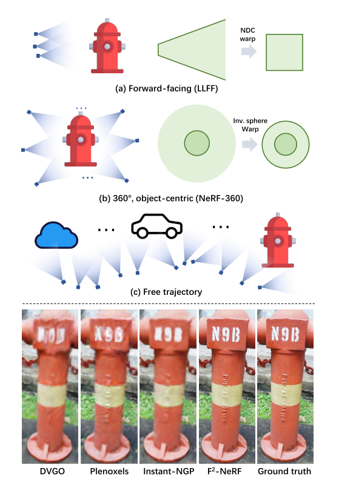

# F2-NeRF: Fast Neural Radiance Field Training with Free Camera Trajectories

## 前言

目前，比较快速的方法（Instant-NGP, Plaenoxels, DVGO, TensorRF）都是为了有边界场景进行设计的，在处理无边界场景的时候都需要用一些特定的warp方法来进行转换。本文提出了一个新颖的space-warping方法（perspective warping）来解决所述的问题。

目前而言，主要有两种warp函数：
1. NDC warping：主要应对的是forward-facing-scenes，目标是把前向无穷远处的视锥映射到有限的Z轴上；
2. sphere inversion transformation：主要应对360场景，目标是把无穷远处的场景映射到一个有限的球面上；

但是，上述的两种方法仅能应对单一场景，对于组合场景（free-trajectory）就无法很好的适应。

就目前的方法而言，对于free-trajectory的情况而言，主要效果不好的原因在于：网格均匀的平铺导致特征表达能力的不足，太多的网格特征被浪费掉。理论上来看，对于free-trajectory的场景来说，应该保证前景有足够dense的网格，而背景的网格则相对稀疏，但是目前的方法都是把网格平铺在空间中，导致了整体表达能力的下降。

