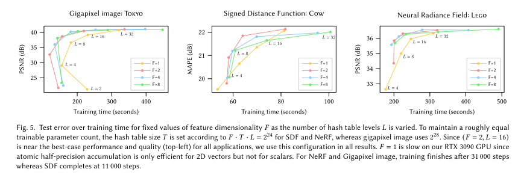

# Instant Neural Graphics Primitives with a Multiresolution Hash Encoding

---

## 前言

instance-ngp是大幅提高NeRF训练速度的一种方法，看完该论文主要问答如下问题：
1. 该方法为什么能够提升速度；
2. 对于输入的表达上有什么改变；
3. 采样方式上，有什么提高？如何让采样变得更加的有目的性（效率问题）；

---

## 方法

### parametric encodings

作者指出，目前SOTA的NeRF方法在对于feature的表达上都是在辅助的数据结构（例如grid、tree）中加入额外的训练参数，这些参数不同于MLP中的参数，是对feature表达的表示，虽然整个参数的内存占用变多，但是整个的算力会大大减小。

但是无疑，如果不对这些额外的数据结构进行处理，这些结构对于内存的占用将是非常的不划算的，比如真正对于整个结果有影响的部分可能仅仅占据所有grid很少的部分。

作者对于这部分做了一个较为详细的实验：

- 图a没有添加任何的encoding信息，所以整体而言效果非常差，只学到了平滑的位置信息，但是纹理部分学习到的较少；
- 图b为添加了高频的信息，即NeRF-like的方法，可以看到有些地方的纹理已经显现了出来；
- 图c为一个单层的128^3的dense grid，其中每个特征向量为16维，从时间上来讲达到和图b一样的指标仅用了1分钟时间；
- 图d为一个多层的dense grid的示例，其中每个特征向量为2维，所以整体的参数量减小，但是效果变好；
- 图e f为本文提出的方法，即使用hash table来实现快速、轻量且效果不错的方法；

这里先总结一下本文提出方法的特点：

1. 使用稀疏的hash映射对整个场景进行表达，因为本质上来讲，一个空间中并不是所有的点都能投入到grid中，因此很多grid虽然建立了，但是实际上利用率很低；
2. 使用多尺度的方法，基本借鉴了图d的方法，一方面这样的参数不多，同时能够取得较好的效果；
3. 不显式解决 hash 冲突的问题，让网络自己获取到那些地方是重要的，哪些地方是不重要的；

### 多分辨率hash encoding

首先作者通过图d的实验，证实了多分辨率对于整个效果的提升，同时多分辨率能够天然的降低每个feature表达的维度，因此整个框架也是多分辨率为主。下面的表格对应于本文方法所采用的参数：

这里面主要关注的参数如下：

1. 多分辨率的最大层数为16层 L；
2. 每层的最大的hash table的数量为 T，范围为$[2^{14}  2^{24}]$，对比实验的参数为$2^{14}, 2^{19}$；
3. 每个feature的表示维度为F=2；
4. 最外层的分辨率为2^4 = 16；
5. 对内层的分辨率在2^9 ~ 2^19；

所以我们能够看到，对于整个grid部分而言，最大的参数量为$\mathrm{LTF}$，在$[2^{19}, 2^{29}]$之间，所以比对实验中，实际上可以看到每层并没有打满，这也是本文方法的特点之一。

整个方法的流程如下图所示：

可以看到整个过程非常简单：

1. 对于特定点 x，将其映射到不同分辨率后进行插值，累计得到红色和蓝色的LF；
2. 之后加上视角组成的feature E作为整个MLP的输入feature；
3. 最后输入MLP中根据不同的任务的需要得到不同的输出；

整个论文其实大篇幅在讲解第一个步骤。

#### 将输入点映射到多层分辨率grid中

1. 首先算出来第  $l$ 层分辨率：
   $$
   \begin{aligned}
   b&:=exp\left(\frac{\mathrm{ln} N_{max}-\mathrm{ln}N_{min}}{L-1} \right) \\
   N_{l}&:=\lfloor N_{min} b^{l} \rfloor
   \end{aligned} \tag{1}
   $$
   

2. 之后获得第 $l$ 层 left-top 和 right-bottom 的grid坐标：
   $$
   \begin{aligned}
   \lfloor \mathbf{x}_l \rfloor&:=\lfloor \mathbf{x} N_l \rfloor \\
   \lceil \mathbf{x}_l \rceil&:=\lceil \mathbf{x} N_l \rceil
   \end{aligned} \tag{2}
   $$
   

3. 得到之后对于N个顶点（取决于做什么任务）投影到hash table中，得到这些顶点相应的feature，公式如下。这个地方我们可以看到，对于分辨率较低的grid层，映射是1：1的；但是对于高层分辨率的grid层，映射就是多对一的，因此有可能会发生hash冲突，但是后面作者也分析了，一方面这个几率比较小，另一方面随着算法的进行，冲突的hash table中势必有一方会主导整个优化；
   $$
   h(\mathrm{x})=\left(\bigoplus_{i=1}^{d}x_i\pi_i\right) \mathrm{mod} \quad T \tag{3}
   $$
   

   其中d根据任务类型，比如如果是2维平面的任务就是2，3维空间的任务就是3（也是可以处理的最高维度），其中取$\pi_1:=1, \pi_2:=2654435761, \pi_3=805459861$（$\pi_2$是hash映射中的黄金分割数，$\pi_3$的取值待考证，不过看起来也应该是类似的常数）；

4. 得到顶点的几个feature之后，就使用双线性插值的算法得到插值后的feature；

经过上述步骤之后，就得到了该点在多层grid中的feature表示。

#### 对于 T 参数的实验

从整个原理上我们不难看出，每一层的hash table越大，则整个恢复的质量就会越高，但是占据的内存也就会越多，于是作者做了一个实验来确定 T 参数的范围，实验如下图所示：

#### 关于 F 参数的实验

F参数的实验如下图所示：

#### 关于Hash冲突的解决方案

作者主要从原理和训练两个方面来说明Hash冲突在本方法中不会造成很大危害：

1. 因为本文是基于多层分辨率的方法，因此不太可能出现所有层都冲突的情况；
2. 即便出现了两个点映射到同一个hash table中，在训练过程中一定是有一个主要的贡献方（比如一个在物体表面，一个在空旷地方），那么权重更新时就会向着重要的一方倾斜；

#### 在线的自适应性（online adaptivity）

作者提到，实际上在整个算法的运行中，本文提出的方法是可以很好的适应不同的数据部分的，以NeRF为例，当数据的分布慢慢的收敛到物体表面的时候，各个分辨率层的冲突减小，考虑极端情况下每个层的冲突都为0，那么说明从coarse 到 finest 层都能够唯一表示该物体的信息，这样整个模型对物体恢复的精细度变高，准确率也会变高。

#### 对于插值算法的分析

对于插值部分，作者提到对于d-linear类型的插值，主要会造成插值的不平滑现象，于是作者在这个方向上给出了自己的建议，使用一个比较平滑的插值函数：$S_1(x)=x^{2}(3-2x)$，其微分为 $S_1^{\prime}(x)=6x(1-x)$，图像如下，整体而言函数的值域在0~1之间，微分的函数可以看到在 x=0.5 时达到最高。

