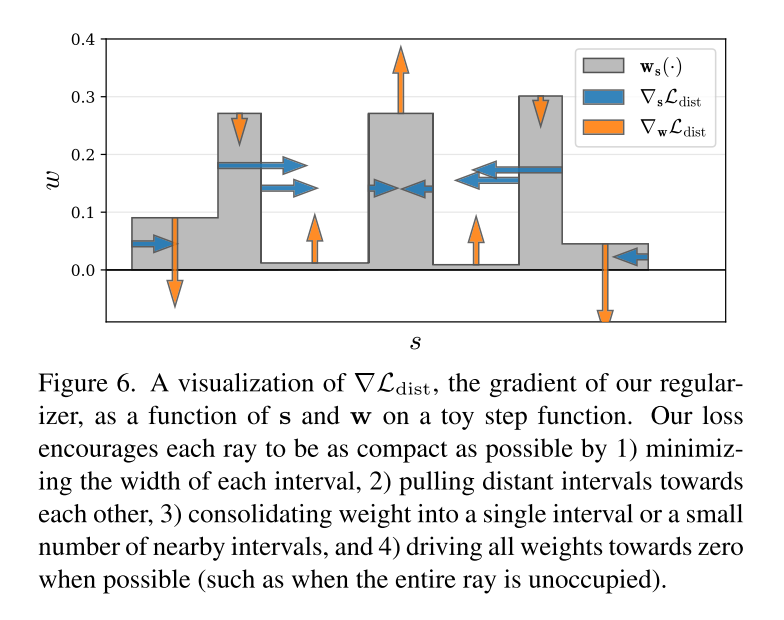
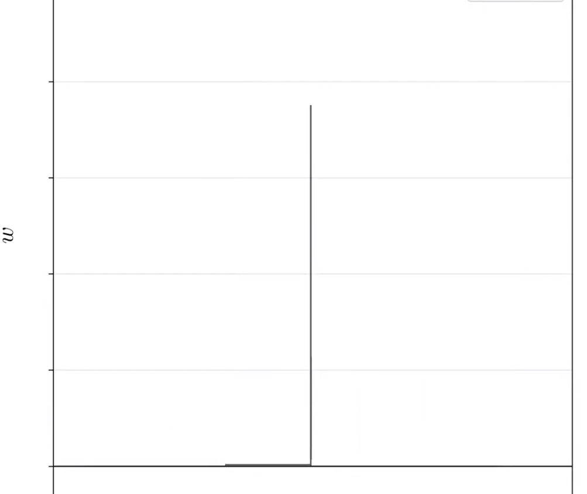
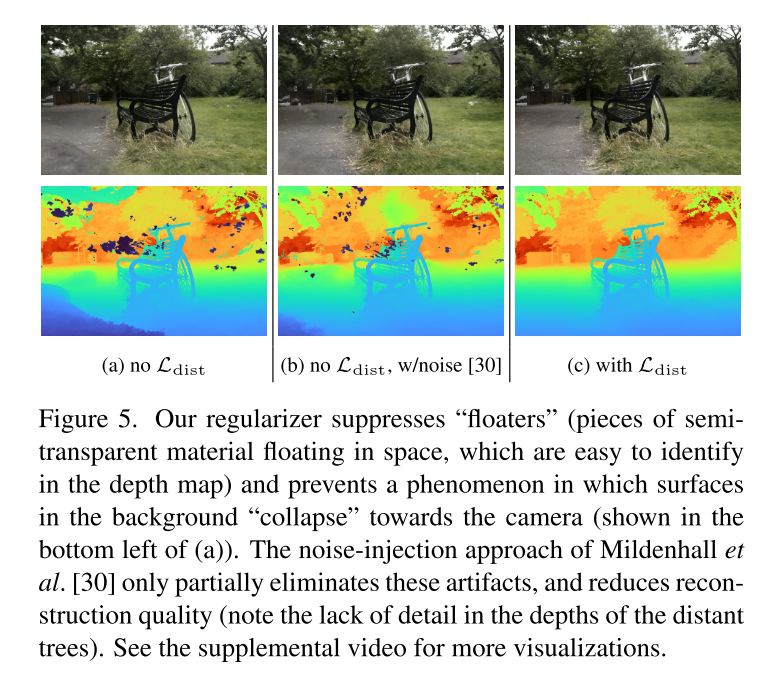

# Mip-NeRF 360: Unbounded Anti-Aliased Neural Radiance Fields

---

## 写在前面

看标题就能知道：本文是对于Mip-NeRF在无边界场景的应用，同年的网络有Block-NeRF（看引用的话是Mip-NeRF 360在前），不过相比于Block-NeRF，Mip-NeRF 360首先没有那么大，其次主要的探索点也不尽相同。具体而言：
1. Block-NeRF场景更大，Mip-NeRF 360的场景较小；
2. Block-NeRF更多的是使用一些手法将多个Mip-NeRF拼凑在一起，Mip-NeRF360则是进一步的对Mip-NeRF的采样和效果进行改进；

&nbsp;

---

## 详细过程

### 无边界NeRF方法的问题
作者在开头处写到：对于无边界NeRF而言，主要的问题有:
1. 参数较多：因为需要在ray上进行采样，无边界场景就会要求有更多的采样点；
2. 效率：这个自不用说，更大的网络效率自然下降；
3. 歧义性（Ambiguity）：因为远处的场景仅有很少的ray可以采样到，这样的现象加剧了2D图像重建3D内容的固有歧义；

作者在后续的2，3，4章节中对该问题进行了深入的探讨和解决；Mip-NeRF的相关知识已经在前序文章中进行了介绍，这里不多赘述，后面有一张图对该过程进行了比较详细的展示；

> PS：个人认为这里的无边界并不是指大场景，而是说不想原生NeRF一样是对于一个物体进行的重建，这里的无边界更多的是说背景无边界

&nbsp;

### 针对场景和射线的参数化
这里主要有如下几个改进点：

1. 借鉴NDC的思路，对射线的采样时使用逆深度（视差）的均匀采样，这样的好处是远距离的采样策略更加的合适（远处的场景视差小，相比于近处的场景，一个像素所代表的距离更远），作者这里使用一个映射函数将 t 空间映射到 s 空间：
    $$
    \begin{equation}
    \mathrm{s=\frac{g(t)-g(t_n)}{g(t_f) - g(t_n)}} \quad \text{where} \quad \mathrm{g=\frac{1}{x}}
    \end{equation}
    $$

2. 使用一个叫做contract函数，将ray的高斯采样变得限制在一个有界场景中，contract函数如下：
    $$
    \begin{equation}
    \mathrm{contract(x)}=
    \begin{aligned}
    \begin{cases}
    \mathrm{x}   \quad & \|\mathrm{x}\| \le 1 \\
    \left( 2-\frac{1}{\| \mathrm{x} \|} \right) \mathrm{\frac{x}{\| x \|}} \quad & \| \mathrm{x} \| \gt 1 
    \end{cases}
    \end{aligned}
    \end{equation}
    $$
    该函数主要是将远处的物体（作者这里定义为 1m 以外的场景或者物体）warp到一个单位为 2 的球体里面，如下图所示：
    

    笔者对于这个图像（或者说函数）的理解更多的是作者在这里做了一个圆形（球形）的畸变，把整个场景的成像机制当做是360度全景相机的成像，这样就把整个unbound的场景“限制”在了一个有限的球面中。

&nbsp;

### 针对效率问题的在线蒸馏

对于无边界场景而言，实际上采样的好坏异常的重要，因为边界比较大，因此采样点中可能很多都是“空气点”，作者解决问题的思路也很简单，提出了一个proposal-MLP（类似于检测框架中的proposal bounding box），该网络不预测color，只使用一个轻量的MLP来提供分布信息 $\mathrm{\hat{w}}$, 因为该网络比较的轻量，所以作者在每次迭代的时候就多次调用，生成更多的采样来达到“细化”的目的。整个流程图如下：

在程序中，上一次的proposal结果会作为下一次的初值进行再次的采样，最后一次优化就是NeRF的MLP做的优化，过程如下图所示：

可以看到随着优化的进行，不管是第一次的prop1还是prop2，分布都更加的收敛（不要被b，c的表象迷惑，主要是 b 图的横轴比较长，有种比 c 图更好的感觉，实际上 c 图因为取得间隔很短，此时的分布已经非常的集中）

接下来的问题就是如何构建优化问题，作者在文中讲到：本质上该问题可以建模为一个直方图相似度的问题，该问题是一个well-established task，但是在这个应用场景中，我们并不能“无脑”的进行两个分布的拉近，比如proposal MLP的分布不合理而NeRF MLP分布合理的时候，两个分布就应该是不相似的，同时因为NeRF MLP负责最后整体颜色的预测，因此该MLP预测的分布是更为可靠的，所以作者在构建该loss的时候，以NeRF MLP为参考，期望通过训练让proposal MLP不停的“跟进”NeRF MLP的分布，保证proposal MLP预测的是对的。

这里作者给出的方法如下：
1. 首先在一定区间进行proposal MLP结果的积分
    $$
    \begin{equation}
    bound(\mathrm{\hat{t}, \hat{w}, T}) = \sum_{j:T \cap \hat{T}_{j} \ne \varnothing} \hat{w}_j
    \end{equation}
    $$

2. 构建边界误差：
    $$
    \begin{equation}
    \mathcal{L}_{prop}(\mathrm{t, w, \hat{t}, \hat{w}}) = \sum_{i} \frac{1}{w_i}max(0, w_i-bound(\mathrm{\hat{t}, \hat{w}, T}))^{2}
    \end{equation}
    $$

3. 可以看到作者这里只惩罚没有“跟上”的部分，因为本身proposal MLP的预测就比较的粗糙，因此超越是必然的，但是作者并不会去管这部分（因为本质上把低于正确权重的部分补上来之后，不对的地方自然就下去了）。同时，作者在梯度传播的时候设置了stop-gradient值，主要的目的是限制该loss对于整个系统的影响程度，拉坏NeRF MLP的预测。
> 作者原文的内容是：We place a stop-gradient on the NeRF MLP’s outputs t and w when computing Lprop so that the NeRF MLP “leads” and the proposal MLP “fol- lows” — otherwise the NeRF may be encouraged to pro- duce a worse reconstruction of the scene so as to make the proposal MLP’s job less difficult. 

&nbsp;

### 基于区间的模型正则化
在常规的NeRF中，悬浮（floaters）和背景崩溃（background collapse）是一个比较常见的问题：
- floaters的主要原因是因为在体素空间中有不连通的区域，导致渲染的时候该部分区域无法表达；
- background collapse的主要原因是因为背景有时候太远，导致模型建模为一团离相机比较近的半透明的云状密集内容（semi-transparent clouds of dense content close to the camera），读者可以想象成在相机前面放上一个特别近的东西，因为相机无法很好的对焦，导致这部分东西是“糊”的；

为了解决上述的两个问题，作者提出了空间的正则化技术，公式如下：

$$
\begin{equation}
\mathcal{L}_{dist}(\mathrm{s,w})=\int_{-\infty}^{\infty}\int \mathrm{w_{s}}(u)\mathrm{w_{s}}(v)|u-v|d_{u} d_{v}
\end{equation}
$$

其中：
- $\mathrm{w_{s}}(u)$ 为权重函数在 u 处的插值，$\mathrm{w_{s}}(u)=\sum_i w_{i}\mathbb{1}_{[s_i, s_{i+1})}(u)$，其中的 $\mathbb{1}_{[s_i, s_{i+1}]}$ 为区间节约函数，表示当 u 的值在该区间内，则累计该区间的权重值；

- 该loss函数期望最大化两个采样点 u,v 的带有权重的距离损失，所以，当两个采样点距离越大的时候，loss希望两者的权重越小，最优的情况下是有一个为0，而当两者的距离越小的时候，权重可以稍大。**即：在射线上的分布上，当在真实被占用的地方时，权重较大，而其他非占用点上，权重期望为0**

- 上述loss除了对于weight的约束之外，其实还对于射线的采样有很好的指导作用，试想当真正被占用地方的采样间隔为特别小的时候，公式（5）中的 |u-v| 也为极小量，进一步缩小了整个loss。

综上，该loss期望最终权重的分布变为一个delta function，如下图所示：
 

最终的效果也很惊艳：

---

### 总结

综上所述，mip-nerf-360主要在如下的方面进行了整体的改进：

1. 使用逆深度进行采样，更加符合视差的效果，同时采用了全景相机的策略，将无边界场景映射到有边界的表达中；
2. 使用在线蒸馏的方法，提出proposal MLP进行 weight 权重的进行几次迭代，使得NeRF MLP能够更加高效的进行采样，但是要注意的是，采样的监督值需要来源于NeRF MLP生成的 weight 权重；
3. 使用正则化技术，使得生成的 weight 权重更加聚焦在真实被占用的地方，提高准确率，解决了floating 和 background collapse的问题；
