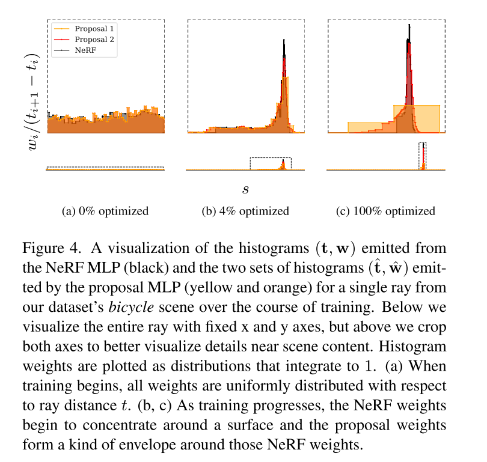

# Mip-NeRF 360: Unbounded Anti-Aliased Neural Radiance Fields

---

## 写在前面

看标题就能知道：本文是对于Mip-NeRF在无边界场景的应用，同年的网络有Block-NeRF（看引用的话是Mip-NeRF 360在前），不过相比于Block-NeRF，Mip-NeRF 360首先没有那么大，其次主要的探索点也不尽相同。具体而言：
1. Block-NeRF场景更大，Mip-NeRF 360的场景较小；
2. Block-NeRF更多的是使用一些手法将多个Mip-NeRF拼凑在一起，Mip-NeRF360则是进一步的对Mip-NeRF的采样和效果进行改进；

&nbsp;

---

## 详细过程

### 无边界NeRF方法的问题
作者在开头处写到：对于无边界NeRF而言，主要的问题有:
1. 参数较多：因为需要在ray上进行采样，无边界场景就会要求有更多的采样点；
2. 效率：这个自不用说，更大的网络效率自然下降；
3. 歧义性（Ambiguity）：因为远处的场景仅有很少的ray可以采样到，这样的现象加剧了2D图像重建3D内容的固有歧义；

作者在后续的2，3，4章节中对该问题进行了深入的探讨和解决；Mip-NeRF的相关知识已经在前序文章中进行了介绍，这里不多赘述，后面有一张图对该过程进行了比较详细的展示；

> PS：个人认为这里的无边界并不是指大场景，而是说不想原生NeRF一样是对于一个物体进行的重建，这里的无边界更多的是说背景无边界

&nbsp;

### 针对场景和射线的参数化
这里主要有如下几个改进点：

1. 借鉴NDC的思路，对射线的采样时使用逆深度（视差）的均匀采样，这样的好处是远距离的采样策略更加的合适（远处的场景视差小，相比于近处的场景，一个像素所代表的距离更远），作者这里使用一个映射函数将 t 空间映射到 s 空间：
    $$
    \begin{equation}
    \mathrm{s=\frac{g(t)-g(t_n)}{g(t_f) - g(t_n)}} \quad \text{where} \quad \mathrm{g=\frac{1}{x}}
    \end{equation}
    $$

2. 使用一个叫做contract函数，将ray的高斯采样变得限制在一个有界场景中，contract函数如下：
    $$
    \begin{equation}
    \mathrm{contract(x)}=
    \begin{aligned}
    \begin{cases}
    \mathrm{x}   \quad & \|\mathrm{x}\| \le 1 \\
    \left( 2-\frac{1}{\| \mathrm{x} \|} \right) \mathrm{\frac{x}{\| x \|}} \quad & \| \mathrm{x} \| \gt 1 
    \end{cases}
    \end{aligned}
    \end{equation}
    $$
    该函数主要是将远处的物体（作者这里定义为 1m 以外的场景或者物体）warp到一个单位为 2 的球体里面，如下图所示：
    

    笔者对于这个图像（或者说函数）的理解更多的是作者在这里做了一个圆形（球形）的畸变，把整个场景的成像机制当做是360度全景相机的成像，这样就把整个unbound的场景“限制”在了一个有限的球面中。

&nbsp;

### 针对效率问题的在线蒸馏

对于无边界场景而言，实际上采样的好坏异常的重要，因为边界比较大，因此采样点中可能很多都是“空气点”，作者解决问题的思路也很简单，提出了一个proposal-MLP（类似于检测框架中的proposal bounding box），该网络不预测color，只使用一个轻量的MLP来提供分布信息 $\mathrm{\hat{w}}$, 因为该网络比较的轻量，所以作者在每次迭代的时候就多次调用，生成更多的采样来达到“细化”的目的。整个流程图如下：

在程序中，上一次的proposal结果会作为下一次的初值进行再次的采样，最后一次优化就是NeRF的MLP做的优化，过程如下图所示：

可以看到随着优化的进行，不管是第一次的prop1还是prop2，分布都更加的收敛（不要被b，c的表象迷惑，主要是 b 图的横轴比较长，有种比 c 图更好的感觉，实际上 c 图因为取得间隔很短，此时的分布已经非常的集中）

接下来的问题就是如何构建优化问题，作者在文中讲到：该问题是一个well-established task，但是相比于传统的方法，