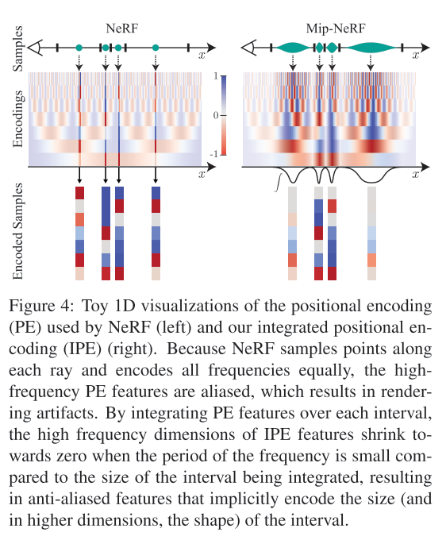
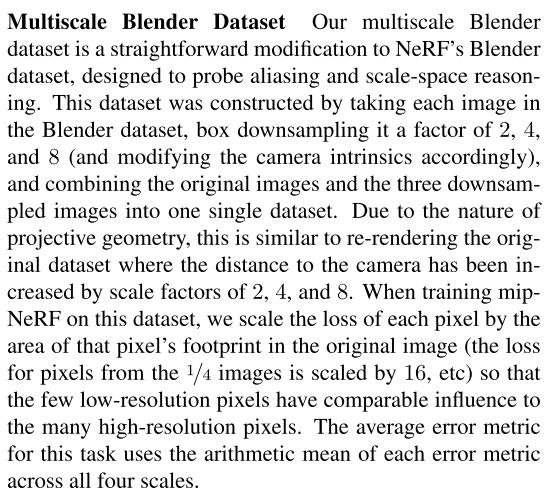
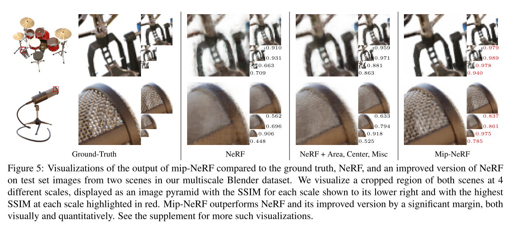
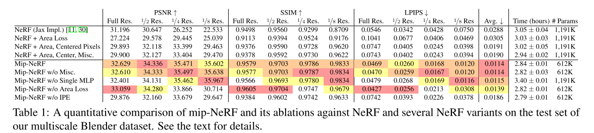

# Mip-NeRF: A Multiscale Representation for Anti-Aliasing Neural Radiance Fields

## Reference

1. Mipmap的讲解： https://blog.csdn.net/qq_42428486/article/details/118856697

## Abstract

对于NeRF而言，因为采样是基于射线上的点进行的，所以理论上对于分辨率较低的多尺度图像来说，就会产生远处的采样点无法很好的代表整个射线锥（conical frustum）的情况，进而产生误差，出现锯齿效应（aliasing），为了解决该问题，Mip-NeRF主要采用了一下的方法：
1. 借鉴mipmaps的方法，在连续的多尺度上表示目标场景；
2. 使用射线锥（conical frustum）代替射线（ray），消除远处点误差大的问题；
3. 在目标采样点上，提出IPE代替PE，提高高维表示的准确性；

Mip-NeRF 的主要思路如下图所示：

## Details

### NeRF 基本原理的回顾

关于NeRF原文的解读，可以去参考文章，这里不再赘述，这里只给出最关键的步骤:
1. 输入采样点的位置$\mathbf{r}(t)=\mathbf{o}+t\mathbf{d}$，获取到网络预测：
    $$
    \forall t_k \subset \mathbf{t}, \quad [\tau_k, \mathbf{c}_k]=MLP(\mathcal{r}(\mathbf{r}(t_k)); \Theta) \tag{1}
    $$

2. 根据网络的预测，进行该射线的渲染，其中 $T_k$ 表示该条射线上的累计不透明度：
    $$
    \mathbf{C}(\mathbf{r}; \Theta, \mathbf{t})=\sum_{k}T_{k}(1-exp(-\tau(t_{k+1}, t_k)))\mathbf{c}_k \\
    \text{where } T_k=exp(-\sum_{k'<k}\tau_{k'}(t_{k'+1}-t_{k'})) \tag{2}
    $$

3. loss构建，主要分两个部分，一个是coarse网络，一个是finetune网络：
    $$
    \begin{aligned}
    \mathop{argmin}_{\theta^{c}, \theta^{f}} \sum_{\mathbf{r} \subset \mathcal{R}} & \left(\| C^{*}(\mathbf{r}) - C(\mathbf{r}; \Theta^{c}, \mathbf{t}^{c}) \|^{2}_{2} \\
             +  \| C^{*}(\mathbf{r}) - C(\mathbf{r}; \Theta^{f}, sort{(\mathbf{t}^{c} + \mathbf{t}^{f}}) \|^{2}_{2} \right)
    \end{aligned} \tag{3}
    $$

    具体而言，在coarse网络中，作者随机采样了64个点（相机位置和射线是固定的，采样了64个t），之后按照不透明度的PDF，采样了128个点，一共组成了192个点对fine网络进行训练；

&nbsp;

### Mip-NeRF的改进

Mip-NeRF的改进主要集中在如下两个地方：

#### 对于采样点的表示上

原生NeRF在采样点的处理上主要有以下的缺点：

1. 远处的点因为分辨率的问题会产生较大的距离，造成较远的事物在图上的渲染会比较稀疏，当然如果视角足够多且密集的话，也能够一定程度上弥补这个问题；
2. 不同远近（作者在文章中归结为scale的不同）的视角采样到同一个点时，NeRF无法获取到因为scale不同而导致射线的shape and size的不同；

示意图如下：

基于此，作者提出使用高斯分布的形式来表示某个区间所有采样点的分布，这样对于这个区间而言，就可以用分布的特点代表整个区间样本的状态，示意图如上面的图1 所示；

对于区间 [t0~t1] 而言，作者通过三个变量 $(\mu_t, \sigma_{t}, \sigma_{r})$ 来表示这个区间的分布情况，下面是这部分的推导过程：

1. 对于3D空间中的点 $\mathrm{x}$ 而言，首先判断该点是否在 **某个相机** 的 **某个视角** 下的 [t0~t1] 区间内，公式如下：
    $$
    \mathbf{F}(\mathrm{x, o, d}, \dot{r}, t_0, t_1)=\mathbb{1} \left\{  \underbrace{ \left( t_0 < \mathbf{\frac{d^{T}(x-o)}{ \left| d \right|^{2}_{2} }} < t_1 \right) }_{点在t_0~t_1范围内} \bigcup \underbrace{ \left( \mathbf{\frac{d^{T}(x-o)}{  \left| d \right|_{2}} > \frac{1}{ \sqrt{1+(\dot{r}/\left\| d \right\|)^{2}} }  } \right) }_{点在视锥范围内} \right\} \tag{4}
    $$
    

对于所有满足上述条件的采样点，其position encoding的表示如下, 其中 $\mathcal{r}(x)$ 和NeRF一样，是将采样点映射到高维空间的操作：
$$
    \mathcal{r}^{*}(\mathbf{o, d}, \dot{r}, t_0, t_1)=\frac{\int{\mathcal{r}(\mathbf{x})\mathbf{F}(\mathbf{x, o, d}, \dot{r}, t_0, t_1)d\mathbf{x}}}{\int{\mathbf{F}(\mathbf{x, o, d}, \dot{r}, t_0, t_1)d\mathbf{x}}} \tag{5}
$$

2. 到这里我们能够发现，公式（5）有一个比较大的问题，就是需要先知道采样点 x 的位置，随后才能计算整个区间的分布，这和NeRF的思路完全相反，因此我们需要把思路正过来，即通过一些参数来表达空间volume的积分，示意图如下：
   
    

    可以看到，空间中的一点[x,y,z]（如红点所示）可以由三个参数的极坐标表示出来，公式如下：
    $$
    \begin{aligned}
    (x, y, z) &= \psi(r, t, \theta)=(rtcos(\theta), rtsin(\theta), t) \\
    dxdydz &= \left| \frac{\partial{(x, y, z)}}{\partial{(r, t, \theta)}} \right| dr dt d\theta \\
           &= \begin{vmatrix} tcos(\theta) & tsin(\theta) & 0 \\ rcos(\theta) & rsin(\theta) & 1 \\ -rtsin(\theta) & rtcos(\theta) & 0 \end{vmatrix} dr dt d\theta \\
           &= (rt^{2}cos^{2}(\theta) + rt^2sin^{2}(\theta)) dr dt d\theta \\
           &= rt^{2} dr dt d\theta
    \end{aligned} \tag{6}
    $$

    对所在空间进行积分，可以得到（注意这里不考虑embedding，只考虑volume）:
    $$
    \begin{aligned}
    V&=\int_{0}^{2\pi}\int_{t_0}^{t_1}\int_{0}^{\dot{r}}rt^{2} dr dt d\theta \\
    &=\pi \dot{r}^{2}\frac{t_1^{3} - t_0^{3}}{3}
    \end{aligned} \tag{7}
    $$

    随后我们就可以计算 t 的均值和方差：
    $$
    \begin{aligned}
    E(t)&=\frac{1}{V} \int_{0}^{2\pi}\int_{t_0}^{t_1}\int_{0}^{\dot{r}}t \cdot rt^{2} dr dt d\theta \\
    &=\frac{3(t_{1}^{4}-t_0^{4})}{4(t_{1}^{3}-t_0^{3}} \\
    \\
    
    E(t^2)&=\frac{1}{V} \int_{0}^{2\pi}\int_{t_0}^{t_1}\int_{0}^{\dot{r}}t^2 \cdot rt^{2} dr dt d\theta \\
    &=\frac{3(t_{1}^{5}-t_0^{5})}{5(t_{1}^{3}-t_0^{3}} \\
    \end{aligned} \tag{8}
    $$

    对于半径 $r$ 而言，作者其实想表示的是x+y的方差(因为是个圆，其实x y的方差是相等的)，论文中的公式有错，参考[!here](https://github.com/google/mipnerf/issues/44) 
    $$
    \begin{aligned}
    E(y)=E(x)&=\frac{1}{V} \int_{0}^{2\pi}\int_{t_0}^{t_1}\int_{0}^{\dot{r}}(rtcos(\theta)) \cdot rt^{2} dr dt d\theta \\
    &=0 \\

    E(y^2)=E(x^2)&=\frac{1}{V} \int_{0}^{2\pi}\int_{t_0}^{t_1}\int_{0}^{\dot{r}}(rtcos(\theta))^{2} \cdot rt^{2} dr dt d\theta \\
    &=\frac{\dot{r}^{2}}{4}\cdot \frac{3(t_1^5-t_0^5)}{5(t_1^3-t_0^3)} \\

    \Downarrow \\

    \sigma_{r}&=E(x^2)-E(x)^{2} + E(y^2)-E(y)^2=\frac{\dot{r}^{2}}{2}\cdot \frac{3(t_1^5-t_0^5)}{5(t_1^3-t_0^3)}
    \end{aligned} \tag{9}
    $$

    剩下的主要是变换相关的，主要是为了数值稳定性，这里就不多赘述了，综上可知，对于空间中的视锥采样点而言：
    1. 我们可以用极坐标的方式来等价代换；
    2. 其中位置 t 和 半径 r 分布满足：
    $$
    \mu_{t}=t_{\mu}+\frac{2t_{\mu}t_{\delta}^{2}}{3t_{\mu}^{2}+t_{\delta}^{2}} \quad \sigma_{t}^{2}=\frac{t_{\delta}^{2}}{3}-\frac{4t_{\delta}^4(12t_{\mu}^2-t_{\delta}^2)}{15(3t_{\mu}^2+t_{\delta}^2)^2} \quad \sigma_{r}^2=\dot{r}^{2}\left( \frac{t_{\mu}^2}{4} + \frac{5t_{\delta}^2}{12} - \frac{4t_{\delta}^4}{15(3_{t_{\mu}^2}+t_{\delta}^2)} \right)
    $$

3. 所以对于给定了一个采样区间[t0~t1]来说，该conical frustum内的所有点可以按照如下分布来表示：
    $$
    \mathbf{\mu}=\mathbf{o}+\mu_t\mathbf{d} \quad \Sigma=\sigma_t^2(\mathbf{dd^T})+\sigma_{r}^2\left( I-\frac{\mathbf{dd^{T}}}{\left\| d \right\|_{2}^{2}} \right) \tag{10}
    $$

    > PS: 后面关于半径这个部分的公式没有特别理清楚。。。

&nbsp;

#### IPE的表示

这部分的推导其实就不是那么的重要了，在NeRF中，我们对一个点进行positional encoding，但是现在我们获得了一个分布，自然可以用分布来代替conical frustum中所有点的PE，这里直接给出公式（推导不难，感兴趣看论文即可）：
$$
\begin{aligned}
\mathcal{r}(\mu, \Sigma) &= E_{\mathbf{x}~\mathcal{N}(\mu_{\mathcal{r}}, \Sigma_{\mathcal{r}})}(\mathcal{r}(\mathbf{x})) \\
&= \begin{bmatrix}
sin(\mu_{\mathcal{r}}) \circ exp(-\frac{1}{2}diag(\Sigma_{\mathcal{r}})) \\
cos(\mu_{\mathcal{r}}) \circ exp(-\frac{1}{2}diag(\Sigma_{\mathcal{r}}))
\end{bmatrix}
\end{aligned} \tag{11}
$$

下图是positional encoding的示意图，可以看到Mip-NeRF的表达确实更加的general一些；

&nbsp;

#### 多尺度的加入

因为mip-NeRF主要想借助mip-maps的思路来解决锯齿的问题，所以在训练的时候，mip-NeRF对多尺度的图像进行训练，论文中取4层多尺度的图像。

&nbsp;

----

### Mip-NeRF的结构和训练

Mip-NeRF训练如下：

$$
\min_{\Theta}=\sum_{\mathbf{r}\in R}(\lambda\left\| C^{*}(\mathbf{r}-C(\mathbf{r};\Theta,t^c))\right\|^2_2 + \left\| C^{*}(\mathbf{r}-C(\mathbf{r};\Theta,t^f))\right\|^2_2) \tag{12}
$$

对于fine sample的采样上，作者在采样的时候采用如下的方法：
$$
w_{k}^{'}=\frac{1}{2}(max(w_{k-1}, w_k) + max(w_k, w_{k+1})) + \alpha \tag{13}
$$

&nbsp;

----
### 一些实验结果

mip-NeRF的训练结果（多尺度对比）如下，可以看到细节的恢复比NeRF要好很多

最后的对比/消融实验也表明mip-NeRF各个提升的有效性:

&nbsp;

----

## Conclusion
总体来看，文章的思路和改进点都是比较明确的：
1. 通过mip-maps的思想来提高抗锯齿能力；
2. 使用IPE代替PE达到更好的采样点表示效果；
