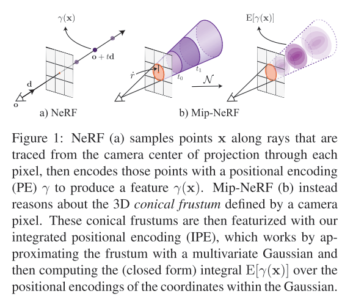
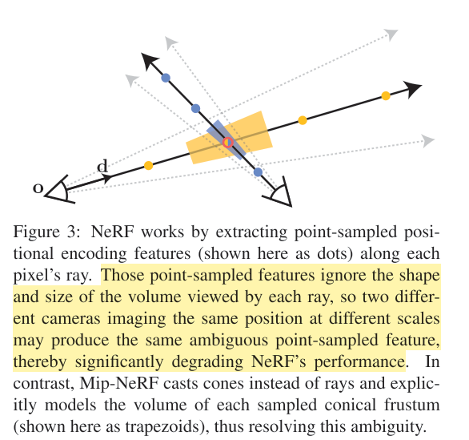
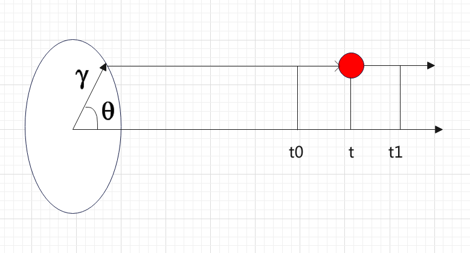

# Mip-NeRF: A Multiscale Representation for Anti-Aliasing Neural Radiance Fields

## Reference

1. Mipmap的讲解： https://blog.csdn.net/qq_42428486/article/details/118856697；
2. k

## Abstract

对于NeRF而言，因为采样是基于射线上的点进行的，所以理论上对于分辨率较低的多尺度图像来说，就会产生远处的采样点无法很好的代表整个射线锥（conical frustum）的情况，进而产生误差，出现锯齿效应（aliasing），为了解决该问题，Mip-NeRF主要采用了一下的方法：
1. 借鉴mipmaps的方法，在连续的多尺度上表示目标场景；
2. 使用射线锥（conical frustum）代替射线（ray），消除远处点误差大的问题；
3. 在目标采样点上，提出IPE代替PE，提高高维表示的准确性；

Mip-NeRF 的主要思路如下图所示：

## Details

### NeRF 基本原理的回顾

关于NeRF原文的解读，可以去参考文章，这里不再赘述，这里只给出最关键的步骤:
1. 输入采样点的位置$\mathbf{r}(t)=\mathbf{o}+t\mathbf{d}$，获取到网络预测：
    $$
    \forall t_k \subset \mathbf{t}, \quad [\tau_k, \mathbf{c}_k]=MLP(\mathcal{r}(\mathbf{r}(t_k)); \Theta) \tag{1}
    $$

2. 根据网络的预测，进行该射线的渲染，其中 $T_k$ 表示该条射线上的累计不透明度：
    $$
    \mathbf{C}(\mathbf{r}; \Theta, \mathbf{t})=\sum_{k}T_{k}(1-exp(-\tau(t_{k+1}, t_k)))\mathbf{c}_k \\
    \text{where } T_k=exp(-\sum_{k'<k}\tau_{k'}(t_{k'+1}-t_{k'})) \tag{2}
    $$

3. loss构建，主要分两个部分，一个是coarse网络，一个是finetune网络
    $$
    \begin{aligned}
    \mathop{argmin}_{\theta^{c}, \theta^{f}} \sum_{\mathbf{r} \subset \mathcal{R}} & \left(\| C^{*}(\mathbf{r}) - C(\mathbf{r}; \Theta^{c}, \mathbf{t}^{c}) \|^{2}_{2} \\
             +  \| C^{*}(\mathbf{r}) - C(\mathbf{r}; \Theta^{f}, sort{\mathbf{t}^{c} \or \mathbf{t}^{f}}) \|^{2}_{2} \right)
    \end{aligned} \tag{3}
    $$

    具体而言，在coarse网络中，作者随机采样了64个点（相机位置和射线是固定的，采样了64个t），之后按照不透明度的PDF，采样了128个点，一共组成了192个点对fine网络进行训练；

&nbsp;

### Mip-NeRF的改进

Mip-NeRF的改进主要集中在如下两个地方：

#### 对于采样点的表示上

原生NeRF在采样点的处理上主要有以下的缺点：

1. 远处的点因为分辨率的问题会产生较大的距离，造成较远的事物在图上的渲染会比较稀疏，当然如果视角足够多且密集的话，也能够一定程度上弥补这个问题；
2. 不同远近（作者在文章中归结为scale的不同）的视角采样到同一个点时，NeRF无法获取到因为scale不同而导致射线的shape and size的不同；

示意图如下：

基于此，作者提出使用高斯分布的形式来表示某个区间所有采样点的分布，这样对于这个区间而言，就可以用分布的特点代表整个区间样本的状态，示意图如上面的图1 所示；

对于区间 [t0~t1] 而言，作者通过三个变量 $(\mu_t, \sigma_{t}, \sigma_{r})$ 来表示这个区间的分布情况，下面是这部分的推导过程：

1. 对于3D空间中的点 $\mathrm{x}$ 而言，首先判断该点是否在 **某个相机** 的 **某个视角** 下的 [t0~t1] 区间内，公式如下：
    $$
    \mathbf{F}(\mathrm{x, o, d}, \dot{r}, t_0, t_1)=\mathbb{1} \left\{  \underbrace{ \left( t_0 < \mathbf{\frac{d^{T}(x-o)}{ \left| d \right|^{2}_{2} }} < t_1 \right) }_{点在t_0~t_1范围内} \and \underbrace{ \left( \mathbf{\frac{d^{T}(x-o)}{  \left| d \right|_{2}} > \frac{1}{ \sqrt{1+(\dot{r}/\left\| d \right\|)^{2}} }  } \right) }_{点在视锥范围内} \right\} \tag{4}
    $$
    
对于所有满足上述条件的采样点，其position encoding的表示如下, 其中 $\mathcal{r}(x)$ 和NeRF一样，是将采样点映射到高维空间的操作：
    $$
    \mathcal{r}^{*}(\mathbf{o, d}, \dot{r}, t_0, t_1)=\frac{\int{\mathcal{r}(\mathbf{x})\mathbf{F}(\mathbf{x, o, d}, \dot{r}, t_0, t_1)d\mathbf{x}}}{\int{\mathbf{F}(\mathbf{x, o, d}, \dot{r}, t_0, t_1)d\mathbf{x}}} \tag{5}
    $$
    
2. 到这里我们能够发现，公式（5）有一个比较大的问题，就是需要先知道采样点 x 的位置，随后才能计算整个区间的分布，这和NeRF的思路完全相反，因此我们需要把思路正过来，即通过一些参数来表达空间volume的积分，示意图如下：
   
    

    可以看到，空间中的一点[x,y,z]（如红点所示）可以由三个参数的极坐标表示出来，公式如下：
    $$
    \begin{aligned}
    (x, y, z) &= \psi(r, t, \theta)=(rtcos(\theta), rtsin(\theta), t) \\
    dxdydz &= \left| \frac{\part{(x, y, z)}}{\part{(r, t, \theta)}} \right|dr dt d\theta \\
           &= \begin{vmatrix} tcos(\theta) & tsin(\theta) & 0 \\ rcos(\theta) & rsin(\theta) & 1 \\ -rtsin(\theta) & rtcos(\theta) & 0 \end{vmatrix} dr dt d\theta \\
           &= (rt^{2}cos^{2}(\theta) + rt^2sin^{2}(\theta)) dr dt d\theta \\
           &= rt^{2} dr dt d\theta
    \end{aligned} \tag{6}
    $$

    对所在空间进行积分，可以得到（注意这里不考虑embedding，只考虑volume）:
    $$
    \begin{aligned}
    V&=\int_{0}^{2\pi}\int_{t_0}^{t_1}\int_{0}^{\dot{r}}rt^{2} dr dt d\theta \\
    &=\pi \dot{r}^{2}\frac{t_1^{3} - t_0^{3}}{3}
    \end{aligned}
    $$

