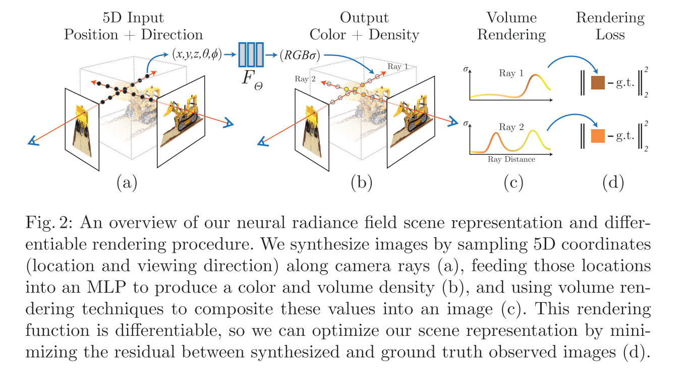

# NeRF: Representing Scenes as Neural Radiance Fields for View Synthesis

## Abstract

NERF的开山之作，作者主要讨论了如何使用MLP来表示一个三维场景

> Our algorithm represents a scene using a fully-connected (non- convolutional) deep network, whose input is a single continuous 5D coor- dinate (spatial location (x, y, z) and viewing direction (θ, φ)) and whose output is the volume density and view-dependent emitted radiance at that spatial location.

---

## Related Works

1. 之前的工作使用MLP来获取位置的符号距离（sign distance）表示3D空间位置的形状，但是这样的方式不足以表征复杂的物体
2. 也有类似的方法把低位的坐标值使用颜色、纹理、照明等信息映射到color值；

---

## Details

### 主要思想

作者其实把自己的想法和实现已经画在下面的图中了，具体而言：

1. 网络的输入为5D向量，$(x, y, z, \theta, \phi)$，其中方向向量为 $\mathbf{d}=(\theta, \phi)$ ；
2. 网络的输出为Color+Density，$(\mathbf{c}, \sigma)$；

&nbsp;

### 使用辐射场的体素渲染

体素渲染的思路也很简单，主要体现在下面的积分上：
$$
C(\mathrm{r})=\int_{t_n}^{t_f} T(t) \sigma(\mathrm{r}(t)) \mathrm{c}(\mathrm{r}(t), \mathrm{d}) dt \text{, where } T(t)=exp(-\int_{t_n}^{t} \sigma(\mathrm{r}(s)) ds)

\tag{1}
$$

可以看到，其中：
1. $\mathrm{r}(t)=\mathrm{o}+t\mathrm{b}$ 表示在射线上的距离为 t 的点；
2. $\sigma(x)$ 表示 x 的density；
3. $\mathrm{c}(x)$ 表示 x 的color颜色；
4. $T(t)$ 表示透明度（transmittance）的积分，透明区域积分为0，非透明区域积分变大；

对上述公式进行离散化，只需把连续积分变为离散积分即可，积分的区间如下：

$$
t_i = \mathcal{U} \left[ t_n + \frac{i-1}{N}(t_f - t_n), t_n + \frac{i}{N}(t_f - t_n) \right] \tag{2}
$$

每个间隔记为 $\delta_{i}$;

于是离散的积分表示为：

$$
\hat{C}(\mathrm{r})=\sum_{i=1}^{N}T_i \underbrace{(1-exp(-\sigma_i\delta_i))}_{\alpha_i}\mathrm{c}_i \text{ , where } T_i=exp(-\sum_{j=1}^{i-1}\sigma_j\delta_j) \tag{3}
$$

其中的：

1. $\delta_{i/j}$ 为离散化的间隔；

2. $\sigma_{i/j}$ 为网络预测的单点的volume density（或者称为opacity）；

3. $c_i$ 为网络预测的color；

4. 使用了 $\alpha_i$ 替换了volume density；

   > 实际上，$\alpha$ 是volume density在volume观察路线上的积分 $\alpha=\int{\sigma}ds$，如果认为在volume内部密度是一样的，则可以简化为当前的形式

&nbsp;

### 优化项

上述所表述的就是传统的辐射场渲染的方法，下面的改进则是本文主要创新的地方，主要分为两个：
1. 使用position encoding来激发网络对于高频特征的恢复能力；
2. 分层级的进行volume采样来进行效果的提高；

&nbsp;

#### position encoding

这部分作者主要借鉴On the spectral bias of neural networks 这篇论文的结论，添加了position embedding部分将输入映射到高维的表示中，即
$$
F_{\Theta} = F'_{\Theta} \circ \gamma \tag{4}
$$

其中 $\gamma$ 表示高阶的 position encoding，作者使用的函数为：
$$
\gamma(p)=\left(\sin \left(2^0 \pi p\right), \cos \left(2^0 \pi p\right), \cdots, \sin \left(2^{L-1} \pi p\right), \cos \left(2^{L-1} \pi p\right)\right) \tag{5}
$$
$\gamma(\cdot)$ 的输入是一个标量，也就是说对于网络的5D输入 $\mathbf{x + d}$，每一个标量都要经过该函数进行高维映射，在实现中，$\mathbf{x}$ 的映射维度为L=10， $\mathbf{d}$ 的映射维度为L=4。

> 作者探讨了在 Transformer 中的 positional encoding（embedding），对于 Transformer 而言，positional encoding更大的作用是让网络区分每个token的位置信息，进而学习不同位置的相关性，而在这里，作者的主要思路是将输入数据映射到高维特征空间上，从而让网络直接在高维空间上学习；

&nbsp;

#### Hierarchical volume sampling

这部分也比较容易理解，作者将整个网络分为 Coarse + Finetune 的模式，先利用公式（2）（3）获得大颗粒度分辨率下的体素渲染结果，随后将公式（2）做变换得到 Coarse 重建的公式：
$$
\hat{C}_c(\mathbf{r})=\sum_{i=1}^{N_c} w_i c_i, \quad w_i=T_i\left(1-\exp \left(-\sigma_i \delta_i\right)\right) \tag{6}
$$
其中将不透明度作为权重系数并进行归一化，$\hat{w}_i=w_i/\sum_{j=1}^{N_c}w_j$ 作为 PDF 来进行更细致的采样，即：不透明度高的区域，采样的数量会越多。采样 $N_c$ 个点；