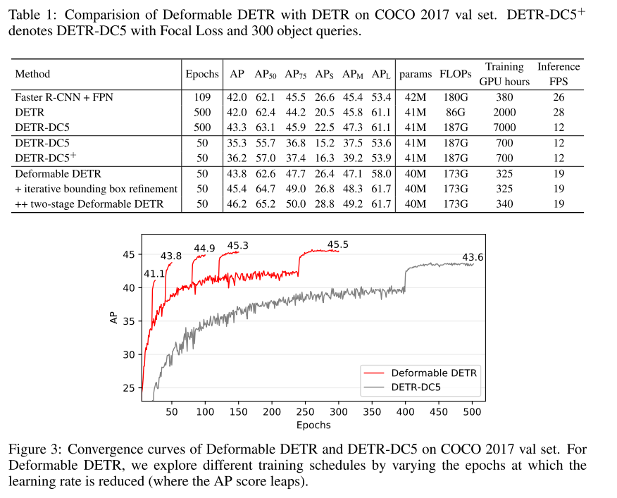
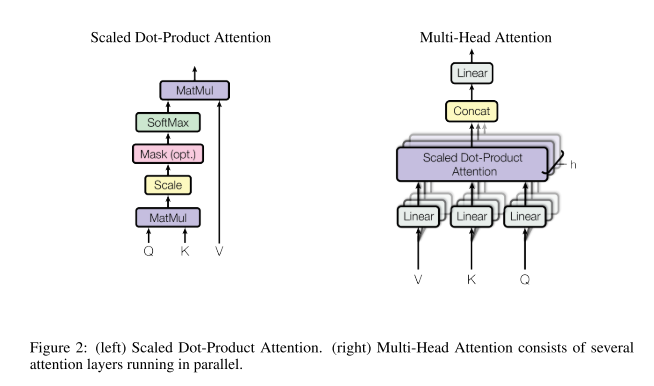
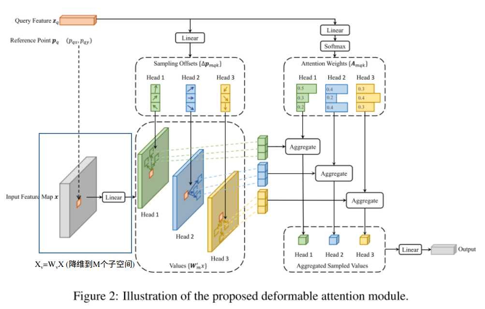

# Deformable DETR

## 写在前面

来看deformable-DETR的原因呢是因为最近看了一些BEV感知的方案，都已经开始用这种方法来刷榜提分了，所以来看看其中的原理和奥妙。

DETR算是Transformer应用在目标检测中比较有代表性的方法了，本文主要是将可变卷积的思路用在了DETR上，同时因为这种方法的特殊性，也使得多尺度的特征图可以自然的加入到该方法中。

从实验的结果上可以见到，因为可变注意力的加入，整个方法的收敛速度变快了，同时效果也变好了很多，但是弊端就是FLOPs下降了不少。



paper: https://arxiv.org/abs/2010.04159

github: https://github.com/fundamentalvision/Deformable-DETR

&nbsp;

-----

## 原始的DETR部分

因为整个论文是对DETR的修改，所以这里有必要先对DETR部分进行稍微的引入，也是论文中第三节所做的事情，这部分最重要的就是对DETR的复杂度和优缺点进行分析；

### 符号表示

这里还是先总结梳理用到的符号：

- 多头注意力的数量记为 $M$；
- 注意力部分key，value表示记为 $x_k \in \R^{C} \quad k \in \Omega_{k}(N_k)$；
- 注意力部分value表示记为 $z_q \in \R^{C} \quad q \in \Omega_{q}(N_q)$；
- 单词的维度记为$C$，多头注意力中子空间的维度记为$C_v$；

&nbsp;

### 复杂度分析

因为整个网络涉及到很多个部分，所以这里给拆解出来逐个分析：

#### 经典多头注意力复杂度

注意力机制的模式依旧参考经典的transformer，如下：



作者这边给的计算公式为：
$$
\mathrm{MultiHeadAttn(z_q, x)} = \sum_{m=1}^{M} \underbrace{W_{m}}_{\R^{C \times C_v}}[\sum_{k \in \Omega_{k}}A_{mqk} \underbrace{W_{m}}_{\R^{C_v \times C}}^{\prime}x_k] \\
\text{where } A_{mqk} \propto \mathrm{exp}\{\frac{(U_{m}z_q)^{T}(V_m x_k)}{\sqrt{C_v}}\} \quad U_m,V_m \in \R^{C_v \times C} \tag{1}
$$
这里的公式没有完全吻合上面的Multi-Head Attention的图例，主要原因是缺了一个Concat的显式表达，但是其实在实现的时候就是使用这样一个加法进行实现的，总体的参数量和结果是一样的。

所以我们能简单分析出整个算法的复杂度为：

- key的多头降维的运算量：$M \times (N_k C C_c) = N_kC^{2}$；
- value的多头降维的运算量：$M \times (N_kC C_c) = N_kC^{2}$；
- query的多头降维的运算量：$M \times (N_qC C_c)=N_qC^{2}$；
- 多头计算attention：$M\times(N_qC_vN_k)=N_kN_qC$；
- 多头抽取query到的特征：$M\times (N_q N_kC_v) = N_kN_qC$；
- 最后concat以及linear： $N_qC^{2}$；

所以最后的整体复杂度为：$O(N_qC^{2}+N_kC^{2}+N_qN_kC)$；

#### DETR Encoder部分的复杂度

DETR的做法是把特征图的WH拉平了当做序列，因此把上述公式中的 $N_q, N_k$ 替换为 $HW$ 得到 $O(HWC^{2} + H^{2}W^{2}C) $，论文中认为 $HW >> C$，所以复杂度化简为 $O(H^{2}W^{2}C) $

#### DETR Decoder部分的复杂度

假设要query的特征数量为N，则query的自注意力复杂度为 $O(NC^{2}+N^{2}C)$，而交叉注意力部分的复杂度为$O(HWC^{2}+NHWC)$；

#### DETR自身的问题

1. DETR很难使用高层特征（特征图的尺寸比较大）来帮助预测小物体，主要原因是当特征图的尺寸较大时，整个复杂度会与尺寸乘积的二次方成正比关系；
2. DETR的收敛过程会比较慢，这主要的是因为交叉注意力中，注意力模块要从比较全局的分布慢慢注意到稀疏的目标物体上；

其实对于transformer类的框架，通常会有一个warmup的过程，这个过程一定程度上会帮助网络进行收敛；

&nbsp;

-----

## Deformable DETR部分

这部分主要介绍Deformable DETR的核心改进了，即把可变注意力模块引入到整个框架中。

### 符号表示

首先还是先把符号表示捋清楚：

- 多头注意力的数量记为 $M$，整个和上面是一样的；
- 采样点 $K$，这个变量的定义和上面不一样；
- 特征图整个记作 $x^{l} \in \R^{C\times H \times W} \quad l \in [1, L]$，表示多尺度的特征图；
- $p_q$ 表示参考点，也就是query的坐标点， $\Delta p_{mqk}$ 表示对应的第k个偏移量；

&nbsp;

### 方法细节

针对上述的DETR的两个问题，作者主要从如下两个部分进行改进：

- 提出了可变注意力模块；
- 将多尺度引入可变注意力模块；

#### 可变注意力

这部分主要分析单个特征图，祭出公式：
$$
\mathrm{DeformAttn(z_q, p_q, x)} = \sum_{m=1}^{M} \underbrace{W_{m}}_{\R^{C \times C_v}}[\sum_{k =1}^{K}A_{mqk} \underbrace{W_{m}}_{\R^{C_v \times C}}^{\prime}x(p_q+\Delta p_{mqk})] \tag{2}
$$
可以看到和公式（1）相比，公式在注意力机制的运算上进行了变化：

1. 公式（1）中的累加和的区间为整个输入空间，但是在公式（2）中的累加空间变为了 K 个采样点；
2. 注意力的计算也不再是query和所有的单词进行相关性的计算，而是仅由 $z_q$ 推理出来，仅仅针对 K 个采样点；
3. K 个采样点由参考点 $p_q$ 和偏移量 $\Delta p_{mqk}$ 共同得到，当然这个偏移量不可能就是一个整数，这里获取该偏移量上的特征时是使用了双线性插值的；

整个流程图如下：



那么分析一下复杂度的话，如下：

1. value的多头降维的运算量：这里有两种算法，一种是全部的降维$N_kM \times (C C_c) = N_kC^{2}=HWC^{C}$；另一种是局部的降维 $N_qM\times(KCC_v)=N_qKC^{2}$；可以在特征图尺寸比较大的时候使用第二种方法，而在特征图比较小的时候使用第一种方法；
2. query这部分的运算量由原先的对于整图进行注意力变为了对 K 个采样点计算偏移（2d平面的xy方向）以及和 K 个采样点的权重（注意力）计算的维度，写在一起为：$N_q M\times (2KC + KC) = 3N_qMKC$，可以看到这里不需要对query进行降维处理了；
3. bilinear线性采样的复杂度为：$5N_qKC$；
4. 后面的多头合并以及线性层运算量：$N_qC^{2}$；

所以整体的复杂度为 $O(N_qC^{2}+\min (N_qKC^{2}, HWC^{2})+3N_qMKC+5N_qKC)$，因为后两项的 $5K+3MK << C$，因此整体的复杂度简化为 $O(N_qC^{2}+\min (N_qKC^{2}, HWC^{2}))$。

通过上面的分析可以看到：该方法解决了DETR问题中注意力从全图向某些稀疏的点注意的问题，因为从一开始算法就在关注一些系数的点；

&nbsp;

#### 多尺度引入

相比于上面的部分，这部分主要是把多尺度的特征图 **“自然”** 的添加进来，公式如下：
$$
\mathrm{MSDeformAttn(z_q,p_q, \{x^{l}\}_{l=1}^{L})} = \sum_{m=1}^{M} \underbrace{W_{m}}_{\R^{C \times C_v}}[\sum_{k =1}^{K}\sum_{l=1}^{L} A_{mqkl} \underbrace{W_{m}}_{\R^{C_v \times C}}^{\prime}x^{l}(\phi (\hat {p_q})+\Delta p_{mlqk})] \tag{3}
$$
从这个公式中我们可以看到偏移量和权重依旧是query向量经过线性层得到的，只不过上面我们仅仅得到 K 个就可以了，但是这次我们需要得到 LK 个了，所以：

- 注意力上： $\sum_{k} \sum_{l} A_{mlqk} = 1$；
- 参考点也由原先的确定点变为了值在 [0, 1] 之间归一化之后的量，方便在各层之间使用；
- 模块的最外层需要输入的特征图都是同一维度的；

所以复杂度的话，只需要将上面分析的复杂度中K变为KL即可，即 $O(N_qC^{2}+\min (N_qKLC^{2}, HWC^{2}))$；

&nbsp;

----

## 代码部分

根据上面的分析可以看到，相比于常规的DETR方法，deformable-DETR的修改点主要在：

1. 不再进行全局的 Key 与 Query 的注意力，而是使用 Query 计算出感兴趣的 K 个点；
2. 不再使用 Key 与 Query 的相似度作为 Value 的权重，而是使用 Query 计算出来；

这里主要看三个部分：

- Multi-Scale Deform Attention，这也是这个算法比较核心的部分；
- 对应Transformer的encoder层，这部分因为 query 和 key，value 是相同的，因此可变注意力的参考点是多层级特征的本身；
- 对应Transformer的decoder层，这部分因为 query 的维度和 key，value 不同，因此可变注意力的参考点需要重新计算；

&nbsp;

### Multi-Scale Deform Attention

这部分的主要代码如下，不太重要的就删掉了，整个流程分为：

1. 对value进行多头线性投影；
2. 使用 query 计算**每个感兴趣点**的偏移 以及 对应的权重；
3. 运算得到分布在多头、多层的感兴趣点的位置；
4. 在多头、多层特征上进行采样，得到对应的（这里相当耗时，并行化程度很低，作者为此专门写了一个cuda程序）；

```python
class MSDeformAttn(nn.Module):
    def __init__(self, d_model=256, n_levels=4, n_heads=8, n_points=4):
        super().__init__()
        if d_model % n_heads != 0:
            raise ValueError('d_model must be divisible by n_heads, but got {} and {}'.format(d_model, n_heads))
        _d_per_head = d_model // n_heads

        self.im2col_step = 64 # cuda 程序中使用的变量
        self.d_model = d_model # feature dimension
        self.n_levels = n_levels # 使用多少层的feature
        self.n_heads = n_heads # 多少个注意力头
        self.n_points = n_points # 多少个感兴趣点
        
        self.sampling_offsets = nn.Linear(d_model, n_heads * n_levels * n_points * 2) # 将query转化为各个感兴趣点的坐标(x,y)
        self.attention_weights = nn.Linear(d_model, n_heads * n_levels * n_points) # 将query转化为各个感兴趣点的权重
        self.value_proj = nn.Linear(d_model, d_model) # 将value映射到多头子空间
        self.output_proj = nn.Linear(d_model, d_model) # 和上面同理

        self._reset_parameters()

    def _reset_parameters(self):
        pass

    def forward(self, query, reference_points, input_flatten, input_spatial_shapes, input_level_start_index, input_padding_mask=None):
        """
        :param query                       (N, Length_{query}, C)
        :param reference_points            (N, Length_{query}, n_levels, 2), range in [0, 1], top-left (0,0), bottom-right (1, 1), including padding area
                                        or (N, Length_{query}, n_levels, 4), add additional (w, h) to form reference boxes
        :param input_flatten               (N, \sum_{l=0}^{L-1} H_l \cdot W_l, C)
        :param input_spatial_shapes        (n_levels, 2), [(H_0, W_0), (H_1, W_1), ..., (H_{L-1}, W_{L-1})]
        :param input_level_start_index     (n_levels, ), [0, H_0*W_0, H_0*W_0+H_1*W_1, H_0*W_0+H_1*W_1+H_2*W_2, ..., H_0*W_0+H_1*W_1+...+H_{L-1}*W_{L-1}]
        :param input_padding_mask          (N, \sum_{l=0}^{L-1} H_l \cdot W_l), True for padding elements, False for non-padding elements

        :return output                     (N, Length_{query}, C)
        """
        N, Len_q, _ = query.shape
        N, Len_in, _ = input_flatten.shape
        assert (input_spatial_shapes[:, 0] * input_spatial_shapes[:, 1]).sum() == Len_in
		
        # 1. 对value进行多头映射
        value = self.value_proj(input_flatten)
        if input_padding_mask is not None:
            value = value.masked_fill(input_padding_mask[..., None], float(0))
        value = value.view(N, Len_in, self.n_heads, self.d_model // self.n_heads)
        
        # 2. 使用query求解感兴趣点位置和权重，同时对权重进行归一化
        # (N, Length_{query}, N_{head}, N_{level}, N_{points}, 2/1)
        sampling_offsets = self.sampling_offsets(query).view(N, Len_q, self.n_heads, self.n_levels, self.n_points, 2)
        attention_weights = self.attention_weights(query).view(N, Len_q, self.n_heads, self.n_levels * self.n_points)
        attention_weights = F.softmax(attention_weights, -1).view(N, Len_q, self.n_heads, self.n_levels, self.n_points)
        
        # 3. 进行感兴趣点的位置归一化
        if reference_points.shape[-1] == 2:
            # 如果输入的参考点是二维的，仅有（x y）位置，那么就要和用特征图的大小来把位置进行归一化操作
            # input_spatial_shape就是每个特征图的大小
            offset_normalizer = torch.stack([input_spatial_shapes[..., 1], input_spatial_shapes[..., 0]], -1)
            # (N, Length_{query}, 1, N_{level}, 1, 2) + (N, Length_{query}, N_{head}, N_{level}, N_{points}, 2)/(1,1,1,N_{level}, 1, 2)
            sampling_locations = reference_points[:, :, None, :, None, :] \
                                 + sampling_offsets / offset_normalizer[None, None, None, :, None, :]
        elif reference_points.shape[-1] == 4:
            # 如果输入的参考点是四维的，有（x y h w）信息，直接进行归一化操作
            # input_spatial_shape就是每个特征图的大小
            # 维度信息同上
            sampling_locations = reference_points[:, :, None, :, None, :2] \
                                 + sampling_offsets / self.n_points * reference_points[:, :, None, :, None, 2:] * 0.5
        else:
            raise ValueError(
                'Last dim of reference_points must be 2 or 4, but get {} instead.'.format(reference_points.shape[-1]))
        
        # 4. 在投影后的 value 的 多个不同层 上进行 多个感兴趣点的 采样，每个乘以权重得到query到的单词
        output = MSDeformAttnFunction.apply(
            value, input_spatial_shapes, input_level_start_index, sampling_locations, attention_weights, self.im2col_step)
        output = self.output_proj(output)
        return output
```

&nbsp;

### Encoder层

在encoder的时候，输入的特征是多尺度的特征，因此输出的特征也需要是相同的多尺度特征输出，所以在encoder部分，参考点的数量和多层特征图的尺寸之和相同，同时每一个query点都需要在多层特征上进行注意力，代码如下：

```python
class DeformableTransformerEncoder(nn.Module):
    def __init__(self, encoder_layer, num_layers):
        super().__init__()
        self.layers = _get_clones(encoder_layer, num_layers)
        self.num_layers = num_layers

    @staticmethod
    def get_reference_points(spatial_shapes, valid_ratios, device):
        reference_points_list = []
        ## 1. 遍历多层特征的尺寸
        for lvl, (H_, W_) in enumerate(spatial_shapes):
            ## 2. 生成坐标点
            ref_y, ref_x = torch.meshgrid(torch.linspace(0.5, H_ - 0.5, H_, dtype=torch.float32, device=device),
                                          torch.linspace(0.5, W_ - 0.5, W_, dtype=torch.float32, device=device))
            ## 3. valid_ratios是一个根据mask生成的缩放参数，不过这个缩放参数主要的作用是控制多层间的采样
            ##    因为最后对每个reference_point又乘以了多层的valid_ratios，所以相同层的缩放系数为1
            ##    而不同层因为valid_ratios不同，因此缩放系数不同，大体上应该都是1，不会差别特别大
            ref_y = ref_y.reshape(-1)[None] / (valid_ratios[:, None, lvl, 1] * H_)
            ref_x = ref_x.reshape(-1)[None] / (valid_ratios[:, None, lvl, 0] * W_)
            ## (N, H_xW_, 2)
            ref = torch.stack((ref_x, ref_y), -1)
            reference_points_list.append(ref)
        ## (N, \sum_{l=0}^{L}(H_l x W_l), 2)
        reference_points = torch.cat(reference_points_list, 1)
        ## (N, \sum_{l=0}^{L}(H_l x W_l), n_levels, 2)
        ## 这里也是不同层间注意力的精髓，也就是说每一层的query，都有多层的reference_point点
        reference_points = reference_points[:, :, None] * valid_ratios[:, None]
        return reference_points

    def forward(self, src, spatial_shapes, level_start_index, valid_ratios, pos=None, padding_mask=None):
        """
        src: (N, \sum_{l=0}^{L-1} H_l x W_l, C)
        spatial_shapes: (n_levels, 2), [(H_0, W_0), (H_1, W_1), ..., (H_{L-1}, W_{L-1})]
        level_start_index: (n_levels, ), [0, H_0*W_0, H_0*W_0+H_1*W_1, H_0*W_0+H_1*W_1+H_2*W_2, ..., H_0*W_0+H_1*W_1+...+H_{L-1}*W_{L-1}]
        valid_ratios: (N, n_levels, 2)
        output: (N, \sum_{l=0}^{L-1} H_l x W_l, C)
        """
        output = src
        reference_points = self.get_reference_points(spatial_shapes, valid_ratios, device=src.device)
        for _, layer in enumerate(self.layers):
            output = layer(output, pos, reference_points, spatial_shapes, level_start_index, padding_mask)

        return output
```

&nbsp;

### Decoder层

Decoder层相对来讲没有那么复杂，主要的几个注意点就是：

1. 参考点是由 query 的 pos_embedding 映射得到的，其中 pos_embedding 也是要学习的哦；
2. 输入的参考点的维度中并不包含多尺度的信息，所以进来之后先把参考点和encoder一样做一下维度扩充的步骤；
3. 输出的参考点记录中并不包含多尺度的信息，如果想看多尺度的信息，需要改一下代码；

```python
class DeformableTransformerDecoder(nn.Module):
    def __init__(self, decoder_layer, num_layers, return_intermediate=False):
        super().__init__()
        self.layers = _get_clones(decoder_layer, num_layers)
        self.num_layers = num_layers
        self.return_intermediate = return_intermediate

    def forward(self, tgt, reference_points, src, src_spatial_shapes, src_level_start_index, src_valid_ratios,
                query_pos=None, src_padding_mask=None):
        """
        tgt: (N. N_{query}, C)
        reference_points: (N. N_{query}, 2)
        src: (N, \sum_{l=0}^{L-1} H_l x W_l, C)
        src_spatial_shapes: (n_levels, 2), [(H_0, W_0), (H_1, W_1), ..., (H_{L-1}, W_{L-1})]
        src_level_start_index: (n_levels, ), [0, H_0*W_0, H_0*W_0+H_1*W_1, H_0*W_0+H_1*W_1+H_2*W_2, ..., H_0*W_0+H_1*W_1+...+H_{L-1}*W_{L-1}]
        src_valid_ratios: (N, n_levels, 2)
        output: (N, \sum_{l=0}^{L-1} H_l x W_l, C)
        reference_points: (N. N_{query}, 2)
        """
        output = tgt

        intermediate = []
        intermediate_reference_points = []
        
        for lid, layer in enumerate(self.layers):
            ## 1. 对参考点进行归一化，因为这里的参考点是使用 query 的 pos_embedding 算出来的，并没有映射到多层维度上，
            ##    所以和上面encoder层一样，添加上不同层的尺度缩放得到不同层的参考点（不过此时缩放系数就不太保证在1附近了）
            reference_points_input = reference_points[:, :, None] * src_valid_ratios[:, None]
                
            ## 2. 输入给decoder_layer
            output = layer(output, query_pos, reference_points_input, src, src_spatial_shapes, src_level_start_index, src_padding_mask)

            if self.return_intermediate:
                intermediate.append(output)
                # 注意这里记录的并不是在多层尺度上的参考点
                intermediate_reference_points.append(reference_points)

        if self.return_intermediate:
            return torch.stack(intermediate), torch.stack(intermediate_reference_points)

        return output, reference_points
```

&nbsp;

------------

## 总结

整个分析下来我们可以看出，其实可变注意力对于自注意力的修改还是相当大的：

1. 不使用相似度来作为权值得到 query 的结果，而是用学习的参数；
2. 每个单词并不用和所有的单词进行注意力，而是关注多层特征中的多个点就可以了；
3. 在encoder阶段，注意力会保持多层的输出，也就是多尺度的融合；

代码分析部分只考虑了一些情况，在源代码中，decoder的参考点生成上，作者提供了另一种根据 encoder 的输出来产生的办法，这里没有特别多的分析，感兴趣的同学可以看源码部分。