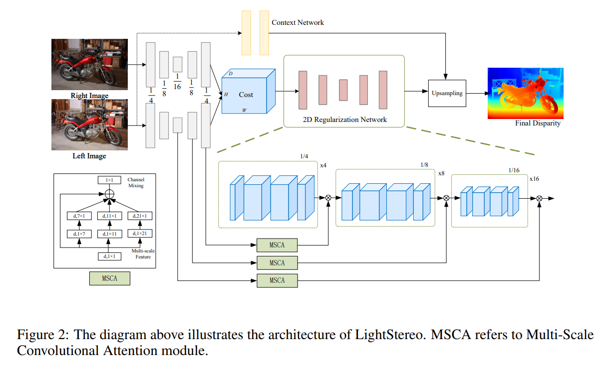
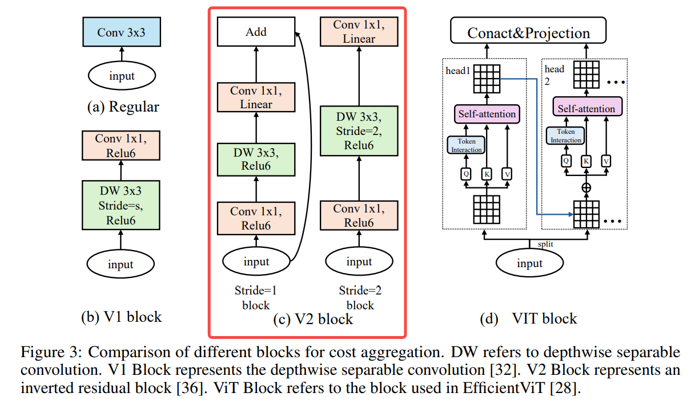
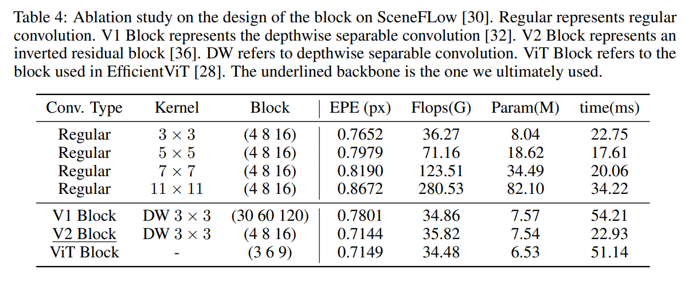
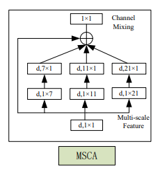
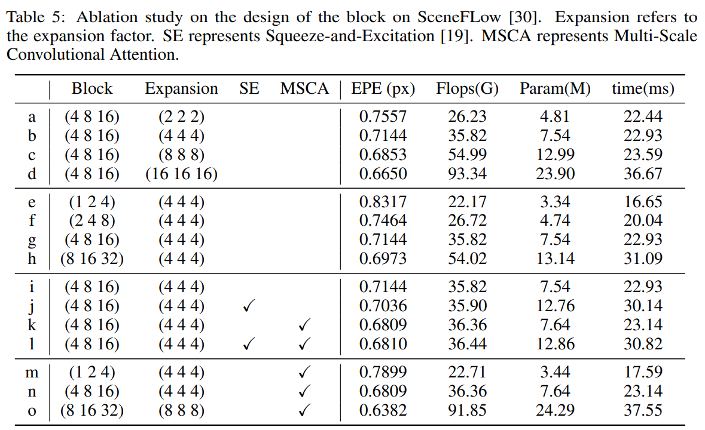
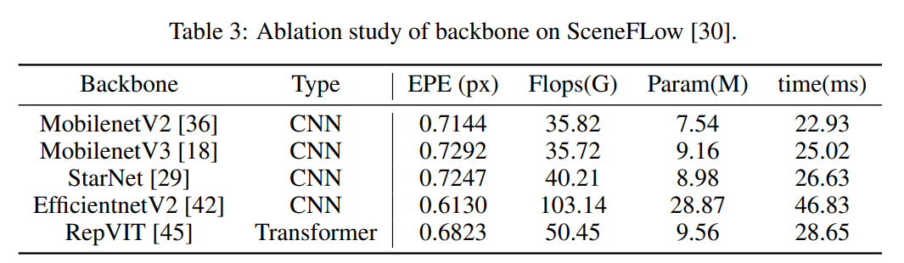
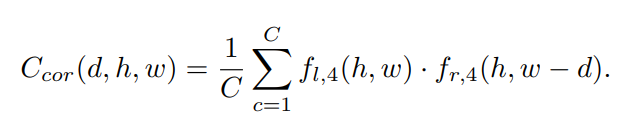
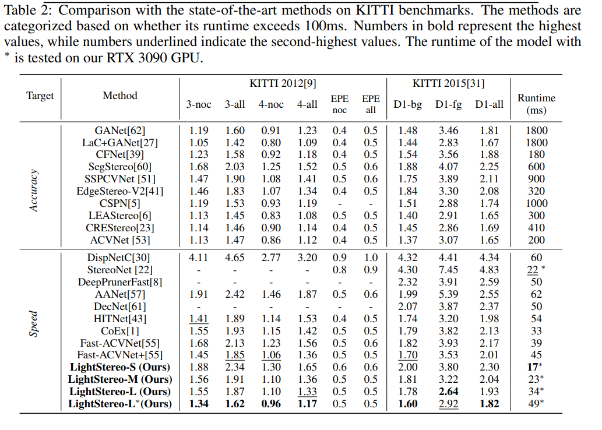

# LightStereo: Channel Boost Is All Your Need for Efficient 2D Cost Aggregation

## 写在前面
本论文也是一个轻量级的双目深度估计网络，但是主要聚焦在两个方面：2D网络以及CNN，因此对于边缘计算来说就非常的友好。

本文的主要关注点如下：
1. 如何构建cost volume有什么不同吗？
2. 如何达到高精度的恢复？

先祭出网络的整体框图：


## 详细方法

### Inverted Residual Blocks

这个block其实本身没有什么好讲的，MobileNet都已经这么多年了，但是在网络中作者把该block用在了对cost volume的特征提取上，该block在先对通道方向（disparity）进行增强（factor=4），特征整合之后再降维到原来的维度，和题目中的Channel Boost相呼应。




当然，这么设计真的比其他的强吗？作者也做了消融实验，如下：


可以看到V2 block确实是取得了效果和时间的最佳平衡。


### Multi-Scale Convolutional Attention Module

我们知道一个比较大的感受野其实理论上类似于Transformer的Attention操作，作者在这里使用多尺度的MSCA模块对图像处理，用比较大的感受野捕捉细节来辅助Cost Volume的处理，这里注意的是整个模块中考虑到轻量化，采用的都是depth-wise的卷积核，模块如下：



消融实验结果如下，最后的m,n,o为作者提出的几个模型参数：



代码部分如下，其实和SE这些注意力机制作用机理很相似：
```python
class AttentionModule(nn.Module):
    def __init__(self, dim, img_feat_dim):
        super().__init__()
        self.conv0 = nn.Conv2d(img_feat_dim, dim, 1)

        self.conv0_1 = nn.Conv2d(dim, dim, (1, 7), padding=(0, 3), groups=dim)
        self.conv0_2 = nn.Conv2d(dim, dim, (7, 1), padding=(3, 0), groups=dim)

        self.conv1_1 = nn.Conv2d(dim, dim, (1, 11), padding=(0, 5), groups=dim)
        self.conv1_2 = nn.Conv2d(dim, dim, (11, 1), padding=(5, 0), groups=dim)

        self.conv2_1 = nn.Conv2d(dim, dim, (1, 21), padding=(0, 10), groups=dim)
        self.conv2_2 = nn.Conv2d(dim, dim, (21, 1), padding=(10, 0), groups=dim)

        self.conv3 = nn.Conv2d(dim, dim, 1)

    def forward(self, cost, x):
        attn = self.conv0(x)

        attn_0 = self.conv0_1(attn)
        attn_0 = self.conv0_2(attn_0)

        attn_1 = self.conv1_1(attn)
        attn_1 = self.conv1_2(attn_1)

        attn_2 = self.conv2_1(attn)
        attn_2 = self.conv2_2(attn_2)

        attn = attn + attn_0 + attn_1 + attn_2
        attn = self.conv3(attn)
        return attn * cost
```

### Backbone的影响

作者也做了不同backbone的对比实验，RepVIT还是强的：



----


## 总结

简单说网络还是很强的，笔者在RK板子上部署之后稍微修改一下就能跑到20hz，回答一下最开始的关注点：

1. 构建cost volume使用相似度度量，公式如下：

    

2. 从论文的角度来讲，上面的Inverted Residual Block和MSCA的消融实验都告诉我们这两个都对精度有很大的提高，对于MSCA，笔者觉得不意外，毕竟多尺度和大感受野是一个非常确定的提升trick，但是对于Inverted Residual Block能有这么大的提升还是比较惊喜的，说明对于disparity这个通道进行细致处理是非常有意义的，这也是题目的Channel Boost is all you need的底气所在。

最后贴一些结果对比的图，依旧注意本文是做性能和速度的平衡的，所以整体看网络还是很强的

