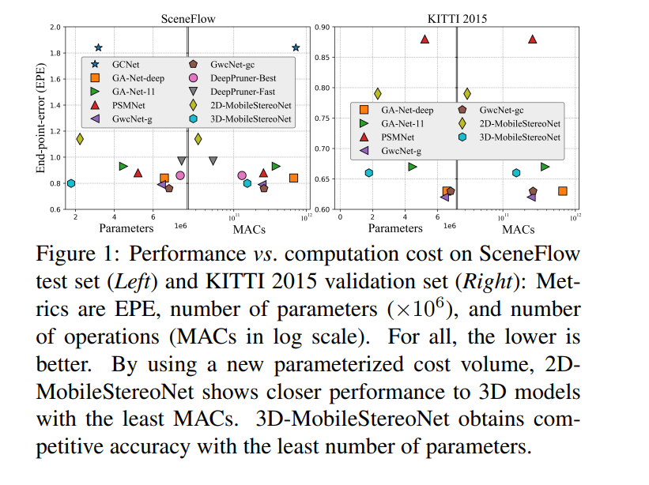
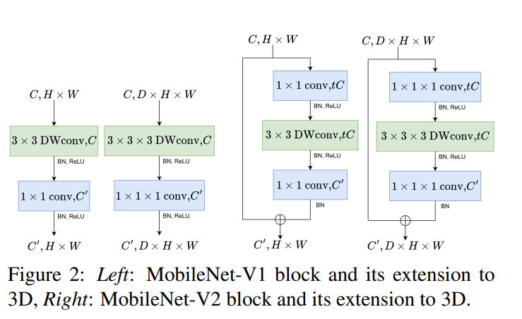
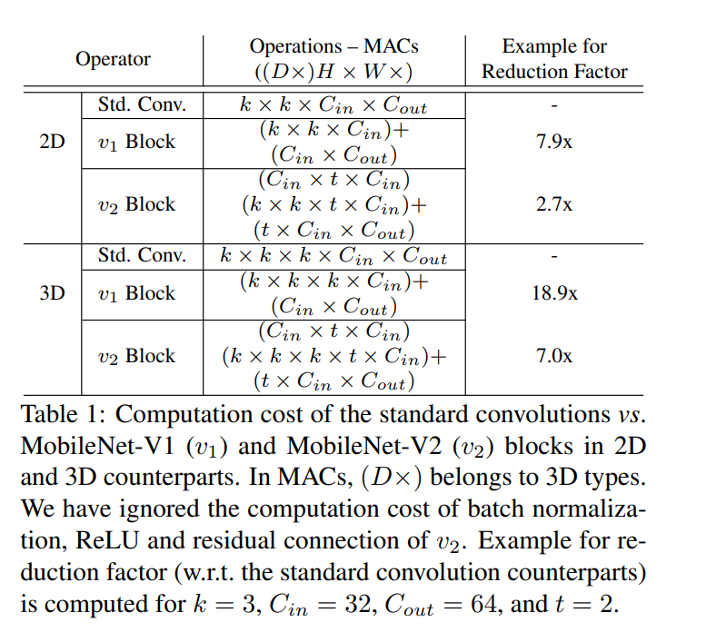
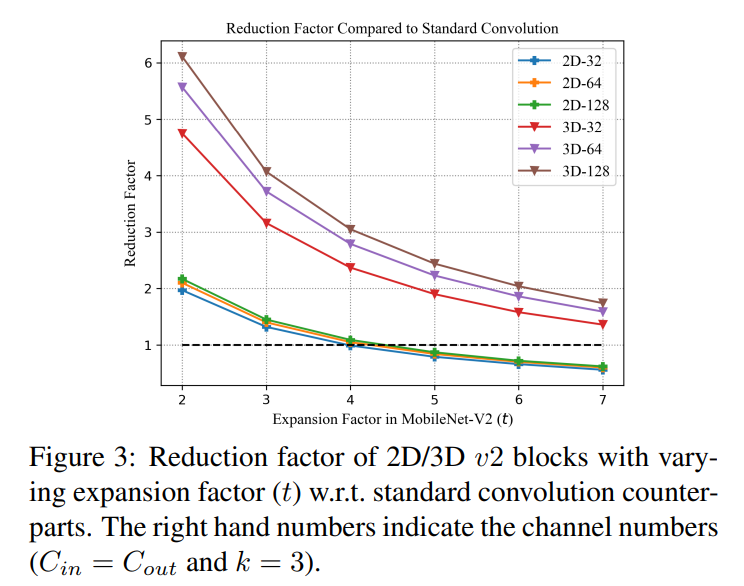
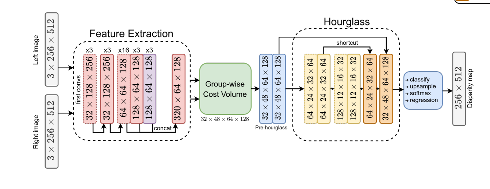
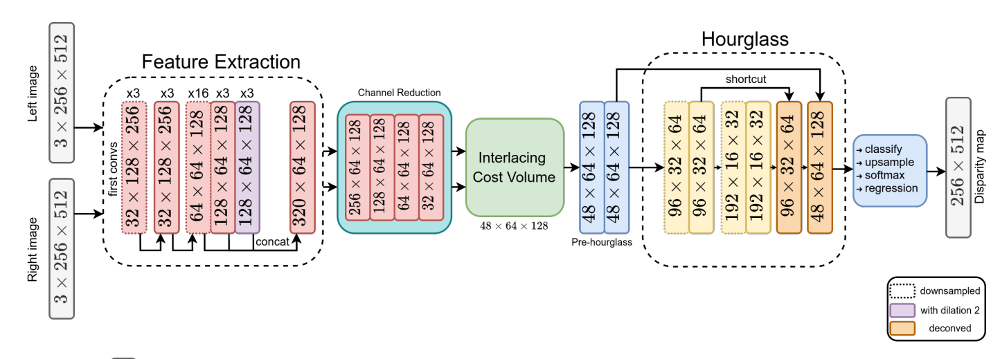
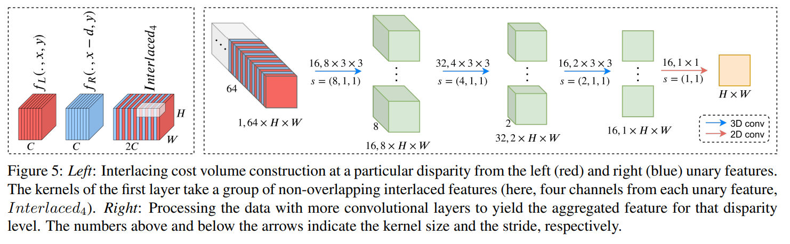
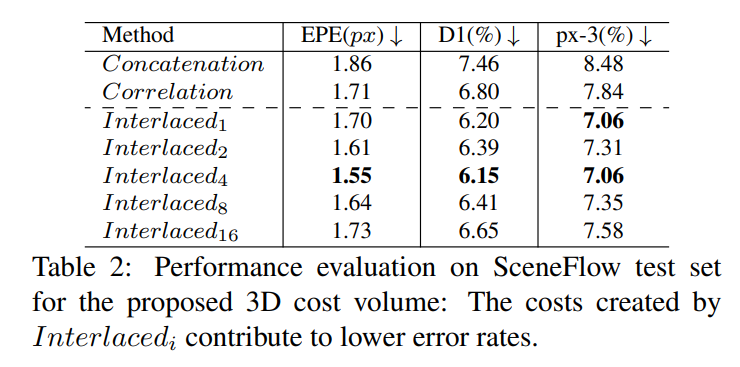

# MobileStereoNet: Towards Lightweight Deep Networks for Stereo Matching

## 写在前面

很经典的一篇文章，轻量化必不可少的文章算是：
1. 把mobilenet的思路带入到繁重的3D/4D cost volume的计算中，降低了整体的计算量，同时保持整个网络的效果；
2. 提出了一个子网络来进行cost volume的构建，不再使用传统的距离判断的方法；
3. 不止有3D的网络，同时还推出了2D网络


- github: https://github.com/cogsys-tuebingen/mobilestereonet
- paper: https://arxiv.org/pdf/2108.09770

----

## 具体方法
### 轻量化的block设计
这部分没有特别多需要讲的，就是把mobilenet的block扩展为3D的模块，如下：


作者这里对比了一下整体计算量的减少系数（reduction factor），可以看到2D block的扩展在通道扩展数大于5之后，就可能不如原始的卷积核，所以作者最后选择t=3和t=2(在hourglass中)




### 3D pipeline设计
3D pipeline在设计的时候没有特别的的部分，主要就是把原来的3D部分换为了轻量的block


cost volume的构建使用简单的分组相似度计算，代码如下：
```python
def groupwise_correlation(fea1, fea2, num_groups):
    B, C, H, W = fea1.shape
    assert C % num_groups == 0
    channels_per_group = C // num_groups
    cost = (fea1 * fea2).view([B, num_groups, channels_per_group, H, W]).mean(dim=2)
    assert cost.shape == (B, num_groups, H, W)
    return cost


def build_gwc_volume(refimg_fea, targetimg_fea, maxdisp, num_groups):
    B, C, H, W = refimg_fea.shape
    volume = refimg_fea.new_zeros([B, num_groups, maxdisp, H, W])
    for i in range(maxdisp):
        if i > 0:
            volume[:, :, i, :, i:] = groupwise_correlation(refimg_fea[:, :, :, i:], targetimg_fea[:, :, :, :-i],
                                                           num_groups)
        else:
            volume[:, :, i, :, :] = groupwise_correlation(refimg_fea, targetimg_fea, num_groups)
    volume = volume.contiguous()
    return volume
```

### 2D pipeline设计
作者在2D框架的设计上做了一些独特的设计：
- 使用了channel reduction进行了通道数的压缩操作，将信息尽可能的保留；
- 提出了interlacing cost volume的方法，将3D的cost volume的信息压缩到了2D上；



#### channel reduction
这部分没有特别多需要解释的，主要是作者使用了几个卷积层将channel递减

#### interlacing cost volume construction
这部分是作者特地为2D pipeline设计的，因为在传统的设计中，是需要有一个相关性函数来获取一个特定视差下的特征图，公式如下：

$$
\begin{equation}
C_{3D}(d, x, y) = G(f_{L}(x, y), f_{R}(x-d, y)) 
\end{equation}
$$

其中函数 $G$ 为相似度度量函数，常用的比如：
- Hamming distance
- 特征相似度度量

通过上面的函数就可以将2D的图像信息升维到3D信息。

作者提出了一种可学习的方式来获取特定视差下的feature，如下图所示，笔者认为这样的好处应该是通过网络弥补了一些spatial resolution上的缺陷：


其中Interlacedi表示后续使用的3D卷积核为2ix3x3，例如图片中的Interlaced4，表示后续使用的是8x3x3的

代码部分如下，感觉这部分还是挺麻烦的：
```python
self.conv3d = nn.Sequential(nn.Conv3d(1, 16, kernel_size=(8, 3, 3), stride=[8, 1, 1], padding=[0, 1, 1]),
                            nn.BatchNorm3d(16),
                            nn.ReLU(),
                            nn.Conv3d(16, 32, kernel_size=(4, 3, 3), stride=[4, 1, 1], padding=[0, 1, 1]),
                            nn.BatchNorm3d(32),
                            nn.ReLU(),
                            nn.Conv3d(32, 16, kernel_size=(2, 3, 3), stride=[2, 1, 1], padding=[0, 1, 1]),
                            nn.BatchNorm3d(16),
                            nn.ReLU())

self.volume11 = nn.Sequential(convbn(16, 1, 1, 1, 0, 1),
                                nn.ReLU(inplace=True))

B, C, H, W = featL.shape
volume = featL.new_zeros([B, self.num_groups, self.volume_size, H, W])
for i in range(self.volume_size):
    if i > 0:
        x = interweave_tensors(featL[:, :, :, i:], featR[:, :, :, :-i])
        x = torch.unsqueeze(x, 1)
        x = self.conv3d(x)
        x = torch.squeeze(x, 2)
        x = self.volume11(x)
        volume[:, :, i, :, i:] = x
    else:
        x = interweave_tensors(featL, featR)
        x = torch.unsqueeze(x, 1)
        x = self.conv3d(x)
        x = torch.squeeze(x, 2)
        x = self.volume11(x)
        volume[:, :, i, :, :] = x

volume = volume.contiguous()
volume = torch.squeeze(volume, 1)

```

和其他方式对比试验如下：



### 最终模型
- First Convolutions: 使用mobilenetv2的block，t=3
- Feature Extraction: 保持residual connection的结构和卷积层；
- Channel Reduction: 使用4个1x1的卷积核进行操作；
- Pre-hourglass: 使用t=3的参数；
- hourglass: 2D和3D使用的通道数略有差别，使用t=2的参数；

------

## 实验结果

### SceneFlow数据集
结果如下，可以看到：
- 2D的方法确实在性能和参数上都取得了非常好的效果；
- 3D的方法虽然EPE指标不算最好，但是整体的效果-速度的trade-off也确实做到了最好了；


### KITTI2015数据集
结果如下，可以看到基本上也取得了非常好的trade-off


---

## 总结
本文主要介绍了MobileStereoNet这个网络，对于该网络而言：
- 3D网络pipeline可以认为更多的是把block做了轻量化，没有做特别独特的改进；
- 2D网络做了一些自己独特的设计，取得了速度-精度都很好的trade-off；

下篇我们来看看今年比较新的一篇文章：LightStereo