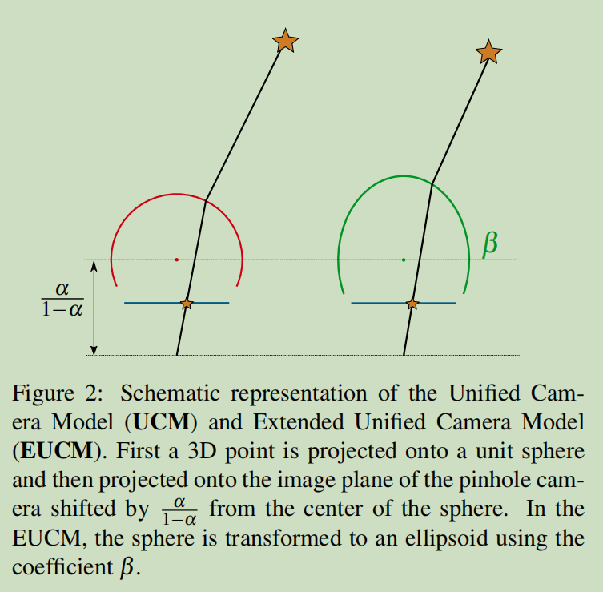
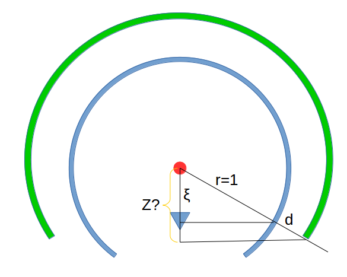
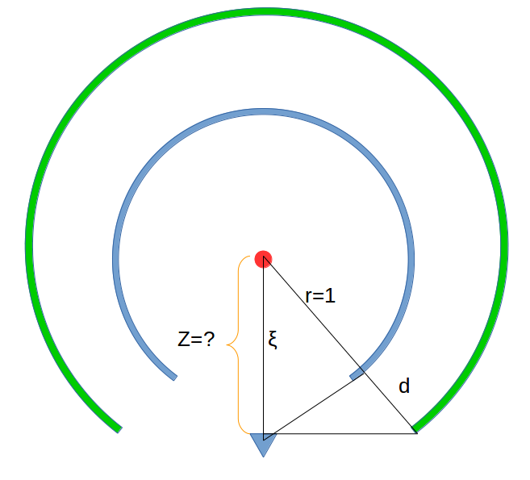
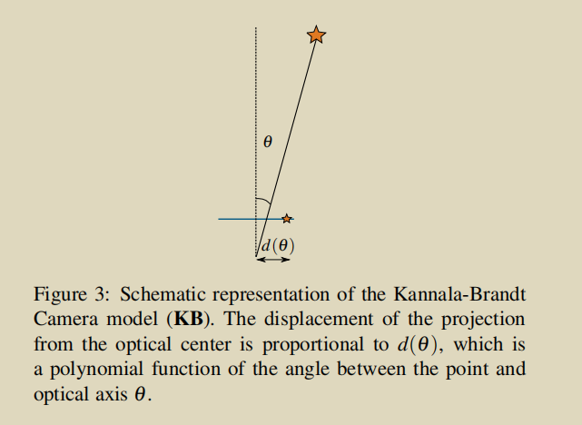
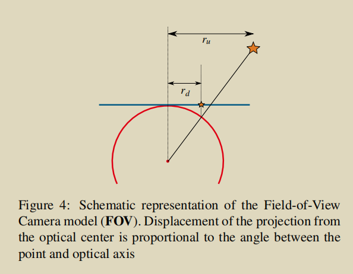

# The Double Sphere Camera Model

## 绪论

论文对目前存在的广角镜头进行了总结。对于每个模型，我们提供了投影和反投影方程，同时给出了有效投影的区域。之后我们提出了一个“双球”模型，该模型适合广角镜头，同时具有计算简单，拥有闭式的逆的特点。我们使用一些矫正数据集和几种不同的镜片进行测试，主要的测试点为：投影误差，计算投影反投影以及jacobians的时间。

## 简介

目前，VO和SLAM的很多问题都可以用广角镜头进行解决。

1. 广角镜头能捕捉到更多的纹理丰富的区域，对于视觉运动估计是很好的；
2. 相比于非广角镜头，对于广角镜头，大的机体运动可以对应于小的像素运动，对于直接法的方法是很好的；

目前，折返相机（Catadioptric cameras）比较贵，但是鱼眼相机具有相同的效果，同时比较常见而且便宜等优点，文章以鱼眼为主进行介绍；

文章的结构：

- Section 2，给出总结性的鱼眼模型；
- Section 3，提出一个较为新颖的投影模型，该模型具有以下优点：
  - 投影模型更适合鱼眼相机的畸变‘
  - 投影模型没有计算时间度很复杂的三角函数操作；
  - 与基于高阶或者多项式的方法不同，该模型使用迭代的方式进行求解，而逆存在闭式解；
- Section 5，对目前所有的模型运用到VO中进行评估。文章还会给出计算投影，反投影以及jacobian计算的时间；

## 相关工作

Notation：

1. $u=[u, v]^T$表示像素的坐标，$x=[x, y, z]^T$表示世界坐标系下的一个点；
2. 对于所有相机模型，假定所有投影都相交于一个点（即中心投影），该点定义了相机坐标系的位置；
3. 相机坐标的z轴对齐于相机的主轴，x,y对齐于图像的轴；
4. 用SE(3)表示相机的位姿；
5. $\pi: \Omega \rightarrow \Theta$表示相机平面到图像平面的投影，其逆$\pi^{-1}: \Theta \rightarrow \mathbb{S}^{2}$表示逆过程；

对于所有的相机模型，文章讨论了$\pi, \pi^{-1}$的公式，以及相机内参$i, \Omega, \Theta$. 其中$\Omega$表示相机平面上的有效点，而$\Theta$表示图像平面上的有效点。

### 2.1 小孔相机(Pinhole)

pinhole的模型比较简单，如下：

$$\pi(\mathbf{x}, \mathbf{i})=\left[\begin{array}{l}{f_{x} \frac{x}{z}} \\ {f_{y} \frac{y}{z}}\end{array}\right]+\left[\begin{array}{l}{c_{x}} \\ {c_{y}}\end{array}\right]$$

$$\begin{aligned} \pi^{-1}(\mathbf{u}, \mathbf{i}) &=\frac{1}{\sqrt{m_{x}^{2}+m_{y}^{2}+1}}\left[\begin{array}{c}{m_{x}} \\ {m_{y}} \\ {1}\end{array}\right] \\ m_{x} &=\frac{u-c_{x}}{f_{x}} \\ m_{y} &=\frac{v-c_{y}}{f_{y}} \end{aligned}$$

理论上来说，只要z大于0(180度)，该模型都能正常的工作，但是实际上，即便是加上了畸变矫正，当镜头的视场大于120度的时候，模型的表现就已经是次优了。

所以对于pinhole模型而言:

1. $i = [fx, fy, cx, cy]$
2. $\Omega = \{x\in \mathbb{R}^3, z>0\}$
3. $\Theta = \mathbb{R}^2$

### 2.2 Unified Camera Model

UCM模型一共有5个参数，$\mathbf{i}=\left[\gamma_{x}, \gamma_{y}, c_{x}, c_{y}, \xi\right]^{T}$，研究表明UCM模型可以表示抛物面，双曲面，椭圆以及平面镜的系统，该模型也能表示鱼眼镜头，但是模型并不能特别完美的适合所有的鱼眼。

UCM模型的投影方程为：

$$\begin{aligned} \pi(\mathbf{x}, \mathbf{i}) &=\left[\begin{array}{c}{\gamma_{x} \frac{x}{\xi d+z}} \\ {\gamma_{y}\frac{y}{\xi d+z}}\end{array}\right]+\left[\begin{array}{c}{c_{x}} \\ {c_{y}}\end{array}\right] \\ d &=\sqrt{x^{2}+y^{2}+z^{2}} \end{aligned}$$

该模型认为先把3D点投影到一个单位球面上，之后把该球面shift到一个$\xi$的高度，再通过小孔成像的方式得到最终的图。实际的图如下：

通常情况下，上述模型通常改写为：

$$\pi(\mathbf{x}, \mathbf{i})=\left[\begin{array}{l}{f_{x} \frac{x}{\alpha d+(1-\alpha) z}} \\ {f_{y} \frac{y}{\alpha d+(1-\alpha) z}}\end{array}\right]+\left[\begin{array}{c}{c_{x}} \\ {c_{y}}\end{array}\right]$$

所以模型的参数又可以写作$i=\left[f_{x}, f_{y}, c_{x}, c_{y}, \alpha\right]^{T}$，其中$\alpha \in [0, 1]$，下面分析一下有效的投影点，先给出结论：

$$\begin{array}{l}{\Omega=\left\{\mathbf{x} \in \mathbb{R}^{3} | z>-w d\right\}} \\ {w=\left\{\begin{array}{ll}{\frac{\alpha}{1-\alpha},} & {\text { if } \alpha \leq 0.5} \\ {\frac{1-\alpha}{\alpha}} & {\text { if } \alpha>0.5}\end{array}\right.}\end{array}$$

> 稍对上面的结论进行分析，主要分析两种情况，第一种就是当shift的距离没有超过单位球的半径时：
>
> 
>
> 第二种就是当shift的距离超过单位球的半径的时候：
>
> 

反投影的公式可以写作：

$$\begin{aligned} \pi^{-1}(\mathbf{u}, \mathbf{i}) &=\frac{\xi+\sqrt{1+\left(1-\xi^{2}\right) r^{2}}}{1+r^{2}}\left[\begin{array}{c}{m_{x}} \\ {m_{y}} \\ {1}\end{array}\right]-\left[\begin{array}{l}{0} \\ {0} \\ {\xi}\end{array}\right] \\ m_{x} &=\frac{u-c_{x}}{f_{x}}(1-\alpha) \\ m_{y} &=\frac{v-c_{y}}{f_{y}}(1-\alpha) \\ r^{2} &=m_{x}^{2}+m_{y}^{2} \\ \xi &=\frac{\alpha}{1-\alpha} \end{aligned}$$

反过来，有效的图像平面的区域为：

$$\Theta=\left\{\begin{array}{ll}{\mathbb{R}^{2}} & {\text { if } \alpha \leq 0.5} \\ {\left\{\mathbf{u} \in \mathbb{R}^{2} | r^{2} \leq \frac{(1-\alpha)^{2}}{2 \alpha-1}\right\}} & {\text { if } \alpha>0.5}\end{array}\right.$$

### 2.4 Kannala-Brandt 相机模型

KB相机模型可以很好的符合常规、广角和鱼眼摄像头。KB模型假设相机的光心到投影点的距离是关于投影点与Z轴夹角$\theta$的多项式，如下图所示：

所以鱼眼的参数一般为两种，6参数$i=[f_x, f_y, c_x, c_y, k_1, k_2]$和8参数$i=[f_x, f_y, c_x, c_y, k_1, k_2, k_3, k_4]$，投影公式为：

$$\begin{aligned} \pi(\mathbf{x}, \mathbf{i}) &=\left[\begin{array}{l}{f_{x} d(\theta) \frac{x}{r}} \\ {f_{y} d(\theta) \frac{y}{r}}\end{array}\right]+\left[\begin{array}{c}{c_{x}} \\ {c_{y}}\end{array}\right] \\ r &=\sqrt{x^{2}+y^{2}} \\ \theta &=\operatorname{atan} 2(r, z) \\ d(\theta) &=\theta+k_{1} \theta^{3}+k_{2} \theta^{5}+k_{3} \theta^{7}+k_{4} \theta^{9} \end{aligned}$$

可以看到多项式$d(\theta)$作用于在xy平面上归一化之后的x, y值

KB模型的反投影方程为：

$$\begin{aligned} \pi^{-1}(\mathbf{u}, \mathbf{i}) &=\left[\begin{array}{c}{\sin \left(\theta^{*}\right) \frac{m_{x}}{r_{u}}} \\ {\sin \left(\theta^{*}\right) \frac{m_{y}}{r_{u}}} \\ {\cos \left(\theta^{*}\right)}\end{array}\right] \\ m_{x} &=\frac{u-c_{x}}{f_{x}} \\ m_{y} &=\frac{v-c_{y}}{f_{y}} \\ r_{u} &=\sqrt{m_{x}^{2}+m_{y}^{2}} \\ \theta^{*} &=d^{-1}\left(r_{u}\right) \end{aligned}$$

KB模型有时候用于小孔镜头的畸变模型。需要注意的是，因为该模型先用小孔相机的模型，之后使用畸变的模型，因此在z=0的时候会出现奇异值，导致该模型不适合180度的鱼眼镜头。

最后分析一下可投影的范围：

- 世界坐标系下的范围为$\Omega=\mathbb{R}^3 /\ [0,0,0]^T $
- 图像坐标系下的范围为$\Theta=\mathbb{R}^2$

顺便一提，opencv中的鱼眼模型以及kalibr中的等距畸变模型（equidistant distortion）用的就是KB模型；

### 2.5 FOV（Field of View）相机模型

FOV模型有五个参数$i=[f_x, f_y, c_x, c_y, w]^T$，该模型认为图像点与Z轴的距离与实际3D点与Z轴距离的角度有一个比例关系，如图所示一样。

其中模型中的w近似于理想鱼眼镜头的视场。

投影模型如下：

$$\begin{aligned} \pi(\mathbf{x}, \mathbf{i}) &=\left[\begin{array}{c}{f_{x} r_{d} \frac{x}{r_{y}}} \\ {f_{y} r_{d} \frac{y}{r_{u}}}\end{array}\right]+\left[\begin{array}{c}{c_{x}} \\ {c_{y}}\end{array}\right] \\ r_{u} &=\sqrt{x^{2}+y^{2}} \\ r_{d} &=\frac{\operatorname{atan} 2\left(2 r_{u} \tan \frac{w}{2}, z\right)}{w} \end{aligned}$$

FOV相机模型的反投影模型为：

$$\begin{aligned} \pi^{-1}(\mathbf{u}, \mathbf{i}) &=\left[\begin{array}{c}{m_{x} \frac{\sin \left(r_{d} w\right)}{2 r_{d} \tan \frac{w}{2}}} \\ {m_{y} \frac{\sin \left(r_{d} w\right)}{2 r_{d} \tan \frac{w}{2}}}\\ {\cos \left(r_{d} w\right)}\end{array}\right] \\ m_{x} &=\frac{u-c_{x}}{f_{x}} \\ m_{y} &=\frac{v-c_{y}}{f_{y}} \\ r_{d} &=\sqrt{m_{x}^{2}+m_{y}^{2}} \end{aligned}$$

最后分析一下可投影的范围：

- 世界坐标系下的范围为$\Omega=\mathbb{R}^3 /\ [0,0,0]^T $
- 图像坐标系下的范围为$\Theta=\mathbb{R}^2$