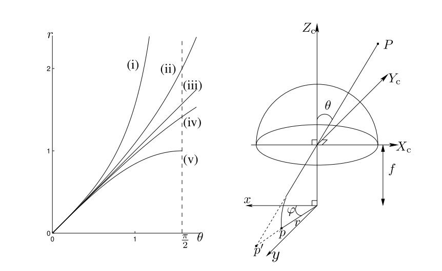

# 相机模型的总结

本文主要对常用的相机模型进行总结，主要分为两个部分，针孔模型和鱼眼模型，每个相机模型会有理论介绍与实际的操作，大多数会用到opencv作为工具；

&nbsp;

-----

## 针孔相机模型

TODO

&nbsp;

------

## 鱼眼相机模型

### 参考

1. https://docs.opencv.org/4.x/db/d58/group__calib3d__fisheye.html opencv的fisheye model
2. A Generic Camera Model and Calibration Method for Conventional, Wide-Angle, and Fish-Eye Lenses 一种通用的鱼眼模型
3. https://blog.csdn.net/github_39582118/article/details/115874725 一元多次方程求解根的特征值方法

&nbsp;

### 小孔模型的改进版模型

常用的一些鱼眼模型通常都是在小孔模型的基础上衍生而来，这类模型通常认为畸变的入射角 $\theta_d$ 与真实的入射角 $\theta$ 之间满足一个多项式的关系，如下：
$$
\theta_d=\theta+k_1\theta^{3}+k_2\theta^{5}+k_3\theta^{7}+k_4\theta^{9}+\dots  \tag{1}
$$
有了畸变的入射角，根据模型的建模方式不同，可以得到不同的畸变距离：
$$
\begin{aligned}
r&=f\mathrm{tan(\theta)} \quad \text{(i. perspective projection)} \\
r&=f\mathrm{tan(\frac{\theta}{2})}  \quad \text{(ii. stereographic projection)} \\
r&=f\mathrm{\theta}  \quad \quad \quad \text{(iii. equidistance projection)} \\
r&=f\mathrm{sin(\frac{\theta}{2})} \quad \text{(iv. equisolid projection)} \\
r&=f\mathrm{sin(\theta)} \quad \text{ (v. orthogonal projection)} \\
\end{aligned}
$$
图示如下：

左图有两个点是比较重要的，第一个就是 $\theta = \frac{\pi}{2}$ ，图中标记了出来，第二个就是 $r=1$ 。

- $\theta = \frac{\pi}{2}$ 表示入射角可以达到与光轴垂直的角度，可以看到iii, iv, v的模型基本上都可以涵盖这样的情况；
- $r=1$ 表示归一化平面的点与光心的距离为1，此时在x y轴上已经达到了最大了，但是在非轴上的点，它的距离还可以再远一些，这也就是我们通常看到矫正之后的图像是一张四个角被拉伸的图像的原因；

等距模型是最常用的鱼眼模型，也是opencv中使用的鱼眼模型，下面主要介绍该模型，其他模型原理上是类似的，实践中

1. 通过畸变点与光心距离换算畸变入射角的时候采用不同的公式；
2. 畸变参数也是不同的；

&nbsp;

### 等距模型（Equidistance）

等距模型如上面公式所体现的，距离和入射角呈线性关系，所以入射角如果是均匀的，那么得到的距离组成的同心圆也是均匀的，所以称为等距模型。

下述步骤都在归一化平面上进行，一旦得到了归一化平面的点，就可以通过内参映射到图像坐标系下。

依旧按照相机投影的两个关键步骤进行解析。

#### 正向投影

正向投影的时候，根据空间点的位置：

1. 通过三角函数关系得到正确的入射角 $\theta$， 根据上述的畸变公式（1），计算得到经过镜头畸变的入射角 $\mathrm{\theta_d}$；
2. 根据等距模型 $r=f\theta$，得到在图像中点到光心的距离，通常取 $f=1$（这个地方跟畸变矫正算法中的值有关），所以 $r_d=\theta_d$；
3. 等距模型认为畸变只会影响点到光心的距离，而不会影响点和光心的夹角，所以可以通过空间点在归一化平面上的坐标求得角度 $\phi$；
4. 最后计算经过畸变的点的坐标 $\mathrm{x_d=cos(\phi) r_d, y_d=sin(\theta)r_d}$；
5. 将 $[x_d, y_d]$ 按照内参映射到图像坐标系得到 $[u, v]$；

#### 反向投影

反向投影就是上述步骤的逆过程，最主要的部分就是如何通过畸变 $\theta_d$ 获得未畸变的 $\theta$ ：

1. 根据图像坐标点 $[u, v]$ 和内参矩阵得到在归一化平面上的点 $[x_d, y_d]$；
2. 根据 $[x_d, y_d]$ 计算得到点与光心的夹角 $\phi$ 以及畸变之后的点到光心的距离 $r_d$；
3. 根据等距模型，依旧取$f=1$，则得到 $\theta_d=r_d$；
4. 此时根据畸变公式（1），我们需要做的就是求解一元高次方程的根，这里可以使用SVD的方法进行求解，具体参考[这里](https://blog.csdn.net/github_39582118/article/details/115874725 )，在实现的时候，求解得到的根会有实根和虚根，因此需要把虚根去除，同时如果有多个实根，则取中位数作为$\theta$；
5. 得到了真实的$\theta$，根据等距公式就可以得到真实的距离$r=f\theta$；
6. 使用 $r$ 和 $\phi$ 就可以得到归一化平面上的空间点坐标 $\mathrm{x=cos(\phi)r, y=sin(\phi)r}$；

&nbsp;

