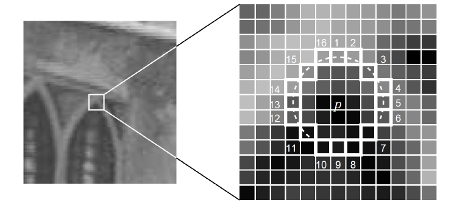
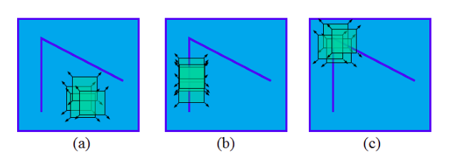
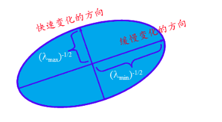
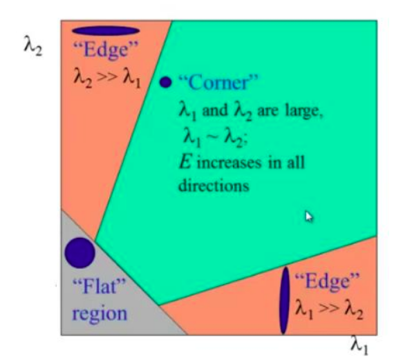
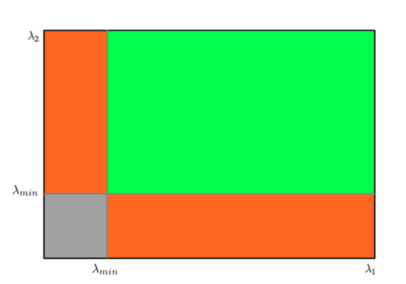

# 角点检测

## FAST角点检测

主要的想法：

1. 当一个点的周围许多像素都比该像素要大或者小，则可以认为该点为一个角点；
2. 对于每个地方做NMS去重，就可以得到比较好的角点；

实际的做法(以16点法为例)：

1. 选择一个像素$p$，取该像素周围一定范围的16个点作为比较对象进行比较，如下图所示：

   

2. 如果其中大于$I_p+t$或者小于$I_p-t$的像素数量大于9个，则认为该点为角点，否则则认为不是角点；
3. 对于上述过程，可以采用预比较进行加速，比如先比较十字方向的像素，即$I_1, I_5, I_9, I_{13}$的值，如果满足上述条件，则认为该点为候选点，否则认为该点不是候选点，删除掉；对于候选点，则比较16个像素的值，9个则认为是角点；
4. 这样提取出来的点就会比较多，比如上图中，$p$点周围的点也差不多会被认为是角点，因此要额外的进行一步非极大值抑制（NMS）操作，即在角点的一个范围内( 3×3 或者 5×5 )取分数最高的角点，其中分数的取法也比较多，常用的可以是所有点对于中间像素的差的和；

## Harris角点

主要的想法：

1. 若一个划窗在图像上移动，对于平移$[u, v]$个像素而言，可以计算出像素块(因为这算是使用光度误差，因此使用像素块)的像素差为：

   $$E(u, v)=\sum_{x, y} \underbrace{w(x, y)}_{\text {window function }}[\underbrace{I(x+u, y+v)}_{\text {shifted intensity }}-\underbrace{I(x, y)}_{\text {intensity }}]^{2}$$

2. 根据像素块的差值，一共有三种情况：

   a. 变化较小，则认为在像素变化不大的地方；

   b. 单方向上(即仅有$u$或者$v$变化时)变化很大，则认为该像素处于边缘上；

   c. 所有方向上变化很大，则认为该像素是一个角点；

   如下图所示：

   

3. 所以对于角点而言，目标就是看$E(u, v)$的变化是否足够大，那么需要有下面几个步骤：
   1. 将$I(x+u, y+v)$泰勒展开之后可得：

      $$I(x+u, y+v)=I(x, y)+I_{x} u+I_{y} v+O\left(u^{2}, v^{2}\right)$$

   2. 将上式代入$E(u, v)$的公式可得：

      $$E(u, v)=\sum_{x,y}w(x, y)[u, v]\left[\begin{array}{cc}{I_{x}^{2}} & {I_{x} I_{y}} \\ {I_{x} I_{y}} & {I_{y}^{2}}\end{array}\right]\left[\begin{array}{l}{u} \\ {v}\end{array}\right]=[u, v]M\left[\begin{array}{l}{u} \\ {v}\end{array}\right]$$

   3. 从上式可以比较明显的看出来$E(u, v)$是关于$[u, v]$的一个椭圆方程，该椭圆方程长轴和短轴由M矩阵决定，这里不假证明的说椭圆的长短轴是M矩阵的两个特征值$\lambda1, \lambda2$:

      

   

   4. 定义响应函数为$R=\lambda_{1} \lambda_{2}-k\left(\lambda_{1}+\lambda_{2}\right)^{2}$，若：

      1. $|R|$比较小，说明$\lambda1, \lambda2$都比较小，则在平坦的区域；
      2. R<0，则说明$\lambda1, \lambda2$中一个远大于另一个，则在边缘区域上；
      3. R比较大，则说明$\lambda1, \lambda2$都比较大，是角点的位置；

      如下图表示：

      

## Shi-Tomasi角点

主要的想法：

1. 对于Harris角点，定义的响应函数为$R=\lambda_{1} \lambda_{2}-k\left(\lambda_{1}+\lambda_{2}\right)^{2}$, 而Shi-Tomasi角点则直接取$\lambda1, \lambda2$中的最小值，如果最小值都大于阈值的话，那么该角点称之为强角点，如下图所示，绿色的区域就是角点的部分：

   

