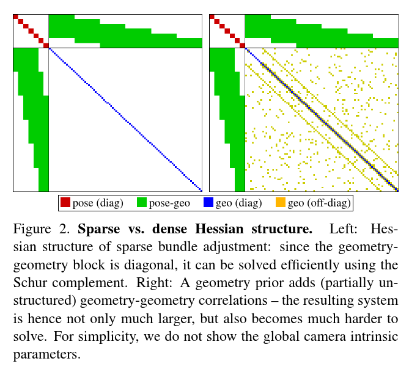

# Direct Sparse Odometry

## Abstract

本文提出了一个较为新颖的直接稀疏里程计（DSO）。**整个系统包含了完整的直接法（最小光度误差）模型**，状态包含相机的位姿，逆深度。为了达到实时运算，算法去除了直接法添加先验的做法，取而代之的是从整个图像上均匀的采样关键点。最后，整个系统添加了完整的光度标定，考虑了曝光时间，镜头渐晕以及非线性响应函数（这些基本上都是相机的参数）。

## Introduce

这部分主要介绍Direct vs Indirect、Sparse vs Dense方法。

#### Direct VS Indirect

- Indirect方法主要分为两步：1） 预处理图像，获得一致性的表示（指代匹配步骤，不管是匹配法或者光流法）；2） 使用观测进行自变量的估计；
- Direct方法舍弃了第一步，直接使用像素值的光度误差进行估计；

通常，Direct使用光度误差进行优化，而Indirect方法则使用几何误差进行优化。

#### Dense VS Sparse

- Sparse方法：利用图像中部分独立点进行重建；
- Dense方法：利用图像的全部像素进行重建；
- Semi-dense方法：避免重建整个平面，本质上还是使用部分子集进行重建，论文中描述子集的特点为连接程度大且约束严格，个人的理解是梯度比较大，优化信息比较明显；

个人感觉，Dense和Sparse再讲如何使用图像中的像素点。

关于两种方法的组合方法，这里不再赘述，详细可以看论文中的部分。DSO使用的显然就是Direct+Sparse方法，也就是优化方法是光度误差优化，而在整个过程中，是选择图像中一部分像素参与到优化的。

#### 关于为什么使用Direct方法

Indirect方法的优势是不言而喻的，关键点对于光照变化、镜头畸变具有很好的鲁棒性。但是针对相机的曝光时间、伽马矫正等已知噪声的影响，Indirect方法显得无能为力；但是对于Direct方法，由于使用光度误差进行优化，可以很自然的将相机的一些特性引入到模型中。

直接法的最大的优势就是不需要关键点的匹配，从而能得到一个更细粒度的几何表示（这点暂时没有感受到）；同时，直接法可以在整个图像上寻找有用的点，包括edge上的点和灰度比较低的点，这样的好处是能在稀疏纹理的地方显得更加的鲁邦。

稀疏法最大的优势在于保持了求解矩阵的稀疏性，没有引入几何先验使得Hassan阵是稀疏的，如下图：

