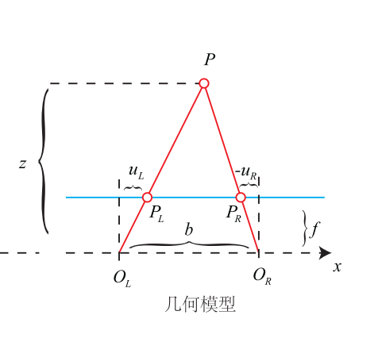
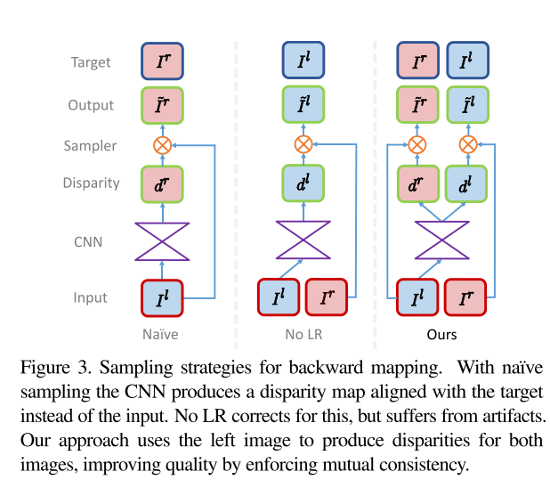

# MonoDepth

## 写在前面

单目深度预测的第一篇文章。Monodepth属于自监督单目深度预测中较为经典的一个方法，首先相对于监督方法而言，Monodepth是自监督的，因此对于没有标签的数据集而言是友好的；其次，对于之前提出的相似算法而言，作者在它们的基础上进行了改进，使得算法能够输出更好的效果；

&nbsp;

## 符号表示

首先还是弄清楚整个文章中的符号：

- 左右目的图像表示为 ${I_l, I_r}$；
- 网络预测的视差表示为 $d^{l}, d^{r}$；
- 根据网络预测的视差而得到的图像表示为 $\tilde{I}^{l}=I^r(d^l), \tilde{I}^{r}=I^l(d^r)$；
- 通过视差图得到深度的公式为 $\hat{d}=bf/d$，其中 $f$ 为焦距，$b$ 为基线长度，$d$ 为预测的视差；

&nbsp;

## 方法细节

方法部分主要注重的就是两个地方：网络构架和监督的loss；

### 网络架构

整个方法的主要网络架构可以表示为下图：

可以看到网络主要有如下的特点：

1. 网络采用encode-decode的方法；
2. 相比于之前的网络，作者使用单张图片预测了左右的视差，并分别与左右目的图像结合进行图像层面的监督，作者文中说No LR的方法因为仅仅预测了单个视差，因此出现了伪影和深度上的不连续（看起来主要是因为某些区域内部纹理十分的相似，导致视差的预测会不准确），而通过左右目的图像一起进行监督就会使得视差预测的更具有一致性，保证最终的预测是好的；
3. 最后，作者在decode的解码中提取了多层特征图来进行视差图的预测；

### 训练loss

loss部分主要分为三个部分：

1. 光度图像的重建误差；
2. 视差平滑误差；
3. 左右目的视差一致性误差；

#### 光度图像的重建误差

这部分也比较好理解，以左图 $I_l$ 为例，将左图的像素移动预测出来的视差图 $d^r$ 就可以得到恢复回来的右图 $\tilde{I}^{r}$，随后将两张图进行SSIM误差计算，就组成了该误差项，公式如下：
$$
C_{ap}^{l}=\frac{1}{N}\sum_{i,j}\alpha\frac{1-SSIM(I_{ij}^{l}, \tilde{I}_{ij}^{l})}{2}+(1-\alpha)\|I_{ij}^{l}-\tilde{I}_{ij}^{l}\| \tag{1}
$$
可以看到整个loss项中，有SSIM（结构相似性）误差以及光度误差，在SSIM误差中，该值的值域为[-1, 1]，且值越大，说明越相似，因此作者使用上面的公式将值域缩放到了[0,1]，图片结构越相似，则值越小；

&nbsp;

#### 视差平滑误差

这部分是对于物体边缘部分视差的平滑，通常情况下，图像的梯度变化较大的地方，深度和视差都会变化会比较大，所以在物体边缘部分希望惩罚会小一些，依旧以左图为例，公式如下：
$$
C_{d s}^{l}=\frac{1}{N} \sum_{i, j}\left|\partial_{x} d_{i j}^{l}\right| e^{-\left\|\partial_{x} I_{i j}^{l}\right\|}+\left|\partial_{y} d_{i j}^{l}\right| e^{-\left\|\partial_{y} I_{i j}^{l}\right\|} \tag{2}
$$
&nbsp;

#### 左右目的一致性误差

这个部分就是因为根据左目图像同时预测了左右目的视差，因此就可以将左右目的视差一致性作为损失函数进行最小化，主要的做法就是左目和右目的同样的点的视差是要一致的，这个损失会去除掉上面所说的残影问题：
$$
C_{lr}^{l}=\frac{1}{N} \sum_{i, j}\left|d_{i j}^{l}-\underbrace{d_{i j-{d_{i j}^{l}}}^{r}}_{找到ij在右图的位置}\right| \tag{3}
$$
