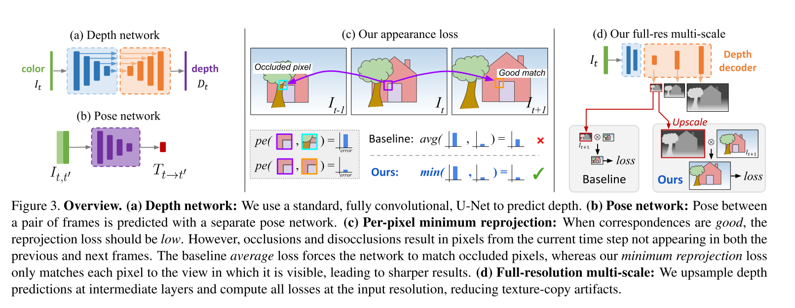
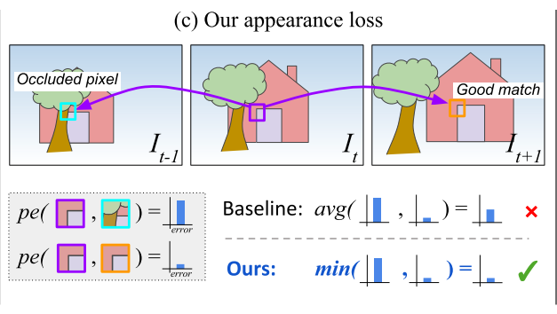
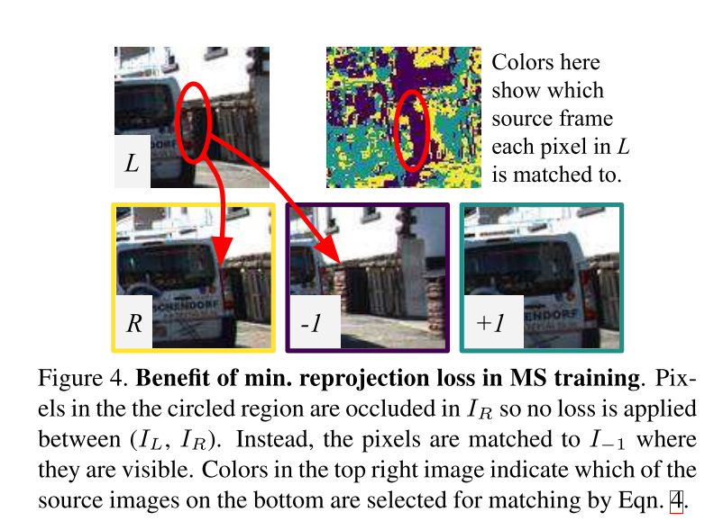
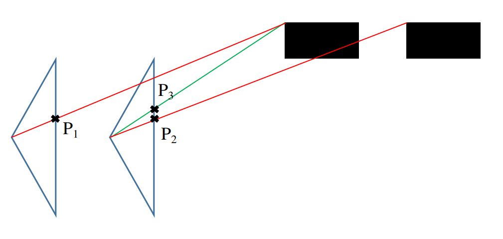
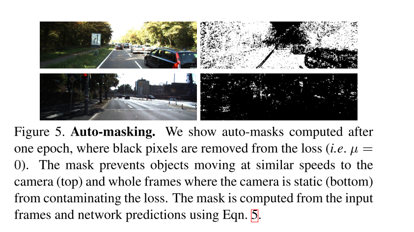
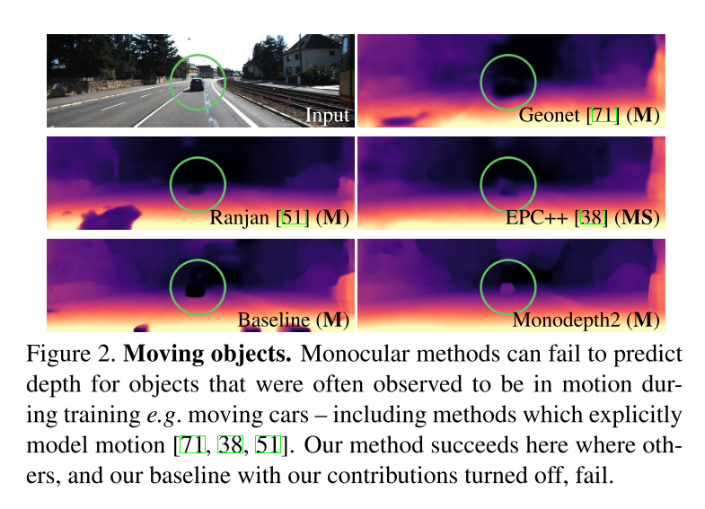
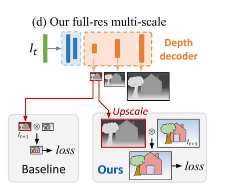
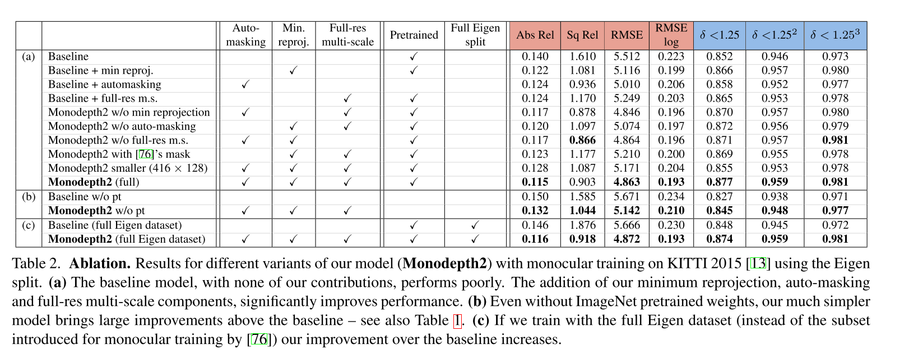

# MonoDepth2

----

## 写在前面

MonoDepth2属于自监督方案中相当经典的一个工作，作者在整个网络设计过程中考虑到了很多影响深度预测的因素，并对这些因素逐一进行了改进，使得效果超过了监督方法，也是后面很多工作都要对比的经典。

&nbsp;

---

## 符号表示

首先还是弄清楚整篇文章的符号表示

- 当前帧的图像表示为 $I_t$，临近帧的图像表示为 $I_{t'} \in \{I_{t-1}, I_{t+1}\}$；
- 投影公式表示为 $I_{t'\rightarrow t}=I_{t'}<proj(D_t, T_{t}^{t'},K)>$，所以重投影误差公式为 $L_{p}=\sum_{t'}pe(I_t, I_{t'\rightarrow t})$；
- 上面公式中的pe表示重投影的结构误差和光度误差之和，公式为 $pe(I_a, I_b)=\frac{\alpha}{2}(1-SSIM(I_a, I_b))+(1-\alpha)\|I_a-I_b\|_1$；

&nbsp;

----

## 方法细节

在训练方法上，因为前面的方法其实也很多且较为完善了，所以整体的自监督部分比较常规，但是作者深入分析了一些地方，添加了一些部分，使得效果变得更好；作者把自己的思路表达在如下图中：

### 常规的部分

在思路上，monodepth2和之前的一些自监督的方法一样，都是使用时序空间上的光度误差来作为自监督的信息，如上面的投影误差公式表示的那样：
$$
\begin{aligned}
L_{p}&=\sum_{t'}pe(I_t, I_{t'\rightarrow t}) \\
I_{t'\rightarrow t}&=I_{t'}<proj(D_t, T_{t}^{t'},K)> \\ 
pe(I_a, I_b)&=\frac{\alpha}{2}(1-SSIM(I_a, I_b))+(1-\alpha)\|I_a-I_b\|_1
\end{aligned} \tag{1}
$$
其次就是一般深度估计中使用的边缘平滑项：
$$
L_s = \left|\partial_{x} d_{t}^{*}\right| e^{-\left\|\partial_{x} I_t\right\|}+\left|\partial_{y} d_{t}^{*}\right| e^{-\left\|\partial_{y} I_{t}\right\|} \tag{2}
$$
这里面的 $d^{*}$ 值得注意，在代码中，作者对预测得到的深度图先算了一个均值 $\overline{d}$，之后使用深度除以该均值做一个归一化，公式如下：
$$
d^{*} = \frac{d}{\overline{d}} \tag{3}
$$
&nbsp;

### 提高的部分

#### Per-Pixel Minimum Reprojection Loss

作者分析了现有的自监督方法，发现其实影响算法的主要是 **不可见像素** 和  **被遮挡像素** ，当然，不可见像素可以通过一些条件判断删除，但是被遮挡的像素在 **平均为主的算法中**，会引入被遮挡部分的误差；那么作者的改进就是在所有的重投影误差中选择最小的，表示该预测的深度至少有一个是匹配上的；表示如下图：

作者在实验中也将这部分算法产生的误差图保存了下来，如下：可以看到红框中的部分在右目图上被遮挡了，但是在前一幅图上并没有遮挡，因此 **正确的深度预测** 所产生的误差图显示这部分的误差是较低的。

&nbsp;

#### Auto-Masking Stationary Pixels

作者这里分析了动态物体对于预测的影响。首先从假设上来讲，深度预测的假设通常认为相机是运动的，景物都是静止的，所以一旦有动态物体的出现时，势必会影响到重投影误差，导致深度预测的很差，更进一步分析的话：**如果出现的物体和相机的移动速度（大小和方向）差不多，那么这部分的预测深度将会是一个无穷远的洞**；

> 下面简单说为什么是一个无穷远的洞，如下图，前一帧的投影点$P_1$在下一帧的投影按照投影关系而言应该为$P_2$，但是因为物体在移动，所以投影点依旧为$P_2 \sim P_1$，那么从多视图几何上来讲，该点一定是无穷远点；
>
> 

那么知道了为什么产生以为现象之后，作者的处理方法也比较简单，作者认为如果我自身是运动的，**那么静止物体在前后图像同一点的误差（光度和结构）一定大于重投影的误差，但是速度相似的点的误差情况相反，**当然这个基于位姿和深度的预测都是差不多对的，因此作者基于这个条件实时的产生一个mask，过滤掉这些速度相似的点（stationary pixels）。
$$
\mu=[\min_{t'} pe(I_{t},I_{t\rightarrow t'}) < \min_{t'}pe(I_t, I_{t'})] \tag{4}
$$
其中：

1. [] 是Iverson bracket，当条件成立为1，否则为0，所以为1的点都是静态物体点（相机坐标系下的动态点）；
2. 这里作者也考虑到了遮挡的问题，所以用了 $\min_{t'} pe(I_t, I_{t\rightarrow t'})$；

作者在论文中给出了效果如下：

实际的预测效果可以看到也变好了很多：

&nbsp;

#### Multi-scale Estimation

多尺度的训练算是当前比较流行的一种方法，但是对于深度预测这样的任务中，中间尺度层其实并不利于最终的深度预测，最主要的原因是在中间尺度层中计算重投影误差，导致低纹理和纹理重复伪影都会在这样的分辨率中驱使深度变得无穷大；

针对上面的情况，作者的解决方案是将底层的深度先扩大到和图像大小一样的分辨率，随后再进行误差（光度和结构）的计算，这样的处理其实能够较好的解决因为分辨率变大导致的一些投影点较近引发的深度估计不准确的问题，文章中原话为 “This effectively constrains the depth maps at each scale to work toward the same objective i.e. reconstructing the high resolution input target image as accurately as possible”。

&nbsp;

------

## 消融学习

作者在KITTI数据集上进行了消融实验，结果如下：

可以看到在baseline的基础上，添加的每个提高部分都能够将预测的精度提高，同时在ImageNet上训练的预训练网络也会大大帮助模型达到更好的效果。

&nbsp;

------

## 总结

总体看到，作者在现有方法的基础上做了很多思考，并加了很多提高的方法，总结如下：

1. 为了解决遮挡对于预测的影响，提出了取最小误差的方法；
2. 为了解决同速度物体对于预测的影响，实时滤除了这些相对静止的物体的影响；
3. 改进多尺度层的投影误差，使得多层预测的目标都是使得原始分辨率下的误差（光度和结构）最小，避免中间层的误差引起预测的不准确；

