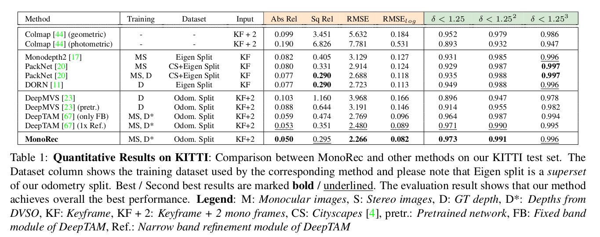
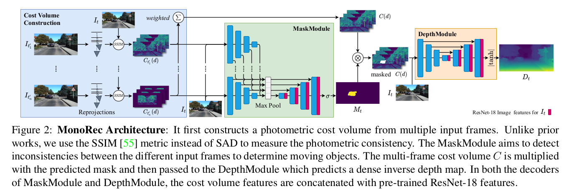
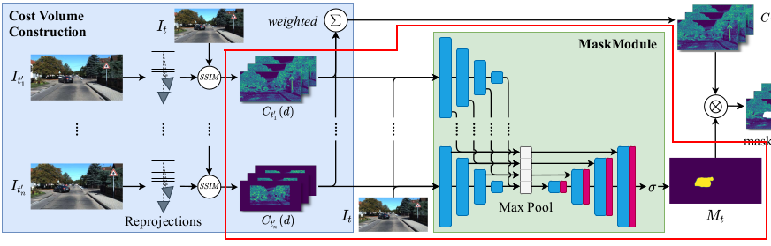
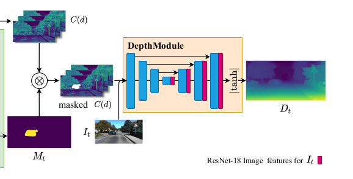
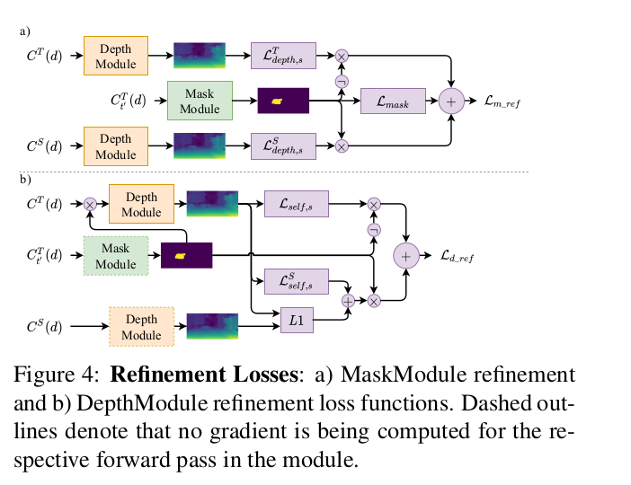

# MonoRec: Semi-Supervised Dense Reconstruction in Dynamic Environments from a Single Moving Camera

----

## 写在前面

本文是慕尼黑工业的Daniel Cremers团队研究的关于单目深度的一篇文章，对比于Mono-Depth类的方法，该方法的主要特点如下：

1. 该方法类似于一种时序的方案，将当前帧附近的信息都用上来预测当前帧的深度信息；
2. 更好的考虑了动态目标的影响，使得结果变得相当好；
3. 方法在训练的时候，不仅考虑了时序的序列（单目前后帧），也考虑了空间的序列（双目左右目），相当于多了一个很强的约束在里面；

这里给出该方法的结果，可以看到基本上是全方位提升：

&nbsp;

----

## Notation

还是先搞清楚符号表示：

- 图像帧使用 $\{I_0,...,I_N\}$ 表示，关键帧使用 $I_t$ 表示，而非关键帧使用 $I_{t'}(t'\in \{1,...,N\} | t)$ 表示；
- 帧间位姿使用 $T_{t'}^{t} \in SE(3)$ 表示；
- 算法仅预测关键帧的深度图，因此使用 $D_t$ 表示；
- 算法不仅使用了 t 时刻（关键帧时刻）的前后非关键帧 $I_{t'}$，同时也使用了当前时刻的双目图像，记作 $I_{t^S}$;

最后，光度投影公式表示为：
$$
I_{t'}^{t}=I_{t'}<proj(D_t, T_{t'}^{t})> \tag{1}
$$
&nbsp;

------

## 算法细节

这里作者给出了一张图笔者感觉特别精髓，如下：

主要的模块可以看到是三个部分：

1. Cost Volume的构建；
2. MaskModule的部分；
3. DepthModule的部分；

下面分别说一下这三部分；

&nbsp;

### Cost Volume构建

这部分主要是构建了网络的输入，作者并没有单纯的将RGB图像作为输入送给网络，而是构建了当前关键帧与非关键帧的SSIM误差图像来作为输入，当然既然是误差图像，那么必然要知道深度信息，这里深度作为待估计量，此时是不知道的。

作者的做法是对于关键帧 $I_t$ ，对每个像素点 $\mathrm{x}$ 都枚举一些深度，之后将像素点使用这些深度值按照公式（1）进行投影，所以对于一对图像 $\{I_t, I_{t'}\}$，其中像素点 $\mathrm{x}$ 在单个假设深度得到的误差记作：
$$
pe(\mathrm{x},d)=\frac{1-\mathrm{SSIM}(I_{t'}^{t}(\mathrm{x},d)I_{t}(\mathrm{x}))}{2} \tag{2}
$$
其中：

1. 其实这里的 $d$ 是逆深度，只不过这里统一叫做深度；
2.  $d\in\{d_i|d_{min}+\frac{i}{M}(d_{min}-d_{max})\}$，其中在实现的过程中，M取32；
3. 整个误差的值域为 $[0,1]$；

那么对于 N 个不同时刻的非关键帧与关键帧的图像对，对于其中的某个像素点 $\mathrm{x}$， 作者期望综合所有时刻的SSIM误差来作为网络的输入，因此有：
$$
C(\mathrm{x}, d) = 1-2\frac{1}{\sum_{t'}w_{t'}}\sum_{t'}pe_{t}^{t'}(\mathrm{x},d)w_{t'}(\mathrm{x}) \tag{3}
$$
其中：

1. $w_{t'}$ 是一个权重变量，个数为 N，即和选择多少个非关键帧有关，公式如下：
   $$
   w_{t'}(\mathrm{x})=1-\frac{1}{M-1}\sum_{d\neq d^*}\mathrm{exp}(-\alpha(pe^{t}_{t'}(\mathrm{x},d)-pe^{t}_{t'}(\mathrm{x},d^{*}))^{2}) \tag{4}
   $$

2. $d^{*}$ 表示在 **关键帧** 上的像素点 $\mathrm{x}$，使得 N 个时刻的SSIM的值都最小的最佳的枚举深度；

&nbsp;

### MaskModule部分

从流程图上可以看出来，MaskModule的主要流程如下：

1. 针对一对图像对 $\{I_t, I_{t'}\}$，得到 M 个枚举深度得到的SSIM图，设为$C_{t'}$；

2. 于是对于选择的 N 个时刻的SSIM图，可得 $C_{t'},t'\in\{1,\dots,N\}|t$；

3. 对每个 $C_{t'}$ 输入给encoder，得到 $E_{t'}$，所以有 $E_{t'},t'\in\{1,\dots,N\}|t$；

4. 对所有的 $E_{t'}$ 取max，得到decoder的输入；

5. 在做decoder的时候，SSIM这种能够感知几何运动的输入对于预测Mask是不够的，因为有些地方是低纹理或者没有漫反射的区域（这些部分因为本身灰度值比较低，因此SSIM也无法反应误差），因此作者对于当前帧的图像也做了encode，这样在颜色空间上对Mask的预测做了补充。

   > However, geometric priors alone are not enough to predict moving objects, since poorly-textured or non-Lambertian surfaces can lead to inconsistencies as well. Furthermore, the cost volumes tend to reach a consensus on wrong depths that semantically don’t fit into the context of the scene for objects that move at constant speed .

&nbsp;

### DepthModule部分

根据流程图中的部分，DepthModule的输入为Cost Volume和MaskModule的输出共同作用。

Cost Volume依旧提供SSIM的误差图，不过这个误差图是权重的结果；Mask的作用主要是去除移动物体在SSIM误差图中的部分（这部分的SSIM误差会使得移动物体处的计算不准确），因此作者和MaskModule中一样，在decoder的阶段加入图像的feature，促使网络根据周边信息和图像信息推断移动物体部分的深度。

> This way, there won’t be any maxima (i.e. strong priors) in regions of moving objects left, such that DepthModule has to rely on information from the image features and the surroundings to infer the depth of moving objects.

&nbsp;

----

## 训练部分

作者在训练的部分特别分了几个步骤，分别是

1. Bootstrapping阶段
2. MaskModule Refinement阶段；
3. DepthModule Refinement阶段；

### Bootstrapping阶段

该阶段主要是预热阶段，因为DepthModule的训练需要MaskModule的参与，但是初始阶段的MaskModule并不好，因此该部分主要是对两个主要模块的预训练。代码层面上，这两个模块也是分开前后进行训练的。

#### 在DepthModule的预训练阶段

此时因为没有Mask，所以是全部的Cost Volume参与训练，整体误差项如下：
$$
\mathcal{L}_{depth}=\sum_{s=0}^{3}(\mathcal{L}_{self,s}+\alpha\mathcal{L}_{sparse,s}+\beta\mathcal{L}_{smooth,s}) \tag{5}
$$
作者为了更好的多尺度特征，使用了多个尺度的信息，也就是其中的 s：

- 自监督误差信息$\mathcal{L}_{self,s}$：该部分主要是SSIM误差和光度误差的自监督，特别的，这里不仅考虑了时间（temporal）序列，同时也把双目的信息（公式中的$t^{S}$）考虑了进来，所以公式如下：
  $$
  \mathcal{L}_{\text {self }, s}= \min _{t^{\star} \in t^{\prime} \cup\left\{t^{S}\right\}}\left(\lambda \frac{1-\operatorname{SSIM}\left(I_{t^{\star}}^{t}, I_{t}\right)}{2}+(1-\lambda)\left\|I_{t^{\star}}^{t}-I_{t}\right\|_{1}\right) \tag{6}
  $$

- 稀疏点云监督信息$\mathcal{L}_{sparse,s}$：其中稀疏的点云来自SLAM系统生成的点云，这里作者点名用了DSVO的点云，其实里面的点云相对来说还是很多的，所以这里的稀疏并不意味着普通的VO能够做到；
  $$
  \mathcal{L}_{sparse,s}=\|D_t - D_{VO}\|_{1} \tag{7}
  $$

- 边缘的监督信息$\mathcal{L}_{smooth,s}$：该部分主要是对边缘进行更好的平滑，公式如下：
  $$
  \mathcal{L}_{smooth,s}=|\partial_x d|e^{-\partial_x I_t} + |\partial_y d|e^{-\partial_y I_t} \tag{8}
  $$
  Monodepth2中的这部分对d进行了归一化处理，但是在MonoRec中并没有；

#### 在MaskModule的预训练阶段

这部分主要就是如何产生Mask了，作者的方法如下（特别的，作者在判断像素移动的时候，并没有采用光度得到的误差，而是衡量语义的一致性）：

- 先对当前帧、右目帧、前后非关键帧使用Mask-RCNN产生移动物体的实例分割；

- 使用VGG对这些帧进行卷积，得到最后的高阶feature，这些feature的差值用来衡量语义的一致性；

- 使用DepthModule产生的两个深度图$D_t, D_t^{S}$，之后交叉验证点的一致性：

  （1）$pe_{t^S}^t(\mathrm{x},D_t(\mathrm{x}))>12$，使用时序预测的深度来检验双目的一致性，因为时序的深度图中没有去除移动物体的影响，因此预测的深度不准导致该部分不准确；

  （2）$\overline{pe}_{t'}^t(\mathrm{x},D_{t^{S}}(\mathrm{x}))>8$，使用双目预测的深度图来检验时序上的一致性，因为双目的时候预测的深度是准确的，此时移动物体被当做静态物体了，但是投影到时序上的时候，因为物体在运动，所以它们之间的语义误差一定比较大；

  （3）$max\{\frac{D_t(x)}{D_{t^S}(x)}, \frac{D_{t^S}(x)}{D_{t}(x)}\} > 1.5$，也就是两者预测的残差比较大；

  上述三个条件满足两个，则认为该点是移动物体上的点；

- 将数据集中的每个图像都这么做了之后，为了保证mask在时序上的一致性，作者将时序上的结果放在一起，如果两个实例分割的IOU>0.25，则说明两个实例分割为同一物体，如果两个实例分割中的移动点的比例大于40%，则该mask被认为是移动物体的mask；

> 以上过程都是笔者的推断，没有在代码中找到该部分，因此不能保证这样的做法是对的。

&nbsp;  

### MaskModule的refine过程

作者对于上面的Bootstrapping的训练过程提出两个问题：

- 移动物体在整个数据集中占的比例比较小，因此需要大量的数据增强；
- 因为Cost Volume中的几何先验并不和Mask训练中的辅助标签直接相关，因而会影响收敛的程度；

那么这里作者给出的方法就是依旧结合光度的信息来做，过程和上面的预训练有些类似：

- 使用时序的图像 $I_{t'}$ 预测 $D_t$，之后多尺度的获得SSIM误差 $\mathcal{L'^{T}_{self,s}}$，因为DepthModule没有训练好，所以这部分的误差是比较大的；
- 使用双目的图像 $I_{t^S}$ 预测 $D_{t^S}$，之后多尺度的获得SSIM误差 $\mathcal{L'^{S}_{self,s}}$，因为双目图像对于移动物体而言其实也是静止物体，所以这部分应该会比较好；
- 根据MaskModule的预测结果 $M_t$，在时序的误差中把 $M_t$ 的部分去掉，而在双目的误差中，把 $M_t$ 的部分保留，用这样的方法来使得Mask的预测和几何先验产生足够的关联；
- 最后再把监督的信息添加进来稳定整个误差；

所以最后误差的形式为：
$$
\begin{aligned}
\mathcal{L}_{m_{-} r e f}=& \sum_{s=0}^{3}\left(M_{t} \mathcal{L}_{d e p t h, s}^{\prime S}+\left(1-M_{t}\right) \mathcal{L}_{d e p t h, s}^{\prime T}\right) \\
&+\mathcal{L}_{m a s k}
\end{aligned} \tag{9}
$$
&nbsp;

### DepthModule的refine过程

在Mask训练好的前提下，我们就可以将Mask预测的结果用于Depth的refine中，方法和上面的refine过程一样，也是使用预测到的Mask来结合基于时序和双目的误差，如下：

- 将Cost Volume经过Mask之后，通过DepthModule得到 $D_t$，这个过程如上面最后DepthModule的流程图一样，这部分会加入Image的信息；
- 对双目直接做DepthModule得到 $D_{t^S}$，老样子，这个深度按理说是预测的比较准确的；
- 依旧是使用 $D_t$ 和 $D_{t^S}$ 得到多尺度的SSIM误差 $\mathcal{L'^{T}_{self,s}}$ 和 $\mathcal{L'^{S}_{self,s}}$；
- 通过预测的 $M_t$ 来使得 $\mathcal{L'^{T}_{self,s}}$ 负责动态物体之外的refine，而 $\mathcal{L'^{S}_{self,s}}$ 则负责动态物体深度的refine；
- 但是我们这个文章是单目深度预测啊，不能在val的过程中也有双目图像的参与，因此作者会强迫 $D_t - D_{t^S}$ 在动态物体区域的深度相差尽量小，使得网络通过动态物体周围信息或者图像信息来得到动态物体部分的深度；

所以最后误差的形式为，这里也是多尺度的误差，只不过论文中仅给出了一层的误差：
$$
\begin{aligned}
\mathcal{L}_{d_{-} r e f, s}=&\left(1-M_{t}\right)\left(\mathcal{L}_{\text {self }, s}+\alpha \mathcal{L}_{\text {sparse }, s}\right) \\
&+M_{t}\left(\mathcal{L}_{\text {self }, s}^{S}+\gamma\left\|D_{t}-D_{t}^{S}\right\|_{1}\right) \\
&+\beta \mathcal{L}_{s m o o t h, s}
\end{aligned} \tag{10}
$$

&nbsp;

### 小结

笔者在这个过程中其实觉得作者的方法还是很巧妙的，特别是在预热阶段的交叉验证，以及refine阶段通过Mask连接单双目SSIM误差的做法，refine过程作者给了一个图可以很清晰的表示出来整体的思路：

&nbsp;

----

## 总结

整个文章的设计思路到这里就结束了，论文其实还有一些消融实验以及CornerCase的分析值得研读，感兴趣的同学可以去读读。

整体而言，笔者个人觉得还是被Daniel Cremers团队的严谨和敬业折服，论文给出了很多的分析和尝试，代码写的也颇具C++的风格，相对来说比较难读，不过开源了总比不开源要好。