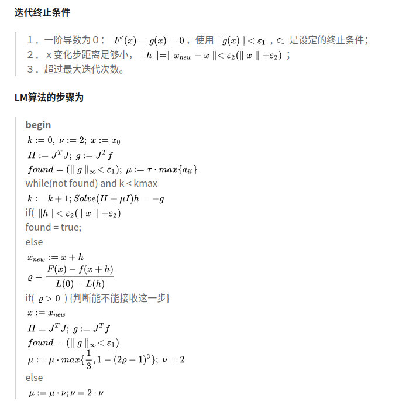

# SLAM基础知识

1. 稀疏法 vs 稠密法：

	- 稀疏法：使用独立的点（传统的角点）进行重建或者求解位姿；
	- 稠密法：使用全部的2D点进行重建或者求解位姿；
	- 半稠密法：避免重建整个平面，但是目标是使用连接较好的子点集；

2. 直接法 vs 间接法：
	- 直接法：最小化光度误差(photometic error);
	- 间接法：最小化几何误差(geometric error)，先进行图像的预处理，得到独立点之间的匹配(特征点匹配也好，光流也好)，之后最小化几何误差得到模型；
    
3. 3D点的维度
	- 间接法：间接法是隐式的定义一个点，因为在选取点的时候，选择的是角点响应函数最大的点，并不知道该点属于哪个平面，点的位置需要被估计；
	- 直接法：直接法是很明显的定义了一个点，知道方向，知道逆深度，直接就恢复了这个点，且逆深度能够表征该点的射线在什么地方与平面相交；同时，对于景深较深的场景，逆深度是更好一些；

4. 梯度下降法？高斯牛顿法？LM法？

 首先定义最优化问题$F(x) = \frac{1}{2}||f(x)||^2$，其中$f(x)=error$;
 - 梯度下降法：直接对$\frac{1}{2}||f(x)||^2$求导即得调整量为$\delta x =J^T f(x)$，其中$J=\frac{f(x)}{x}$;
 - 高斯牛顿法：对$f(x+\delta{x})$进行一阶泰勒展开得到$f(x+\delta{x})=f(x)+J\delta{x}$，所以有
 $$ F(x+\delta{x})=\frac{1}{2}(f(x)^Tf(x)+f(x)^TJ\delta{x}+\delta{x}^TJ^Tf(x)+\delta{x}^TJ^TJ\delta{x}) $$
 对上式求导等于0就可得
 $$(J^TJ)\delta{x}=-J^Tf(x)$$
 - LM方法：LM方法是对高斯牛顿方法的启发式增强，因为当$H=J^TJ$不可逆时，高斯牛顿法就会出现问题，LM方法在高斯牛顿法的基础上添加阻尼项$\frac{1}{2}\mu\delta{x}^T\delta{x}$，此时上述公式变为：
 $$
 (J^TJ+\mu I)\delta{x}=-J^Tf(x)
 $$
 可以看到，1）当$\mu$较大时，解变为$\delta{x}=-\frac{1}{\mu}J^Tf(x)$，为梯度下降法；2）当$\mu$较小的时候，解变为$\delta{x}=-(J^TJ)^{-1}J^Tf(x)$，为高斯牛顿法。
 
 	根据上述分析，可以看到，$\mu$在其中的作用不言而喻，对于$mu$的更新而言，有如下图的办法，主要是根据质量参数$\rho$判断的(其中F为原始模型，L为近似模型)
    
    
