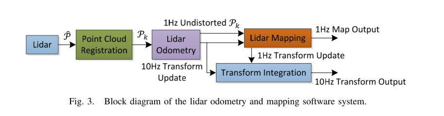

# Lidar 相关工作

- https://www.ri.cmu.edu/pub_files/2014/7/Ji_LidarMapping_RSS2014_v8.pdf

  Ji Zhang and Sanjiv Singh. LOAM: Lidar Odometry and Mapping in Real-time.

  1. 整个系统分为两个部分，位姿的估计和建图；
  2. 算法以sweep为单位，sweep中的点云称为$P_k$，当sweep完整的时候，投影到参考坐标系下称为$\overline{P}_{k}$
  3. 对每次接收到的点云$P_k$进行特征提取，其中提取出的点有边缘点和平面点，按照作者自己定义的平滑度进行区分；
  4. 使用边缘点和平面点到线和面的距离作为优化目标进行位姿的优化；

  

  