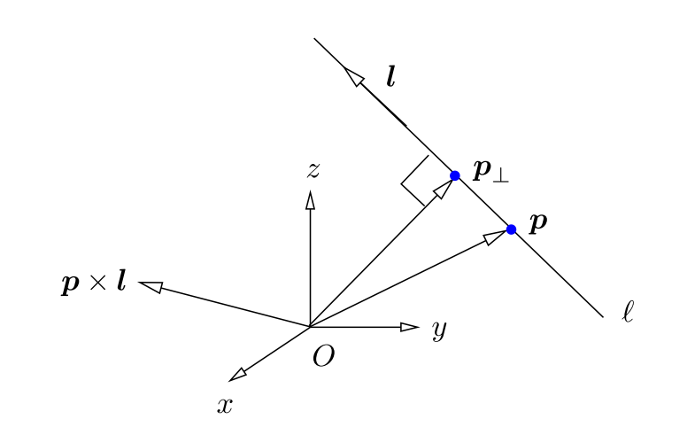

# Line representation

## Reference

1. Plucker Coordinates for Lines in the Space.
2. Structure-From-Motion Using Lines: Representation, Triangulation and Bundle Adjustment.
3. 

&nbsp;

----

## 直线的自由度

3D空间中的直线有4个自由度，通常认为一条线由两个点或者面组成，所以自由度有2x3=6个，但是由于直线绕着自身的方向轴旋转和移动的话，直线还是这个直线，所以真实自由度为6-2=4个。

## Plucker坐标系

Plucker坐标系是一种比较重要的表示方法，后面很多的表示方法也能和该方法进行互换

Plucker坐标系使用两个向量表示，$L:=(\hat{l},m)$，其中：

- $\hat{l}$表示直线的方向向量，模长为1；
- $m=l\times p$, $p$为直线上的一点，可以看到这部分也表示线与原点组成平面的法线；

所以，这个直线的表示形式基本上是方向向量和法向量的表示方法，如下图：

另一点，$m$表示了原点到直线的距离，公式推导如下：
$$
\begin{aligned}
\boldsymbol{p}_{\perp} &=\boldsymbol{p}-(\hat{\boldsymbol{l}} \cdot \boldsymbol{p}) \hat{\boldsymbol{l}} \\
&=(\hat{\boldsymbol{l}} \cdot \hat{\boldsymbol{l}}) \boldsymbol{p}-(\hat{\boldsymbol{l}} \cdot \boldsymbol{p}) \hat{l} \\
&=\hat{\boldsymbol{l}} \times(\boldsymbol{p} \times \hat{\boldsymbol{l}}) \\
&=\hat{\boldsymbol{l}} \times \boldsymbol{m}
\end{aligned}  \tag{1}
$$
$\hat{l}\cdot p$表示把$p$向量映射到直线方向上的长度，也就是上图看到的$p_{\perp}-p$的长度；所以$\boldsymbol{p}_{\perp}$的模长就是远点到直线的最短距离，因为$\hat{l}$与$m$垂直，因此：
$$
||p_{\perp}||=||\hat{l}|| \cdot ||m||sin(90)=||m|| \tag{2}
$$

### 两种特殊的情况

自然而然的想到，如果直线过原点怎么表示？如果直线是无穷远点怎么表示？

#### 过原点的直线

因为直线过原点，那么就把p设为原点，则$m=\overrightarrow{0}\times l=\overrightarrow{0}$，跟它的实际意义也相符；

#### 过无穷远点的直线

直线过无穷点时，那么就把p设为无穷远点，有$p=t\overline{p}$，则坐标可以写作：
$$
L:=(l, t\overline{p}\times l):=(\frac{l}{t}, \overline{p}\times l)=(0, m) \tag{3}
$$

&nbsp;

### 在空间中的表示方法

#### 使用两个点进行表示

给定两个3D空间中的点，有：$M^T=(\overline{M}, m)^T, N^T=(\overline{N}, n)^T$，其中$m,n$一方面使得直线变为其次坐标的表示，另一方面表示该点的逆深度，所以根据上面的Plucker坐标的表示，有：
$$
L=\left(\begin{array}{c}\overline{l} \\ m\end{array}\right)=\left(\begin{array}{c} \frac{\overline{M}}{m}-\frac{\overline{N}}{n} \\ \overline{M}\times \overline{N} \end{array} \right) = \left(\begin{array}{c} n\overline{M}-m\overline{N} \\ \overline{M}\times \overline{N} \end{array} \right) = \left(\begin{array}{c} a \\ b \end{array} \right) \tag{4}
$$
这里简单分析一下自由度，由上可知，Plucker的表示下一条直线有6个参数表示，是5维齐次坐标系下的齐次表示，同时，因为Plucker坐标中的$a, b$分别表示线的方向以及线和原点组成的法向量，因此有约束$a^Tb=0$的约束，所以最终Plucker表示下的直线就有4个自由度，和空间直线的自由度一致。

#### 使用两个平面的交表示

这部分属于空间中点和线的对偶形式，给定3D空间中的两个平面，有：$M^T=(\overline{M}, m)^T, N^T=(\overline{N}, n)^T$，这里$m, n$就不表示逆深度了，而是表示截距，同样按照Plucker坐标的表示，有：
$$
L=\left(\begin{array}{c}\overline{l} \\ m \end{array}\right)=\left(\begin{array}{c} \overline{M}\times \overline{N} \\ \frac{\overline{M}}{m}-\frac{\overline{N}}{n} \end{array} \right) = \left(\begin{array}{c} \overline{M}\times \overline{N} \\ n\overline{M}-m\overline{N} \end{array} \right) = \left(\begin{array}{c} a \\ b \end{array} \right) \tag{5}
$$

> 简单的说一下上个公式中的b是怎么得来的，假设点$X$在直线上，则有：
> $$
> \begin{aligned}
> \begin{cases}
> \overline{M}X+m=0 \\
> \overline{N}X+n=0 
> \end{cases} \rightarrow (n\overline{M}-m\overline{N})X=0
> \end{aligned}
> $$
> 所以可以看到$b=(n\overline{M}-m\overline{N})$垂直于直线上一点，同时$b$也垂直于直线的方向向量$(\overline{M}\times \overline{N})$，因此$b$就是直线与原点构成平面的法向量。

&nbsp;

---

