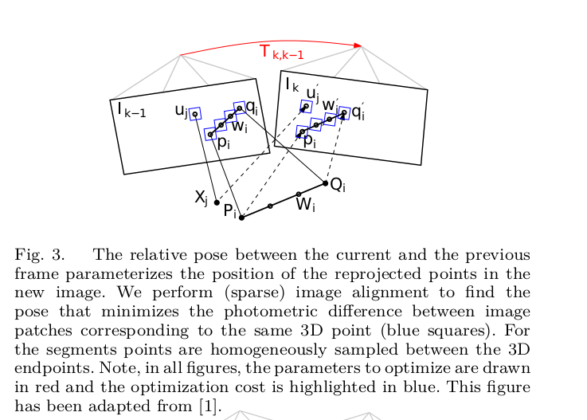
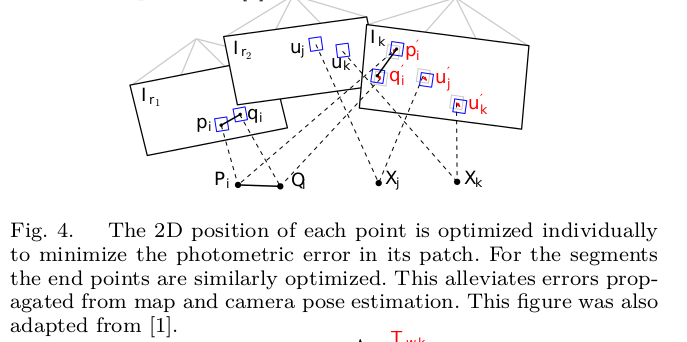
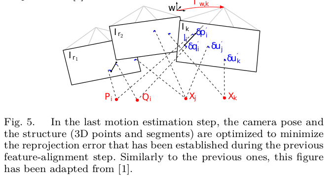
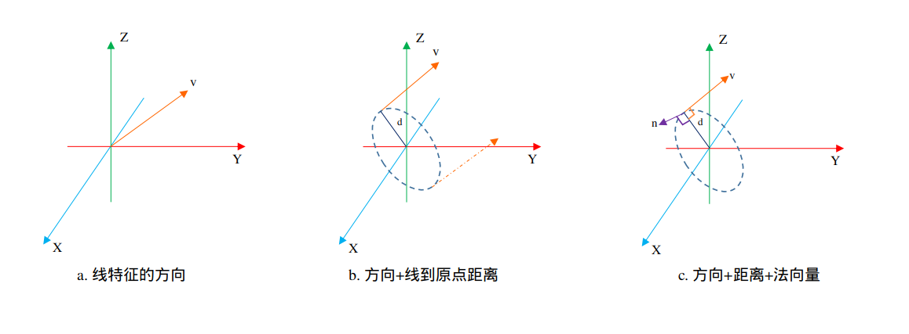
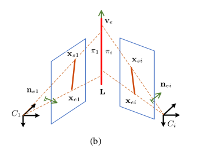
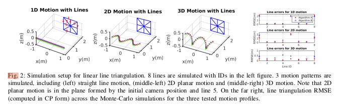
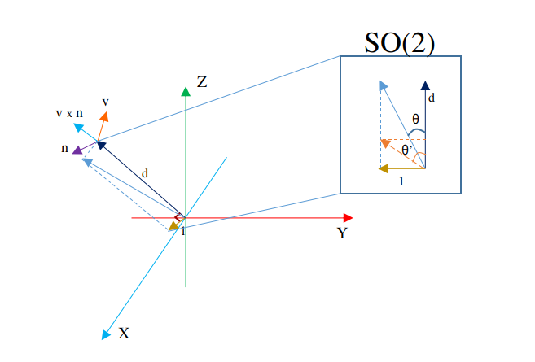
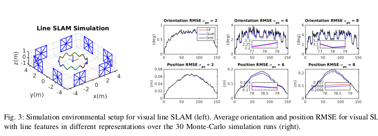

# SLAM线特征学习（2）——线特征最小表示总结

----

## 写在前面

如无意外，这篇文章应该是2021年最后一篇文章了。年初写了关于线特征的表示和优化推导（参考[这里](https://zhuanlan.zhihu.com/p/149028042)），当时其实觉得已经总结相当到位了（真是年少轻狂），然后就没有然后了。。。

最近想把线特征加在Mono-MSCKF中，看看能不能对效果有提升，所以找了最近几年的使用线特征的论文学习了一下，本文是对于这段时间学习的总结。因为参考的论文也比较多，本文也不能一一介绍，所以这里主要列一下论文的大致内容和特点：

1. PL-SVO: Semi-Direct Monocular Visual Odometry by Combining Points and Line Segments（2016），线特征大神Ruben Gomez-Ojeda将线的约束添加在SVO中，因为SVO框架的特殊性，作者主要将线特征当做两个3D端点进行处理；
2. PL-SLAM: Real-Time Monocular Visual SLAM with Points and Lines（2017），基于ORB-SLAM的线特征方案，作者在本文中提出了一种仅仅使用线特征来进行位姿和地图的初始化方案，线特征表示法依旧用的是**端点表示法**，也就是LSD检测到之后用description-base的方法进行跟踪，之后三角化等等；
3. PL-SLAM: a Stereo SLAM System through the Combination of Points and Line Segments（2018），依旧是线特征Ruben Gomez-Ojeda的作品，上一篇是一个里程计，这次就是一个完整的SLAM了，线特征表示依旧是**端点表示**；
4. Pl-vio: Tightly-coupled monocular visual–inertial odometry using point and line features（2018），贺博将线特征和VIO结合在一起的文章，文中使用普吕克矩阵进行线特征的初始化，对于中值法预积分和线特征的最小表示有着相当详细的推导；
5. Plücker Coordinates for Lines in the Space（2019），也是第一篇总结参考的文章，我的感觉文章类似于Quaternion kinematics for the error-state KF，很好的综述总结性的文章；
6. Visual-Inertial Navigation with Point and Line Features（2019），黄国权老师组关于线特征的文章，总结的相当全面，感觉算是天花板了，当然方法依旧是基于滤波以及四元数的表示是JPL的；

本文主要记录一下PL-SVO和Visual-Inertial Navigation with Point and Line Features中的一些细节，前者SVO是个人比较喜欢的一个框架，后者是因为确实个人感觉是天花板一般的存在，里面对于现存的线特征的初始化和最小表示都做了比较和测试，里面的推导都是基于JPL四元数的，这里作者都用Hamilton表示法进行推导，这样可以直接上Eigen。

&nbsp;

----

## PL-SVO

熟悉SVO的小伙伴都知道，SVO是一个相当特别的框架，一个很重要的点在于它在track的过程（sparse image alignment）中并没有像其他框架一样需要知道特征点的关联关系，这些点的关联关系都是通过极线搜索后期绑定的，因此SVO代码一定程度上兼顾了**短期约束（直接法）**和**长期关联（特征点法）**的两个优势。

在PL-SVO的工作中，作者并没有使用普吕克坐标系表示直线，主要的原因笔者总结如下：

1. 作者希望在track的过程中也使用线特征，image alignment的主要思路是把两个投影点的光度误差作为损失函数，**如果使用普吕克坐标系，那我们只能知道3D线在2D图像中的方向，而无法得到具体的点**；
2. 通常使用普吕克坐标系的话我们会用LSD的线段检测方法进行图像中线段的提取，但是提取到的线的端点是not repetitive的，这个对于普吕克表示法的初始化没有影响，但是对于想用具体点的作者而言，这个方法是不能接受的；

针对上面的两个问题，作者在整个工作中使用线的端点来显式的表达一个线段，具体到SVO的三个阶段而言：

1. 在sparse image alignment的阶段，作者均匀的在线上取几个点（看图是四个，不知道代码里面是几个），随后对这些点按照点的方式进行位姿的求解，公式如下：
   $$
   \begin{array}{ccc}
   \delta I_{l}(\boldsymbol{\xi}, \mathbf{l})=\frac{1}{N_{l}} \sum_{n=0}^{N_{l}}\left|I_{k}\left(\boldsymbol{\pi}\left(\mathbf{T}(\boldsymbol{\xi}) \cdot \mathbf{w}_{n}\right)\right)-I_{k-1}\left(\mathbf{w}_{n}\right)\right| \\
   \boldsymbol{\xi}_{k-1, k}^{*}=\underset{\boldsymbol{\xi}}{\operatorname{argmin}}\left\{\sum_{i \in \mathcal{P}}\left\|\delta I_{p}\left(\boldsymbol{\xi}, \mathbf{x}_{i}\right)\right\|^{2}+\sum_{j \in \mathcal{L}}\left\|\delta I_{l}\left(\boldsymbol{\xi}, \mathbf{l}_{j}\right)\right\|^{2}\right\} \\
   \left.\frac{\partial \delta I_{l}\left(\boldsymbol{\xi}, \mathbf{l}_{j}\right)}{\partial \boldsymbol{\xi}}\right|_{\xi=0}=\left.\frac{1}{N_{l}} \sum_{m=0}^{N_{l}} \frac{\partial \delta I_{p}\left(\boldsymbol{\xi}, \mathbf{w}_{n}\right)}{\partial \boldsymbol{\xi}}\right|_{\xi=0}
   \end{array} \tag{1}
   $$
   示意图如下：

   

2. 在feature alignment的阶段，类似于上面的过程，作者也是仅仅考虑线特征的两个端点，对两个端点进行光度误差的refine，公式如下：

   > 这里作者也承认这样的假设是一个比较大胆的假设，对于光度误差而言，其优化方向较大程度依赖该点周围的梯度，但是对于线特征来说，梯度可能仅仅在一个方向上，进而导致这里算出来的点不是那么的准确，不过这个点依旧是在线上的，作者这里依旧进行了优化，后续在 BA 的时候会一定程度改变3D点的位置

   $$
   \mathbf{w}_{j}^{\prime}=\underset{\mathbf{w}_{j}^{\prime}}{\operatorname{argmin}}\left\|I_{k}\left(\mathbf{w}_{j}^{\prime}\right)-I_{r}\left(\mathbf{A}_{j} \cdot \mathbf{w}_{j}\right)\right\|^{2}, \forall j \tag{2}
   $$

   示意图如下：

   

3. 最后就是BA了，公式就是点到线的距离，这里就不多说了，示意图如下：

   

还有就是在进行深度滤波阶段，作者也是对线段的两个端点进行处理。

&nbsp;

----

## Visual-Inertial Navigation with Point and Line Features

这篇文章的线特征表示就是主流的普吕克表示法了，文中主要讨论了 **两种线特征的初始化方法的对比** 以及 **三种线特征最小表示的效果**，本文笔者也主要对这两部分进行说明。

### 普吕克线特征表示

首先来比较直观的看一下普吕克线特征表示法的原理，笔者给出了自己理解的一个示意图，如下：

- 3D空间中的线绕着自身方向旋转和移动都不改变线本身，因此线特征的方向向量是十分重要的，如其中 a 所示；
- 另一个比较重要的参数量就是到原点的距离，如 b 所示；
- 上面两个信息知道之后，我们线特征可能的位置其实还是有无穷多个，只要它的位置在蓝色的虚线圆上就可以，比如 b 图中的黄色虚线，因此普吕克加入了另一个向量 n 来唯一确定线在圆上的位置，这里 n 和 v 是垂直关系；

所以普吕克线特征的表示法为：
$$
\mathcal{L}=
\begin{bmatrix}
\mathrm{n} \\ \mathrm{v} 
\end{bmatrix} \quad \text{where } \mathrm{n\perp v} \quad \frac{\|n\|}{\|v\|}=d \tag{3}
$$
&nbsp;

### 两种线特征的初始化方法

文中讨论了两种初始化的方法：**最小二乘求解法** 和 **普吕克矩阵法**，

#### 最小二乘法

最小二乘法示意图如下：

当我们在图像端得到了两个匹配的线段之后，我们是可以使用 **两个线段得到的平面法向量** 求得线特征在 **3D空间中的方向向量的**，如果有多个匹配，则我们本质上就是在求解最小二乘问题了，公式如下：
$$
\underbrace{\left[\begin{array}{c}
\vdots \\
{}^{C_{2}} \mathbf{n}_{e 2 C_{2}}^{\top C_{1}} \mathbf{R}^{\top} \\
\vdots
\end{array}\right]}_{\mathbf{N}} {}^{C_{1}} \mathbf{v}_{e 1}=\mathbf{0} \tag{4}
$$
注意这里我们把 c1 当做了参考系，因此在 c1 系下，当通过公式（4）得到了线特征的方向之后，我们就得到了线特征在 c1 系下的两个参数 $\mathrm{n, v}$，但是注意这里 n 是单位向量，与普吕克表示法中的 n 差一个距离 d，下面是 d 的求解：

- 首先通过之前的总结知道，线特征在帧间的投影方程如下，其中的 n 都是单位向量：
  $$
  \left[\begin{array}{c}
  {}^{c_1}d\mathbf{{}^{c_1}n}_{e_1} \\
  \mathbf{{}^{c_1}v}_{e_1}
  \end{array}\right]=
  \left[\begin{array}{cc}
  \mathrm{R}^{c_1}_{c_i} & {\left[\mathbf{t}^{c_1}_{c_i}\right]_{\times} \mathrm{R}^{c_1}_{c_i}} \\
  \mathbf{0} & \mathrm{R}^{c_1}_{c_i}
  \end{array}\right]\left[\begin{array}{c}
  {}^{c_i}d\mathbf{{}^{c_i}n}_{e_i} \\
  \mathbf{{}^{c_i}v}_{e_i} 
  \end{array}\right] \tag{5}
  $$
  取出其中第一行得到：
  $$
  {}^{c_1}d\mathbf{{}^{c_1}n}_{e_1}={}^{c_i}d\mathrm{R}^{c_1}_{c_i}\mathbf{{}^{c_i}n}_{e_i}+{\left[\mathbf{t}^{c_1}_{c_i}\right]_{\times} \mathrm{R}^{c_1}_{c_i}}\mathrm{{}^{c_i}v_{e_i}} \tag{6}
  $$

- 因为我们仅仅想求解 ${}^{c_1}d$，所以我们通过两边同时乘以 $\mathbf{b_i} = \lfloor {}^{c_1}v_{e_1} \rfloor_{\times} \mathrm{R}^{c_1}_{c_i}\mathbf{{}^{c_i}n}_{e_i}$ 的方式将带有 ${}^{c_1}d$ 的项消掉：
  $$
  {}^{c_1}d \mathrm{b_i^{T}} \mathbf{{}^{c_1}n}_{e_1} = \mathrm{b_i^{T}}\left[\mathbf{t}^{c_1}_{c_i}\right]_{\times} \mathrm{R}^{c_1}_{c_i}\mathrm{{}^{c_i}v_{e_i}}=\mathrm{b_i^{T}}\left[\mathbf{t}^{c_1}_{c_i}\right]_{\times} \mathrm{{}^{c_1}v_{e_1}} \tag{7}
  $$
  于是我们看到，上面的公式（7）中所有的向量和旋转我们都是在之前计算过得，仅有一个未知量 ${}^{c_1}d$；

- 依旧结合多个观测之后，可以得到：
  $$
  ^{c_1}d\begin{bmatrix}\vdots \\
  \mathrm{b_i^{T}} \mathbf{{}^{c_1}n}_{e_1} \\
  \vdots
  \end{bmatrix}_{n\times1} = \begin{bmatrix}\vdots \\
  \mathrm{b_i^{T}}\left[\mathbf{t}^{c_1}_{c_i}\right]_{\times} \mathrm{{}^{c_1}v_{e_1}} \\
  \vdots
  \end{bmatrix}_{n\times1} \tag{8}
  $$
  所以依旧求解一个最小二乘问题就可以了。

经过公式（4）和公式（8）之后，线特征的三个要素 $\mathrm{n, v, d}$ 就都知道了，于是就可以写作普吕克坐标的形式了。

&nbsp;

#### 普吕克矩阵法

普吕克矩阵法也很简单，在多视图几何中有专门的章节进行介绍，其有点表示和面表示，两者相互对偶，本文中主要讨论面表示法，因为面的法向量是比较好获取的：
$$
\mathcal{L}=\pi_1\pi_i^{T}-\pi_i\pi_1^{T}=
\begin{bmatrix}
\lfloor ^{c_1}\mathrm{v}_{e1}^{(i)} \rfloor_{\times} & {}^{c_1}d_{l}^{(i)}{}^{c_1}\mathrm{n}_{e1}^{(i)} \\ 
-{}^{c_1}d_{l}^{(i)}{}^{c_1}\mathrm{n}_{e1}^{(i)} & 0
\end{bmatrix} \tag{9}
$$
需要啰嗦的一点是每个向量上面都有一个角标，表示该向量是由第 1 帧和第 i 帧的观测得到的在 **c1 坐标系下** 的线特征。

之后作者对多帧观测得到的 **在 c1 坐标系的线特征** 取了一个平均，如下：
$$
\begin{aligned}
{ }^{C_{1}} \mathbf{n}_{e 1} &=\sum_{i=2}^{m}{ }^{C_{1}} \mathbf{n}_{e 1}^{(i)} /\left\|\sum_{i=2}^{m}{ }^{C_{1}} \mathbf{n}_{e 1}^{(i)}\right\| \\
{ }^{C_{1}} \mathbf{v}_{e 1} &=\sum_{i=2}^{m}{ }^{C_{1}} \mathbf{v}_{e 1}^{(i)} /\left\|\sum_{i=2}^{m}{ }^{C_{1}} \mathbf{v}_{e 1}^{(i)}\right\| \\
{ }^{C_{1}} d_{l} &=\frac{\sum_{i=2}^{m}{ }^{C_{1}} d_{l}^{(i)}}{m-1}
\end{aligned} \tag{10}
$$
&nbsp;

#### 无法初始化的情况

注意这里讨论的是无法初始化，不是线特征无法使用！

本文中作者说明了几种情况下线特征无法初始化：

1. 在同一平面上运动，此时通过线观测得到的两个平面法向量平行，无法得到线特征的方向向量；
2. 纯旋转的运动，此时公式（4）或者公式（9）也都无法得到正常的线特征方向向量，本质原因是他们在 c1 系下的方向依旧是平行的；

文中也说道其实双目也会存在退化问题，最本质的原因也是 **双目看到的线与相机中心构成的平面** 相互平行（其实只有同一平面一种情况）；

&nbsp;

#### 实验及结果

作者使用蒙特卡洛方法对 8 条线段进行了仿真实验，运动的轨迹包括 1D直线运动、2D平面运动 以及 3D空间运动，结果如下：

从结果上能看到两个结论：

1. 最小二乘方法比普吕克矩阵的方法要好一些，特别是在平面运动的时候，这个结论其实符合预期，毕竟最小二乘法比于平均的方法还是比较适合处理多观测的问题；
2. 实验中的1、5、8线段因为和运动在同一平面上，导致初始化时都不太好，也符合预期；

&nbsp;

----

### 三种线特征的最小表示法

在3D空间中，无论是用两个端点对线进行表示还是普吕克坐标系的表示法，其参数均为6个，但是线特征的自由度是4，具体而言：

1. 法向量 n 和方向向量 v 是垂直关系，因此可以使用其外积 $n \times v$ 得到与它们垂直的方向向量，三个向量组成的矩阵刚好就是世界系到直线之间的旋转 R，该旋转矩阵的自由度为3；
2. 除了对于线特征 n 和 v 向量的优化，还有距离 d 也要进行优化，于是衍生出了三种方法；

下面就是三种表示法到 普吕克坐标系的转换 以及 jacobian 的求导。

#### 正交表示法

正交表示法前面的总结说的比较清楚了，主要的思路是把普吕克坐标系看作是 3x2 的矩阵进行 QR 分解，得到的 Q 矩阵就是旋转矩阵，而 R 矩阵的自由度为1，将其化简为 $SO(2)$ 进行优化，笔者大概将其表示为下面的图示（对于旋转矩阵的更新读者应该都比较熟悉了，这里仅仅给出对于距离更新的图示）：

图中当调节直线到原点的距离时，只需要调节其中的 $\theta$ 角度就可以了，因为 1 是固定不动的。

根据上一篇总结，正交表示法如下，注意下面不是等号，而是相似：
$$
\begin{aligned}
\mathcal{L} &\sim \underbrace{\left(\frac{n}{\|n\|} \frac{v}{\|\mathbf{v}\|} \frac{n \times v}{\|\mathbf{n} \times \mathbf{v}\|}\right)}_{\mathbf{U} \in S O(3)} \underbrace{\left(\begin{matrix}\|\mathbf{n}\| & 0 \\ 0 &  \|\mathbf{v}\| \\ 0 & 0\end{matrix}\right)}_{(\|\mathbf{n}\|\|\mathbf{v}\|)^{\top} \in \mathbb{P}^{1}} \quad \text{QR 分解} \\
&\sim \underbrace{\left(\frac{n}{\|n\|} \frac{v}{\|\mathbf{v}\|} \frac{n \times v}{\|\mathbf{n} \times \mathbf{v}\|}\right)}_{\mathbf{U}} \begin{bmatrix} \frac{d}{\sqrt{1+d^2}} & \frac{1}{\sqrt{1+d^2}} \\ \frac{-1}{\sqrt{1+d^2}} & \frac{d}{\sqrt{1+d^2}} \end{bmatrix} \\
&\sim \underbrace{\left(\frac{n}{\|n\|} \frac{v}{\|\mathbf{v}\|} \frac{n \times v}{\|\mathbf{n} \times \mathbf{v}\|}\right)}_{\mathbf{U}} \underbrace{\begin{bmatrix} cos(\phi) & -sin(\phi) \\ sin(\phi) & cos(\phi)\end{bmatrix}}_{\mathbf{W}} \\
&\sim \underbrace{\left(\frac{n}{\|n\|} \frac{v}{\|\mathbf{v}\|} \frac{n \times v}{\|\mathbf{n} \times \mathbf{v}\|}\right)}_{\mathbf{U}} \underbrace{\begin{bmatrix} w1 & -w2 \\ w2 & w1\end{bmatrix}}_{\mathbf{W}}= \mathbf{U \times W} \\
\end{aligned} \tag{11}
$$
与普朗克的转换关系为
$$
\underbrace{\mathcal{L}_{6\times1}}_{Plucker表示}=\sqrt{\|n\|^2+\|v\|^2} \underbrace{\begin{bmatrix} w1\mathbf{u_1} \\ w2\mathbf{u_2} \end{bmatrix}}_{正交表示} \tag{12}
$$
jacobian的求解如下：
$$
\frac{\partial \mathcal{L}}{\partial(\theta, \phi)}=
\left[\frac{\partial \mathcal{L}}{\partial \theta}, \frac{\partial \mathcal{L}}{\partial \phi}\right]=
\left[\frac{\partial \mathcal{L}}{\partial{U}}\frac{\partial{U}}{\partial \theta}, \frac{\partial \mathcal{L}}{\partial{W}}\frac{\partial{W}}{\partial \phi}\right] \tag{13}
$$
第一部分：
$$
\begin{aligned}
\frac{\partial \mathcal{L}}{\partial{U}}\frac{\partial{U}}{\partial \theta}&=\frac{\partial{\begin{bmatrix} w1\mathbf{u_1} \\ w2\mathbf{u_2} \end{bmatrix}}}{\partial{[\mathbf{u_1},\mathbf{u_2}, \mathbf{u_3}]}}\frac{\partial{[\mathbf{u_1},\mathbf{u_2}, \mathbf{u_3}]}}{\partial{\theta}} \\
&=\begin{bmatrix}w1 \mathbf{I} & 0_{3\times3} & 0_{3\times3} \\ 0_{3\times3} & w2\mathbf{I} & 0_{3\times3} \end{bmatrix}_{6\times9}
\begin{bmatrix}0 & -\mathbf{u3} & \mathbf{u2} \\ \mathbf{u3} & 0 & -\mathbf{u1} \\ -\mathbf{u2} & \mathbf{u1} & 0 \end{bmatrix}_{9\times3} \\
&= \begin{bmatrix} 0 & -w1\mathbf{u3} & w1\mathbf{u2} \\ w2\mathbf{u3} & 0 &  -w2\mathbf{u1} \end{bmatrix}_{6\times3}
\end{aligned} \tag{14}
$$
第二部分：
$$
\begin{aligned}
\frac{\partial \mathcal{L}}{\partial{W}}\frac{\partial{W}}{\partial \phi}&=\frac{\partial{\begin{bmatrix} w1\mathbf{u_1} \\ w2\mathbf{u_2} \end{bmatrix}}}{\partial{[w1, w2]^T}}\frac{\partial{[w1, w2]^T}}{\partial{\phi}} \\
&=\begin{bmatrix}\mathbf{u1} & 0 \\ 0 & \mathbf{u2} \end{bmatrix}_{6\times2}
\begin{bmatrix} -w2 \\ w1 \end{bmatrix}_{2\times1} \\
&= \begin{bmatrix} -w2\mathbf{u1} \\ w1\mathbf{u2}\end{bmatrix}_{6\times1}
\end{aligned} \tag{15}
$$
于是整体有：
$$
\frac{\partial \mathcal{L}}{\partial(\theta, \phi)}=
\begin{bmatrix} 0_{3\times3} & -w1\mathbf{u3} & w1\mathbf{u2} & -w2\mathbf{u1} \\ -w2\mathbf{u3} & 0_{3\times3} &  -w2\mathbf{u1} & w1\mathbf{u2} \end{bmatrix}_{6\times4} \tag{16}
$$
&nbsp;

#### 四元数与距离表示法

上面可以看到，其实线特征的自由度到最后就包括 **表征姿态的旋转矩阵SO(3)** 和 **线到原点的距离d** ，那我们能否直接对这两个自由度进行优化而不像正交表示法一样再转换一下呢？

答案是肯定的，这种方法把 SO(3) 表示成四元数 q，实际的自由度为3，距离表示为 d，自由度为1。

所以四元数与距离的表示法如下，这里 $\boxplus$ 没有什么特别的意义，就是表示表达式需要加上距离：
$$
\mathcal{L} \sim \underbrace{\left(\frac{n}{\|n\|} \frac{v}{\|\mathbf{v}\|} \frac{n \times v}{\|\mathbf{n} \times \mathbf{v}\|}\right)}_{\mathbf{U} = \mathrm{R_{l}^{w}(q)}} \boxplus \mathrm{d} \tag{17}
$$
那么与普吕克的转换关系如下：
$$
\underbrace{\mathcal{L}_{6\times1}}_{Plucker表示}=\underbrace{\begin{bmatrix} \mathrm{d} \mathbf{u_1} \\ \mathbf{u_2} \end{bmatrix}}_{正交表示} \tag{18}
$$
jaconbian的求解有：
$$
\frac{\partial \mathcal{L}}{\partial(\theta, \mathrm{\tilde d})}=
\left[\frac{\partial \mathcal{L}}{\partial \theta}, \frac{\partial \mathcal{L}}{\partial \mathrm{\tilde d}}\right] \tag{19}
$$
这里换一个推导方法，这样读者应该可以更好的看懂论文中的公式：

首先将 **法向量的单位向量** 和 **方向向量的单位向量** 表达为如下形式：
$$
\begin{cases}
\mathrm{n=u_1=R_{l}^{w}(q)}\begin{bmatrix}1 \\ 0 \\ 0\end{bmatrix}=\mathrm{R_{l}^{w}(q)e_1} \\
\mathrm{v=u_2=R_{l}^{w}(q)}\begin{bmatrix}0 \\ 1 \\ 0\end{bmatrix}=\mathrm{R_{l}^{w}(q)e_2}
\end{cases} \tag{20}
$$
接着分析公式（19）的各个部分：

第一部分，可以看到这部分和公式（14）是完全一样的：
$$
\frac{\partial \mathcal{L}}{\partial \theta}=\frac{\partial \begin{bmatrix} \mathrm{d} \mathrm{R_{l}^{w}e_1} \\ \mathrm{R_{l}^{w}e_2} \end{bmatrix}}{\partial \theta}=\frac{\begin{bmatrix} \mathrm{d} \mathrm{R_{l}^{w}Exp(\theta) e_1} \\ \mathrm{R_{l}^{w}Exp(\theta)e_2} \end{bmatrix} - \begin{bmatrix} \mathrm{d} \mathrm{R_{l}^{w} e_1} \\ \mathrm{R_{l}^{w}e_2} \end{bmatrix}}{\theta}=\begin{bmatrix} -\mathrm{d} \mathrm{R_{l}^{w} \lfloor e_1\rfloor_{\times}} \\ -\mathrm{R_{l}^{w} \lfloor e_2\rfloor_{\times}} \end{bmatrix}=\begin{bmatrix} 0 & -\mathrm{d}\mathbf{u3} & \mathrm{d}\mathbf{u2} \\ \mathbf{u3} & 0 &  \mathbf{u1} \end{bmatrix}_{6\times3} \tag{21}
$$

> 这里推导一下文章中的表示，因为文章中使用的是JPL四元数的表示法，因此局部扰动模型从左乘变为了右乘，且Exp操作中的加号变为减号，详细可以看笔者之前总结的两种四元数的对比文章，https://zhuanlan.zhihu.com/p/269257787
> $$
> \begin{aligned}
> \frac{\partial \mathcal{L}}{\partial \theta}=\frac{\partial \begin{bmatrix} \mathrm{d} \times \mathrm{{}_{l}^{w}Re_1} \\ \mathrm{{}_{l}^{w}Re_2} \end{bmatrix}}{\partial \theta}&=
> \frac{\begin{bmatrix} \mathrm{d} \times \mathrm{Exp(\theta){}_{l}^{w}R e_1} \\ \mathrm{Exp(\theta){}_{l}^{w}Re_2} \end{bmatrix} - \begin{bmatrix} \mathrm{d} \times \mathrm{{}_{l}^{w}R e_1} \\ \mathrm{{}_{l}^{w}Re_2} \end{bmatrix}}{\theta} \\
> &=\frac{\begin{bmatrix} \mathrm{d} \times \mathrm{(I-\lfloor \theta \rfloor_{\times}) {}_{l}^{w}R e_1} \\ \mathrm{(I-\lfloor \theta \rfloor_{\times}){}_{l}^{w}Re_2} \end{bmatrix} - \begin{bmatrix} \mathrm{d} \times \mathrm{{}_{l}^{w}R e_1} \\ \mathrm{{}_{l}^{w}Re_2} \end{bmatrix}}{\theta} \\
> &=\begin{bmatrix} \mathrm{d} \mathrm{\lfloor {}_{l}^{w}R e_1\rfloor_{\times}} \\  \lfloor\mathrm{{}_{l}^{w}R e_2\rfloor_{\times}} \end{bmatrix}
> \end{aligned}
> $$

第二部分，这部分比较简单了：
$$
\frac{\partial \mathcal{L}}{\partial \mathrm{\tilde d}}=\frac{\partial \begin{bmatrix} \mathrm{d} \mathrm{R_{l}^{w}e_1} \\ \mathrm{R_{l}^{w}e_2} \end{bmatrix}}{\partial \mathrm{\tilde d}}=\begin{bmatrix} \mathrm{R_{l}^{w}e_1} \\ 0_{3\times3} \end{bmatrix}_{6\times1} \tag{22}
$$
合起来就是：
$$
\frac{\partial \mathcal{L}}{\partial(\theta, \mathrm{\tilde d})} =\begin{bmatrix} -\mathrm{d} \mathrm{R_{l}^{w} \lfloor e_1\rfloor_{\times}} & \mathrm{R_{l}^{w}e_1} \\ -\mathrm{R_{l}^{w} \lfloor e_2\rfloor_{\times}} & 0_{3\times3} \end{bmatrix}_{6\times4} \tag{23}
$$
&nbsp;

#### 最近点法（Closest point）

该方法是作者在上一个方法的基础上进行的改进，主要的想法是：因为四元数本身就是4个数，然后距离是1个数，所以作者就干脆把两者相乘，记作$\mathrm{p=dq}$，作者把这个4D的向量认为是一个点，这个点是距离空间中线的最近点，所以更新的过程就是：
$$
\mathrm{\overline{q} = q + \tilde{q}} \tag{24}
$$
我们看到这里一个很大的好处就是这个更新的过程变作了加法，而不再是乘法了。

我们看到最近点法转换为上面的四元数与距离表达法其实很简单：
$$
\begin{cases}
\mathrm{q=\frac{p}{\|p\|}} \\
\mathrm{d=\|p\|}
\end{cases} \tag{25}
$$
于是与普吕克坐标表示的转换就可以参考上面的方法了。

那这里还是主要看一下jacobian如何求解，论文给出的方法如下：
$$
\frac{\partial \mathcal{L}}{\partial \mathrm{\tilde p}}=\frac{\partial \mathcal{L}}{\partial(\theta, \mathrm{d})}\frac{\partial (\theta, \mathrm{d})}{\partial \tilde p} \tag{26}
$$
这里确实没有更好的求解方法，只能这么中间转一下，所以下面主要关注在后面的部分，这部分主要采用的是误差状态（error-state）的推导方式，如下：

对于旋转部分：
$$
\begin{aligned}
\mathrm{p_t} &= \mathrm{p+\tilde p} = \mathrm{d (q\otimes \Omega(\theta))} \\
&=\mathrm{dq +\tilde q} = \mathrm{d([q]_{left}\Omega(\theta))} \\
&=\mathrm{dq + \begin{bmatrix} \tilde q_w \\ \mathbf{\tilde q_v} \end{bmatrix}} = \mathrm{d\begin{bmatrix} \mathrm{q_w} & -\mathbf{q_v}^{T} \\ \mathbf{q_v} & \mathrm{q_w}+[\mathbf{q_v}]_{\times} \end{bmatrix}}\begin{bmatrix}1 \\ \frac{1}{2}\theta\end{bmatrix} \\
&\Rightarrow \mathrm{\begin{bmatrix} \tilde q_w \\ \mathbf{\tilde q_v} \end{bmatrix}} = \mathrm{\begin{bmatrix} -\frac{\mathrm{d}}{2}\mathbf{q_v}^{T}\theta \\ \frac{\mathrm{d}}{2}(\mathrm{q_w I_{3\times3}}+[\mathbf{q_v}]_{\times})\theta \end{bmatrix}}
\end{aligned} \tag{27}
$$
对于位移部分：
$$
\begin{aligned}
\mathrm{p_t} &= \mathrm{p+\tilde p} = \mathrm{(d + \tilde d) q} \\
&=\mathrm{dq +\tilde q} = \mathrm{dq + \tilde dq} \\ 
&\Rightarrow \mathrm{\begin{bmatrix} \tilde q_w \\ \mathbf{\tilde q_v} \end{bmatrix}} = \mathrm{\begin{bmatrix} \mathrm{\tilde d q_w} \\ \mathrm{\tilde d} \mathbf{q_v} \end{bmatrix}}
\end{aligned} \tag{28}
$$
所以结合两个部分为：
$$
\mathrm{\begin{bmatrix} \tilde q_w \\ \mathbf{\tilde q_v} \end{bmatrix}} = \underbrace{\begin{bmatrix}-\frac{\mathrm{d}}{2}\mathbf{q_v}^{T} & \mathrm{q_w} \\ \frac{\mathrm{d}}{2}(\mathrm{q_w I_{3\times3}}+[\mathbf{q_v}]_{\times}) & \mathbf{q_v} \end{bmatrix}}_{\mathrm{A}}\begin{bmatrix}\theta \\ \mathrm{\tilde d}\end{bmatrix} \tag{29}
$$
公式（29）表示了 $[\theta, \mathrm{\tilde d}]$ 到 $\mathrm{\tilde {p}}$ 的映射关系，但是我们想求解的公式（26）其实是反过来的关系，所以这里要对矩阵A求逆，这里直接给出结论就是：
$$
\begin{aligned}
&\underbrace{\begin{bmatrix}-\frac{\mathrm{2}}{\mathrm{d}}\mathbf{q_v} & \frac{\mathrm{2}}{\mathrm{d}}(\mathrm{q_w I_{3\times3}}-[\mathbf{q_v}]_{\times}) \\ \mathrm{q_w} & \mathbf{q_v}^{T} \end{bmatrix}}_{\mathrm{A^{-1}}}\underbrace{\begin{bmatrix}-\frac{\mathrm{d}}{2}\mathbf{q_v}^{T} & \mathrm{q_w} \\ \frac{\mathrm{d}}{2}(\mathrm{q_w I_{3\times3}}+[\mathbf{q_v}]_{\times}) & \mathbf{q_v} \end{bmatrix}}_{\mathrm{A}} \\
&=\begin{bmatrix}\mathbf{q_v}\mathbf{q_v}^{T}+\mathrm{q_w^2 I_{3\times3}}-[\mathbf{q_v}]_{\times}[\mathbf{q_v}]_{\times} & \frac{2}{\mathrm{d}}(-\mathrm{q_w}\mathbf{q_v}+\mathrm{q_w}\mathbf{q_v}) \\ \frac{2}{\mathrm{d}}(-\mathrm{q_w}\mathbf{q_v}^{T}+\mathrm{q_w}\mathbf{q_v}^{T}) & \mathrm{q_w^2} + \mathbf{q_v}^{T}\mathbf{q_v} \end{bmatrix} \quad \text{where } \mathrm{[u]_{\times}[u]_{\times}=uu^{T}-u^{T}uI_{3\times3}} \\
&=\begin{bmatrix}\mathrm{q_w^{2} I_{3\times3} + \mathbf{q_v^{T}q_v}  \mathrm{I_{3\times3}}} & 0_{3\times1} \\ 0_{1\times3} & 1\end{bmatrix} = \mathrm{I}_{4\times4}
\end{aligned} \tag{30}
$$
所以公式（26）的后半部分为：
$$
\frac{\partial (\theta, \mathrm{d})}{\partial \tilde p} =\begin{bmatrix}-\frac{\mathrm{2}}{\mathrm{d}}\mathbf{q_v} & \frac{\mathrm{2}}{\mathrm{d}}(\mathrm{q_w I_{3\times3}}-[\mathbf{q_v}]_{\times}) \\ \mathrm{q_w} & \mathbf{q_v}^{T} \end{bmatrix} \tag{31}
$$
在论文中，因为作者采用的是JPL的四元数，因此 $\mathrm{\tilde p = [p_v, p_w]}$，所以求解出来的结果刚好是前后两个列互换了位置。

&nbsp;

#### 实验及结果

作者同样使用蒙特卡洛的方法对三种最小表示进行了测试，测试结果如下：

可以看到作者的对于这部分的探索还是比较全面，加入了三个不同档次的观测误差进行了测试，结果表示：

1. 三者的趋势都是相似的；
2. **四元数和距离表示法** 以及 **最近点表示法** 的误差要在观测误差比较大的时候小于 **正交表示法**

&nbsp;

------

## 总结

本文算是详细总结了 线特征的初始化方法 和 最小表示法，下部分就是实际的代码操练了，如果后续在实践过程中发现什么坑了到时候再补。