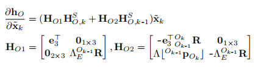
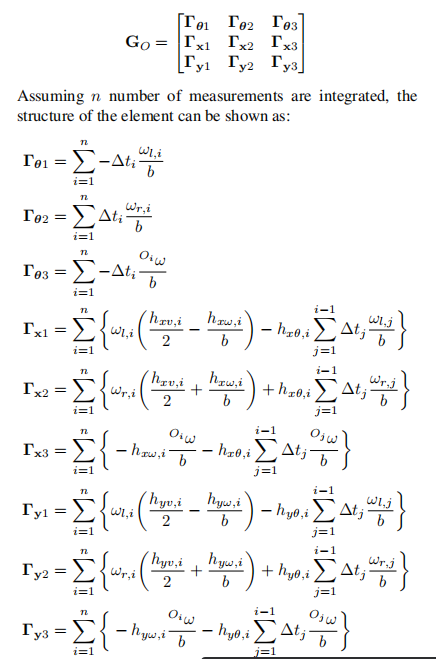
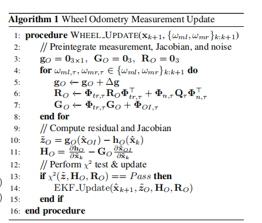

# MINS: Efficient and Robust Multisensor-aided Inertial Navigation System

---

## 写在前面

MINS为黄国权老师rpng组对于openvins的升级版，相比于openvins：

- 整个框架对于传感器的集成度更高了，不仅仅是vio系统，同时兼容了各种传感器

参考：

- https://copland.udel.edu/~ghuang/papers/tr_wheel-vio.pdf 关于odom部分的公式推导

---

## 符号注解

下面是会用到的符号整理

- 坐标系表示：{$I$}表示IMU坐标系， {$C$}表示Camera坐标系，{$O$}表示Wheel Odom坐标系，{$L$}表示Lidar坐标系， {$G$}表示GNSS坐标系，{$E$}表示ENU坐标系

- 状态量表示：
  $$
  \begin{aligned}
  \mathrm{x_k}&=(\mathrm{x_{I_k}, x_{H_k}}) \\
  \mathrm{x_{I_k}}&=(\mathrm{{}^{I_k}_{E}R, {}^{E}p_{I_k},{}^{E}v_{I_k}, b_g, b_a}) \\
  \mathrm{x_{H_k}}&=(\mathrm{{}^{I_{k-1}}_{E}R, {}^{E}p_{I_{k-1}},\dots, {}^{I_{k-h}}_{E}R, {}^{E}p_{I_{k-h}}})
  \end{aligned}
  $$

- odom部分符号表示：

  - 轮子转速符号：$w_{l_k}, w_{r_k}$；
  - 轮径和轮间距：$X_{OI} = \{r_{l}, r_{r}, b\}$；

---

## 方法细节

### Wheel Encoder Update

左右轮速的符号表示如下，其中$w_{m}$为观测变量，$w_{l_k}$表示为轮速真值，$n_{wl}$为噪声值
$$
\begin{equation}
\begin{aligned}
w_{ml_k}&=w_{l_k}+n_{wl} \\
w_{mr_k}&=w_{r_k}+n_{wr}
\end{aligned}
\end{equation}
$$
随后使用差分轮速的公式得到线速度和角速度，其中
$$
\begin{equation}
\begin{aligned}
{}^{O_k}w&=(w_{rk}r_r - w_{lk}r_l)/b \\
{}^{O_k}v&=(w_{rk}r_r + w_{lk}r_l)/2
\end{aligned}
\end{equation}
$$
差分机器人的轮速运动模型微分公式如下：
$$
\begin{equation}
\begin{bmatrix}
{}^{O_{\tau}}_{O_{k-1}}\dot \theta \\
{}^{O_{k-1}}\dot x_{O_{\tau}} \\
{}^{O_{k-1}}\dot y_{O_{\tau}}
\end{bmatrix} :=
\begin{bmatrix}
-{}^{O_{\tau}} w \\
{}^{O_{\tau}}v \mathrm{cos}({}_{O_{\tau}}^{O_{k-1}}\theta) \\
{}^{O_{\tau}}v \mathrm{sin}({}_{O_{\tau}}^{O_{k-1}}\theta)
\end{bmatrix} =
\begin{bmatrix}
-{}^{O_{\tau}} w \\
{}^{O_{\tau}}v \mathrm{cos}({}^{O_{\tau}}_{O_{k-1}}\theta) \\
-{}^{O_{\tau}}v \mathrm{sin}({}^{O_{\tau}}_{O_{k-1}}\theta)
\end{bmatrix}
\end{equation}
$$
其中重点注意相对位姿中参考系问题，论文中的原文为 **we follow global-to-local orientation representation**：

1. 角度微分的参考系是$O_{\tau}$，因此角速度其实是机体角速度的负值；
2. 左公式中使用的角度因为参考系为k-1，因此无需取负号，右公式中角度的参考系变为$\tau$，因此需要取符号；

因为我们经常用的是local-to-global表示，因此需要把其中所有的角度表示中的上下角标反向，各中的角度前加负号即可。这里后面的公式笔者使用local-to-global的表示：
$$
\begin{equation}
\begin{aligned}
Z_{O} &=: 
\begin{bmatrix}
{}^{O_{k-1}}_{O_{k}}\theta \\ 
{}^{O_{k-1}}\mathbf{d}_{O_k}
\end{bmatrix} = 
\begin{bmatrix}
\int_{t_{k-1}}^{t_{k}}{}^{O_t}wdt \\
\int_{t_{k-1}}^{t_{k}} {}^{O_{t}}v \mathrm{cos}({}^{O_{k-1}}_{O_{t}}\theta) dt \\
\int_{t_{k-1}}^{t_{k}} {}^{O_{t}}v \mathrm{sin}({}^{O_{t-1}}_{O_{t}}\theta) dt
\end{bmatrix} \\
&=:\mathbf{g_{O}}(\{w_l, w_r\}_{k-1:k}, \mathrm{x_{OI}})
\end{aligned}
\end{equation}
$$

观测方程就比较明确了，其中$\Lambda=\{e_1, e_2\}$
$$
\begin{equation}
\mathrm{h_{O}(x_k)}:=
\begin{bmatrix}
{}^{O_{k-1}}_{O_{k}} \hat\theta \\ 
{}^{O_{k-1}}\mathbf{\hat d}_{O_k}
\end{bmatrix}=:
\begin{bmatrix}
\mathrm{e_3}^T\mathrm{Log({}^{O_{k-1}}_{E}R {}_{O_{k}}^{E}R)} \\
\Lambda {}^{O_{k-1}}_{E}R(\mathrm{{}^{E}p_{O_k} - {}^{E}p_{O_{k-1}}})
\end{bmatrix}
\end{equation}
$$

误差观测方程如下：
$$
\begin{equation}
\begin{aligned}
\mathbf{g_{O}}(\{w_l, w_r\}_{k-1:k}, \mathrm{x_{OI}})+\underbrace{\mathbf{G_O}}_{\frac{\partial{\mathrm{\tilde x}_{OI}}}{\partial{\mathrm{\tilde x}_{k}}}} \mathrm{\tilde x_{k}} + \mathbf{G_n} n_{w} &= \mathrm{h_O(x_k)} + \underbrace{\mathbf{H_O}}_{\frac{\partial{h_O(\mathrm{x_k})}}{\partial{\mathrm{\tilde x_k}}}}\mathrm{\tilde x_k}+\mathbf{H_n}n_{\mathrm{ \tilde x}} \\
\tilde z_{O} =\mathbf{g_{O}}(\{w_l, w_r\}_{k-1:k}, \mathrm{x_{OI}}) - \mathrm{h_{O}(x_k)} &= \mathbf{H_O} \mathrm{\tilde x_k} - \mathbf{G_O} \mathrm{\tilde x_k} + \mathbf{H_n} n_{\mathrm{\tilde x}} - \mathbf{G_n} n_{w} 
\end{aligned}
\end{equation}
$$

可以看到和常规的观测方程不同的是：这次观测并不是和状态无关的（当然更多的时候我们是希望解耦的，比如说是否可以将观测改为轮速？这样所有和状态相关的部分都在方程的右侧），而是和状态耦合在一起的，也就 $\mathbf{G_O}$ 的部分。

方程右侧的部分 $\mathbf{H_O}$ 其实很容易推导，按照公式（5）加扰动公式就能简单的求解出来，这里不做详细的推导了，直接上公式：

其中观测矩阵推导如下(这部分主要参考Visual-Inertial-Wheel Odometry with Online Calibration)：

#### 对 $\mathbf{g_{O}}(\{w_l, w_r\}_{k-1:k}, \mathrm{x_{OI}})$ 进行推导

首先整个推导过程中如果直接对最终的状态变量( $ \mathrm{x}_{OI}=\left[ r_l, r_r, b \right] $ )进行求导的话会非常复杂，因此我们先对变量 $\left[{}^{O_k} \theta, {}^{O_{k}}\mathrm{x}, {}^{O_{k}}\mathrm{y}\right]$ 和 $ \left[ {}^{O_{\tau}}w, {}^{O_{\tau}}v \right] $ 进行误差状态的递推，之后利用链式法则进行微分方程的整理。

1. 首先推导状态变量$ \left[ {}^{O_{\tau}}w, {}^{O_{\tau}}v \right] $和$ \mathrm{x}_{OI} $ 的关系：

  $$
  \begin{equation}
  \begin{aligned}
  {}^{O} \tilde w &= \begin{bmatrix} -\frac{w_{ml}}{b} & \frac{w_{mr}}{b} & -\frac{w_{mr}r_r - w_{ml}r_l}{b^2} \end{bmatrix} \begin{bmatrix} \tilde r_{l} \\ \tilde r_{r} \\ \tilde b \end{bmatrix} + \begin{bmatrix} \frac{r_l}{b} & -\frac{r_r}{b} \end{bmatrix} \begin{bmatrix} n_{wl} \\ n_{wr} \end{bmatrix} \\
  &= h_{w\mathbf{x_{OI}}}\mathrm{\tilde x_{CI}} + h_{w\mathbf{n}_{OI}}\mathbf{n}_w \\

  {}^{O} \tilde v &= \begin{bmatrix} \frac{w_{ml}}{2} & \frac{w_{mr}}{2} & 0 \end{bmatrix} \begin{bmatrix} \tilde r_{l} \\ \tilde r_{r} \\ \tilde b \end{bmatrix} + \begin{bmatrix} -\frac{r_l}{2} & -\frac{r_r}{2} \end{bmatrix} \begin{bmatrix} n_{wl} \\ n_{wr} \end{bmatrix} \\
  &= h_{v\mathbf{x_{OI}}}\mathrm{\tilde x_{CI}} + h_{w\mathbf{n}_{OI}}\mathbf{n}_w

  \end{aligned}
  \end{equation}
  $$

2. 整体的递推公式可以简化如下，请读者依旧注意这里旋转坐标系的表示问题和原文不同

  $$
  \begin{equation}
  \begin{aligned}
  {}^{O_k}_{O_{\tau+1}} \tilde \theta &= {}^{O_k}_{O_{\tau}} \tilde \theta + \mathbf{H_{1, \tau}} \mathbf{\tilde x_{OI}} + \mathbf{H_{2, \tau}} \mathbf{n_{w, \tau}} \\
  {}^{O_k}\mathbf{\tilde x}_{O_{\tau+1}} &= {}^{O_k}\mathbf{\tilde x}_{O_{\tau}} + \mathbf{H_{3, \tau}} {}^{O_k}_{O_{\tau}} \tilde \theta + \mathbf{H_{4, \tau}}  \mathbf{\tilde x_{OI}} + \mathbf{H_{5, \tau}} \mathbf{n_{w, \tau}} \\
  {}^{O_k}\mathbf{\tilde y}_{O_{\tau+1}} &= {}^{O_k}\mathbf{\tilde y}_{O_{\tau}} + \mathbf{H_{6, \tau}} {}^{O_k}_{O_{\tau}} \tilde \theta + \mathbf{H_{7, \tau}}  \mathbf{\tilde x_{OI}} + \mathbf{H_{8, \tau}} \mathbf{n_{w, \tau}} \\
  \end{aligned}
  \end{equation}
  $$

      上述公式可以写为状态传递方程的矩阵形式，如下: 
  $$
  \begin{equation}
  \begin{aligned}
  \boldsymbol{\Phi}_{t r, \tau} & =\left[\begin{array}{ccc}
  1 & 0 & 0 \\
  \mathbf{H}_{3, \tau} & 1 & 0 \\
  \mathbf{H}_{6, \tau} & 0 & 1
  \end{array}\right], \quad \boldsymbol{\Phi}_{W I, \tau}=\left[\begin{array}{l}
  \mathbf{H}_{1, \tau} \\
  \mathbf{H}_{4, \tau} \\
  \mathbf{H}_{7, \tau}
  \end{array}\right], \quad \boldsymbol{\Phi}_{n, \tau}=\left[\begin{array}{l}
  \mathbf{H}_{2, \tau} \\
  \mathbf{H}_{5, \tau} \\
  \mathbf{H}_{8, \tau}
  \end{array}\right]
  \end{aligned}
  \end{equation}
  $$

      有了误差状态的传递方程，则观测的协方差的更新公式如下：
  $$
  \begin{equation}
  \mathbf{P}_{m, \tau+1} =\boldsymbol{\Phi}_{t r, \tau} \mathbf{P}_{m, \tau} \boldsymbol{\Phi}_{t r, \tau}^{\top}+\boldsymbol{\Phi}_{n, \tau} \mathbf{Q}_\tau \boldsymbol{\Phi}_{n, \tau}^{\top}
  \end{equation}
  $$

      如公式（6）（8）所示，整个观测因为和状态变量中的 $\mathbf{x}_{OI}$ 相关，因此可以借鉴预积分的思想，在迭代的过程中不断的对传递矩阵进行更新，公式如下：
  $$
  \begin{equation}
  \frac{\partial \mathbf{g}_{\tau+1}}{\partial \tilde{\mathbf{x}}_{W I}} =\boldsymbol{\Phi}_{t r, \tau} \frac{\partial \mathbf{g}_\tau}{\partial \tilde{\mathbf{x}}_{W I}}+\boldsymbol{\Phi}_{W I, \tau}
  \end{equation}
  $$

3. 对其中的各个变量进行细致推导 

    首先根据公式（3）或者公式（4）可以得到观测 $O_{\tau}$ 到 $O_{\tau+1}$ 的递推公式：
    $$
    \begin{equation}
    \begin{aligned}
    {}_{O_\tau+1}^{O_k}\theta &= {}_{O_\tau}^{O_k}\theta + {}^{O_{\tau}} \omega \Delta t \\
    {}^{O_k}\mathrm{x}_{{}_{O_\tau+1}} &= {}^{O_k}\mathrm{x}_{{}_{O_\tau}} + \frac{{}^{O_{\tau}}v(\mathcal{sin}({}_{O_{\tau+1}}^{O_k}\theta)-\mathcal{sin}({}_{O_\tau}^{O_k}\theta))}{{}^{O_{\tau}}w} \\
    {}^{O_k}\mathrm{y}_{{}_{O_{\tau+1}}} &= {}^{O_k}\mathrm{y}_{{}_{O_\tau}} + \frac{{}^{O_{\tau}}v(-\mathcal{cos}({}_{O_{\tau+1}}^{O_k}\theta)+\mathcal{cos}({}_{O_\tau}^{O_k}\theta))}{{}^{O_{\tau}}w} \\
    \end{aligned}
    \end{equation}
    $$

    > 其中的sin与cos使用微积分中的 $\int f(x) dx = F(x_2) - F(x_1)$ 的方法，这里是对时间进行的积分

    + 对 $\theta$ 进行推导，根据公式（12）第一行，容易得出：

        $$
        \begin{equation}
        \begin{aligned}
        {}_{O_\tau+1}^{O_k} \tilde \theta &= {}_{O_\tau}^{O_k} \tilde \theta + {}^{O_{\tau}} \tilde \omega \Delta t \\
        &= {}_{O_\tau}^{O_k} \tilde \theta + \underbrace{\Delta t \mathbf{H}_{w\mathbf{x_{OI}}}}_{\mathbf{H_{1, \tau}}}\mathrm{\tilde x_{CI}} + \underbrace{\Delta t \mathbf{H}_{w\mathbf{n}_{OI}}}_{\mathbf{H}_{2,\tau}} \mathbf{n}_w 
        \end{aligned}
        \end{equation}
        $$
    
    + 对 ${}^{O_{k}}\mathrm{x}_{O_{\tau+1}}$ 进行推导，根据公式（12）第二行，可以看到主要的误差状态集中在加号之后的部分，先设这部分为 $f\mathrm{({}^{O_k}\theta, {}^{O_{\tau}}w, {}^{O_{\tau}}v)}$, 则有：
        $$
        \begin{aligned}
        f\mathrm{({}^{O_k}\theta, {}^{O_{\tau}}w, {}^{O_{\tau}}v)} &= \frac{{}^{O_{\tau}}v(\mathcal{sin}({}_{O_\tau+1}^{O_k}\theta)-\mathcal{sin}({}_{O_\tau}^{O_k}\theta))}{{}^{O_{\tau}}w} \\ 
        &= \frac{{}^{O_{\tau}}v(\mathcal{sin}({}_{O_\tau}^{O_k}\theta +{}^{O_{\tau}}w \Delta t)-\mathcal{sin}({}_{O_\tau}^{O_k}\theta))}{{}^{O_{\tau}}w}
        \end{aligned}
        $$
      推导误差方程有：
        $$
        \begin{equation}
        \begin{aligned}
        f ({}^{O_k}\theta + {}^{O_k} \tilde \theta,  {}^{O_{\tau}}w + {}^{O_{\tau}} \tilde w, {}^{O_{\tau}}v + {}^{O_\tau} \tilde v) &= f\mathrm{({}^{O_k}\theta, {}^{O_{\tau}}w, {}^{O_{\tau}}v)} \\
        &+ \frac{\partial f(...)}{\partial {}^{O_k}\theta} {}^{O_k} \tilde \theta + \frac{\partial f(...)}{\partial {}^{O_{\tau}}w} {}^{O_{\tau}} \tilde w + \frac{\partial f(...)}{\partial {}^{O_{\tau}}v} {}^{O_{\tau}} \tilde v \\
        &=\underbrace{\frac{{}^{O_{\tau}}v(\mathcal{cos}({}_{O_\tau+1}^{O_k}\theta)-\mathcal{cos}({}_{O_\tau}^{O_k}\theta))}{{}^{O_{\tau}}w}}_{\mathbf{H}_{3, \tau}} {}^{O_k} \tilde \theta \\ 
        &+ \underbrace{\frac{{}^{O_{\tau}}v\left[\mathcal{cos}({}_{O_\tau}^{O_k}\theta +{}^{O_{\tau}}w \Delta t) \Delta t - \left(\mathcal{sin}({}_{O_\tau}^{O_k}\theta +{}^{O_{\tau}}w \Delta t)-\mathcal{sin}({}_{O_\tau}^{O_k}\theta)\right)\right]}{{}^{O_{\tau}}w^2}}_{\mathbf{h_{xw}}} {}^{O_{\tau}} \tilde w \\
        &+ \underbrace{\frac{\mathcal{sin}({}_{O_\tau}^{O_k}\theta +{}^{O_{\tau}}w \Delta t)-\mathcal{sin}({}_{O_\tau}^{O_k}\theta)}{{}^{O_{\tau}}w}}_{\mathbf{h_{xv}}} {}^{O_{\tau}} \tilde v \\
        &=\mathbf{H}_{3,\tau} {}^{O_{k}} \tilde \theta + \mathbf{h_{xw}}\left( h_{w\mathbf{x_{OI}}}\mathrm{\tilde x_{CI}} + h_{w\mathbf{n}_{OI}}\mathbf{n}_w \right) + \mathbf{h_{xv}}\left( h_{v\mathbf{x_{OI}}}\mathrm{\tilde x_{CI}} + h_{v\mathbf{n}_{OI}}\mathbf{n}_w \right) \\
        &=\mathbf{H}_{3,\tau} {}^{O_{k}} \tilde \theta + \underbrace{\left( \mathbf{h_{xw}} h_{w\mathbf{x_{OI}}} + \mathbf{h_{xv}} h_{v\mathbf{x_{OI}}}\right)}_{\mathbf{H_{4, \tau}}}\mathrm{\tilde x_{CI}} + \underbrace{\left( \mathbf{h_{xw}} h_{w\mathbf{n}_{OI}}+ \mathbf{h_{xv}} h_{v\mathbf{n}_{OI}} \right)}_{\mathbf{H_{5, \tau}}} \mathbf{n}_w \\
        \end{aligned}
        \end{equation}
        $$

    + ${}^{O_{k}}\mathrm{y}_{O_{\tau+1}}$ 同理，只需要把其中的 sin cos互换同时注意符号
      $$
      \begin{equation}
      \begin{aligned}
      f ({}^{O_k}\theta + {}^{O_k} \tilde \theta,  {}^{O_{\tau}}w + {}^{O_{\tau}} \tilde w, {}^{O_{\tau}}v + {}^{O_\tau} \tilde v) &= f\mathrm{({}^{O_k}\theta, {}^{O_{\tau}}w, {}^{O_{\tau}}v)} \\
      &+ \underbrace{\frac{{}^{O_{\tau}}v(\mathcal{sin}({}_{O_\tau+1}^{O_k}\theta)-\mathcal{sin}({}_{O_\tau}^{O_k}\theta))}{{}^{O_{\tau}}w}}_{\mathbf{H}_{6, \tau}} {}^{O_k} \tilde \theta \\ 
      &+ \underbrace{\frac{{}^{O_{\tau}}v\left[\mathcal{sin}({}_{O_\tau}^{O_k}\theta +{}^{O_{\tau}}w \Delta t) \Delta t + \left(-\mathcal{cos}({}_{O_\tau}^{O_k}\theta +{}^{O_{\tau}}w \Delta t)+\mathcal{cos}({}_{O_\tau}^{O_k}\theta)\right)\right]}{{}^{O_{\tau}}w^2}}_{\mathbf{h_{yw}}} {}^{O_{\tau}} \tilde w \\
      &+ \underbrace{\frac{-\mathcal{cos}({}_{O_\tau}^{O_k}\theta +{}^{O_{\tau}}w \Delta t)+\mathcal{cos}({}_{O_\tau}^{O_k}\theta)}{{}^{O_{\tau}}w}}_{\mathbf{h_{yv}}} {}^{O_{\tau}} \tilde v \\
      &=\mathbf{H}_{6,\tau} {}^{O_{k}} \tilde \theta + \mathbf{h_{yw}}\left( h_{w\mathbf{x_{OI}}}\mathrm{\tilde x_{CI}} + h_{w\mathbf{n}_{OI}}\mathbf{n}_w \right) + \mathbf{h_{yv}}\left( h_{v\mathbf{x_{OI}}}\mathrm{\tilde x_{CI}} + h_{v\mathbf{n}_{OI}}\mathbf{n}_w \right) \\
      &=\mathbf{H}_{6,\tau} {}^{O_{k}} \tilde \theta + \underbrace{\left( \mathbf{h_{yw}} h_{w\mathbf{x_{OI}}} + \mathbf{h_{yv}} h_{v\mathbf{x_{OI}}}\right)}_{\mathbf{H_{7, \tau}}}\mathrm{\tilde x_{CI}} + \underbrace{\left( \mathbf{h_{yw}} h_{w\mathbf{n}_{OI}}+ \mathbf{h_{yv}} h_{v\mathbf{n}_{OI}} \right)}_{\mathbf{H_{8, \tau}}} \mathbf{n}_w \\
      \end{aligned}
      \end{equation}     
      $$

  至此整个递推公式中的各个分量推理完毕，作者在原文中给出了状态传递矩阵的闭式解：
  
  

  相比于一步到位的闭式解，其实效仿IMU的预积分也是一种更常规的做法，因此作者也给出了迭代求解的方式：

  

