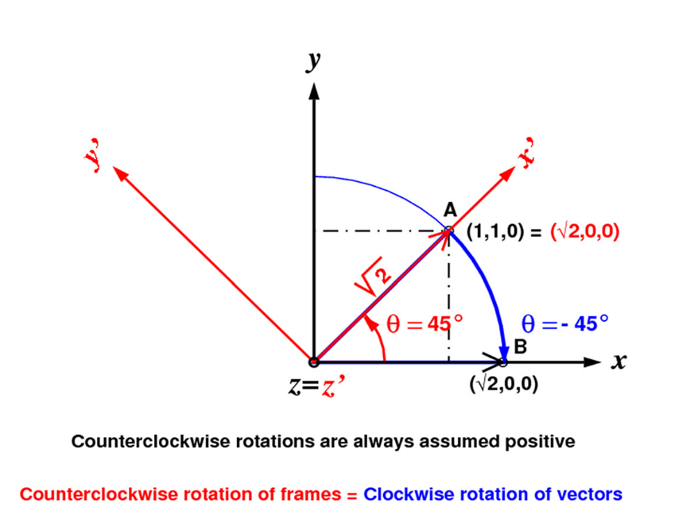
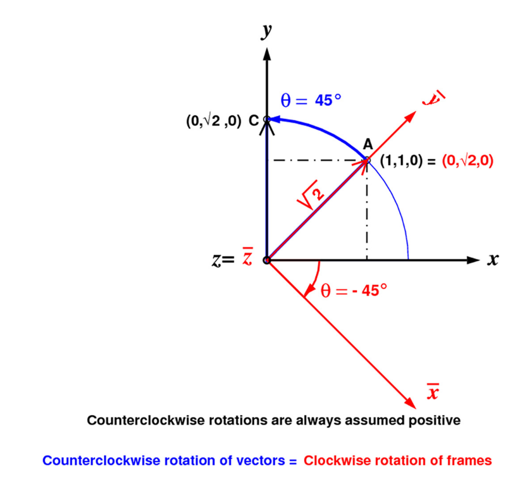

# MSCKF前导——四元数的两种表示

----

## 写在前面

最近看MSCKF方法，发现里面的旋转表示与笔者先前理解的非常不同，也让笔者重新审视了一下自己对于旋转向量、旋转矩阵与四元数的关系，通过查找一些资料，也算是把这些关系理得比较清楚，该文章就是对自己理解过程的一次总结，希望能帮助更多的小伙伴。

&nbsp;

-----

## Reference

1. Active versus Passive Rotations. 该论文比较清晰的解释了“主动旋转”和“被动旋转”；
2. Why and How to Avoid the Flipped Quaternion Multiplication. 该论文比较系统的总结了Hamilton和Shuster两种四元数的运用，然后作者提出了一种四元数到旋转矩阵的映射，可以保持使用Hamilton四元数的同时，保持乘法的Homogeneous；
3. Quaternion kinematics for the error-state Kalman filter. ESKF中的前4章也都是在讲四元数和旋转的事情，该篇文章主要使用Hamilton表示法的四元数；
4. Indirect Kalman Filter for 3D Attitude Estimation. MARS LAB关于四元数表示旋转的一篇文章，里面详细推导了JPL表示下的四元数的公式；
5. 还有一篇邱博的笔记，但是实在找不到链接；

**特别希望的是，在本文之前，大家对于四元数和旋转矩阵相信都有自己的理解，但是希望读者暂时忘记之前的理解，因为很可能这些理解会导致你很不理解本文的变换关系，就像参考2中提醒读者的一样：If a reader is unaware of the split, the discovery that two different quaternion multiplications are in use, and that in fact “the other” was employed, might be made only after several failures, during which the confusion may even have spread to third parties.**

&nbsp;

-----

## 缘起——旋转的主动性（Active）和被动性（Passive）

旋转的主动性与被动性绝对是相对关系的一个很好的体现，特别是在SLAM中，算法其实一直都在用两者，但是却总是不对两者进行区分，导致笔者之前觉得：旋转嘛，就用四元数或者旋转矩阵表示就可以了。但是实际上两个的自然含义确实是千差万别。

举个简单的例子——重投影误差。这里仅仅考虑旋转，通常有公式如下：
$$
\mathrm{P^C} = \mathrm{R_{W}^{C}}\mathrm{P^W}  \tag{1}
$$
对于上述公式，我们可以从两个角度去解释：

1. 世界坐标系下的一个点经过旋转，转到了相机坐标系下，我们称之为**主动旋转**，也就是旋转前后，坐标系没有发生变化，而是其中的点被旋转到了一个新位置上；
2. 世界坐标系整个旋转成为相机坐标系，此时再去观察同样的点，具有了不一样的值，我们称之为**被动旋转**，也就是旋转前后，空间中的点的绝对位置没有变化，变化的仅仅是观察者的坐标系；

显然，机器人运动中更应该偏向**被动旋转**。

### 旋转方向的定义

绕一个轴的旋转其实有两种，顺时针（左手法则）和逆时针（右手法则），所以这里先规定旋转的方向，再说明其他的部分：通常定义逆时针为正旋转，如果有变动会在那个地方说明。

&nbsp;

### 被动旋转

这里先说被动旋转，原因是因为被动旋转的表示其实是最早被提出来的，像之前所说的，被动旋转表示把一个坐标系{R}转成了另一个坐标系{b}，如下图的例子所述：

{xyz}坐标系绕着其中中的z轴，正向旋转45°，那么其中在{xyz}坐标系下的点A如何变化。

根据图能很容易的看出，该种情形下的旋转公式如下：
$$
\begin{bmatrix}\sqrt{2} \\ 0 \\ 0 \end{bmatrix} = \mathbf{R} \mathrm{v^{G}} =\begin{bmatrix}cos(\theta) & sin(\theta) & 0 \\ -sin(\theta) & cos(\theta) & 0 \\ 0 & 0 & 1 \end{bmatrix} \begin{bmatrix} 1 \\ 1\\ 0 \end{bmatrix} \tag{1}
$$
但是，如果我们把目光放在基底的变化上，就会发现事情没有那么简单。从图中不难看出，如果我们在这个过程中把整个{xyz}的基底进行旋转，则旋转的过程如下：
$$
\begin{bmatrix}e_1^{\prime} & e_2^{\prime} & e_3^{\prime}\end{bmatrix} = \begin{bmatrix} \frac{1}{\sqrt{2}} & -\frac{1}{\sqrt{2}} & 0 \\ \frac{1}{\sqrt{2}} & \frac{1}{\sqrt{2}} & 0 \\ 0 & 0 & 1 \end{bmatrix}=\begin{bmatrix}cos(\theta) & -sin(\theta) & 0 \\ sin(\theta) & cos(\theta) & 0 \\ 0 & 0 & 1 \end{bmatrix} \begin{bmatrix} e_1 & e_2 & e_3\end{bmatrix} = \mathbf{^{b}_{G}C}\begin{bmatrix} e_1 & e_2 & e_3\end{bmatrix} \tag{2}
$$
于是我们得到如下的结论：**在被动旋转的表示方法下，整个坐标系绕着一个旋转轴正向旋转（也就是逆时针）等于把其中的向量绕着相同的旋转轴逆向旋转（也就是顺时针）**，有公式：
$$
\mathbf{R}=\mathbf{R_z(-\theta)}=\mathbf{^{b}_{G}C}^T=\mathbf{R_z(\theta)} \tag{3}
$$
这里把旋转矩阵R的方向定为{b}系到{G}系，就好像原先在{b}系中的向量经过了旋转矩阵旋转到了{G}系一样；

&nbsp;

### 主动旋转

如果旋转轴依旧是{xyz}中的z轴，而旋转角度也还是45°，但是这次直接旋转A点的话，A点如何变化呢？

根据图能很容易的看出，该种情形下的旋转公式如下：
$$
\begin{bmatrix}0 \\ \sqrt{2} \\ 0 \end{bmatrix} = \mathbf{R} \mathrm{v^{xyz}} =\begin{bmatrix}cos(\theta) & -sin(\theta) & 0 \\ sin(\theta) & cos(\theta) & 0 \\ 0 & 0 & 1 \end{bmatrix} \begin{bmatrix} 1 \\ 1\\ 0 \end{bmatrix} \tag{4}
$$
同样，如果我们把目光放在基底的变化上，就会发现事情没有那么简单。从图中不难看出，如果我们在这个过程中把整个{xyz}的基底进行旋转，则旋转的过程如下：
$$
\begin{bmatrix}e_1^{\prime} & e_2^{\prime} & e_3^{\prime}\end{bmatrix} = \begin{bmatrix} \frac{1}{\sqrt{2}} & \frac{1}{\sqrt{2}} & 0 \\ -\frac{1}{\sqrt{2}} & \frac{1}{\sqrt{2}} & 0 \\ 0 & 0 & 1 \end{bmatrix}=\begin{bmatrix}cos(\theta) & sin(\theta) & 0 \\ -sin(\theta) & cos(\theta) & 0 \\ 0 & 0 & 1 \end{bmatrix} \begin{bmatrix} e_1 & e_2 & e_3\end{bmatrix} = \mathbf{^{b}_{G}C}\begin{bmatrix} e_1 & e_2 & e_3\end{bmatrix} \tag{5}
$$
于是我们得到如下的结论：**在主动旋转的表示方法下，坐标系中的一个点绕着一个旋转轴正向旋转（也就是逆时针）等于把整个坐标系绕着相同的旋转轴逆向旋转（也就是顺时针）**，有公式：
$$
\mathbf{R}=\mathbf{R_z(\theta)}=\mathbf{^{b}_{G}C}^T=\mathbf{R_z(-\theta)} \tag{6}
$$
&nbsp;

### 结论

可以看到，同样的一个旋转动作（绕着Z轴旋转45°），被动旋转和主动旋转给出的结论完全不同，其本质原因在于被动旋转在主动的转坐标系，那么对于坐标系中的所有点来说就是逆向的旋转了。

于是容易得到下面的结论：如果使用一个被动旋转去旋转一个点或者是向量，则坐标系的变换是正向的，但是表示主动旋转的旋转矩阵确实逆向的；主动旋转则是相反的结论。

&nbsp;

----

## 乱入——四元数对于旋转的表示

四元数与旋转向量之间的关系如下：
$$
\mathbf{q}=\mathrm{sin}(\frac{\theta}{2})+\mathrm{cos}(\frac{\theta}{2})\mathbf{u_R}=[\mathrm{sin}(\frac{\theta}{2}), \mathrm{cos}(\frac{\theta}{2})\mathbf{u_R}]  \tag{7}
$$
其中旋转轴是在参考系上的。

随后定义虚部的乘法运算法则：
$$
\begin{cases}
i^2=j^2=k^2=ijk=1 \\
i j=-j i=k \\
 j k=-k j=i \\ 
 k i=-i k=j
\end{cases} \tag{8}
$$
这里对四元数的其他的数学性质就不做过多赘述，感兴趣的可以到参考3和参考4中看。

Hamilton提出四元数其实是铁站边**被动旋转**的，也就是说四元数其实表示的是对于坐标系的旋转。有如下的公式：
$$
\mathcal{X}_{B}=\mathbf{q}\odot \mathcal{X}_{A} \odot \mathbf{q^{-1}} \tag{9}
$$
其中$\mathcal{X}_{A}$和$\mathcal{X}_{B}$表示坐标系{A}和坐标系{B}。

根据Hamilton规定的虚部乘法运算法则：，有：
$$
\begin{aligned}
\mathcal{X}_{B} &= \mathbf{^{A}_{B}q}\odot \mathcal{X}_{A} \odot \mathbf{^{A}_{B}q^{-1}} \\
&=[\mathbf{q^{-1}}]_{R}[\mathbf{q}]_{L} \mathcal{X}_{A} \\
&=\left[\begin{array}{ccc}
q_{w}^{2}+q_{x}^{2}-q_{y}^{2}-q_{z}^{2} & 2\left(q_{x} q_{y}-q_{w} q_{z}\right) & 2\left(q_{x} q_{z}+q_{w} q_{y}\right) \\
2\left(q_{x} q_{y}+q_{w} q_{z}\right) & q_{w}^{2}-q_{x}^{2}+q_{y}^{2}-q_{z}^{2} & 2\left(q_{y} q_{z}-q_{w} q_{x}\right) \\
2\left(q_{x} q_{z}-q_{w} q_{y}\right) & 2\left(q_{y} q_{z}+q_{w} q_{x}\right) & q_{w}^{2}-q_{x}^{2}-q_{y}^{2}+q_{z}^{2}
\end{array}\right]\mathcal{X}_{A} \\
&=\mathbf{R_{A}^{B}}\mathcal{X}_{A}
\end{aligned}   \tag{10}
$$
这里读者可以代入上面的被动旋转的例子进来，发现旋转矩阵R刚好是对坐标系基底进行旋转的旋转矩阵。

