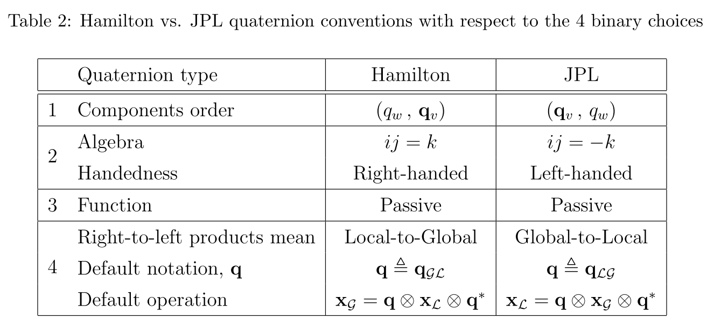

# [周结1]——MSCKF论文笔记

## Reference

1. A Multi-State Constraint Kalman Filter for Vision-aided Inertial Navigation. MSCKF1.0的论文；
2. Quaternion Kinematics for Error-State KF. 关于四元数以及ESKF的论文；
3. Robust Stereo Visual Inertial Odometry for Fast Autonomous Flight. MSCKF-VIO对应的论文；
4. https://github.com/KumarRobotics/msckf_vio 双目MSCKF的工程；
5. https://zhuanlan.zhihu.com/p/76341809 知乎上大佬对MSCKF的总结，本文没有过多的程序方面的讲解，都是从理论上推导的，也是个人的一些解惑过程；

> PS: MSCKF的工程算是我见过最贴近论文的工程了，基本上工程中的数学部分在论文里面都给了出来，所以对于MSCKF1.0来说，论文是一定要弄懂的。本篇将参考[1]和参考[3]放在一起进行梳理，因为两者确实很相似，不过在参考[3]中作者对能观性进行了一定程度的补偿。

&nbsp;

----

## EKF的状态变量构建

### 坐标系的表示问题

论文中{G}为世界(global)坐标系，{I}为IMU坐标系(或者称为机体坐标系)。

### 位姿表示方式

关于位姿的表示了，在大多数的SLAM系统中，位姿表示一般为$T=\{R^{G}_{I}|t^{G}_{I}\}$，但是MSCKF(或者大部分的EKF-base的VO/VIO系统)中的位姿表示变为了$T=\{R^{I}_{G}|p^{G}_{I}\}$，论文中都表示为$T=\{^{I}_{G}q| ^{G}p_{I}\}$，然后**其中最关键的一点是：四元数的表示方法使用的不是传统的Hamilton表示方法，而是JPL表示方法**，这两种表示方法的区别和联系可以看参考[[2]](https://arxiv.org/abs/1711.02508)，简单的说就是大佬们为了四元数乘法的一致性，自己又搞了一个表示方法出来，借用参考[2]中的区别图如下：

这里笔者把个人认为比较重要的改变记录下来：

- 四元数的微分方程发生了变化，区别如下：

  - Hamilton表示法中，四元数的微分方程表示为$\dot{\mathbf{q}}=\frac{1}{2}\mathbf{q}\otimes\Omega(^Lw) $；
  - JPL表示法中，四元数的微分方程表示为$\dot{\mathbf{q}}=\frac{1}{2}\Omega(^Lw)\otimes \mathbf{q}$

  其中$\Omega(^Lw)$均用一个纯四元数（pure quaternions）的右乘矩阵形式：

$$
\Omega(w)=\begin{bmatrix}-[w]_{\times} & w \\ -w^T & 0 \end{bmatrix}
$$
- 四元数的扰动展开发生了变化；

&nbsp;

### IMU状态变量的表示方式

> Notation:
>
> 以下的参数表示中：
>
> 1. 若字母头上什么都没有，形如$\mathbf{X}$的形式，表示该变量为truth-state，这个值为理想值，永远不可能求得；
> 2. 若字母头上有尖号，形如$\widehat{\mathbf{X}}$，表示该变量为normal-state，也就是算法的估计值；
> 3. 若字母头上有飘号，形如$\widetilde{\mathbf{X}}$，表示该变量为error-state，也就是估计值与真值之间的差值；
> 4. 特别的，对于四元数表示旋转而言，头上都有一个横线，形如$\overline{\mathbf{q}}$，表示该四元数是一个单位四元数；

IMU状态变量一如既往的还是用5个变量表示，不过这里的顺序不太一样，如下：
$$
\mathrm{X}_{IMU}=\begin{bmatrix} ^{L}_{G}\overline{q}^T & b_g^{T} & ^{G}v_{I}^{T} & b_a^{T} & ^{G}p_{I}^{T} \end{bmatrix}^{T}   \tag{1}
$$
IMU的error-state向量表示如下：
$$
\tilde{\mathrm{X}}_{IMU}=\begin{bmatrix} \delta{\theta_{I}^T} & \tilde{b}_g^T & ^{G}\tilde{v}_{I}^T & \tilde{b}_{a}^T & ^{G}\tilde{p}_{I}^{T} \end{bmatrix}^{T}   \tag{2}
$$
其中$\delta{\theta}$为旋转向量，由$\delta{\overline{q}}=\left[\frac{1}{2}\delta{\theta}^T, 1\right]^T$表示，唯一需要注意的就是一旦这样表示了，就意味着假设了旋转角度很小，因为是error-state，所以这个假设是十分成立的；

&nbsp;

### 带相机位姿的状态变量表示方式

k时刻的整个滤波器的位姿为：
$$
\mathrm{\widehat{X}_{k}}=\begin{bmatrix}\mathrm{\widehat{X}_{IMU}} & ^{C_1}_{G}\widehat{\overline{q}}^T & ^{G}\widehat{p}_{C_1}^T & ... & ^{C_N}_{G}\widehat{\overline{q}}^T & ^{G}\widehat{p}_{C_N}^T	\end{bmatrix}^T  \tag{3}
$$
对应的error-state为：
$$
\mathrm{\tilde{X}_{k}}=\begin{bmatrix}\mathrm{\tilde{X}_{IMU}} & \delta{\theta}_{C_1} & ^{G}\widehat{p}_{C_1}^T & ... & \delta{\theta}_{C_N} & ^{G}\tilde{p}_{C_N}^T	\end{bmatrix}^T  \tag{4}
$$
&nbsp;

----

## MSCKF位姿估计——估计的变量是什么？

这一小节主要搞清楚MSCKF中的状态量是什么，这个也是理解MSCKF的一个重要的部分。

相比于EKF-Base的方法，MSCKF更多的使用ESKF的方式，也就是对**误差变量error-state**进行估计，而不是**对表示位姿的状态变量normal-state**进行估计。与Graph-base的方法求解的量是一样的。

使用ESKF的好处是不言而喻的，引用参考2中的原话：

- The orientation error-state is minimal (i.e., it has the same number of parameters as degrees of freedom), avoiding issues related to over-parametrization (or redundancy) and the consequent risk of singularity of the involved covariances matrices, resulting typically from enforcing constraints.
- The error-state system is always operating close to the origin, and therefore far from possible parameter singularities, gimbal lock issues, or the like, providing a guarantee that the linearization validity holds at all times.
- The error-state is always small, meaning that all second-order products are negligible. This makes the computation of Jacobians very easy and fast. Some Jacobians may even be constant or equal to available state magnitudes.
- The error dynamics are slow because all the large-signal dynamics have been inte- grated in the nominal-state. This means that we can apply KF corrections (which are the only means to observe the errors) at a lower rate than the predictions.

&nbsp;

----

## MSCKF位姿估计——状态变量的估计

搞清楚了估计的变量是什么之后（一定注意是error-state），下面就可以开始构建整个滤波问题了，但是因为本质上算法还是在求解状态变量（也就是$\widehat{\mathbf{X}}$），因此这里先看一下状态变量的递推过程；

### IMU姿态的传导（Propagation）

#### IMU的运动方程

对于IMU而言，姿态传导部分基本上依赖于IMU的运动方程，使用IMU的测量进行最新时刻的位姿的推导，并以此作为机体位姿转移到相机位姿上，在连续时域上，IMU的运动方程如下：
$$
\begin{aligned}
\begin{cases}
^{I}_{G}\dot{\bar{q}}(t) &=\frac{1}{2} \boldsymbol{\Omega}(\boldsymbol{\omega}(t))_{G}^{I} \bar{q}(t) \\ 
\dot{\mathbf{b}}_{g}(t) &=\mathbf{n}_{w g}(t) \\
^{G}\dot{\mathbf{v}}(t) &= ^{G}\mathbf{a}(t) \\ 
\dot{\mathbf{b}}_{a}(t) &=\mathbf{n}_{w a}(t) \\
^{G}\dot{\mathbf{p}}(t) &= ^{G}\mathbf{v}(t)
\end{cases}
\end{aligned}   \tag{5}
$$
其中四元数为JPL表示法，$\Omega$为上面的纯四元数右乘矩阵形式。

公式（5）中的参数均为理想情况下的参数，实际过程中的运动方程为：
$$
\begin{aligned}
\begin{cases}
^{I}_{G}\dot{\widehat{\bar{q}}}(t) &=\frac{1}{2} \boldsymbol{\Omega}(\boldsymbol{\widehat\omega}(t))_{G}^{I} \bar{q}(t) \\ 
\dot{\mathbf{\widehat b}}_{g}(t) &=0 \\
^{G}\dot{\mathbf{\widehat v}}(t) &= \mathbf{C}_{\hat{q}}^{T} \hat{\mathbf{a}}-2\left\lfloor\boldsymbol{\omega}_{G} \times\right\rfloor^{G} \hat{\mathbf{v}}_{I}-\left\lfloor\boldsymbol{\omega}_{G} \times\right\rfloor^{2} G_{\hat{\mathbf{p}}_{I}}+{ }^{G} \mathbf{g} \\ 
\dot{\mathbf{\widehat b}}_{a}(t) &= 0 \\
^{G}\dot{\mathbf{p}}(t) &= ^{G}\mathbf{\widehat v}(t)
\end{cases}
\end{aligned}   \tag{6}
$$
其中：

1. $\widehat \omega(t)=\omega_{m}-\widehat b_{g}-R^{b}_{w}\omega_{G}$，表示实际过程中通过测量减去零偏的值，同时作者这里考虑了地球转动的影响；
2. $\widehat a=a_m-\widehat b_a$，表示实际过程中通过测量减去零偏的值，作者在计算速度的微分时，也考虑了地球转动对于测量值的影响；
3. 以上均在连续时域中进行的分析，对连续函数进行离散化时需要在位置上考虑加速度的影响，这样会更加的准确一些（在开源的S-MSCKF代码中是没有考虑地球自传的影响的）；

&nbsp;

#### IMU状态积分

----

### Camera姿态的传导

以上均是IMU位姿的递推过程，因为这个过程中并没有观测，因此相机的位姿都保持不变；

&nbsp;

#### 误差状态的微分方程

这部分请读者参考参考[2](https://arxiv.org/abs/1711.02508)第五章的内容，这里直接给出结论，如下：
$$
\dot{\tilde{\mathbf{X}}}_{\mathrm{IMU}}=\mathbf{F} \widetilde{\mathbf{X}}_{\mathrm{IMU}}+\mathbf{G} \mathbf{n}_{\mathrm{IMU}}  \tag{7}
$$
其中：

1. $$
   \mathbf{F}=\left[\begin{array}{ccccc}
   -\lfloor\hat{\boldsymbol{\omega}} \times\rfloor & -\mathbf{I}_{3} & \mathbf{0}_{3 \times 3} & \mathbf{0}_{3 \times 3} & \mathbf{0}_{3 \times 3} \\
\mathbf{0}_{3 \times 3} & \mathbf{0}_{3 \times 3} & \mathbf{0}_{3 \times 3} & \mathbf{0}_{3 \times 3} & \mathbf{0}_{3 \times 3} \\
   -\mathbf{C}_{\hat{q}}^{T}\lfloor\hat{\mathbf{a}} \times\rfloor & \mathbf{0}_{3 \times 3} & -2\left\lfloor\boldsymbol{\omega}_{G} \times\right\rfloor & \mathbf{-} \mathbf{C}_{\hat{q}}^{T} & -\left\lfloor\boldsymbol{\omega}_{G} \times\right. \\
   \mathbf{0}_{3 \times 3} & \mathbf{0}_{3 \times 3} & \mathbf{0}_{3 \times 3} & \mathbf{0}_{3 \times 3} & \mathbf{0}_{3 \times 3} \\
   \mathbf{0}_{3 \times 3} & \mathbf{0}_{3 \times 3} & \mathbf{I}_{3} & \mathbf{0}_{3 \times 3} & \mathbf{0}_{3 \times 3}
   \end{array}\right]
   $$
   
2. $$
   \mathbf{G}=\left[\begin{array}{cccc}
   -\mathbf{I}_{3} & \mathbf{0}_{3 \times 3} & \mathbf{0}_{3 \times 3} & \mathbf{0}_{3 \times 3} \\
   \mathbf{0}_{3 \times 3} & \mathbf{I}_{3} & \mathbf{0}_{3 \times 3} & \mathbf{0}_{3 \times 3} \\
   \mathbf{0}_{3 \times 3} & \mathbf{0}_{3 \times 3} & -\mathbf{C}_{\hat{q}}^{T} & \mathbf{0}_{3 \times 3} \\
   \mathbf{0}_{3 \times 3} & \mathbf{0}_{3 \times 3} & \mathbf{0}_{3 \times 3} & \mathbf{I}_{3} \\
   \mathbf{0}_{3 \times 3} & \mathbf{0}_{3 \times 3} & \mathbf{0}_{3 \times 3} & \mathbf{0}_{3 \times 3}
   \end{array}\right]
   $$

稍微不同的一点是参考2中考虑了重力，而这里并没有考虑重力，同时这里多考虑了地球的自转影响。

&nbsp;

#### 误差状态传递过程的推导

根据MSCKF2.0中的表述，在MSCK1.0中使用的是数值推导而非理论推导，这里先按照1.0中的思路来，之后总结2.0的时候再按照2.0的方法进行推导。

公式（7）表示了误差状态的微分关系，根据线性系统的离散化知识，可以得到误差状态的递推方程为：
$$
\boldsymbol{\tilde{X}}\left(t_{k+1}\right)=\boldsymbol{\Phi}\left(t_{k+1}, t_{k}\right) \boldsymbol{\tilde{X}}\left(t_{k}\right)+\int_{t_{k}}^{t_{k+1}} \boldsymbol{\Phi}\left(t_{k+1}, \tau\right) \boldsymbol{G}(\tau) \boldsymbol{n}(\tau) \mathrm{d} \tau \tag{8}
$$
其中状态传递矩阵$\dot\Phi(t_{k+1}, t_k)=F(t)\Phi(t_{k+1})$，可以明显看到，该状态转移矩阵的闭式解是指数函数，形式为：
$$
\boldsymbol{\Phi}\left(t_{k+1}, t_{k}\right)=\exp \int_{t_{k}}^{t_{k+1}} \boldsymbol{F}(t) \mathrm{d} t   \tag{10}
$$
针对公式（8），对协方差矩阵进行推导的话可以得到：
$$
\begin{aligned}
E\left[\boldsymbol{W}_{k} \boldsymbol{W}_{j}^{\mathrm{T}}\right]=& E\left[\int_{t_{k}}^{t_{k+1}} \boldsymbol{\Phi}\left(t_{k+1}, t\right) \boldsymbol{G}(t) \boldsymbol{w}(t) \mathrm{d} t \cdot \int_{t_{j}}^{t_{j+1}} \boldsymbol{w}^{\mathrm{T}}(\tau) \boldsymbol{G}^{\mathrm{T}}(\tau) \boldsymbol{\Phi}^{\mathrm{T}}\left(t_{k+1}, \tau\right) \mathrm{d} \tau\right] \\
&= \int_{t_{k}}^{t_{k+1}} \boldsymbol{\Phi}\left(t_{k+1}, t\right) \boldsymbol{G}(t)\left[\int_{t_{j}}^{t_{j+1}} E\left[\boldsymbol{w}(t) \boldsymbol{w}^{\mathrm{T}}(\tau)\right] \cdot \boldsymbol{G}^{\mathrm{T}}(\tau) \boldsymbol{\Phi}^{\mathrm{T}}\left(t_{k+1}, \tau\right) \mathrm{d} \tau\right] \mathrm{d} t\\
&= \int_{t_{k}}^{t_{k+1}} \boldsymbol{\Phi}\left(t_{k+1}, t\right) \boldsymbol{G}(t)\left[\int_{t_{j}}^{t_{j+1}} \boldsymbol{q} \delta(t-\tau) \boldsymbol{G}^{\mathrm{T}}(\tau) \boldsymbol{\Phi}\left(t_{k+1}, \tau\right) \mathrm{d} \tau\right] \mathrm{d} t
\end{aligned}  \tag{11}
$$
于是看到，当$t！=\tau$的时候，因为狄更斯函数的关系导致积分值为0；而当$t==\tau$的时候，整个积分有值，为：
$$
\left.E\left[\boldsymbol{W}_{k} \boldsymbol{W}_{j}^{\mathrm{T}}\right]\right|_{j=k}=\int_{t_{k}}^{t_{k+1}} \boldsymbol{\Phi}\left(t_{k+1}, t\right) \boldsymbol{G}(t) \boldsymbol{q} \boldsymbol{G}^{\mathrm{T}}(t) \boldsymbol{\Phi}^{\mathrm{T}}\left(t_{k+1}, t\right) \mathrm{d} t \tag{12}
$$
对于离散情况而言，如果采样周期足够短，我们可以简单的假设在$t \in [t_k, t_{k+1}]$这段时间内，转移矩阵$\Phi$和驱动矩阵$G$均不变化，于是整个**误差状态**传递过程就比较明了了：

1. 通过公式（7）获得误差状态**微分方程**的传递矩阵$\mathbf{F(t)}$；
2. 通过公式（10）获得误差状态的转移矩阵$\mathbf{\Phi(t_{k+1}, t_k)}$，这里通常使用泰勒展开，论文中保留到了三阶；
3. 通过公式（12）获得误差状态的协方差矩阵；

整个过程完成了卡尔曼滤波的预测阶段；