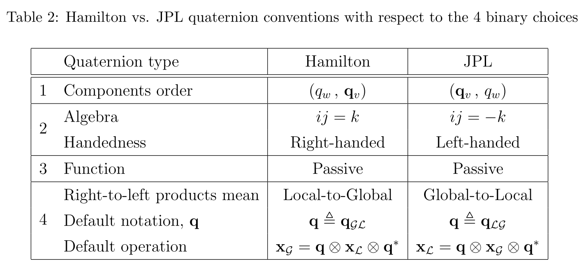

# [周结1]——MSCKF论文笔记

## Reference

1. A Multi-State Constraint Kalman Filter for Vision-aided Inertial Navigation. MSCKF1.0的论文；
2. Quaternion Kinematics for Error-State KF. 关于四元数以及ESKF的论文；
3. https://github.com/KumarRobotics/msckf_vio 双目MSCKF的工程；

> PS: MSCKF的工程算是我见过最贴近论文的工程了，基本上工程中的数学部分在论文里面都给了出来，所以对于MSCKF1.0来说，论文是一定要弄懂的。

----

## EKF的状态变量构建

首先说明一下坐标系问题，论文中{G}为世界(global)坐标系，{I}为IMU坐标系(或者称为机体坐标系)。

其次就是关于位姿的表示了，在大多数的SLAM系统中，位姿表示一般为$T=\{R^{G}_{I}|t^{G}_{I}\}$，但是MSCKF(或者大部分的EKF-base的VO/VIO系统)中的位姿表示变为了$T=\{R^{I}_{G}|p^{G}_{I}\}$，论文中都表示为$T=\{^{I}_{G}q| ^{G}p_{I}\}$，然后**其中最关键的一点是：四元数的表示方法使用的不是传统的Hamilton表示方法，而是JPL表示方法**，这两种表示方法的区别和联系可以看参考[[2]](https://arxiv.org/abs/1711.02508)，简单的说就是大佬们为了数学运算的一些性质，自己又搞了一个表示方法出来，借用参考[2]中的区别图如下：

