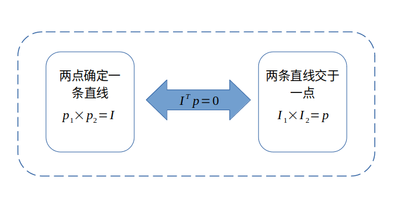
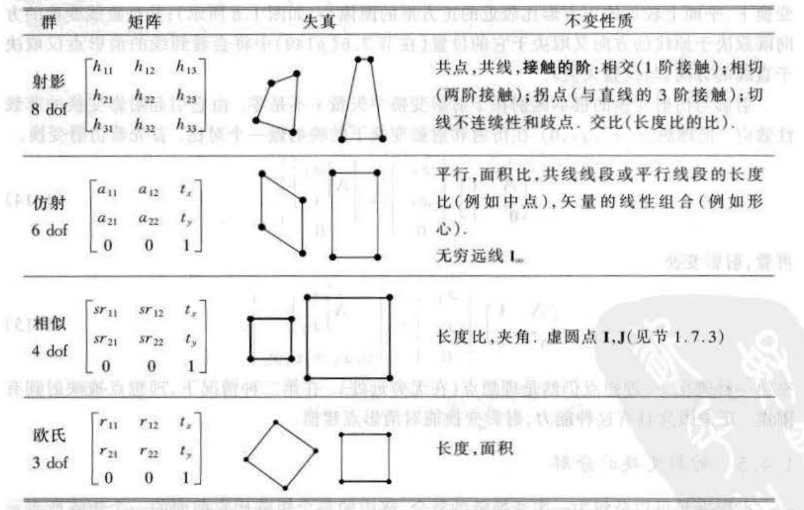
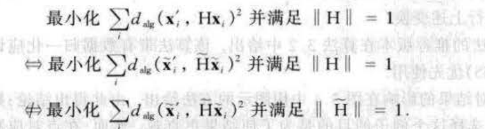

# 一文详解多视图几何（一）————基础部分

---

[TOC]

----

## 写在前面

最近换了工作之后确实是忙了亿点点哈，很多东西都没有时间阅读和总结。年初立下的FLAG是今年要看两本书，第一本就是多视图几何，看了几个月了，其实也边看边总结，但是总感觉跟流水账一样，索性重新进行规划和总结一下，第二遍确实感觉上要比第一遍的时候强很多。
这次的一文系列主要聚焦在整本书的大纲上，大纲其实分了5个部分，但是鉴于笔者的工作方向，这里仅仅总结到两视图几何部分，多余的部分读者自行安排哈~

&nbsp;
---

## 整体架构

这里给出本文的架构图，整个文章也会完全围绕着这个架构去走，如果中途迷路的小伙伴可以回来看看整个脑图哈~

&nbsp;
---

## MVG中使用到的基础知识

其实整体看下来，MVG虽然名称上有几何这个名词，但是在很多方面，代数的作用还是相当大的，笔者第一遍看的时候也是很懵逼，感觉很多时候不是在看几何的东西，而是代数的推导。后来回过头思考的时候才明白：其实对于MVG而言，纯几何去解释其实比较感性，帮助我们很形象的理解理论（就如同函数的图像一样），而代数的解释更加理性，它帮助我们在几何不是那么容易解释的情况下，给我们的推导提供一个定心丸（当然这个代数都是对的）。
笔者总结的目的也是希望尽可能用几何的方式来解释MVG中的一些推导和理论。

&nbsp;

### 坐标系的表示
这部分比较简单，主要就是引入齐次坐标（取名为射影空间），其优点就是整个运算都能在向量空间进行表示，在后面的所有推导中都会显示出这个优势：
$$
\begin{aligned}
\mathrm{IR^3} &\rightarrow \mathrm{IP^2} \quad (2D射影空间) \\
\mathrm{IR^4} &\rightarrow \mathrm{IP^3} \quad (3D射影空间）
\end{aligned}
$$

可以看到，XD的射影空间对应的其实是(X+1)D的欧式空间，所以齐次坐标系就是在原先的非齐次坐标系的基础上扩展了一维，但是又对该维度进行了特别的约束：让该维度等于1表示在(X+1)D上的一个射线簇。我个人感觉也是射影中射的来源，影就是该射线与不同的平面相交所产生的**像**，就像我们的影子在墙上和地上形成的形状不同一样。

举个简单的例子：在2D射影空间 $\mathrm{IP^2}$ 上，点 $\mathrm{p=[1, 1, 1]}$ 既可以表示欧式空间 $\mathrm{IR^3}$ 中的点 $\mathrm{p=[1, 1, 1]}$, 也可以表示点 $\mathrm{p=[2, 2, 2]}$。

于是一个将 $\mathrm{IR^3}$ 转为 $\mathrm{IP^2}$ 的公式如下：
$$
\mathrm{IR^3} = \begin{bmatrix} x \\ y \\ z \end{bmatrix} \Rightarrow \begin{bmatrix} x/z \\ y/z \\ 1 \end{bmatrix} =  \mathrm{IP^2} \tag{1}
$$

&nbsp;
---

### 二维平面的点线关系
该部分主要将关注点放在2D平面上，主要讨论的部分包括:
- 点线的关系
- 消影点和消影线（又叫做无穷远点）
- 消影线（又叫做无穷远线）和虚圆点

下述的所有的点均用符号 $\mathrm p$ 表示，而直线均用符号 $\mathrm I$ 表示。

#### 点线关系
整体来说，本章主要围绕的一个基本点就是点在线上的公式：
$$
\mathrm{I^T p=0} \tag{2}
$$

根据上面的公式，我们可以在齐次坐标系下很容易的得到小学初中所学的知识点：
1. 两点确定一条直线：
$$
\mathrm{p_1 \times p_2 = I} \tag{3}
$$

2. 两条非平行的直线有一个交点：
$$
\mathrm{I_1 \times I_2 = p} \tag{4}
$$

这里体现出来了2D射影空间（也就是2D的齐次坐标系）的一个优势，即点和线的公式在一定程度上是统一的。
当然，使用非齐次坐标也可以表示上述的两个公式，但是在代数上来讲，上述的公式更容易处理和公式代入，同时也避免了一些奇异情况的特殊处理，典型的情况比如直线的斜率为0和$\infty$。

上述的关系可以通过下面的一张图表示：

> 点在曲线上
> 曲线在整个视图几何中的存在感不强，所以这部分就简单介绍一下，点在曲线上的公式主要由如下式子表示：
> $$
> \mathrm{p^T C p = 0} \tag{5}
> $$
>
> 其中：
> - C 是一个3x3的对称矩阵，一般情况下，C 的形式为：
> $$
> C=\begin{bmatrix}a & \frac{b}{2} & \frac{d}{2} \\ \frac{b}{2} & c & \frac{e}{2} \\ \frac{d}{2} & \frac{e}{2} & e\end{bmatrix}
> $$
> 
> - p 是一个齐次坐标系的点，形式为：
> $$
> p=\left[x, y, z\right]^{T}
> $$
>
> - 所以曲线方程展开为：
> $$
> \mathrm{ax^2 + bxy + cy^2 + dxz + eyz + fz^2 = 0}
> $$

&nbsp;

#### 消影点（无穷远点）
消影点（无穷远点）从名字中也容易理解，就是位于无穷远处的点而已，对于齐次坐标系而言，它的表示如下：
$$
\mathrm{p_\infty=\begin{bmatrix}x \\ y \\ 0\end{bmatrix}} \tag{6}
$$

需要特别说明的一点是：消影点仅仅是个代数上的概念，也就是在齐次坐标系中的一个表示，它与非齐次坐标系中的点不存在映射关系。**比如在非齐次坐标系中，无穷远点可以是 $[1, \infty]$, 也可以是 $[\infty, 3]$, 也可以是$[\infty, \infty]$, 但是如果我们按照公式（1）进行映射的话，发现并没有实际的 $\mathrm{IR^3}$ 的点与之对应，所以这个点仅仅是一个概念或者代数上的一个点**。

无穷远点的引入有一个重要的作用就是可以作为平行线的交点，按照公式（4）可以得到两条平行线的交点必然满足公式（6）所示的无穷远点的形式。但是几何数学告诉我们，两条平行线是不可能有交点的，所以也印证了上面对于无穷远点的说明：该点仅仅是一个代数概念的点。

&nbsp;

#### 消影线（无穷远线）
有了消影点的表示之后，消影线就呼之欲出了：
$$
\mathrm{I_\infty=\begin{bmatrix}0 \\ 0 \\ 1\end{bmatrix}} \tag{7}
$$

无穷远直线的形式比较简单，证明的话就是点在线上的公式得知所有的无穷远点都在无穷远直线上。

当然引入无穷远直线并不是为了干巴巴的新加了一个知识点，后面在介绍射影变换的时候可以使用“恢复无穷远直线位置的方法”来得到射影变换中的**特殊**仿射变换。

&nbsp;

#### 虚圆点（绝对点）
虚圆点的定义为：每一圆周交 $\mathrm{I_{\infty}}$ 的点。

从定义上可以看到，这个东西又是一个代数概念性的东西，原因是因为本质上，虚圆点也是无穷远点。

下面先来从原始定义上来推导出虚圆点的表达式：
1. 根据曲线方程 $\mathrm{ax^2 + bxy + cy^2 + dxz + eyz + fz^2 = 0}$ , 如果曲线是圆周，则 b=d=e=0，同时a=c；
2. 又因为虚圆点是无穷远点，那么z=0；

综上，虚圆点满足：
$$
\begin{cases}
x^2+y^2=0 \\
z=0
\end{cases} \tag{8}
$$

所以虚圆点的表达式为：
$$
\mathrm{I}=\begin{bmatrix}1 \\ i \\ 0 \end{bmatrix} \quad \mathrm{J}=\begin{bmatrix}1 \\ -i \\ 0 \end{bmatrix} \tag{9}
$$

和上面的消影线一样，虚圆点也不是一个无用的知识点，虚圆点的主要作用有两个：
1. 虚圆点在相似变换下是不变的（后面深入讲）；
2. 虚圆点构建出一个对偶二次曲线，该曲线也是在相似变换下是不变的（后面深入讲）:
$$
\mathrm{C^{*}=IJ^T + JI^T}=\begin{bmatrix}1 & 0 & 0 \\ 0 & 1 & 0 \\ 0 & 0 & 0 \end{bmatrix} \tag{10}
$$

&nbsp;

#### 小结
在2D平面上的基础知识主要围绕着点线关系展开，同时为了兼容整个平面几何的特殊情况，引入了无穷远点这个概念点，进而触发了无穷远线和虚圆点及其对偶的二次曲线，再次声明，这些概念性的东西在后面的射影几何中极其重要，后面可以看到识别出了这些概念的东西之后就可以恢复出原始的图像仅仅经过相似变换后的结果。

&nbsp;
---

### 三维平面的点线面关系
整个三维部分其实看起来仅仅是在二维的基础上添加了一个维度，但是该维度将整个难度也提升了一级，代入了诸多的性质。但是本文从实用的角度出发（笔者自以为的角度），仅仅介绍一些常用的东西：

#### 点扩展为点
点这部分没有特别大的变换，仅仅就是添加了 z 方向的一个维度，下面的点就用大写字母表示了。
$$
\mathrm{P=\begin{bmatrix}x \\ y \\ z \\ 1\end{bmatrix}} \tag{11}
$$

&nbsp;

#### 线扩展为面
在三维射影空间中，面的参数和线是比较相似的，由一个4维向量表示，同时点在面上的方程与二维射影空间中点在线上的方程类似，如下：
$$
\mathrm{P^T\pi=\begin{bmatrix}x & y & z & 1\end{bmatrix}\begin{bmatrix}a \\ b \\ c \\ d\end{bmatrix}=0} \tag{12}
$$

其中：
1. a b c为面的法向量，理论上模长为1；
2. d 参数是原点到平面的垂直距离；

&nbsp;

#### 三维射影空间中的线
如上所述，二维射影空间的点和线都有了扩展映射，但是三维射影空间的线却没有与之对应的东西，原因是线在3D空间中相对点和面是比较复杂的。

1. 自由度的复杂性：从上面点和面的表达式中能够看到齐次坐标用4维的向量表达了仅有3个维度自由度的点和面（面的表达式可以将整个向量除以 d ，就和点是一样的了），但是在三维空间的线是有4个自由度的（两个点决定一条直线，但是直线饶自身方向为轴旋转和移动均表示一条直线，因此自由度为4），所以仅仅有4个维度的三维射影空间 $\mathrm{IP^3}$ 是无法在自由度上包括直线的，除非再次进行扩展，用5个维度的向量表示；
2. 表达式的复杂性：如上所述，既然不能用三维射影空间的坐标表示线，那么一定有表示方法对线进行表示：
	- 两个点的表示方法：起点加方向；
	- 点面矩阵零空间的表示方法：这种方法的表达比较模糊，最终的形式跟第一种也差不多，是两个矢量相加的形式；
	- 普朗克表示法：普朗克使用6个参数来表示线特征，相比于前两种方法，该方法最终是使用一个向量的表示法，并且该6个参数还都是有实际的意义，是本小节重点想介绍的表示法；

##### 普朗克表达式
给定两个点，普朗克矩阵的表达式为：
$$
\mathrm{L=AB^T - BA^T=
\begin{bmatrix}
0 & x_a*y_b-y_a*x_b & x_a*z_b-z_a*x_b & x_a-x_b \\ 
y_a*x_b-x_a*y_b & 0 & y_a*z_b-z_a*y_b & y_a-y_b \\
z_a*x_b-z_b*x_a & z_a*y_b-y_a*z_b & 0 & z_a-z_b \\
x_b-x_a & y_b-y_a & z_b-z_a & 0 \\
\end{bmatrix}}=
\begin{bmatrix}
0 & n_1 & n_2 & d_1 \\ 
-n_1 & 0 & n_3 & d_2 \\
-n_2 & -n_3 & 0 & d_3 \\
-d_1 & -d_2 & -d_3 & 0
\end{bmatrix}
\tag{13}
$$

这里可以看到，整个矩阵的实际参数其实仅有6个，其中$\mathrm{\{n_1, n_2, n_3\}}$是两点的叉积（两点与原点形成平面的法向量），而$\mathrm{\{d_1, d_2, d_3\}}$是两点决定的直线的方向向量，所以可以看到6个参数都是有实际意义的。

其次，假设该A、B点定义的直线为平面P、Q的交线，那么 L 矩阵的零空间为以P和Q为基底的组成的平面束空间。

通常，普朗克的直线表示法也表示为$\mathrm{L=\{n1, n2, n3, d1, d2, d3\}^T}$，关于这个表示法如何应用在SLAM中的部分，可以参考笔者之前写的https://zhuanlan.zhihu.com/p/149028042

&nbsp;

##### 普朗克表达式的自由度

之后再来谈谈自由度的问题，我们看到整个参数有6个，去除一个比例系数自由度为5，又因为整个矩阵 L 的行列式为0，得到约束（这个在matlab上印证过）：
$$
\mathrm{n_1*d_3-n_2*d_3+n_3*d_1=0} \tag{14}
$$

因而又可以去除一个自由度，因此普朗克表示法的自由度与期望的一致。

&nbsp;

##### 普朗克表达式的线共面判据

这里依旧使用点来进行判断，四点$\mathrm{A, B, \hat{A}, \hat{B}}$共面的主要判据（在matlab上印证过）：
$$
\mathrm{det(A, B, \hat{A}, \hat{B})}=0 \\ 
\Rightarrow \mathrm{n_1*\hat{d_3}+\hat{n_1}*d_3-n_2*\hat{d_2}-\hat{n_2}*d_2+d_1*\hat{n_3}+\hat{d_1}*n_3}=0 \tag{15}
$$

&nbsp;

#### 小结
本小节主要介绍了三维空间中的点线面的表示法，书中还介绍了无穷远点和面，以及在2D空间绝对二次曲线所对应过来的也叫做绝对二次曲线的东西，但是因为应用上比较少（以笔者的视角），所以这里不多讲了，感兴趣的小伙伴还是看书哈。

&nbsp;
---

### 射影几何（2D）
到了本文最重要的一个小节了，也就是关于射影变换部分，在最开始的脑图中也给出了本小节的主要研究部分：
1. 射影变换的层次，这个必须是每个学习视觉必须记住的东西了；
2. 射影变换的恢复，这个部分主要基于很强烈的先验知识，来恢复出没有射影变换之前的图像；
3. 射影变换的估计，这个部分主要是根据两帧之间的匹配关系来估计两帧之间的射影变换，也是我们十分常用的一个部分；

所以整体来说，第二部分是比较有意思的部分，但是不常见，可以跳过；一三部分是最常用的，也是很基础的部分，需要重点掌握。

#### 射影变换的层次
射影变换的层次从低到高主要分为欧式、相似、仿射和射影，变换的自由度依次为3、4、6、8，这四种变换其实在SLAM或者SFM中其实都比较常见。

在书中其实给出了一副特别好的图来总结这几种变换，如下：

因为射影变换包括了所有的变换，因此这里以射影变换 $\mathrm{H}$ 为例说明这些变换对于点和线的变换公式：
- 对于点的变换公式为：
	$$
	\mathrm{x' = Hx} \tag{16}
	$$

- 对于线的变换公式为：
	$$
	\mathrm{I' = H^{-T}I} \tag{17}
	$$

有了上面的两个公式，图中的不变性质就显而易见了：
- 虚圆点在相似变换下是不变的，为了标注使用时不混淆，这里使用虚圆点J作为例子：
	$$
	\mathrm{H_s*J}=\begin{bmatrix}scos(\theta) & ssin(\theta) & t_x \\ -ssin(\theta) & scos(\theta) & t_y \\ 0 & 0 & 1\end{bmatrix}\begin{bmatrix}1 \\ -i \\ 0\end{bmatrix}
	=\begin{bmatrix}s(cos(\theta)-isin(\theta)) \\ -s(sin(\theta)+icos(\theta)) \\ 0 \end{bmatrix}=se^{-\theta\pi}\begin{bmatrix}1 \\ -i \\ 0\end{bmatrix} \tag{18}
	$$

	我们看到，最终整个变换之后的点和原先点仅仅相差了一个系数，而系数在射影空间是最不值钱的，直接忽略掉就是一个点了，因此虚圆点在相似变换下是一个不动点；
- 无穷远直线在仿射变换下是不变的：使用变换对于线的变换公式可得：
	$$
	\mathrm{H_A^{-T}I_{\infty}}=\begin{bmatrix}A^{-1} & -A^{-1}t \\ 0 & 1 \end{bmatrix}^T \begin{bmatrix} 0 \\ 1 \end{bmatrix}=
	\begin{bmatrix}A^{-1} & 0 \\ -A^{-1}t & 1 \end{bmatrix} \begin{bmatrix} 0 \\ 1 \end{bmatrix} = \begin{bmatrix}0 \\ 1 \end{bmatrix} \tag{19}
	$$

	可见无穷远直线经过仿射变换之后还是原来的无穷远直线，但是值得注意的一点是，虽然无穷远直线的位置还在原来的地方，但是并不是所有的无穷远点都还在原来的位置上！

OK，不变性质讲完之后，其实就能顺利的开启第二个小节了。

&nbsp;

#### 射影变换的恢复（option）
从上面的图中可以看到，在所有变换的层次中，射影变换位于最上次，是最复杂的变换，但是好消息是该变换一定能被其他变换组合表示，表达式为：
$$
\mathrm{H}=\mathrm{H}_{\mathrm{s}} \mathrm{H}_{\mathrm{A}} \mathrm{H}_{\mathrm{p}}=\left[\begin{array}{cc}
s \mathrm{R} & \mathbf{t} / v \\
\boldsymbol{0}^{\top} & 1
\end{array}\right]\left[\begin{array}{ll}
\mathrm{K} & \mathbf{0} \\
\boldsymbol{0}^{\top} & 1
\end{array}\right]\left[\begin{array}{cc}
\mathrm{I} & \mathbf{0} \\
\mathbf{v}^{\top} & v
\end{array}\right]=\left[\begin{array}{cc}
\mathrm{A} & \mathrm{t} \\
\mathbf{v}^{\top} & v
\end{array}\right] \tag{20}
$$

能够看到，射影变换可以拆分为相似变换、仿射变换和最特殊的射影变换的乘积。射影变换的恢复也主要是逆向的求解出射影变换的后两个变换，求到相似变换的时候一般就不往下再恢复的原因是一般情况下我们不会特别清楚图像中的尺度是多少。

这里沿用书中的例子：假设我们看到了一副如下所示的图像：

因为这一节是依赖于先验知识的，因此我们知道图中的地砖每个都是正方形，而不应该现在看到具有两个特点的砖块：
1. 正方形的对角边不再平行；
2. 正方形相邻两边不再垂直；

回忆上小节的内容，因为相似变换和仿射变换都不会改变平行关系，所以不平行的现象必然是最后的仿射变换 $\mathrm{H_p}$ 造成的，所以我们可以通过恢复平行关系来找到这个仿射变换，方法如下：
- 首先，回忆无穷远点的引入，两条平行线的交点为无穷远点，但是如果平行线的平行关系被破坏，则两直线的交点就会交于有限远点；
- 其次，如果我们找到原本应该应该是无穷远点的两个点，并连线，就可以得到无穷远直线；
- 最后，如果把上述的无穷远直线通过 $\mathrm{H^{-T}I}$ 的变换关系变换为原来的理想的无穷远直线 $\mathrm{I_{\infty}=[0, 0, 1]^{T}}$；
- 最最后，一定有读者会想：为什么不恢复无穷远点而是无穷远直线？因为无穷远点并没有理想的无穷远点，而无穷远直线则有。

上面的逻辑想通了之后，其实就可以推公式了，这里特别注意的是变换顺序问题，因为射影变换的公式是把 **原像** 中的点变换为 **像**，即 $\mathrm{x'=Hx}$，所以我们在去除射影变换的影响的时候，其实是把图像作为了 **原像**， 而把理想无穷远直线作为了 **像**：
$$
\begin{aligned}
I_{\infty}&=H_p^{-T}I_{img} \\
\Rightarrow \begin{bmatrix}0 \\ 0 \\ 1 \end{bmatrix} &= (\begin{bmatrix}I & 0 \\ v^{T} & v\end{bmatrix}^{T})^{-1}\begin{bmatrix}l_1 \\ l_2\\ l_3\end{bmatrix} \\
\Rightarrow H_p&=\begin{bmatrix}1 & 0 & 0 \\0 & 1 & 0 \\ l_1 & l_2 & l_3 \end{bmatrix}
\end{aligned} \tag{21}
$$

于是我们可以在例子中的图像上取两组平行线，之后通过计算其无穷远点并获取无穷远直线就可以求得上述的 $\mathrm{H_p}$，进行变换之后可得如下的图像：

可以看到图像的砖块确实恢复了平行关系。笔者在写这部分程序的时候，一定注意：
- 取平行线的时候一定注意不要取4个平行线，而是取两组互相垂直的平行线；
- 求得的无穷远点记得归一化到 z=1；

恢复了平行关系之后，下一步就是恢复垂直关系，这里面又用到了一个射影空间的角度计算公式：
$$
cos(\theta)=\frac{\mathbf{L^{T}C_{\infty}m}}{\sqrt{(\mathbf{L^{T}C_{\infty}L})(\mathbf{m^{T}C_{\infty}m})}} \tag{22}
$$

这里依旧设计到上面特别关注的投影顺序问题，也就是里面的变量都属于那个部分：

1. $\mathbf{L}， \mathbf{m}$ 均是在 **像** 上的两条直线；
2. $\mathbf{C_{\infty}}$ 也是 **像** 上的虚圆点的对偶二次曲线；
3. $\theta$ 是 **原像（可以认为就是欧式空间）** 上的夹角；

于是我们可以看到，只要获取了 **原像** 上的一组垂直直线，就可以不管分母的东西，而仅仅使得分子为0就可以！

鉴于 $\mathrm{L, M}$ 都是 **像** 中的线，是现成的，所以问题就集中在了绝对二次曲线 $\mathrm{C_{\infty}}$ 上。

回忆射影变换的层次一节（主要看那个图），仿射变换不会影响平行的性质，但是从投影公式上不难看出，仿射变换一定影响虚圆点的位置！进而影响绝对二次曲线的形式：
$$
\mathbf{C_{\infty}^{\prime}}=\mathbf{HIJ^{T}H^{T}+HJI^{T}H^{T}}=\mathbf{HC_{\infty}H^{T}} \tag{23}
$$
理想情况下的绝对二次曲线的形式为公式（10）的样子，把公式（20）中仿射变换的特别形式 $\mathrm{H_A}$ 代入可得：
$$
\mathbf{C_{\infty}^{\prime}}=\mathbf{H_{A}C_{\infty}H_A^{T}}=
\begin{bmatrix} K & 0 \\ 0 & 1 \end{bmatrix}\begin{bmatrix} I & 0 \\ 0 & 0 \end{bmatrix}\begin{bmatrix} K^{T} & 0 \\ 0 & 1 \end{bmatrix} = \begin{bmatrix} KK^{T} & 0 \\ 0 & 0 \end{bmatrix} = \begin{bmatrix} s_1 & s_2 & 0 \\ s_2 & s_3 & 0 \\ 0 & 0 & 0 \end{bmatrix} \tag{24}
$$
把公式（24）回带到公式（22）的分子中：
$$
\begin{aligned}
\begin{bmatrix}l_1 & l_2\end{bmatrix}\begin{bmatrix}s_1 & s_2 \\ s_2 & s_3\end{bmatrix} \begin{bmatrix}m_1 \\ m_2\end{bmatrix} &= 0 \\
l_1m_1s_1+(l_1m_2+l_2m_1)s_2+l_2m_2s_3&=0 \\ 
\begin{bmatrix}l_1m_1 & l_1m_2+l_2m_1 & l_2m_2\end{bmatrix}\begin{bmatrix}s_1 \\ s_2 \\ s_3\end{bmatrix}&=0
\end{aligned} \tag{25}
$$
可见一组垂直关系不够，需要两组才能解出来，所以在 **像** 中选择两组相互垂直的线段之后：
$$
\begin{bmatrix}l_1^{1}m^{1}_1 & l^{1}_1m^{1}_2+l^{1}_2m^{1}_1 & l^{1}_2m^{1}_2 \\ l_1^{2}m^{2}_1 & l^{2}_1m^{2}_2+l^{2}_2m^{2}_1 & l^{2}_2m^{2}_2\end{bmatrix}\begin{bmatrix}s_1 \\ s_2 \\ s_3\end{bmatrix}=\mathbf{Ax}=0 \tag{26}
$$
上面的方程很好求解，一旦求解了$s_1, s_2, s_3$，就可以直接构建 $KK^{T}$ 矩阵，之后通过cholesky分解得到 K 矩阵，就得到了仿射矩阵$\mathbf{H_A}$。但是特别注意的是：该仿射矩阵是把 **原像** 映射为 **像** 的。所以如果我们想进一步的去除射影变换的影响，需要用该矩阵的逆来进行反向的摄影矫正，如下图：

可以看到垂直关系也恢复了出来。

&nbsp;

#### **射影变换的估计**

这一节其实在书中是一大章，就是我们常用的估计单应矩阵的方法，内容讲了很多，很细致，但是在笔者看来，从理解的角度出发，整个章节大概可以分为三个点：

1. 求解代数解的方法——DLT方法；
2. 迭代求解的方法——基于优化方法的求解，其中介绍了一些损失函数；
3. 鲁棒性估计方法——RANSAC，鲁棒最大似然估计；

&nbsp;

##### 求解代数解

书中其实给出了两种方案：

- 求解形如AX=0的方程

  首先给出射影变换的公式$\mathbf{x'=Hx}$，可以看到一对真正的匹配之间必然满足：
  $$
  \mathbf{x'\times Hx}=\begin{bmatrix}\mathbf{y'h_{3}^{T}x-w'h_{2}^{T}x} \\ \mathbf{w'h_{1}^{T}x-x'h_{3}^{T}x} \\ \mathbf{x'h_{2}^{T}x-y'h_{1}^{T}x} \end{bmatrix}=
  \underbrace{\begin{bmatrix}0 & \mathbf{-w'x^{T}} & \mathbf{y'x^{T}} \\ \mathbf{w'x^{T}} & 0 & \mathbf{-x'x^{T}} \\ \mathbf{-y'x^{T}} & \mathbf{x'x^{T}} & 0\end{bmatrix}}_{A} \begin{bmatrix}\mathbf{h_1} \\\mathbf{h_2} \\ \mathbf{h_3} \end{bmatrix} =0 \tag{27}
  $$
  其中矩阵A的秩为2，所以其实保留其中两个等式就可以了，一般选择前两个等式。对于这样的一种问题来说，如果我们有4对匹配点，那么前面的A矩阵的维度就是8x9，如果我们把求解的矩阵当做齐次向量来解，那么其实求得的解是差一个绝对的尺度的，所以我们可以添加一个约束条件为$\left|\mathbf{x}\right|=1$的约束条件，其实添加了约束条件之后，就等于可以直接使用SVD得到最优解，同时该最优解一定满足该约束条件；

- 求解形如Ax=b的解

  这种方法其实是比较常用的求解方法，同样的，如果仅仅使用$\mathbf{x'=Hx}$的公式进行构建方程的话，则对于每一个点对，有：
  $$
  \left[\begin{array}{ccccccc}
  0 & 0 & 0 & -x_{i} w_{i}^{\prime} & -y_{i} w_{i}^{\prime} & -w_{i} w_{i}^{\prime} & x_{i} y_{i}^{\prime} & y_{i} y_{i}^{\prime} \\
  x_{i} w_{i}^{\prime} & y_{i} w_{i}^{\prime} & w_{i} w_{i}^{\prime} & 0 & 0 & 0 & -x_{i} x_{i}^{\prime} & -y_{i} x_{i}^{\prime}
  \end{array}\right] \overline{\mathbf{h}}=\left(\begin{array}{l}
  -w_{i} y_{i}^{\prime} \\
  -w_{i} x_{i}^{\prime}
  \end{array}\right) \tag{28}
  $$
  所以同样的，4对匹配点能构建一个8x9的求解问题，在h中，仅仅需要把其中的某一个变量设置为1，例如$h_j=1$，则整个问题都可以进一步求解，但是如此最大的问题就是，如果真正的$h_j=0$，那么整个问题的求解将会变得不稳定；

&nbsp;

##### 迭代式的求解方法

这部分是笔者觉得整个书中编排问题（或者说是大佬们没有特别照顾笔者这种菜鸡）比较大的一点，整个章节读下来相当的突兀，不知道为什么就出了一个小节讲这个，一会儿又蹦出来一个小节讲那个。所以笔者在这部分打算先总观的进行俯瞰干什么，之后再看达到这样的目的需要什么，这样会比较清晰一些。

优化迭代的求解方法其实无非就是找一个代价函数，之后就是使用各种迭代的方法求解到最优解，整个章节的大部分也是围绕着这样的目的展开：

1. 代价函数——代数距离，几何距离以及Sampson距离（前两种距离一笔带过就好，Sampson距离可以多讲一下）；
2. 建模部分——如何使用单个代价函数构建最大似然估计；
3. 数据处理——如何处理数据能进行更好的问题估计，这里面也研究了一些不变性的东西，这部分会多讲一下；
4. 优化方法——这部分读者可以自行看书，其实当前面的都解决了，这个就是一个流程而已；

疏通了上面的顺序之后，其实再会过头去看整个章节的内容就会比较清晰了。

1. 代价函数

   - 代数距离

     对于任意两个矢量$\mathbf{x_1}$和$\mathbf{x_2}$，我们可以将如下公式作为代数距离：
     $$
     d_{alg}(\mathrm{x_1}, \mathrm{x_2})^{2}=a_1^{2}+a_2^{2} \quad \text{其中} \mathbf{a}=(a_1, a_2, a_3)^{T}=\mathrm{x_1}\times\mathrm{x_2} \tag{29}
     $$
     所以一对匹配点$\mathrm{x'}=(x_1', x_2', x_3')^{T}$ 和 $\mathrm{\hat{x}}'=H\mathrm{x}=(\mathrm{\hat{x}_1}', \mathrm{\hat{x}_2}', \mathrm{\hat{x}_3}')$ 的代数距离为：
     $$
     \mathrm{A}\mathbf{h}=\varepsilon=\begin{bmatrix}\mathrm{y}'\mathrm{\hat{w}}'-\mathrm{w}\mathrm{\hat{y}}' \\ \mathrm{w}'\mathrm{\hat{x}}'-\mathrm{x}\mathrm{\hat{w}}' \end{bmatrix} \tag{30}
     $$
     所以取其范数为：
     $$
     d_{alg}(\mathrm{x}',\mathrm{\hat{x}}')^{2}=(\mathrm{y}'\mathrm{\hat{w}}'-\mathrm{w}\mathrm{\hat{y}}')^{2}+(\mathrm{w}'\mathrm{\hat{x}}'-\mathrm{x}\mathrm{\hat{w}}')^{2} \tag{31}
     $$

   - 几何距离

     也就是我们常见的重投影误差，不过书中这里又进行了划分，除了我们常用的重投影误差之外，书中也给出了一些其他形式的重投影误差，感兴趣的话可以到书中看看，这里不再展开；

   - Sampson距离

     Sampson误差笔者认为还是从二次曲线的拟合开始比较好，毕竟本身也是这个方法的来源。

     考虑一个场景：我们有一些数据之后，需要拟合一个二次曲线，形如 $\mathrm{x^{T}Cx}=0$ ，那么一个比较大的问题就是如何度量某个数据点与二次曲线的**几何误差（代数误差就是代入公式之后的误差了）**，Sampson给出了如下的方法求解：

     1. 设函数$\mathcal{V}(\mathrm{x})=\mathrm{x^{T}Cx}$，显然，真正在曲线上的点$\mathrm{\overline{x}}$ 一定可以满足$\mathcal{V}(\mathrm{\overline{x}})=0$；

     2. 假设测量 $\mathrm{x}$ 与曲线上的最近点 $\mathrm{\overline{x}}$ 之间的距离为 $\delta{\mathrm{x}}$；

     3. 将 2 的假设代入 1 中，就可以得到：
        $$
        \begin{aligned}
        \mathcal{V}(\mathrm{\overline{x}})&=\mathcal{V}(\mathrm{x+\delta{x}}) \\ 
        &=\mathcal{V}(\mathrm{x})+\mathbf{J}\delta{\mathrm{x}}=0 
        \end{aligned}
        \tag{32}
        $$

     4. 在 2 中，其实我们做了一个最优化的假设，就是 $\delta{\mathrm{x}}$ 是测量与曲线点最近的点，所以其实我们需要求解一个最优化的问题：
        $$
        \begin{aligned}
        \mathrm{min}_{\delta x} \quad &\lVert\delta{\mathrm{x}}\rVert^{2} \\ 
        s.t. \quad &\mathcal{V}(\mathrm{x})+\mathbf{J}\delta{\mathrm{x}}=0 
        \end{aligned} \tag{33}
        $$
        直接上拉格朗日乘子法，得到（这里和书中的公式稍微有些不同的是把中间的减号换成了加号，因为整个问题在求最小值，但是如果用减法，可以约定$\lambda$是小于等于0的）：
        $$
        \mathcal{L}(\delta{\mathrm{x}})=\delta{\mathrm{x}}^{T}\delta{\mathrm{x}}+2\lambda^{T}(\mathcal{V}(\mathrm{x})+\mathbf{J}\delta{\mathrm{x}}) \tag{34}
        $$
        于是按照拉格朗日乘子法的求解可以得到：
        $$
        \begin{aligned}
        \frac{\partial \mathcal{L}(\delta{\mathrm{x}})}{\partial \delta{\mathrm{x}}}=0 &\Rightarrow \delta{\mathrm{x}}^{T}+\lambda \mathbf{J}=0 \\
        \frac{\partial \mathcal{L}(\delta{\mathrm{x}})}{\partial \lambda}=0 &\Rightarrow \mathcal{V}(\mathrm{x})+\mathbf{J}\delta{\mathrm{x}}=0  
        \end{aligned} \tag{35}
        $$
        公式（10）联立就可以得到$\lambda=(\mathbf{J}\mathbf{J}^{T})^{-1}\mathcal{V}(\mathrm{x})$，再次代入公式（10）的第一个约束中，得到：
        $$
        \delta{\mathrm{x}}=-\mathbf{J}^{T}(\mathbf{J}\mathbf{J}^{T})^{-1}\mathcal{V}(\mathrm{x}) \tag{36}
        $$
        于是距离值，也就是
        $$
        \lVert\delta{\mathrm{x}}\rVert^{2}=\delta{\mathrm{x}}^{T}\delta{\mathrm{x}}=\mathcal{V}(\mathrm{x})^{T}(\mathbf{J}\mathbf{J}^{T})^{-1}\mathcal{V}(\mathrm{x}) \tag{37}
        $$

     如果我们将$\mathbf{J}\mathbf{J}^{T}$当做是$\mathcal{V}(\mathrm{x})$的协方差矩阵，那么我们推了半天就推出来了马氏距离。其实我们仅仅是用公式（37）的结论，也就是我们如果有一个曲线函数$\mathcal{V}(\mathrm{x})=0$，那么我们就可以用公式（37）定义测量的Sampson误差。

     回到这节的主旨上来：为了迭代优化求解找合适的代价函数，而Sampson误差给与了我们一种方法，只要我们有理想点的曲线方程，那么就可以很直接的得到测量到该曲线的误差。

     书中给出了一个例子：使用代数误差来作为上述的曲面函数$\mathcal{V}(\mathrm{x})=\mathrm{A}(\mathrm{x})\mathbf{h}$，其中 $\mathrm{x}$ 是由两个 2D 测量堆叠起来，形如 $\mathrm{x=[x, y, x',y']}$。所以我们可以用公式（37）得到优化步骤中的误差部分，同时因为公式中的 $\mathcal{V}(\mathrm{x})$ 和 $\mathbf{J}$ 都是关于 $\mathbf{H}$ 的函数，所以整个误差可以对射影变换 $\mathbf{H}$ 进行求导（目之所及就觉得贼麻烦的形式），也就提供了后面对 $\mathbf{H}$ 的优化方向 。

2. 建模部分

   这部分其实不难，主要是把整个问题看做一个最大似然估计，之后对每一个测量方程进行高斯建模，最终的结论就是基于高斯模型的最大似然估计其实就是最小化几何误差函数（这里做一个思考：代数误差可以吗？笔者认为不太可以，因为代数误差没有实际的物理单位，而几何误差具有实际的物理单位，方差的意义更明确）。

3. 数据处理

   在看ORB-SLAM2的时候就接触到其中的归一化的部分，后面自己写这部分代码的时候，确实感到将数据进行归一化之后再进行位姿估计会比直接使用图像坐标进行位姿估计结果要好很多！当时并没有特别的深究其中的奥妙，但是该小节其实比较深入的探讨了这点，笔者总结为：

   - 归一化前后的结果是否是一致的？——这直接决定能否使用归一化（结论是一致与否取决于后续的估计算法）；

   - 既然有时候不一致，那么归一化的好处是什么？——结果准确度的提升，选择了相同的标准坐标系，导致结果的相似变换不变性；

   &nbsp;

   ###### 图像坐标变换的不变性

   首先我们来研究变换前后的射影变换的关系：

   - 原始的数据为$\mathrm{x}，\mathrm{x}'$，经过变换的（该变换可以是归一化，也可以是别的操作）的数据为$\mathrm{\tilde{x}}，\mathrm{\tilde{x}}'$，所有的数据均在2D射影空间$\mathrm{IP^{2}}$下；

   - 变换是一个线性变换，设为$\mathrm{T}$，该矩阵为3x3矩阵，如果考虑各种变换的话，那么该矩阵就是一个射影矩阵，如果仅仅是归一化的话，那么该矩阵就是一个仿射变换矩阵；

   - 变换后的数据与变换前的数据的关系为：$\mathrm{\tilde{x}} = \mathrm{T}\mathrm{x}$，$\mathrm{\tilde{x}'} = \mathrm{T'}\mathrm{x}'$；

   所以：

   - 如果我们使用原始的数据匹配对进行射影矩阵的估计，那么有$\mathrm{x'} = \mathrm{H}\mathrm{x}$；

   - 如果我们使用变换之后的数据匹配对进行射影矩阵的估计，那么有$\mathrm{\tilde{x}}' = \mathrm{\tilde H}\mathrm{\tilde x}$；

   - 将线性变换代入之后就可以得到$\mathrm{H}=\mathrm{T'^{-1}}\mathrm{\tilde H}\mathrm{T}$

   &nbsp;

   ###### DLT的非不变性

   有了上述结论，我们很容易理解DLT算法其实在变换的前后是不能保证一致性的：假设第二幅图上的变换 $\mathrm{T'}$ 是相似变换，第一幅图 $\mathrm{T}$ 是任意射影变换（因为公式里面都消掉了）：
   $$
   \begin{cases}
   \mathrm{x}'\times \mathrm{Hx}=\mathrm{Ah_{1:2}}=\epsilon_{1:2} \\
   \mathrm{\tilde{x}}'\times \mathrm{\tilde H \tilde x}=(\mathrm{T'x'}) \times \mathrm{T'HT^{-1}Tx}=s\mathrm{RAh_{1:2}}=s\mathrm{R}\epsilon_{1:2}
   \end{cases} \tag{38}
   $$
   其中使用到反对称矩阵的性质：
   $$
   \lfloor\mathrm{Mu}\rfloor_{\times}=\mathrm{\left|M\right|M^{-T}\lfloor u\rfloor_{\times}M^{-1}} \tag{39}
   $$
   因为其中$\mathrm{T'}$是相似变换，所以他的行列式为s，又因为代数误差我们仅取误差向量的前两项，所以仅与旋转部分R相乘就可以了。于是得到书中的结论：

   **令$\mathrm{T'}$为具有缩放因子s的相似变换，$\mathrm{T}$ 为任意的射影变换，此外，假设 H 是任何2D单应并定义$\mathrm{\tilde{H}=T'HT^{-1}}$，那么$\mathrm{\lVert\tilde{A}\tilde{h}\rVert}=s\mathrm{\lVert{A}h\rVert}$，其中 $\mathrm{h}$ 和 $\mathrm{\tilde{h}}$ 是 $\mathrm{H}$ 和 $\mathrm{\tilde{H}}$ 的参数向量。**

   但是因为我们最后求解的是一个 Ah=0 的方程，多了一个系数其实不会影响最后的结果。没错，忽略常数项的话，确实变换的前后都可以得到同样的误差向量$\epsilon_{1:2}$，但是使用DLT的时候，我们实际上是添加了一个约束：$\mathrm{\lVert h \rVert}=1$的约束的，因此，如果我们在经过变换的数据上依旧使用这样的约束 $\mathrm{\lVert\tilde{h}\rVert=1}$，那么我们再使用逆映射公式 $\mathrm{H}=\mathrm{T'^{-1}}\mathrm{\tilde H}\mathrm{T}$ 映射到原数据的射影矩阵时，该矩阵组成的参数向量的模很大程度上不为1了，即$\mathrm{\lVert h \rVert \neq 1}$，亦即变换前后单独计算的时候，一旦使用了参数向量的模为1的约束时，两个解必然不能通过 $\mathrm{\tilde{H}=T'HT^{-1}}$ 联系起来，也就是书中的结论：

   

   &nbsp;

   ###### 归一化步骤

   这部分就主要给出了为什么经过归一化处理之后的数据能给出更好的结果，同时作者也给出了一种合适的归一化方法。

   在DLT的非不变性中，我们明白了：使用经过相似变换的数据求解射影变换 $\mathrm{\tilde{H}}$ 和使用原始数据求解射影变换 $\mathrm{H}$ 是不同的，那么是否存在优劣关系呢？答案是肯定的。书中给出了一个标准的坐标系，将数据归一化到该坐标系中之后得到的结果是比较好的，同时可以通过逆变换公式得到在原始数据中的射影变换 H。

   这里记录一下书中给出的归一化标准坐标：

   - 对所有点平移使得他们的形心位于原点位置；

   - 对所有点缩放使得他们到他们到原点的平均距离为$\sqrt{2}$，所以平均点为[1,1]；

   归一化对于问题求解的主要好处如下：

   - 归一化改善了系数矩阵的条件数。归一化主要会影响系数矩阵 $\mathrm{A}$ 的条件数（条件数决定了矩阵是否是病态，或者可逆的衡量标准），或者主要是矩阵 $\mathrm{A}$ 的倒数第一个和倒数第二个奇异值的比率。这里定性的分析一下，当使用原始数据的时候，那么每个点都是几十或者几百的值，但是齐次项是1，于是在构建矩阵 $\mathrm{A}$ 的时候，非齐次项的乘积会迅速变大，齐次项的乘积还是1，导致整个矩阵的数值分布很大，那么他的条件数自然会很大；反过来，如果归一化到一个合适的分布，那么整个矩阵 $\mathrm{A}$ 的数值分布就会比较合理；

   - 归一化从某种程度上具有相似不变性。因为匹配的点集都使用归一化方法归一化到了标准坐标系下了，所以两个点集之间不管相差怎样的相似变换，在归一化坐标系下的结果都是一样的。**因此将所有点都归一化到标准坐标系下的前提下，DLT算法对于相似变换具有不变性**。

&nbsp;

##### 鲁棒性估计

这部分如之前所说，很多都是流程的东西，看书或者代码即可，这里仅仅记录一些基础又不常用的东西。

###### RANSAC的采样次数

通常为了简单，我们在程序中通常会设置采样次数为一个固定常数，但是RANSAC的采样次数其实是可以通过公式计算出来的，具体的：

**假设采样次数 N 可以使得我们在整个选择中得到至少有一次的采样样本（假设采样样本有 s 个）中没有野值的概率为p，通常p取0.99，其中数据中的内点概率（或者也叫占比）为w**

我们取上述条件的反：**在所有的采样中，采样全部是野值的概率为1-p**。于是可以建立如下公式：
$$
{\underbrace{(1-\underbrace{w^{s}}_{采样样本中全部是内点})}_{一次采样全部为外点}}^{N}=1-p \tag{40}
$$
所以N的公式也就是：
$$
N=\frac{log(1-p)}{log(1-w^{s})} \tag{41}
$$

&nbsp;

#### 小结

这个小结按理说是要总结整个2D射影几何的，但是鉴于其中最重要的且杂乱的就是射影矩阵的估计， 所以就总结这里吧。

总体感觉就是书中其实想教授的其实非常多，但是对应到各类的开源框架中用到的又比较少，通常都是DLT加RANSAC就求得了一个很好的结果，从后续的读书中其实也能够看到，很多时候作者使用DLT加优化方法（称为黄金方法）和仅仅使用DLT的方法的差距并不是很大。

&nbsp;

-----

## 总结

终于到了欢天喜地的总结时刻，本篇确实有些长了，看了很久，写了很久，有时候对于类似这种书的感情很矛盾，有时候觉得应该当做工具书来对待，哪里不会翻哪里，有时候又觉得应该提前看看，这样看其他代码的时候就会事半功倍，年初的计划显然选择了后者。就整体而言，其实也学习到了很多东西，把之前不太明白或者没有深究的事情都仔细思考了一下，也算是还债了。