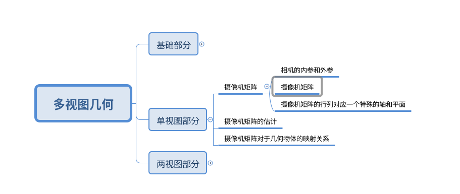
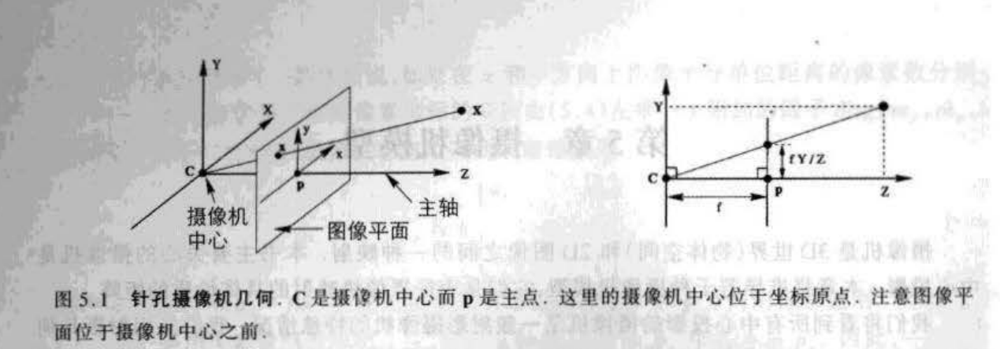
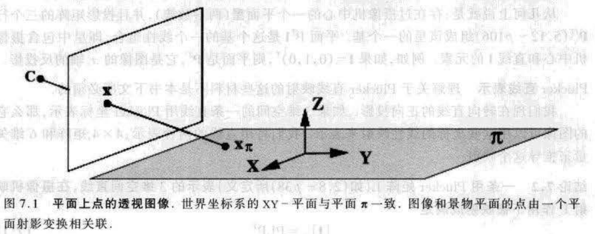

# 一文详解多视图几何（二）————单视图几何

## 写在前面

本文主要总结的就是单视图几何部分啦，整个内容上来讲熟悉SLAM或者SFM的小伙伴们肯定是不算是很难的，但是还是会收获很多，因为平时而言对于一张图片而言其实并没有特别的去关注，一个简单的问题就是一个正方形的砖块为什么在不同角度拍摄的时候就呈现出不同的形状？其实这个问题在上一章我们能猜出一二来：因为整个内参和外参的乘积矩阵内部一定有一个射影变换在。从基础部分我们知道，一个变换是射影变换的充要条件仅仅是矩阵非奇异，这个条件其实很容易满足了。书本在这部分也是把内外参的乘积称为摄像机矩阵，并对该矩阵进行了一些比较深入的剖析。

&nbsp;

---

## 整体架构

依旧给出整体架构，小伙伴们应该可以看到这部分明显少了很多。一方面是内外参大家都比较熟悉，二是因为估计的方法在上一篇中也都给出了说明，因此这里就简单的代过了。

&nbsp;

---

## 摄像机矩阵

在深入之前，首先就是对于摄像机的分类，书中将摄像机分作有限摄像机和无限摄像机。具体而言，有限摄像机的投影中心交于有限远点，即焦距是有限的；而无限远摄像机就是投影交于无穷远点，即焦距是无穷大（仅仅是理论值上的无穷大）；如下图：

&nbsp;

### 摄像机内参矩阵

内参矩阵主要就是小孔成像的理论公式化，如下图：

基本上就是相似三角形的原理，这里主要对其中一些基础概念进行记录：

1. 首先是坐标系的朝向：z 轴朝向摄像机的前方，x 轴朝向摄像机的左侧，y 轴朝向摄像机的上方；
2. Z=f 的平面被称为图像平面或者聚焦平面；
3. 投影中心称为摄像机中心（常说的摄像机的位姿），也称为光心；
4. 摄像机中心到图像的垂线称为主轴，或者主射线；
5. 过摄像机中心平行于图像平面的平面称为摄像机的主平面，这个平面平时可能用不到，但是在后面对摄像机矩阵分析的时候会分析到；

&nbsp;

#### 摄像机坐标系中的投影变换

在摄像机的坐标系中，将一个3D点$P=[X,Y,Z]$投影到图像平面$p=[fX/Z, fY/Z]$（**该平面依旧属于摄像机坐标系，不是图像坐标系**），所以齐次坐标矩阵乘积形式如下：
$$
\left(\begin{array}{c}
X \\
Y \\
Z \\
1
\end{array}\right) \rightarrow
\underbrace{
\left[\begin{array}{c}
f X/Z \\
f Y/Z \\
1
\end{array}\right] \rightarrow
\left[\begin{array}{c}
f X \\
f Y \\
Z
\end{array}\right]}_{齐次坐标}=\left[\begin{array}{lll}
f & &  & 0 \\
& f &  & 0\\
& & 1 & 0
\end{array}\right]\left(\begin{array}{c}
X \\
Y \\
Z \\
1
\end{array}\right) \tag{1}
$$
&nbsp;

#### 在图像坐标系中的投影变换

公式（1）我们获得了在摄像机坐标系下图像平面的点的坐标$p_{cam}=[fX/Z, fY/Z,1]^{T}$，将摄像机坐标系的点投影到图像坐标系需要添加主点偏置，即把图像的中心点从图像的中心移动到图像的左上角（这是在倒影的前提下！），公式如下：
$$
\left(\begin{array}{c}
X \\
Y \\
Z \\
1
\end{array}\right) \rightarrow
\underbrace{
\left[\begin{array}{c}
f X/Z + p_x \\
f Y/Z + p_y \\
1
\end{array}\right] \rightarrow
\left[\begin{array}{c}
f X+Z p_x \\
f Y+Z p_y \\
Z
\end{array}\right]
}_{齐次坐标}=
\left[\begin{array}{lll}
f & & p_x & 0 \\
& f & p_y & 0\\
& & 1 & 0
\end{array}\right]\left(\begin{array}{c}
X \\
Y \\
Z \\
1
\end{array}\right) \tag{2}
$$
&nbsp;

#### 尺度变换

公式（1）（2）中的图像坐标系的物理单位其实都和焦距的物理单位一致，通常是mm为单位，于是需要转换为像素pix单位，所以在 x 轴和 y 轴方向通常还有两个变换因子：$\mathrm{m_x, m_y}$，与焦距合在一起就是 $\mathrm{f_x=f m_x, f_y=f m_y}$。

综上：最终将相机坐标系的点$P_{cam}$投影到图像坐标系的点$p_{im}$的齐次坐标矩阵乘积形式为：
$$
\left(\begin{array}{c}
X \\
Y \\
Z \\
1
\end{array}\right) \rightarrow
\underbrace{
\left[\begin{array}{c}
f_x X/Z + p_x \\
f_y Y/Z + p_y \\
1
\end{array}\right] \rightarrow
\left[\begin{array}{c}
f_x X+Z p_x \\
f_y Y+Z p_y \\
Z
\end{array}\right]
}_{齐次坐标}=
\underbrace{
\left[\begin{array}{lll}
f_x & & p_x & 0 \\
& f_y & p_y & 0\\
& & 1 & 0
\end{array}\right]}_{内参矩阵K}\left(\begin{array}{c}
X \\
Y \\
Z \\
1
\end{array}\right) \tag{3}
$$
&nbsp;

### 有限射影摄像机

为了增加一般性，通常在内参矩阵 K 中添加扭曲参数 s，于是内参矩阵变为：
$$
\mathrm{K} =\left[\begin{array}{lll}
f_x & s & p_x \\
& f_y & p_y\\
& & 1 
\end{array}\right] \tag{4}
$$
通常情况下并不考虑扭曲参数的影响，所以一般都看作是0。所以对于内参矩阵而言，其自由度为5。

&nbsp;

### 相机的外参

相机的外参就是我们平时使用的比较多的世界系到相机坐标系的变换矩阵了，主要由旋转矩阵 R 和平移矢量 t 组成，书中主要使用旋转矩阵的逆和相机在世界坐标系下的位置表示（其实都一样），如下：
$$
\mathbf{T_{w}^{c}} = \mathrm{[R_{w}^{c}|t_{w}^{c}]}=\mathrm{[R_{w}^{c}|-R_{w}^{c}C_{c}^{w}]}=\mathrm{R_{w}^{c}[I|-C]} \tag{5}
$$
&nbsp;

### 摄像机矩阵

在本书中，作者把整个相机的内外参合在一起称为摄像机矩阵，全书中使用 $\mathrm{P}$ 表示，结合上面的分析，摄像机矩阵 $\mathrm{P}$ 的表达式为：
$$
\mathrm{P} = \mathrm{K[R|t]} = \mathrm{KR[I|-C]} = \mathrm{M[I|-M^{-1}p_4]} \tag{6}
$$
将整个内外参写在一起的优势就是能直接对世界坐标系下的点进行直接的线性投影变换到图像坐标系下，而不用管具体的内外参，而一旦求解出了相机矩阵之后，可以通过对公式中的 M 矩阵进行 RQ 分解得到内参矩阵和外参矩阵。这个方法通常在标定的算法使用，实际的实时定位中并不常用。

> 摄像机矩阵的表示形式也能很好的表达出为什么世界坐标系下的点经过了相机成像之后会有射影变换的效果，因为 M 矩阵本身是一个射影变换。

&nbsp;

----

## 射影摄像机

这一节主要就是对摄像机矩阵进行更细致的分析。首先确定一些符号：
$$
\mathrm{P}=\begin{bmatrix} P_{11} & P_{12} & P_{13} & P_{14} \\ P_{21} & P_{22} & P_{23} & P_{24} \\ P_{31} & P_{32} & P_{33} & P_{34} \end{bmatrix} = \begin{bmatrix} P_{1}^{T} \\ P_{2}^{T} \\ P_{3}^{T} \end{bmatrix} = \begin{bmatrix} p_{1} & p_{2} & p_{3} & p_{4} \end{bmatrix} \tag{7}
$$
其中：

1. 列向量使用小写的字母表示，一共有四个列向量；
2. 行向量使用大写的字母加转置表示，一共有三个行向量；

### 列向量

列向量的现实意义表示在**世界坐标系**下的一些特殊的点在**图像坐标系**下的像，具体而言：

1. 前三个列向量 $p_{i},i=1,2,3$ 表示世界坐标系X Y Z三个轴的无穷远点在图像上的 **像**；
2. 最后一个列向量 $p_4$ 表示世界坐标系原点在图像上的 **像**；

以上结论均可以将世界坐标系的特殊点代入得到，特别的，因为每个列向量的最后一项不一定为1，因此需要最后需要转为齐次坐标。

### 行向量

行向量的现实意义表示在**世界坐标系**下一些特殊的面，具体而言：

1. 假设有世界坐标系的点 X，其满足 $P_{i}^{T}X=0$，以第一个行向量为例，则该点在图像坐标系的 **像** 为 $\mathrm{x_{im}=[0, y, w]}^{T}$，所以该向量表示图像坐标系下 x=0 的平面在世界坐标系下的 **原像**；

2. 对于第三个行向量，按照上面的分析方法，明显看到其 **像** 为$\mathrm{x_{im}=[x, y, 0]}^{T}$，一方面表示在图像坐标系下无穷远点的集合，另一方面表示该平面在世界坐标系下是过相机中心且平行于成像平面的平面（注意是在世界坐标系下哦，四维变量），一般称为主平面；

   

### 主点

回忆上面在做针孔相机的内参矩阵的时候添加了主点偏置，其中主点和这里的主点相对应。

主点定义为过相机中心且垂直于主平面方向的射线（称为主轴）与图像平面的交点称为主点。

因为行向量 $P_{3}^{T}=[p_{31}, p_{32}, p_{33}, p_{34}]^{T}$ 表示主平面，那么根据 $\mathrm{IP^{3}}$ 平面的定义，前三个变量表示平面的法线方向，所以主轴的方向就得到了，即$[p_{31}, p_{32}, p_{33}]^{T}$。

又因为主轴上所有的点在图像坐标系上的 **像** 都是一个点，于是使用无穷远点在图像坐标系上的投影就能得到主点，即：
$$
\mathrm{x_0}=\mathrm{[M|p_4]}\begin{bmatrix}p_{31} \\ p_{32} \\ p_{33} \\ 0 \end{bmatrix} = \mathrm{M}\begin{bmatrix}p_{31} \\ p_{32} \\ p_{33} \end{bmatrix} = \mathrm{M}\mathrm{m} \tag{8}
$$
所以一旦有了相机矩阵 P，其实但从它的前3x3矩阵中就能得到主点的值了。

> 其实在前面讲到，一旦有了相机矩阵 P，也可以通过对 M 矩阵进行 RQ 分解得到内参矩阵 K，那么此时 K 中的主点偏置和公式（8）算出来的一致吗？笔者把书中给出的例子使用公式（8）计算了一下，结果完全一致。

&nbsp;

----

## 摄像机矩阵P的计算

又涉及到矩阵的计算了，虽然维数变多了，但是依旧还是可以用单视图几何中的矩阵估计方法，所以重点依旧是：

1. 数据的归一化；
2. 误差模型的选择：代数误差和几何误差，这里就不涉及到Sampson误差了；
3. 最小化误差；
4. 受限相机矩阵的估计，该部分并不是一个常规的方法，而是更具有针对性的一种计算方法；

不过这里面特别需要注意的是：**由于相机矩阵是几个特殊矩阵的乘积，所以在解问题的时候，约束的添加显得尤为谨慎，不能像之前的方法比较暴力的添加约束**；

先描述问题的背景：假设给定了了3D->2D对应的集合 $\mathrm{X^{w}}$ -> $\mathrm{x^{im}}$ ，求解相机矩阵P。

### 数据的处理——归一化

数据处理部分其实和之前的方法也比较像，这里涉及到两个点集：

- 对于图像点，和单视图几何中的方法一样，假设$\mathrm{\tilde x ^{im} = Tx^{im}}$；

- 对于空间点， 方法类似，不过要把均方差归一化到$\sqrt{3}$，假设 $\mathrm{\tilde X ^{w} = UX^{w}}$ 。

- 但是需要注意一些特别的情况：比如在点集空间中，有一些点距离原点确实很远或者很近，如果强行把它的均方差归一化到 $\sqrt{2}$ 或者 $\sqrt{3}$，那么势必会影响整个点集的分布，导致数据处理的失误；所以此时需要更好的归一化方法，书中给出一种可行的方法如下：

  个人的理解是该方法通过调节齐次项来缩放离群点的权重，不过由于 w 的表达式是一个非线性的表达式，如何还原是一个比较大的问题。

  

&nbsp;

### 误差模型的选择

#### 代数误差

首先祭出映射方程：
$$
\mathrm{x} = \begin{bmatrix}x \\ y \\ w \end{bmatrix} = \mathrm{PX} =  \begin{bmatrix} \mathrm{P^{1}X} \\ \mathrm{P^{2}X} \\ \mathrm{P^{3}X} \end{bmatrix} \tag{9}
$$
所以按照代数距离 $\mathrm{x}\times \mathrm{PX} = 0$ 的定义：
$$
\underbrace{ \left[\begin{array}{ccc}
\mathbf{0}^{\boldsymbol{\top}} & -w_{i} \mathbf{X}_{i}^{\top} & y_{i} \mathbf{X}_{i}^{\top} \\
w_{i} \mathbf{X}_{i}^{\top} & \mathbf{0}^{\mathrm{T}} & -x_{i} \mathbf{X}_{i}^{\top} \\
-y_{i} \mathbf{X}_{i}^{\top} & x_{i} \mathbf{X}_{i}^{\top} & \mathbf{0}^{\top}
\end{array}\right]}_{\mathbf{A_i}}
\underbrace{\left[\begin{array}{c}
\mathbf{(P^{1})^{T}} \\
\mathbf{(P^{2})^{T}} \\
\mathbf{(P^{3})^{T}}
\end{array}\right]}_{\mathbf{x}}=\mathbf{0} \tag{10}
$$
可见和基础部分中的DLT方法一致！即一个点对可以提供2个约束，整个矩阵的未知数为12，去除尺度不确定性为11，因此需要至少6个点对就可以求解出来相机矩阵P。

值得注意的是，DLT在求解 $\mathrm{Ax=0}$ 的时候有一个约束的假设：$\mathbf{|x|=1}$，但是正如前面所说的，这个约束添加在这里真的是最优的吗？其实约束的添加这里有两种：

1. 添加约束条件 $\mathrm{|p|=1}$，其中 $\mathrm{p}$ 表示摄像机矩阵组成的列向量；
2. 添加约束条件 $\mathrm{|\hat{p}^{3}|=1}$，其中 $\mathrm{\hat{p}^{3}}$ 表示摄像机矩阵的 P[3, 0:3] 组成的向量，该部分之所以为1是因为该部分本质上是 KR 的乘积，其向量模为1； 

诚然，上述的约束中，约束2其实是更加合理的，但是实际上，使用约束1不仅会比较方便，而且求解出来P之后也可以用RQ分解得到可靠的内参矩阵和旋转矩阵。

#### 几何误差

几何误差主要就用于迭代的方法中了，主要作为目标函数进行优化从而求解出最优的相机矩阵P；
$$
\min _{\mathrm{P}} \sum_{i} d\left(\mathbf{x}_{i}, \mathbf{P} \mathbf{X}_{i}\right)^{2} \tag{11}
$$
同样，这里也涉及到约束添加的问题，由于该小节介绍的都是比较general的方法（也就是待估计量就是一个矩阵，不做实际意义上的划分），所以该部分并没有什么特别好的约束添加，在后面受限相机的估计中会看到，当估计量不再采用一视同仁，而是有其实际意义的时候，此时添加约束就“名正言顺”了。

&nbsp;

### 最小化误差

最小化误差的方法就比较常规了，使用L-M或者Dogleg都可以，这里给出黄金标定算法的示意图：

&nbsp;

### 受限相机的估计

小节1、2、3在估计相机矩阵的时候，总体而言是把整个矩阵拉成向量进行求解，然而由于相机矩阵来说，其实它的组成部分都是特殊的矩阵，本小节就是按照特殊矩阵的乘积来考虑，进而有一些特别的方法可以利用。

#### 对于相机内参

给出标准的相机内参的形式：
$$
\mathrm{K}=\left[\begin{array}{rrr}
\alpha_{x} & s & x_{0} \\
& \alpha_{y} & y_{0} \\
& & 1
\end{array}\right] \tag{12}
$$
书中认为成像是正方形的，因此$\alpha_{x} = \alpha_{y}$，同时一般的，扭曲因子为0， $s = 0$。所以内参的未知量由5个减少为3个。

#### 对于相机外参

相机外参一般是姿态 R 和位置 t ，未知量均为3个，假设姿态由欧拉角（yaw，pitch，roll） $[\varphi, \theta, \phi]$ 表示，所以以XYZ轴的顺序进行外旋表示的话，因为是外旋表示，所以该矩阵表示相机在世界系下的姿态：

$$
\mathrm{R}=\begin{bmatrix}
c(\varphi) c(\theta) & c(\varphi)s(\theta)s(\phi)-c(\phi)s(\varphi) & s(\varphi)s(\phi)+c(\varphi)s(\theta)c(\phi) \\
c(\varphi)s(\theta) & c(\varphi)c(\phi)+s(\varphi)s(\theta)s(\phi) & c(\phi)s(\varphi)s(\theta)-c(\varphi)s(\phi) \\
-s(\theta) & c(\theta)s(\phi) & c(\theta)c(\phi)
\end{bmatrix} \tag{13}
$$
位移也同样使用相机在世界系下的表示：
$$
\mathrm{t} = \begin{bmatrix}x & y & z\end{bmatrix}^{T} \tag{14}
$$
所以相机外参的未知数为6个。

#### 相机参数的估计

根据上面的分析我们能知道：对于特殊的摄像机矩阵而言，实际的参数空间并不是简单的12个数，而是9个有特殊意义的变量。所以假设估计的参数为$\mathrm{X} = [\mathrm{a_x,x0, y0, \varphi, \theta, \phi, x, y, z}]^{T}$，则有一个非线性函数$g(\mathrm{X})$，使得这个参数映射到12维的矩阵参数向量中，该映射的公式如下：
$$
g(\mathrm{X})=
\begin{bmatrix}
ax*cos(\theta)*cos(\varphi) - x0*sin(\theta) \\ 
ax*(sin(\theta)*sin(\phi)*cos(\varphi) - sin(\varphi)*cos(\phi)) + x0*sin(\phi)*cos(\theta) \\ 
ax*(sin(\theta)*cos(\phi)*cos(\varphi) + sin(\phi)*sin(\varphi)) + x0*cos(\theta)*cos(\phi) \\ ax*x + x0*z \\
ax*sin(\varphi)*cos(\theta) - y0*sin(\theta) \\ 
ax*(sin(\theta)*sin(\phi)*sin(\varphi) + cos(\phi)*cos(\varphi)) + y0*sin(\phi)*cos(\theta) \\ 
ax*(sin(\theta)*sin(\varphi)*cos(\phi) - sin(\phi)*cos(\varphi)) + y0*cos(\theta)*cos(\phi) \\ ax*y + y0*z \\
-sin(\theta) \\ 
sin(\phi)*cos(\theta) \\ 
cos(\theta)*cos(\phi) \\ 
z
\end{bmatrix} \tag{15}
$$
于是上面通用的估计方法中的误差函数都可以把矩阵参数都换做公式（15）表示的非线性公式，之后使用非线性优化的方法进行最优值的求解。

> ps: 除了上面介绍的这种比较直接暴力的仅仅优化9个变量的方法，还有一种方法是通过对优化的目标函数添加软约束来达到参数估计方法，感兴趣的朋友可以去书中了解了解，因为这部分不难，这里就不再赘述。

&nbsp;

---

## 进一步讨论单视图几何

如果说上两个部分是在讨论内外参作为整体的摄像机矩阵的性质和估计，那么这一部分其实又把整个摄像机矩阵拆解开来，特别的，因为我们在讨论单视图几何，所以该部分更加关注的是位置变化之外的一些场景和性质，比如：

- 同一位置上的摄像机拍出的不同图像由一个平面射影相关联；
- 无穷远平面上的几何实体的图像均与摄像机的位置无关；

前者的位置无关源自于固定了摄像机的位置，而后者的位置无关则源于无穷远平面的特殊性。

>  PS: 这里讨论的无穷远平面是世界坐标系的无穷远。

### 摄像机矩阵对于几何实体的映射

这里的几何实体就是点线面了，因为点的映射太常规了，所以直接进行线和面的映射分析：

1. **摄像机矩阵对于平面的映射**：整体的映射如下图：

   

   可以看到，因为是对一个平面的点进行映射，所以世界坐标系直接选择在了平面上，且X-Y轴组成的平面平行于平面 $\pi$，且Z=0，因此映射方程为：
   $$
   \mathrm{x=PX}=
   \begin{bmatrix}
   p_1 & p_2 & p_3 & p_4
   \end{bmatrix}
   \begin{bmatrix}
   X \\ Y \\ 0 \\ 1
   \end{bmatrix}=
   \begin{bmatrix}
   p_1 & p_2 & p_4
   \end{bmatrix}
   \begin{bmatrix}
   X \\ Y \\ 1
   \end{bmatrix} \tag{16}
   $$
   于是原本的映射变为了一个射影变换映射了，这个符合基础部分的解释，因为 Z 轴为0，基本上可以认为是两个2D平面间的射影变换了。

2. **摄像机矩阵对于线的映射**：这点和点的映射类似，不过因为线的表示有很多，简单的就是两点之和为线，这个就不赘述了，比较简单；其次就是普朗克表示法，这部分的推导比较麻烦，具体可以看笔者之前的推导笔记https://zhuanlan.zhihu.com/p/149028042

3. **摄像机矩阵对于二次曲线的反射投影**：在图像上的二次曲线反投影之后在空间形成一个射线锥，如下图：

   

   该锥面的方程为 $\mathrm{Q_{co}=P^{T}CP}$，可以用点在曲线上的方程解释：
   $$
   \mathrm{x^{T}Cx}=\mathrm{(PX)^{T}CPX}=\mathrm{X^{T}}\underbrace{\mathrm{P^{T}CP}}_{\mathrm{Q_{co}}}\mathrm{X} \tag{17}
   $$

### 摄影机矩阵对于无穷远平面的几何实体的映射

这个部分是比较有意义的，因为在无穷远平面上的几何实体的投影是与位置无关的，甚至二次曲线的投影是与旋转也无关的，只与内参矩阵有关。所以在这个部分，其实书中是把整个矩阵又拆解开来了，重点讨论了如果我们得到了无穷远平面上的几何实体之后，我们能恢复出摄像机的内外参的哪些部分（其实就是要么是旋转，要么是内参矩阵）。

##### 内参矩阵对于几何实体的反向投射

这里引申出两个先导结论，用于后面的推理：

1. 摄像机内参矩阵 K 是 x 与摄像机的欧式坐标系下测量的射线反向 $\mathrm{d=K^{-1}x}$ 之间的一个仿射变换。
2. 一条图像直线 $\mathbf{I}$ 确定一张过相机中心的平面，在摄像机的欧式坐标系下，该平面的法线方向为 $\mathbf{n=K^{T}I}$。

上面的结论也比较容易证明，这里不再赘述，值得注意的是上述公式的左边变量均是图像坐标系的，而不是摄像机坐标系！

##### 绝对二次曲线在图像上的像

在基础部分中，我个人觉得比较有意思的是虚圆点及其衍生出来的绝对二次曲线，当然当时是在2D射影空间下的推导，这次我们来推广到3D射影空间（因为这里的绝对二次曲线是在3D空间中）：

1. 2D虚圆点的定义是 **圆周** 与 **无穷远直线** 的交点，推广到3D射影空间中就是 **球体** 与 **无穷远平面** 的交点，在3D射影空间中，无穷远平面表达式为 [0, 0, 0, 1]，所以虚圆点的表达式为：
   $$
   \begin{cases}
   X^2+Y^2+Z^2=0 \\
   W=0
   \end{cases} \tag{18}
   $$

2. 由公式（18）可以推导出绝对二次曲线为：
   $$
   \begin{bmatrix}
   X \\ Y \\ Z
   \end{bmatrix}^{T} \Omega_{\infty} \begin{bmatrix}
   X \\ Y \\ Z
   \end{bmatrix} = 0 \Rightarrow \Omega_{\infty} = \mathbf{I} \tag{19}
   $$

3. 

在上述推广中：

- 我们并没有求出实际的虚圆点是什么，仅仅利用了虚圆点在绝对二次曲线上这个特点（因为实际上我们也不需要知道虚圆点是什么）；
- 这个虚圆点和绝对二次曲线的其实都应该是4维向量，只不过齐次项是0；

那么我们来看看该绝对二次曲线在图像系下的 **像** 是怎么样的：

- 假设虚圆点是 $\mathrm{[X, Y, Z, 0]^{T}}$，所以它在相机坐标系下的 **像** 为：
  $$
  \mathrm{x_{\infty}} = \mathrm{KR[I|-C]}\begin{bmatrix}X \\ Y \\ Z \\ 0\end{bmatrix} = \mathrm{KR}\begin{bmatrix}X \\ Y \\ Z\end{bmatrix} \tag{20}
  $$

- 于是绝对二次曲线的 **像** 亦满足：
  $$
  \mathrm{x_{\infty}^{T}}w\mathrm{x_{\infty}}=
  (\mathrm{KR}\begin{bmatrix}X \\ Y \\ Z\end{bmatrix})^{T}w(\mathrm{KR}\begin{bmatrix}X \\ Y \\ Z\end{bmatrix})=0 \tag{21}
  $$

- 展开看到中间部分：
  $$
  (\mathrm{KR})^{T}w(\mathrm{KR})=\Omega_{\infty} \Rightarrow w = (\mathrm{KR})^{-T}(\mathrm{KR})^{-1} \Rightarrow w=\mathrm{K^{-T}K^{-1}} \tag{22}
  $$

于是我们明显看到，这个绝对二次曲线的 **像** 居然和外参一点儿关系都没有，仅仅取决于内参！而且一个很有意思的现象是：在基础部分我们有一个在任何射影空间都成立的量角公式如下：
$$
\begin{aligned}
cos(\theta)&=\frac{\mathbf{x}_{1}^{\top} \omega \mathbf{x}_{2}}{\sqrt{\mathbf{x}_{1}^{\top} \omega \mathbf{x}_{1}} \cdot \sqrt{\mathbf{x}_{2}^{\top} \omega \mathbf{x}_{2}}} \\
&=\frac{(\mathbf{K^{-1}x}_{1})^{\top} (\mathbf{K^{-1}x}_{2})}{\sqrt{\mathbf{x}_{1}^{\top} \omega \mathbf{x}_{1}} \cdot \sqrt{\mathbf{x}_{2}^{\top} \omega \mathbf{x}_{2}}}
\end{aligned} \tag{23}
$$
可以看到，在图像坐标构成的射影空间（2D射影空间）下的两向量的夹角就是该像素点与摄像机中心构成的射线之间的夹角，这点是完全复合预期的，同时也证明我们求解的绝对二次曲线的 **像** 是没有问题的。

公式（23）由下图表示：

&nbsp;

##### 消影点和消影线（重要且有意思）

上一部分我们讨论了很多内参矩阵对于几何实体的映射，那么这部分主要我们主要关注的点就是如何在已知内参矩阵的情况下，从无穷远点和无穷远线恢复出外参矩阵（其实因为都在无穷远处，与位置无关了，因此只能恢复出旋转了）。

**由消影点求解相机的姿态**

假设在 **世界坐标系** 中有一条直线，表达式为$\mathrm{P_{A}+\lambda D}$，其中 D 是直线的方向（显然方向向量 D 满足 $\mathrm{D=[x,y,z,0]^{T}}$ 且 $\mathrm{x^{2}+y^{2}+z^{2}=1}$ ），假设直线无限延伸至无穷远处，其在无穷远处的点投影到 **图像坐标系** 的表达式为：
$$
\begin{aligned}
\mathrm{p_{\infty}} &= \mathrm{ \mathop{limit}_{\lambda->\infty} ((KRP_{A} + t) + \lambda KRD) } \\
&= \mathrm{ \mathop{limit}_{\lambda->\infty} (\frac{ KRP_{A} + t}{\lambda} + KRD) } \\
&= \mathrm{KRD = d}
\end{aligned} \tag{24}
$$
公式（24）引申出一个特别强势的结果：即3D射影空间系下直线的消影点在图像坐标系的 **像** 仅仅取决于直线的方向、相机的姿态以及内参矩阵，如下图：

考虑如下场景：

假设天花板上有两条线A B，相机从粉色的状态移动到蓝色的状态，那么：

0. **世界坐标系** 和水平状态下的 **相机坐标系** 重合，且此时相机的光轴方向与A B线方向平行；

1. 紫色相机的初始姿态是水平的，即姿态为单位阵，由公式（24）可知，A B线的无穷远点在 **图像坐标系**下的 **像** 为$\mathrm{v_1 = KD}$，根据图中的**世界坐标系**所示，A B线的方向向量为 $\mathrm{D=[0,0,1]^{T}}$（其在 **相机坐标系** 下的方向向量也是一样的），显然该消影点在图像正中心——即所有在 **相机坐标系** 下与光轴平行的直线，它们的消影点一定都在图像的中心；

2. 考虑蓝色的相机，由于旋转的发生，此时A B线在  **相机坐标系** 下的方向已经不和光轴平行，因此他们的消影点并不在图像的中心，根据（24）可知，其消影点的位置为 $\mathrm{v_2=KRD}$，联立两个消影点可得：
   $$
   \mathrm{D}=\frac{\mathrm{K^{-1}v_1}}{\|\mathrm{K^{-1}v_1}\|}=\mathrm{R^{T}\frac{K^{-1}v_2}{K^{-1}v_2}} \Rightarrow \mathrm{d_2} = \mathrm{Rd_1} \tag{25}
   $$
   其中 $\mathrm{d_1}, \mathrm{d_2}$ 是图像消影点反射到 **相机坐标系** 下的单位向量；

其实在上面这个例子中我们不难发现，假设仅有pitch角发生了变化，那么 $d_1, d_2$ 两个向量理论值为 $d_1=[0,0,1]^{T}, d2=[x,0,z]^{T}$，由因为仅有pitch角，所以旋转矩阵为：
$$
\mathrm{R}=\begin{bmatrix}cos(\theta) & 0 & sin(\theta) \\ 0 & 1 & 0 \\ -sin(\theta) & 0 & cos(\theta)\end{bmatrix} \tag{26}
$$
代入到公式（25）就可以知道 $\mathrm{x=sin(\theta)}, z=cos(\theta)$，进而求得pitch的角度，当然也可以通过方向余弦矩阵代入求得三个欧拉角，但是实际中通常会把问题简单化到仅剩下一个角待求求解的地步。

**消影线**

消影线与消影点同理，是一个平面延伸到无穷远处与无穷远平面相交的直线的投影。可以借鉴上面的消影点的分析，假设有有直线位于平面上，那么该直线在无穷远处的交点仅仅取决于方向向量 d，且投影点在 **图像坐标系** 下面的点为 $\mathrm{Kd}$，假设有无穷多条这样的直线，那么在空间上，所有线与无穷远平面的交点的投影其实就是 **平行于平面且过相机中心的平面与图像平面的交线**， 如同上面的分析，这些无穷点仅与直线的方向向量相关，但是对于平面，我们通常将其与法向量 $\mathbf{n}$ 联系起来。如下图：

有了 $\mathbf{n}$ 之后也很容易就能求得 $\mathbf{I}$，根据3D空间点在面上公式和2D空间点在线上的公式可知，在 **相机坐标系下**：
$$
\begin{cases}
\mathrm{X^{T}n = 0} \\
\mathrm{x^{T}I = 0} \\
\mathrm{x=KX}
\end{cases} \Rightarrow \mathrm{X^{T}K^{T}I} = \mathrm{X^{T}n} = 0 \tag{27}
$$
所以消影线为$\mathrm{I_{\infty}=K^{-T}n}$。

&nbsp;

----

## 总结

整个第二部分其实算是一个U型的结构，先将内参矩阵和外参矩阵合并为摄像机矩阵：

- 因为摄像机矩阵直接联系了世界点和图像点，因此其行向量和列向量都对应了一些特殊的平面；
- 摄像机矩阵也解释了为什么一个正方形的物体在不同角度拍摄之后会形成不同的形状，因为内参矩阵和旋转矩阵会形成一个射影矩阵；

其次就讲了如何根据匹配关系求解摄像机矩阵，因为本质上和单应矩阵（射影变换部分）的情形很相似，所以依旧是先代数解再优化解的套路，只不过在数据处理部分的归一化稍显不同，因为涉及到了3D空间点，不像单应矩阵中分布再不均匀也不可能大出一个图像的情形，3D空间点的分布恶劣的情况下会差得多。

最后作者进一步讨论了常规点线面和无穷远点线面在 摄影机矩阵 映射下的表现，通过推导我们发现：

- 如果摄像机拍摄的点都处于同一平面上，那么此时 摄像机矩阵 对于面上点的映射其实是一个射影变换；
- 3D空间中的线由于表达式比较复杂，推导也比较多，因此放在了另一个文章中进行了总结，简而言之，3D空间中的线的映射变换矩阵也是由 摄像机矩阵 的元素组成；
- 对于无穷远平面上的几何实体（其实也就点和线，注意这里没有面），它们在图像坐标系中的 **像** 仅仅与旋转和内参矩阵有关，特别的，绝对二次曲线甚至与旋转没有关系，这个特征也使得我们可以通过 找到空间中特殊几何关系的几何实体的 **像**，从何反算 旋转矩阵 或者 旋转矩阵与内参矩阵的乘积 的能力。

当然，这一章节还讲了很多关于图像畸变以及通过无穷远点和线求解相机内参矩阵的方法，笔者这里没有介绍的原因主要是因为：

- 图像畸变其实完全可以作为一个更大的内容去研究总结，安插在这里太过委屈；
- 相机的内参矩阵以及畸变系数也有更加成熟和好的方法去求解，当然有些时候因为标定场景的限制不得不使用单张图像进行内参的获取时，本章节的一些内容还是值得参考的，但是在笔者看来，本章节给出的单张图像的内参计算其实并不实用，主要还是因为没有考虑到畸变的存在；

