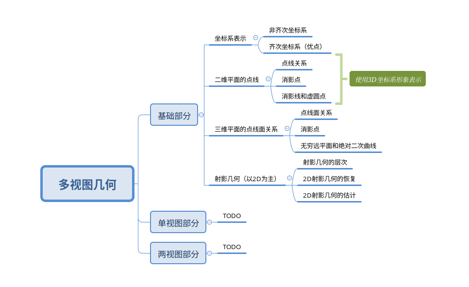
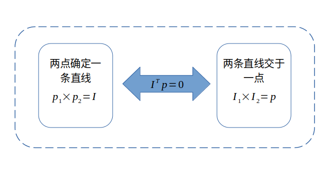
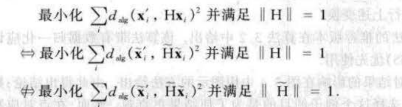
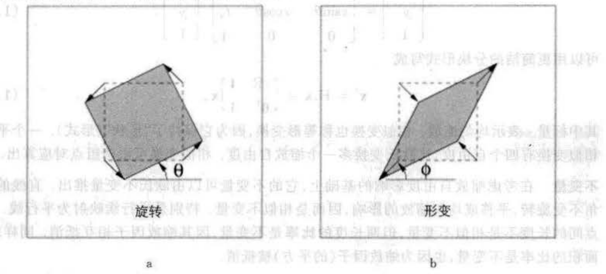
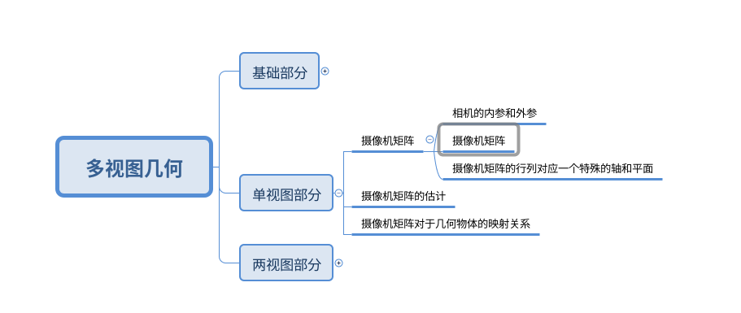

# 第二章——2D射影几何和变换

## 2D射影空间下的点和线的表示

### 2D射影空间下的线的表示

2D射影空间的线依保持线在2D平面下的参数表示，为：
$$
\mathbf{I}=\begin{bmatrix}
a\\ b\\c
\end{bmatrix} \tag{1}
$$
&nbsp;

### 2D射影空间下的点的表示

2D射影空间由一个二维点的齐次坐标表示：如2D欧式坐标下的[x, y]在射影空间下的表示为：
$$
\mathbf{p}=\begin{bmatrix}
x \\ y\\ 1
\end{bmatrix} \tag{2}
$$
这样表示的优点为：

1. 可以自然的表示无穷远点；
2. 将点和线的维度在2D射影空间下统一，均为3维向量；
3. 方便进行矩阵（向量）运算；

&nbsp;

### 点与线的关系

对于2D射影空间（齐次坐标系）下的点与线，有以下的关系：

- 点 x 在线 l 上当且仅当$\mathbf{x^Tl=0}$;
- 过两点 x1 和 x2 的直线为$\mathbf{l=x1 \times x2}$;
- 两条线段 l1 和 l2 的交点为 $\mathbf{x = l1 \times l2}$;

&nbsp;

### 理想点与无穷远直线

在点的表示中讲到，齐次坐标能够很自然的表示无穷远点（理想点），表示方法如下：
$$
\mathbf{p_{\infty}}=\begin{bmatrix}x\\y\\0\end{bmatrix} \tag{3}
$$
其在**非齐次坐标系**下的值为：$\mathbf{p_{\infty}}=[x/0, y/0]^{T}$，值得注意的是，该点不会映射到任何的欧式坐标上（个人的理解为，如果在欧式坐标表示无穷远点，那么两个坐标不一定都要具有无穷大的坐标值）！在数值意义下仅仅表示该点具有无穷大的坐标值！

有了无穷远点的定义之后，无穷远线也就呼之欲出了：**在2D射影空间里，所有的无穷远点都在无穷远直线上！** 因此如果无穷远点的坐标如公式（3）所示，那么无穷远直线必然与所有的无穷远点的关系均为$\mathbf{I_{\infty}^Tx_{\infty}}=0$，所以无穷远直线为：
$$
\mathbf{I_{\infty}}=\begin{bmatrix}0\\0\\1\end{bmatrix} \tag{4}
$$
&nbsp;

### 射影空间的3D表示

这部分是笔者认为比较重要的部分，因为该部分比较形象，且后面有一些理论配合着该部分能很快的被理解。

在2D射影空间中，所有的点的坐标均为三维坐标，如果抛弃无穷远点的话，所有的点都位于x3=1的平面上，因此可以用三维坐标系中的x3=1的平面来表示所有点的分布平面，如下：

根据无穷远点的定义，所有的无穷远点均位于线x3=0的x-y平面上，由于点在线上的定义为两个向量的点积为0，在三维坐标系中等价于两个三维向量相互垂直，因此无穷远直线就是z轴，方向向量为[0,0,1]。

&nbsp;

-----

## 2D射影空间下的变换

2D射影空间的变换主要研究的是点与点的变换关系，下面按照书中介绍有：

- 射影变换和透视变换
- 等距变换
- 相似变换
- 仿射变换

### 射影变换（Projective transformation）

射影变换算是射影空间中覆盖范围最广泛的**线性变换（这里不考虑非线性变换）**了，该变换的要求也很简单：射影变换是$\mathbf{IP^2}$到$\mathbf{IP^2}$自身的一种满足下列条件的可逆映射：三点x1，x2，x3共线当且仅当h(x1)，h(x2)，h(x3)也共线，因此射影变换也被称之为保线变换，但是我们更熟悉的名字叫做**单应变换**。

射影变换自身组成了一个映射群：

​	A. 射影变换的逆是射影变换；

​	B. 两个射影变换的复合也是射影变换；

射影变换的一般形式为：
$$
\mathbf{x^{\prime}}=\begin{bmatrix}x1^{\prime}\\x2^{\prime}\\x3^{\prime}\end{bmatrix}=
\begin{bmatrix}h_{11}&h_{12}&h_{13}\\h_{21}&h_{22}&h_{23}\\h_{31}&h_{32}&h_{33}\end{bmatrix}
\begin{bmatrix}x1\\x2\\x3\end{bmatrix}=\mathbf{H_{P}x}  \tag{5}
$$
其中H就是我们熟悉的单应性矩阵了，这里它的自由度为8，是一个齐次矩阵。

结合上面射影空间的3D表示，我们很容易发现：其实单应性矩阵在三维坐标系下与其中x3=1平面上的点进行乘积的话就是对这些点进行了整体的线性变换！换一种说法就是把x3=1这个平面进行了线性变换！如下图：

透视变换是在射影变换的基础上添加了一些约束得到的一种子变换，MVG书中对于透视变换仅仅是一笔带过的讲了一下，笔者认为主要是该变换还不足够特别到单独拿出来讲，因此一般情况下除了下述的几个特别变换外，基本都使用射影变换。

相较于射影变换，透视变换增加了对于匹配点连线交点的约束，即所有的匹配点的连线交点均交于中心投影的点。这个特点其实给我们提供了两点信息：

- 经过透视变换之后的所有点都必须大于0，否则从原点射出的射线不可能交于变换之后的平面；
- 经过透视变换之后的点与原先点的连线和其他的连线必须是相交的；

因此书中说对于透视投影，整个自由度为6；

> PS: 当把2D射影变换当做是一个线性变换的时候，笔者就比较清晰的明白了为什么说当所有点处于一个平面的时候使用单应性矩阵（射影变换）进行初始化比较好——因为当两个像（图像点）的原像（空间点）都处于三维空间中的同一平面上时，那么其实两对**原像和像之间（3D-2D点对）**的射影变换复合成了**两个像（2D-2D）**的射影变换（单应性矩阵），如下图：
>
> 
>
> 如果原像不在同一平面上，那么原像和像的匹配就不能构成射影变换。

&nbsp;

### 等距变换（Equidistant transformation）

等距变换如同名字所述，对于点与点之间的距离是不会修改的，只是对点的位置进行了旋转和平移；

等距变换的公式如下：
$$
\mathbf{x^{\prime}}=\begin{bmatrix}x1^{\prime}\\x2^{\prime}\\1\end{bmatrix}=
\begin{bmatrix}\xi cos(\theta) &-sin(\theta)&t_x\\\xi sin(\theta)&cos(\theta)&t_y\\0&0&1\end{bmatrix}
\begin{bmatrix}x1\\x2\\1\end{bmatrix}=\mathbf{H_{E}x}  \tag{6}
$$
其中$\xi=1$是保向变换，$\xi=-1$是逆向变换（笔者始终没有理解此中的逆向是什么意思）。其中保向变换又被称为是欧式变换，也是我们比较常见的变换：
$$
\mathbf{x^{\prime}}=\begin{bmatrix}x1^{\prime}\\x2^{\prime}\\1\end{bmatrix}=
\begin{bmatrix}R&t\\0&1\end{bmatrix}
\begin{bmatrix}x1\\x2\\1\end{bmatrix}=\mathbf{H_{E}x}  \tag{7}
$$

&nbsp;

### 相似变换（Similarity transformation）

相似变换也和名字叙述的一样，保持了原像和像的相似性（参考相似三角形），那么对于点之间的距离一定是修改了，但是线之间的几何关系（角度、相交性质等）都没有改变；

相似变换的公式如下：
$$
\mathbf{x^{\prime}}=\begin{bmatrix}x1^{\prime}\\x2^{\prime}\\1\end{bmatrix}=
\begin{bmatrix}\mathrm{s} cos(\theta) &-\mathrm{s}  sin(\theta)&t_x\\\mathrm{s}  sin(\theta)&\mathrm{s} cos(\theta)&t_y\\0&0&1\end{bmatrix}
\begin{bmatrix}x1\\x2\\1\end{bmatrix}=\begin{bmatrix}\mathrm{s}R&t\\0&1\end{bmatrix}=\mathbf{H_{S}x}  \tag{8}
$$
这个部分书中引入了一个术语叫做**度量结构**：笔者个人的理解是说当像和原像之间仅仅差一个相似变化的时候，其原本的结构（线之间的夹角、平行度等）都已经是相似的了，这时候很大程度上就可以推测出原像的性质了；同时，该结构也是后面恢复图像时候经常涉及的一个知识点。

&nbsp;

### 仿射变换（Affine transformation）

仿射变换就没有名字一样那么容易记忆了，该变换由一个非奇异变换和平移变换复合：
$$
\mathbf{x^{\prime}}=\begin{bmatrix}x1^{\prime}\\x2^{\prime}\\1\end{bmatrix}=
\begin{bmatrix}a_{11} & a_{12} & t_x\\ a_{21} & a_{22} &t_y\\0&0&1\end{bmatrix}
\begin{bmatrix}x1\\x2\\1\end{bmatrix}=\begin{bmatrix}A&t\\0&1\end{bmatrix}\begin{bmatrix}\mathbf{x}\\1\end{bmatrix} =\mathbf{H_{A}x}  \tag{9}
$$
其中A是一个**非奇异矩阵**，一个有用的结论是A矩阵总是可以分解为旋转和拉伸的复合：
$$
A=UDV^{T}=(UV^{T})(V\Sigma V^{T})=\mathbf{R(\theta)(R(-\phi)\Sigma R(\phi))} \tag{10}
$$
笔者认为该公式能很好的反映出来仿射变换在做的事情：旋转->拉伸->旋转，如下图所示：

下面探讨一下仿射变换对于原像的改变，也是整本书里面提到很多的不变量：

1. 线段之间的平行关系，这个很重要，因为仿射变换的最后一行为[0,0,1]就是为了不改变无穷远直线，如果原像的无穷远直线被移动了，那么就可以认为原像的平行关系被改变了；
2. 平行线段的长度比，这个也比较容易理解，因为整个仿射变换被分解为了旋转和拉伸，旋转不改变线段的长度，而拉伸这个操作对于平行的向量的作用是一致的；
3. 面积比，这个跟2的分析差不多，都是源于拉伸操作；

&nbsp;

### 小结

书中给出了一个表格对上面的所有的变换进行总结，表格里面也很详尽了，这里不做过多赘述：

&nbsp;

-----

## 射影变换的分解

这个部分也比较重要，虽然书中的篇幅不多，但是给出的分解值得我们注意，这里直接给出分解的公式：
$$
\mathrm{H}=\mathrm{H}_{\mathrm{s}} \mathrm{H}_{\mathrm{A}} \mathrm{H}_{\mathrm{p}}=\left[\begin{array}{cc}
s \mathrm{R} & \mathbf{t} / v \\
\mathbf{0}^{\top} & 1
\end{array}\right]\left[\begin{array}{cc}
\mathrm{K} & \mathbf{0} \\
\mathbf{0}^{\top} & 1
\end{array}\right]\left[\begin{array}{cc}
1 & 0 \\
\mathbf{v}^{\top} & v
\end{array}\right]=\left[\begin{array}{cc}
\mathrm{A} & \mathbf{t} \\
\mathbf{v}^{\top} & v
\end{array}\right] \tag{11}
$$
可以看到对于一个一般的射影变换，其可分解为三个变换的复合（下面按照变换顺序分析）：

1. 最“简单的”射影变换$\mathbf{H_p}$（2Dof，其中v一般为1），仔细看该变换的话可以看到，抛开一般的$\mathbf{IP^2}$的有限点不说，其改变了无穷远点，进而把无穷远直线变为了有限远直线，也就是改变了平行线的交点；
2. 最“简单的”仿射变换$\mathbf{H_A}$（2Dof），其中K是归一化的上三角矩阵（detK=1，减去了三变量的一个自由度），如果按照上面对于仿射变换的分解，那么该变换就仅仅影响原像的夹角（旋转-拉伸-旋转）以及线段长度（拉伸操作），面积其实并没有放大；
3. 标准的相似变换$\mathbf{H_{s}}$，这个部分就负责整体的旋转，缩放和平移了；

&nbsp;

---

## 射影变换对于线段的变换

上面所有的变换都是对 $\mathbf{IP^2}$ 的点进行的变换，但是这些变换也能同等的对线段进行变换，这里仅仅考虑射影变换，公式如下：
$$
\mathbf{I^{\prime}}=\mathbf{(H^{-1})^{T}}\mathbf{I} \tag{12}
$$
这个推到用点在直线上的公式就很容易得到，这里不赘述；

&nbsp;

----

## 从图像恢复仿射和度量性质

从标题上可以明显看出，这个部分其实讲了两件事，结合射影变换的分解公式：

- 从像的图像去除修改平行关系的射影变换部分$\mathbf{H_{P}}$——仿射矫正；
- 从上一步的图像进一步去除修改角度和长度的仿射变换部分$\mathbf{H_{A}}$——度量矫正；

经过上两步之后，整个射影变换仅仅剩余一个相似变换。

讲什么清楚之后，下一件事就是怎么解决了，主要涉及到两个点：

- 无穷远直线的矫正——去除射影变换；
- 虚圆点的矫正——去除仿射变换；

