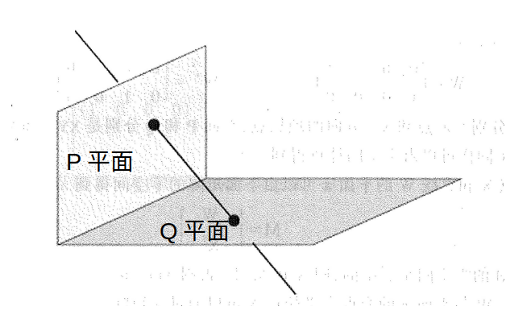

# 第三章——3D射影几何和变换

## 写在前面

这一章节的内容其实主要研究的就是2D射影几何的扩展，主要使用的还是齐次坐标系，加入了一个维度之后，整个空间发生变化的主要有如下的内容：

1. $\mathbf{IP}^{2} \rightarrow \mathbf{IP}^{3}$，每个点的维度变作4维，齐次项依旧是1；

2. 2D射影几何的 **线** 扩展成3D射影几何的 **面** ：$\pi=[m_1,m_2,m_3,m_4]^{T}$；

3. 3D射影几何的线变为复合约束的形式，可以由如下三种方式：

   a. 两点确定一条直线；

   b. 两点组成矩阵的零空间，两个平面组成矩阵的零空间；

   c. Plucker矩阵和表示法

其中直线的部分也是本章比较重要的部分，关于Plucker的表示法，详细可以参考https://zhuanlan.zhihu.com/p/149028042

整个章节其实看下来和第二章很多部分都是能连起来的，所以这里没有很多相似的地方都没有写上来，对照2D射影部分其实还是很好理解的。

&nbsp;

----

## 点与平面的关系

主要就是点在面上，公式为：
$$
\mathbf{0} = \mathbf{\pi^{T}P}=[\pi_1, \pi_2, \pi_3, \pi_4]\begin{bmatrix}p_1 \\ p_2 \\ p_3 \\ p_4\end{bmatrix} \tag{1}
$$

三个不共线的点确定一张平面：
$$
\mathbf{A}\pi=\begin{bmatrix}X_1^T \\ X_2^T \\ X_3^T\end{bmatrix}\pi=\mathbf{0} \tag{2}
$$
其中A的维度为4x3，其中一定要保证A矩阵的秩为3，如果秩为2，则这三个点是共线的，不是处于一般位置上的。

三个点构成的平面可以由如下公式直接获取：
$$
\pi=\begin{bmatrix}(\mathbf{\tilde{X}_1}-\mathbf{\tilde{X}_3})\times(\mathbf{\tilde{X}_2}-\mathbf{\tilde{X}_3}) \\ -\mathbf{\tilde{X}_3}^{T}(\mathbf{\tilde{X}_1}\times\mathbf{\tilde{X}_2})\end{bmatrix} \tag{3}
$$

&nbsp;

-----

## 直线的表示法

在3D射影空间中，直线的自由度为4，通常认为一条线由两个点或者面组成，所以自由度有2x3=6个，但是由于直线绕着自身的方向轴旋转和移动的话，直线还是这个直线，所以真实自由度为6-2=4个。

### 第一种表示方法——零空间与其生成子空间

假设空间中有两个点$\mathbf{A,B}$，可以将其组合成矩阵$\mathbf{W}$，如下：
$$
\mathbf{W}=\begin{bmatrix}A^{T} \\ B^{T} \end{bmatrix} \tag{4}
$$
所以看到：

1. $\mathbf{W}^{T}$的生成子空间为$\mu A + \lambda B$；
2. $\mathbf{W}$的2维右零空间（其实这里不是指零空间是2维的，而是该零空间的基底有两个）是以该直线为轴的平面束，文字描述比较相对来讲比较拗口，直接给出图形比较好理解（画了半天，也没感觉有书上的好看，还是用书上的吧），其中平面 P 和 Q 就是对应的两个基底，相互垂直（不过我还是很难想象这两个平面的线性组合张开成的空间怎么表示平面束的）：

&nbsp;

### 第二种表示方法——Plucker表示法

Plucker表示法使用一个反对称齐次矩阵表示，该矩阵的公式如下：
$$
\mathbf{L=AB^{T}-BA^{T}}=\begin{bmatrix}
0 & a_1b_2-b_1a_2 & a_1b_3-b_1a_3 & a_1-b_1 \\ 
-(a_1b_2-b_1a_2) & 0 & a_2b_3-b_2a_3 & a_2-b_2 \\ 
-(a_1b_3-b_1a_3) & -(a_2b_3-b_2a_3) & 0 & a_3-b_3 \\ 
-(a_1-b_1) & -(a_2-b_2) & -(a_3-b_3) & 0 
\end{bmatrix} \tag{5}
$$
该矩阵具有如下的性质（这里仅仅对前两个加入一些个人的理解）：

1. 矩阵的秩为2，它的右零空间也是2维的，且和上面的图中的P和Q平面一样；
2. 因为整个矩阵是一个对称矩阵（有一个很大的特点就是对角线元素均为0），所以矩阵的有效元素仅为5个（齐次矩阵），同时因为不满秩，所以必须满足$\mathbf{det(L)=0}$的约束，因此整个矩阵表示的直线的自由度仅有4个；

由于整个矩阵是对称矩阵，所以Plucker的表示法进一步的把其中的6个参数提取出来作为单独的一种表示方法，如下：
$$
\mathcal{L}=\{l_{12}, l_{13}, l_{14}, l_{23}, l_{42}, l_{34}\} \tag{6}
$$
该表示法为6维齐次矢量，因为$\mathbf{det(L)=0}$的约束，其参数满足（也很好记，乘法的两个乘数的下标必须组合为1234）：
$$
l_{12}l_{34}+l_{13}l_{42}+l_{14}l_{23}=0 \tag{7}
$$
按照之前总结的Plucker坐标系的表示方法 $\mathcal{L}=\mathbf{\{n,d\}}$ 来讲的话，其实参数的对应关系为 $\mathbf{n}=[l_{23}, l_{13}, l_{12}]$，$\mathbf{d}=[l_{14},l_{24},l_{34}]$，但是因为上面是为了满足行列式的约束，因此中间有一个负号项。

这里有一个比较nice的结论就是两条线相交的充要条件为：
$$
\mathbf{det(A,B,\hat{A},\hat{B})}=l_{12}\hat{l}_{34}+l_{34}\hat{l}_{12}+
l_{13}\hat{l}_{42}+l_{42}\hat{l}_{13}+
l_{14}\hat{l}_{23}+l_{23}\hat{l}_{14}=0=(\mathcal{L}|\mathcal{\hat{L}}) \tag{8}
$$
