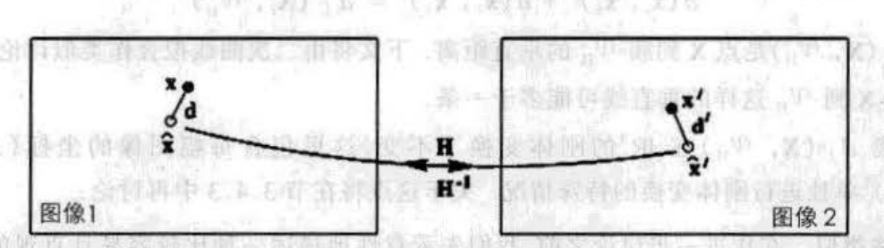
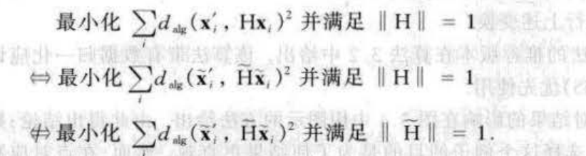
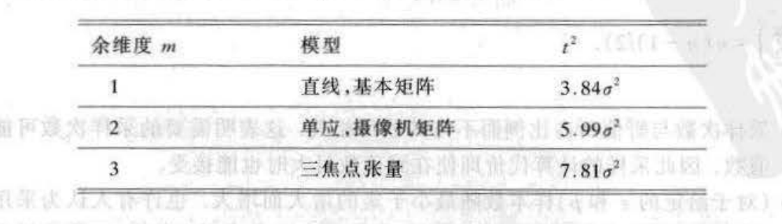
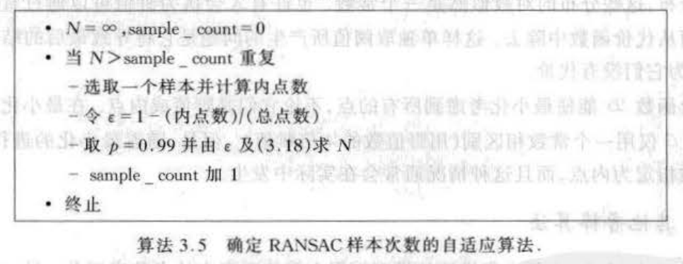
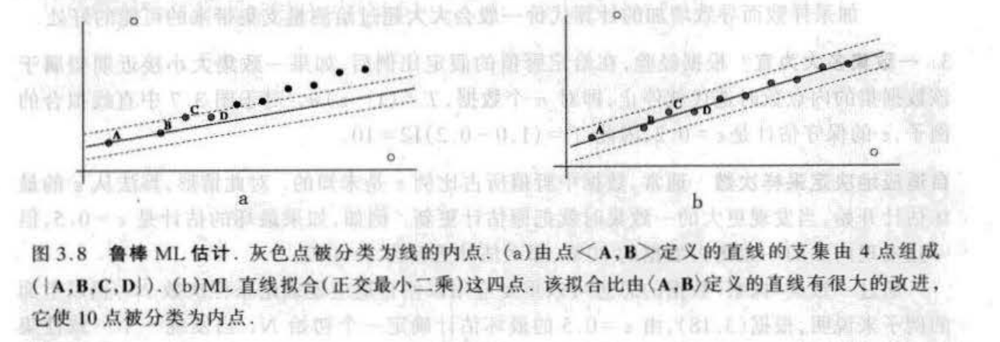

# 2D射影变换的估计

## 写在前面

说实话这一章节在看的时候真的比较容易“陷”进去，所以在开始的时候，不妨将整个章节的内容抽简出来——如何从点集与点集的对应关系中，得到一个比较鲁棒的射影变换（单应性矩阵）。

针对上面这个简单的目的，本章节主要探讨了如下的东西：

1. 求解代数解的方法——DLT，超定方程；
2. 迭代式的求解方法——误差函数（进而讨论了一些误差函数的定义方法）；
3. 鲁棒性估计方法——RANSAC，鲁邦最大似然估计；

本文也按照上面的流程来一步步的总结；

&nbsp;

---

## 求解代数解的方法

### 测量数

测量数是指如果要计算单应性矩阵，需要多少对应的匹配点才可以。因为射影变换矩阵H的变量总数为9，但是由于是齐次矩阵，所以自由度为8。又因为一对匹配点能提供两个约束，因此4对点就可以提供8个约束，求解该问题，该解称为最小配置解。但是通常情况下，对应点中充满了噪声，所以一般情况下需要给出多于4组的匹配点数用于更加鲁邦的估计——超定方程或者RANSAC求解。

&nbsp;

### DLT——直接线性求解

直接线性求解在书中其实有两种方案：

#### 方案1——求解形如Ax=0的解

首先给出射影变换的公式$\mathbf{x'=Hx}$，可以看到一对真正的匹配之间必然满足：
$$
\mathbf{x'\times Hx}=\begin{bmatrix}\mathbf{y'h_{3}^{T}x-w'h_{2}^{T}x} \\ \mathbf{w'h_{1}^{T}x-x'h_{3}^{T}x} \\ \mathbf{x'h_{2}^{T}x-y'h_{1}^{T}x} \end{bmatrix}=
\underbrace{\begin{bmatrix}0 & \mathbf{-w'x^{T}} & \mathbf{y'x^{T}} \\ \mathbf{w'x^{T}} & 0 & \mathbf{-x'x^{T}} \\ \mathbf{-y'x^{T}} & \mathbf{x'x^{T}} & 0\end{bmatrix}}_{A} \begin{bmatrix}\mathbf{h_1} \\\mathbf{h_2} \\ \mathbf{h_3} \end{bmatrix} =0 \tag{1}
$$
其中矩阵A的秩为2，所以其实保留其中两个等式就可以了，一般选择前两个等式。对于这样的一种问题来说，如果我们有4对匹配点，那么前面的A矩阵的维度就是8x9，如果我们把求解的矩阵当做齐次向量来解，那么其实求得的解是差一个绝对的尺度的，所以我们可以添加一个约束条件为$\left|\mathbf{x}\right|=1$的约束条件，其实添加了约束条件之后，就等于可以直接使用SVD得到最优解，同时该最优解一定满足该约束条件；

#### 方案2——求解形如Ax=b的解

同样的，如果仅仅使用$\mathbf{x'=Hx}$的公式进行构建方程的话，则对于每一个点对，有：
$$
\left[\begin{array}{ccccccc}
0 & 0 & 0 & -x_{i} w_{i}^{\prime} & -y_{i} w_{i}^{\prime} & -w_{i} w_{i}^{\prime} & x_{i} y_{i}^{\prime} & y_{i} y_{i}^{\prime} \\
x_{i} w_{i}^{\prime} & y_{i} w_{i}^{\prime} & w_{i} w_{i}^{\prime} & 0 & 0 & 0 & -x_{i} x_{i}^{\prime} & -y_{i} x_{i}^{\prime}
\end{array}\right] \overline{\mathbf{h}}=\left(\begin{array}{l}
-w_{i} y_{i}^{\prime} \\
-w_{i} x_{i}^{\prime}
\end{array}\right) \tag{2}
$$
所以同样的，4对匹配点能构建一个8x9的求解问题，在h中，仅仅需要把其中的某一个变量设置为1，例如$h_j=1$，则整个问题都可以进一步求解，但是如此最大的问题就是，如果真正的$h_j=0$，那么整个问题的求解将会变得不稳定。

&nbsp;

### 超定方程

上面的方法都是基于有4个匹配点对，当匹配点对多于4个的时候，不管是哪个方程的A矩阵都是Nx9的形式，其中N>9，因此此时可以求解一个超定方程，这样的解会稍微稳定一些。

&nbsp;

-----

## 迭代式的求解方法

这部分是笔者觉得整个书中编排问题（或者说是大佬们没有特别照顾笔者这种菜鸡）比较大的一点，整个章节读下来相当的突兀，不知道为什么就出了一个小节讲这个，一会儿又蹦出来一个小节讲那个。所以笔者在这部分打算先总观的进行俯瞰干什么，之后再看达到这样的目的需要什么，这样会比较清晰一些。

优化迭代的求解方法其实无非就是找一个代价函数，之后就是使用各种迭代的方法求解到最优解，整个章节的大部分也是围绕着这样的目的展开：

1. 代价函数——对应书中的第二节，介绍了代数距离，几何距离以及Sampson距离；
2. 建模部分——如何使用单个代价函数构建最大似然估计；
3. 数据处理——如何处理数据能进行更好的问题估计，这里面也研究了一些不变性的东西；
4. 优化方法——这部分读者可以自行看书，其实当前面的都解决了，这个就是一个流程而已；

疏通了上面的顺序之后，其实再会过头去看整个章节的内容就会比较清晰了。

&nbsp;

### 不同的代价函数

#### 代数距离

代数距离是一种数学意义的距离，通常称$\xi=\mathrm{A}\mathbf{h}$为残差矢量，在我们的目的中，我们可以把该矢量的范数作为代数距离进而进行优化：
$$
d_{n k}\left(\mathbf{x}_{i}^{\prime}, H \mathbf{x}_{i}\right)^{2}=\left\|\boldsymbol{\varepsilon}_{i}\right\|=\left\|\left[\begin{array}{ccc}
\boldsymbol{0}^{\boldsymbol{T}} & -w_{i}^{\prime} \mathbf{x}_{i}^{\top} & y_{i}^{\prime} \mathbf{x}_{i}^{\top} \\
w^{\prime} \mathbf{x}_{i}^{\top} & \boldsymbol{0}^{\top} & -x_{i} \mathbf{x}_{i}^{\top}
\end{array}\right] \mathbf{h}\right\|^{2} \tag{3}
$$
对于任意两个矢量$\mathbf{x_1}$和$\mathbf{x_2}$，我们可以将如下公式作为代数距离：
$$
d_{alg}(\mathrm{x_1}, \mathrm{x_2})^{2}=a_1^{2}+a_2^{2} \quad \mathbf{a}=(a_1, a_2, a_3)^{T}=\mathrm{x_1}\times\mathrm{x_2} \tag{4}
$$
根据公式（3）的定义，所以一对匹配点$\mathrm{x'}=(x_1', x_2', x_3')^{T}$ 和 $\mathrm{\hat{x}}'=H\mathrm{x}=(\mathrm{\hat{x}_1}', \mathrm{\hat{x}_2}', \mathrm{\hat{x}_3}')$ 的代数距离为：
$$
\mathrm{A}\mathbf{h}=\varepsilon=\begin{bmatrix}\mathrm{y}'\mathrm{\hat{w}}'-\mathrm{w}\mathrm{\hat{y}}' \\ \mathrm{w}'\mathrm{\hat{x}}'-\mathrm{x}\mathrm{\hat{w}}' \end{bmatrix} \tag{5}
$$
所以取其范数为：
$$
d_{alg}(\mathrm{x}',\mathrm{\hat{x}}')^{2}=(\mathrm{y}'\mathrm{\hat{w}}'-\mathrm{w}\mathrm{\hat{y}}')^{2}+(\mathrm{w}'\mathrm{\hat{x}}'-\mathrm{x}\mathrm{\hat{w}}')^{2}
$$

#### 几何距离

几何距离比较好理解，但是书中对于几何距离又进行了一系列的划分：单图像误差，对称转移误差，以及重投影误差；其中单图像误差和对称转移误差都比较好理解，这里不再赘述，重投影误差是一个值得去讲一下的东西，这里就讲一下笔者自己的理解；

##### 重投影误差

书中这里介绍的重投影误差其实（至少和笔者理解的）和之前见到的重投影误差不同，但是仔细想想又很相同！在笔者看来，重投影误差是给了一个空间3D点，之后通过位姿关系和相机投影矩阵投影到当前的图像坐标系中。

对于仅有两个图像坐标观测的例子中，我们是无法找到上述这样的投影关系的，但是我们可以想象一下有一个“隐式”的3D点，经过了两次投影之后，分别投影到了两幅图的图像上，他们之间由一个单应矩阵联系起来！于是整个重投影误差看起来就是这样子的：

其中：

1. $\mathrm{x, x'}$ 是图像的测量值，而$\mathrm{\hat{x}, \hat{x}'}$ 则是由“隐式"的3D点投影下来的图像坐标；

2. $\mathrm{\hat{x}, \hat{x}'}$ 之间由一个单应性矩阵直接连接（映射）；

3. 所以重投影误差的公式就是：
   $$
   \sum_{i} d\left(\mathbf{x}_{i}, \hat{\mathbf{x}}_{i}\right)^{2}+d\left(\mathbf{x}_{i}^{\prime}, \hat{\mathbf{x}}_{i}^{\prime}\right)^{2} \quad \text { s.t } \quad \hat{\mathbf{x}}_{i}^{\prime}=\hat{H} \hat{\mathbf{x}}_{i} \quad \forall i \tag{6}
   $$

#### Sampson误差

Sampson误差笔者认为还是从二次曲线的拟合开始比较好，毕竟本身也是这个方法的来源。

考虑一个场景：我们有一些数据之后，需要拟合一个二次曲线，形如 $\mathrm{x^{T}Cx}=0$ ，那么一个比较大的问题就是如何度量某个数据点与二次曲线的**几何误差（代数误差就是代入公式之后的误差了）**，Sampson给出了如下的方法求解：

1. 设函数$\mathcal{V}(\mathrm{x})=\mathrm{x^{T}Cx}$，显然，真正在曲线上的点$\mathrm{\overline{x}}$ 一定可以满足$\mathcal{V}(\mathrm{\overline{x}})=0$；

2. 假设测量 $\mathrm{x}$ 与曲线上的最近点 $\mathrm{\overline{x}}$ 之间的距离为 $\delta{\mathrm{x}}$；

3. 将 2 的假设代入 1 中，就可以得到：
   $$
   \begin{aligned}
   \mathcal{V}(\mathrm{\overline{x}})&=\mathcal{V}(\mathrm{x+\delta{x}}) \\ 
   &=\mathcal{V}(\mathrm{x})+\mathbf{J}\delta{\mathrm{x}}=0 
   \end{aligned}
   \tag{7}
   $$

4. 在 2 中，其实我们做了一个最优化的假设，就是 $\delta{\mathrm{x}}$ 是测量与曲线点最近的点，所以其实我们需要求解一个最优化的问题：
   $$
   \begin{aligned}
   \mathrm{min}_{\delta x} \quad &\lVert\delta{\mathrm{x}}\rVert^{2} \\ 
   s.t. \quad &\mathcal{V}(\mathrm{x})+\mathbf{J}\delta{\mathrm{x}}=0 
   \end{aligned} \tag{8}
   $$
   直接上拉格朗日乘子法，得到（这里和书中的公式稍微有些不同的是把中间的减号换成了加号，因为整个问题在求最小值，但是如果用减法，可以约定$\lambda$是小于等于0的）：
   $$
   \mathcal{L}(\delta{\mathrm{x}})=\delta{\mathrm{x}}^{T}\delta{\mathrm{x}}+2\lambda^{T}(\mathcal{V}(\mathrm{x})+\mathbf{J}\delta{\mathrm{x}}) \tag{9}
   $$
   于是按照拉格朗日乘子法的求解可以得到：
   $$
   \begin{aligned}
   \frac{\partial \mathcal{L}(\delta{\mathrm{x}})}{\partial \delta{\mathrm{x}}}=0 &\Rightarrow \delta{\mathrm{x}}^{T}+\lambda \mathbf{J}=0 \\
   \frac{\partial \mathcal{L}(\delta{\mathrm{x}})}{\partial \lambda}=0 &\Rightarrow \mathcal{V}(\mathrm{x})+\mathbf{J}\delta{\mathrm{x}}=0  
   \end{aligned} \tag{10}
   $$
   公式（10）联立就可以得到$\lambda=(\mathbf{J}\mathbf{J}^{T})^{-1}\mathcal{V}(\mathrm{x})$，再次代入公式（10）的第一个约束中，得到：
   $$
   \delta{\mathrm{x}}=-\mathbf{J}^{T}(\mathbf{J}\mathbf{J}^{T})^{-1}\mathcal{V}(\mathrm{x}) \tag{11}
   $$
   于是距离值，也就是
   $$
   \lVert\delta{\mathrm{x}}\rVert^{2}=\delta{\mathrm{x}}^{T}\delta{\mathrm{x}}=\mathcal{V}(\mathrm{x})^{T}(\mathbf{J}\mathbf{J}^{T})^{-1}\mathcal{V}(\mathrm{x}) \tag{12}
   $$

如果我们将$\mathbf{J}\mathbf{J}^{T}$当做是$\mathcal{V}(\mathrm{x})$的协方差矩阵，那么我们推了半天就推出来了马氏距离。其实我们仅仅是用公式（12）的结论，也就是我们如果有一个曲线函数$\mathcal{V}(\mathrm{x})=0$，那么我们就可以用公式（12）定义测量的Sampson误差。

回到这节的主旨上来：为了迭代优化求解找合适的代价函数，而Sampson误差给与了我们一种方法，只要我们有理想点的曲线方程，那么就可以很直接的得到测量到该曲线的误差。

书中给出了一个例子：使用代数误差来作为上述的曲面函数$\mathcal{V}(\mathrm{x})=\mathrm{A}(\mathrm{x})\mathbf{h}$，其中 $\mathrm{x}$ 是由两个 2D 测量堆叠起来，形如 $\mathrm{x=[x, y, x',y']}$。所以我们可以用公式（12）得到优化步骤中的误差部分，同时因为公式中的 $\mathcal{V}(\mathrm{x})$ 和 $\mathbf{J}$ 都是关于 $\mathbf{H}$ 的函数，所以整个误差可以对射影变换 $\mathbf{H}$ 进行求导（目之所及就觉得贼麻烦的形式），也就提供了后面对 $\mathbf{H}$ 的优化方向 。

&nbsp;

### 建模方法

这部分其实不难，主要是把整个问题看做一个最大似然估计，之后对每一个测量方程进行高斯建模，最终的结论就是基于高斯模型的最大似然估计其实就是最小化几何误差函数（这里做一个思考：代数误差可以吗？笔者认为不太可以，因为代数误差没有实际的物理单位，而几何误差具有实际的物理单位，方差的意义更明确）。

&nbsp;

### 数据处理

在看ORB-SLAM2的时候就接触到其中的归一化的部分，后面自己写这部分代码的时候，确实感到将数据进行归一化之后再进行位姿估计会比直接使用图像坐标进行位姿估计结果要好很多！当时并没有特别的深究其中的奥妙，但是该小节其实比较深入的探讨了这点，笔者总结为：

1. 归一化前后的结果是否是一致的——这直接决定能否使用归一化；
2. 归一化的好处——结果准确度的提升，选择了相同的标准坐标系，导致结果的相似变换不变性；

#### 图像坐标变换的不变性

首先做如下假设：

1. 原始的数据为$\mathrm{x}，\mathrm{x}'$，经过变换的（该变换可以是归一化，也可以是别的操作）的数据为$\mathrm{\tilde{x}}，\mathrm{\tilde{x}}'$，所有的数据均在2D射影空间$\mathrm{IP^{2}}$下；
2. 变换是一个线性变换，设为$\mathrm{T}$，该矩阵为3x3矩阵，如果考虑各种变换的话，那么该矩阵就是一个射影矩阵，如果仅仅是归一化的话，那么该矩阵就是一个仿射变换矩阵；
3. 变换后的数据与变换前的数据的关系为：$\mathrm{\tilde{x}} = \mathrm{T}\mathrm{x}$，$\mathrm{\tilde{x}'} = \mathrm{T'}\mathrm{x}'$；

所以看到：

1. 如果我们使用原始的数据匹配对进行射影矩阵的估计，那么有$\mathrm{x'} = \mathrm{H}\mathrm{x}$；
2. 如果我们使用变换之后的数据匹配对进行射影矩阵的估计，那么有$\mathrm{\tilde{x}}' = \mathrm{\tilde H}\mathrm{\tilde x}$；
3. 将线性变换代入之后就可以得到$\mathrm{H}=\mathrm{T'^{-1}}\mathrm{\tilde H}\mathrm{T}$

#### DLT的非不变性

DLT非不变性其实也比较容易证明，还是原来数据和变换的假设，这里变换遵从书中的假设，认为 $\mathrm{T'}$ 是相似变换，$\mathrm{T}$ 是任意射影变换（因为公式里面都消掉了）：
$$
\begin{cases}
\mathrm{x}'\times \mathrm{Hx}=\mathrm{Ah_{1:2}}=\epsilon_{1:2} \\
\mathrm{\tilde{x}}'\times \mathrm{\tilde H \tilde x}=(\mathrm{T'x'}) \times \mathrm{T'HT^{-1}Tx}=s\mathrm{RAh_{1:2}}=s\mathrm{R}\epsilon_{1:2}
\end{cases} \tag{13}
$$
其中使用到反对称矩阵的性质：
$$
\lfloor\mathrm{Mu}\rfloor_{\times}=\mathrm{\left|M\right|M^{-T}\lfloor u\rfloor_{\times}M^{-1}} \tag{14}
$$
因为其中$\mathrm{T'}$是相似变换，所以他的行列式为s，又因为代数误差我们仅取误差向量的前两项，所以仅与旋转部分R相乘就可以了。于是得到书中的结论：

**令$\mathrm{T'}$为具有缩放因子s的相似变换，$\mathrm{T}$ 为任意的射影变换，此外，假设 H 是任何2D单应并定义$\mathrm{\tilde{H}=T'HT^{-1}}$，那么$\mathrm{\lVert\tilde{A}\tilde{h}\rVert}=s\mathrm{\lVert{A}h\rVert}$，其中 $\mathrm{h}$ 和 $\mathrm{\tilde{h}}$ 是 $\mathrm{H}$ 和 $\mathrm{\tilde{H}}$ 的参数向量。**

但是因为我们最后求解的是一个 Ah=0 的方程，多了一个系数其实不会影响最后的结果。没错，忽略常数项的话，确实变换的前后都可以得到同样的误差向量$\epsilon_{1:2}$，但是使用DLT的时候，我们实际上是添加了一个约束：$\mathrm{\lVert h \rVert}=1$的约束的，因此，如果我们在经过变换的数据上依旧使用这样的约束 $\mathrm{\lVert\tilde{h}\rVert=1}$，那么我们再使用逆映射公式 $\mathrm{H}=\mathrm{T'^{-1}}\mathrm{\tilde H}\mathrm{T}$ 映射到原数据的射影矩阵时，该矩阵组成的参数向量的模很大程度上不为1了，即$\mathrm{\lVert h \rVert \neq 1}$，亦即变换前后单独计算的时候，一旦使用了参数向量的模为1的约束时，两个解必然不能通过 $\mathrm{\tilde{H}=T'HT^{-1}}$ 联系起来，也就是书中的图：

> 注意上述结论仅仅是大部分情况，如果经过 $\mathrm{\tilde{H}=T'HT^{-1}}$ 映射的模也为1了，那么变换前后用DLT得到的射影变换是一致的。

> 这里笔者也思考一个问题，书中讨论的是 $\mathrm{Ah=0}$ 的方法，但是在上面我们还讨论了 $\mathrm{Ah=b}$ 的方法，那么该方法是否也存在上面的问题？笔者认为应该也是有的，不过如果把变换 $\mathrm{T}$ 从任意射影变换改为为相似变换，那么该方法在变换前后计算的单应性矩阵应该是一致的，因为前后求解的时候的约束都是 $h_9=1$的约束。

#### 基于最小化方法的几何误差不变性

书中在该小节证明了当变换是欧式变换的时候，几何误差在变换前后的值是一致的，这点很好证明，这里不再赘述；

当变换为相似变换的时候，整个几何误差其实也是差一个变换因子，但是在最小化方法中，差一个因子其实不会影响最终的结果（可以归结于迭代步长项），所以在最小化方法中，几何误差具有不变性。

#### 归一化变换

这部分就主要给出了为什么经过归一化处理之后的数据能给出更好的结果，同时作者也给出了一种合适的归一化方法。

在DLT的非不变性中，我们明白了：使用经过相似变换的数据求解射影变换 $\mathrm{\tilde{H}}$ 和使用原始数据求解射影变换 $\mathrm{H}$ 是不同的，那么是否存在优劣关系呢？答案是肯定的。书中给出了一个标准的坐标系，将数据归一化到该坐标系中之后得到的结果是比较好的，同时可以通过逆变换公式得到在原始数据中的射影变换 H。

这里记录一下书中给出的归一化标准坐标，和ORB-SLAM2中使用的坐标还不是很一样：

1. 对所有点平移使得他们的形心位于原点位置；
2. 对所有点缩放使得他们到他们到原点的平均距离为$\sqrt{2}$，所以平均点为[1,1]；

归一化对于问题求解的主要好处如下：

1. 归一化改善了系数矩阵的条件数。归一化主要会影响系数矩阵 $\mathrm{A}$ 的条件数（条件数决定了矩阵是否是病态，或者可逆的衡量标准），或者主要是矩阵 $\mathrm{A}$ 的倒数第一个和倒数第二个奇异值的比率。这里定性的分析一下，当使用原始数据的时候，那么每个点都是几十或者几百的值，但是齐次项是1，于是在构建矩阵 $\mathrm{A}$ 的时候，非齐次项的乘积会迅速变大，齐次项的乘积还是1，导致整个矩阵的数值分布很大，那么他的条件数自然会很大；反过来，如果归一化到一个合适的分布，那么整个矩阵 $\mathrm{A}$ 的数值分布就会比较合理；
2. 归一化从某种程度上具有相似不变性。因为匹配的点集都使用归一化方法归一化到了标准坐标系下了，所以两个点集之间不管相差怎样的相似变换，在归一化坐标系下的结果都是一样的。**因此将所有点都归一化到标准坐标系下的前提下，DLT算法对于相似变换具有不变性**。

&nbsp;

----

## 鲁棒性估计方法

### RANSAC方法

RANSAC方法其实也接触的很多了，该方法主要应用于有野值的数据集，具体的步骤这里就不赘述了，仅仅记录一些比较有用的部分。

#### 距离阈值

因为RANSAC会通过搜索的方法得到自己的内点集和外点集，如何区分是否是内外点，主要就是靠测量数据与模型的误差的大小是否满足阈值，通常我们使用卡方检验的结论，下面给出书中的结论，更多的维度对应的卡方分布可以参考TODO（知乎）

在ORB-SLAM2的初始化中，我们能很清晰的看到作者在进行基本矩阵的RANSAC估计使用的就是3.84这个参数，而对于单应性矩阵的RANSAC估计，使用的是5.99这个参数；

#### 采样次数

通常为了简单，我们在程序中通常会设置采样次数为一个固定常数，但是RANSAC的采样次数其实是可以通过公式计算出来的，具体的：

**假设采样次数 N 可以使得我们在整个选择中得到至少有一次的采样样本（假设采样样本有 s 个）中没有野值的概率为p，通常p取0.99，其中数据中的内点概率（或者也叫占比）为w**

我们取上述条件的反：**在所有的采样中，采样全部是野值的概率为1-p**。于是可以建立如下公式：
$$
{\underbrace{(1-\underbrace{w^{s}}_{采样样本中全部是内点})}_{一次采样全部为外点}}^{N}=1-p \tag{15}
$$
所以N的公式也就是：
$$
N=\frac{log(1-p)}{log(1-w^{s})} \tag{16}
$$

#### RANSAC估计的套路

&nbsp;

### 鲁棒最大似然估计（ML）

这部分主要分析了RANSAC的缺点：1. 内外点的分类不能取消；2. 使用采样样本得到模型之后，可以得到最佳一致集，如果此时再使用最佳一致集对模型重新拟合，那么此时一定会有外点再次成为内点，如下图：

所以在鲁棒最大似然估计中，作者使用鲁棒核函数对每一个点分配权重，随后进行最大似然估计。