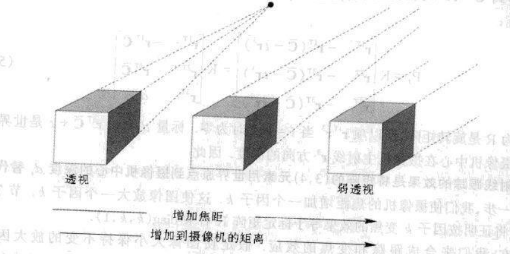
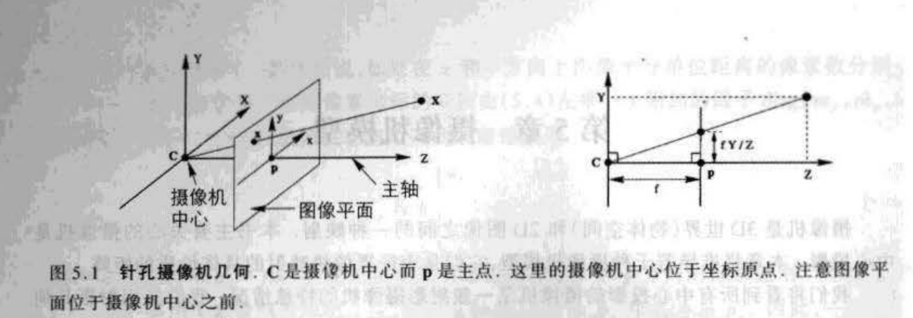
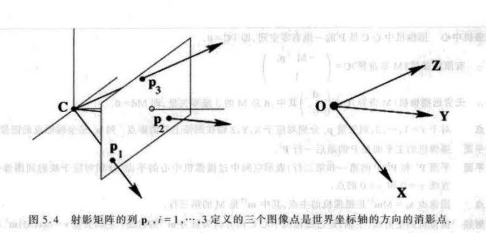
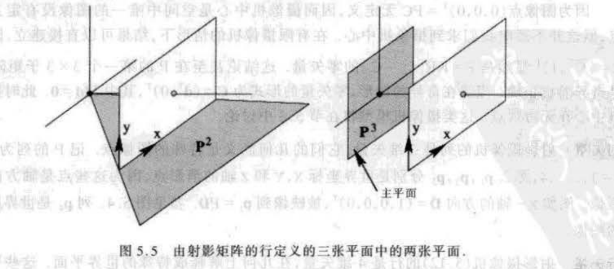

# 第六章——摄像机模型

## 写在前面

本章主要是对摄像机模型进行说明，书中将整个内参和外参都放在一起进行了处理，因此和笔者平时接触的先外参变换再内参投影还是不太一样，不过从整个分析上看：

1. 将内外参放在一起之后组成摄像机矩阵之后，**其列向量和行向量表现出了一些独特的意义**，这点是笔者之前没有深入思考过的；
2. 整个摄像机矩阵也能解释为什么位姿变换（位姿变换属于欧式变换）了，图像会有射影变换的效果；

本章一共讲解了有限摄像机和无限摄像机，因为无限摄像机用的比较少（其实是懒了），以后如果碰上了在进行更详细的记录总结。

&nbsp;

----

## 有限摄像机

有限摄像机简单讲就是相机的投影中心交于有限远点，即焦距是有限的；而无限摄像机就是投影中心交于无穷远点，焦距是无穷大（笔者感觉该焦距仅仅是理论上的无穷远）；一个比较好的图例如下：

本节也按书中的顺序进行讲解：先从特殊的针孔摄像机，之后扩展到一般相机上。

### 针孔摄像机

针孔摄像机的原理如图所示：

基本上就是相似三角形的原理，这里主要对其中一些点进行记录：

1. 首先是坐标系的朝向：z 轴朝向摄像机的前方，x 轴朝向摄像机的左侧，y 轴朝向摄像机的上方；
2. Z=f 的平面被称为图像平面或者聚焦平面；
3. 投影中心称为摄像机中心（常说的摄像机的位姿），也称为光心；
4. 摄像机中心到图像的垂线称为主轴，或者主射线；
5. 过摄像机中心平行于图像平面的平面称为摄像机的主平面，这个平面平时可能用不到，但是在后面对摄像机矩阵分析的时候会分析到；

#### 摄像机坐标系中的投影变换

在摄像机的坐标系中，将一个3D点$P=[X,Y,Z]$投影到图像平面$p=[fX/Z, fY/Z]$（**该平面依旧属于摄像机坐标系，不是图像坐标系**），所以齐次坐标矩阵乘积形式如下：
$$
\left(\begin{array}{c}
X \\
Y \\
Z \\
1
\end{array}\right) \rightarrow
\underbrace{
\left[\begin{array}{c}
f X/Z \\
f Y/Z \\
1
\end{array}\right] \rightarrow
\left[\begin{array}{c}
f X \\
f Y \\
Z
\end{array}\right]}_{齐次坐标}=\left[\begin{array}{lll}
f & &  & 0 \\
& f &  & 0\\
& & 1 & 0
\end{array}\right]\left(\begin{array}{c}
X \\
Y \\
Z \\
1
\end{array}\right) \tag{1}
$$

#### 在图像坐标系中的投影变换

公式（1）我们获得了在摄像机坐标系下图像平面的点的坐标$p_{cam}=[fX/Z, fY/Z,1]^{T}$，将摄像机坐标系的点投影到图像坐标系需要添加主点偏置，即把图像的中心点从图像的中心移动到图像的左上角（这是在倒影的前提下！），公式如下：
$$
\left(\begin{array}{c}
X \\
Y \\
Z \\
1
\end{array}\right) \rightarrow
\underbrace{
\left[\begin{array}{c}
f X/Z + p_x \\
f Y/Z + p_y \\
1
\end{array}\right] \rightarrow
\left[\begin{array}{c}
f X+Z p_x \\
f Y+Z p_y \\
Z
\end{array}\right]
}_{齐次坐标}=
\left[\begin{array}{lll}
f & & p_x & 0 \\
& f & p_y & 0\\
& & 1 & 0
\end{array}\right]\left(\begin{array}{c}
X \\
Y \\
Z \\
1
\end{array}\right) \tag{2}
$$

#### 尺度变换

公式（1）（2）中的图像坐标系的物理单位其实都和焦距的物理单位一致，通常是mm为单位，于是需要转换为像素pix单位，所以在 x 轴和 y 轴方向通常还有两个变换因子：$\mathrm{m_x, m_y}$，与焦距合在一起就是 $\mathrm{f_x=f m_x, f_y=f m_y}$。

综上：最终将相机坐标系的点$P_{cam}$投影到图像坐标系的点$p_{im}$的齐次坐标矩阵乘积形式为：
$$
\left(\begin{array}{c}
X \\
Y \\
Z \\
1
\end{array}\right) \rightarrow
\underbrace{
\left[\begin{array}{c}
f_x X/Z + p_x \\
f_y Y/Z + p_y \\
1
\end{array}\right] \rightarrow
\left[\begin{array}{c}
f_x X+Z p_x \\
f_y Y+Z p_y \\
Z
\end{array}\right]
}_{齐次坐标}=
\underbrace{
\left[\begin{array}{lll}
f_x & & p_x & 0 \\
& f_y & p_y & 0\\
& & 1 & 0
\end{array}\right]}_{内参矩阵K}\left(\begin{array}{c}
X \\
Y \\
Z \\
1
\end{array}\right) \tag{3}
$$
&nbsp;

### 有限射影摄像机

为了增加一般性，通常在内参矩阵 K 中添加扭曲参数 s，于是内参矩阵变为：
$$
\mathrm{K} =\left[\begin{array}{lll}
f_x & s & p_x \\
& f_y & p_y\\
& & 1 
\end{array}\right] \tag{4}
$$
通常情况下并不考虑扭曲参数的影响，所以一般都看作是0。所以对于内参矩阵而言，其自由度为5。

&nbsp;

### 相机的外参

相机的外参就是我们平时使用的比较多的世界系到相机坐标系的变换矩阵了，主要由旋转矩阵 R 和平移矢量 t 组成，书中主要使用旋转矩阵和相机在世界坐标系下的位置表示（其实都一样），如下：
$$
\mathbf{T_{w}^{c}} = \mathrm{[R_{w}^{c}|t_{w}^{c}]}=\mathrm{[R_{w}^{c}|-R_{w}^{c}C_{c}^{w}]}=\mathrm{R_{w}^{c}[I|-C]} \tag{5}
$$
&nbsp;

### 摄像机矩阵

在本书中，作者把整个相机的内外参合在一起称为摄像机矩阵，全书中使用 $\mathrm{P}$ 表示，结合上面的分析，摄像机矩阵 $\mathrm{P}$ 的表达式为：
$$
\mathrm{P} = \mathrm{K[R|t]} = \mathrm{KR[I|-C]} = \mathrm{M[I|-M^{-1}p_4]} \tag{6}
$$
将整个内外参写在一起的优势就是能直接对世界坐标系下的点进行直接的线性投影变换到图像坐标系下，而不用管具体的内外参，而一旦求解出了相机矩阵之后，可以通过对公式中的 M 矩阵进行 RQ 分解得到内参矩阵和外参矩阵。这个方法通常在标定的算法使用，实际的实时定位中并不常用。

> 摄像机矩阵的表示形式也能很好的表达出为什么世界坐标系下的点经过了相机成像之后会有射影变换的效果，因为 M 矩阵本身是一个射影变换。

&nbsp;

----

## 射影摄像机

这一节主要就是对摄像机矩阵进行更细致的分析。首先确定一些符号：
$$
\mathrm{P}=\begin{bmatrix} P_{11} & P_{12} & P_{13} & P_{14} \\ P_{21} & P_{22} & P_{23} & P_{24} \\ P_{31} & P_{32} & P_{33} & P_{34} \end{bmatrix} = \begin{bmatrix} P_{1}^{T} \\ P_{2}^{T} \\ P_{3}^{T} \end{bmatrix} = \begin{bmatrix} p_{1} & p_{2} & p_{3} & p_{4} \end{bmatrix} \tag{7}
$$
其中：

1. 列向量使用小写的字母表示，一共有四个列向量；
2. 行向量使用大写的字母加转置表示，一共有三个行向量；

### 列向量

列向量的现实意义表示在**世界坐标系**下的一些特殊的点在**图像坐标系**下的像，具体而言：

1. 前三个列向量 $p_{i},i=1,2,3$ 表示世界坐标系X Y Z三个轴的无穷远点在图像上的 **像**；
2. 最后一个列向量 $p_4$ 表示世界坐标系原点在图像上的 **像**；

以上结论均可以将世界坐标系的特殊点代入得到，特别的，因为每个列向量的最后一项不一定为1，因此需要最后需要转为齐次坐标。

### 行向量

行向量的现实意义表示在**世界坐标系**下一些特殊的面，具体而言：

1. 假设有世界坐标系的点 X，其满足 $P_{i}^{T}X=0$，以第一个行向量为例，则该点在图像坐标系的 **像** 为 $\mathrm{x_{im}=[0, y, w]}^{T}$，所以该向量表示图像坐标系下 x=0 的平面在世界坐标系下的 **原像**；
2. 对于第三个行向量，按照上面的分析方法，明显看到其 **像** 为$\mathrm{x_{im}=[x, y, 0]}^{T}$，一方面表示在图像坐标系下无穷远点的集合，另一方面表示该平面在世界坐标系下是过相机中心且平行于成像平面的平面（注意是在世界坐标系下哦，四维变量），一般称为主平面；

### 主点

回忆上面在做针孔相机的内参矩阵的时候添加了主点偏置，其中主点和这里的主点相对应。

主点定义为过相机中心且垂直于主平面方向的射线（称为主轴）与图像平面的交点称为主点。

因为行向量 $P_{3}^{T}=[p_{31}, p_{32}, p_{33}, p_{34}]^{T}$ 表示主平面，那么根据 $\mathrm{IP^{3}}$ 平面的定义，前三个变量表示平面的法线方向，所以主轴的方向就得到了，即$[p_{31}, p_{32}, p_{33}]^{T}$。

又因为主轴上所有的点在图像坐标系上的 **像** 都是一个点，于是使用无穷远点在图像坐标系上的投影就能得到主点，即：
$$
\mathrm{x_0}=\mathrm{[M|p_4]}\begin{bmatrix}p_{31} \\ p_{32} \\ p_{33} \\ 0 \end{bmatrix} = \mathrm{M}\begin{bmatrix}p_{31} \\ p_{32} \\ p_{33} \end{bmatrix} = \mathrm{M}\mathrm{m} \tag{8}
$$
所以一旦有了相机矩阵 P，其实但从它的前3x3矩阵中就能得到主点的值了。

> 其实在前面讲到，一旦有了相机矩阵 P，也可以通过对 M 矩阵进行 RQ 分解得到内参矩阵 K，那么此时 K 中的主点偏置和公式（8）算出来的一致吗？笔者把书中给出的例子使用公式（8）计算了一下，结果完全一致。