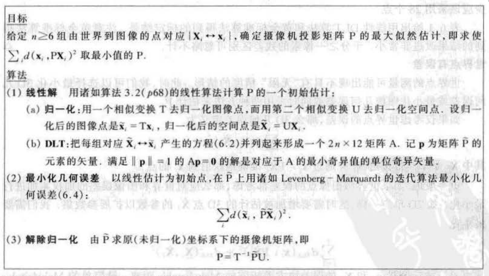

# 第七章——摄像机矩阵P的计算

---

## 写在前面

本章节主要介绍使用世界点与图像点对应关系求解摄像机矩阵P，之后还会继续进行内外参的分解；其次本章节也讲了图像径向失真的矫正。

&nbsp;

-----

## 基本方程（代数误差）

#### 构建方程

对于给定了3D->2D对应的集合{X}->{x}，于是可以构建映射关系为：
$$
\mathrm{x} = \begin{bmatrix}x \\ y \\ w \end{bmatrix} = \mathrm{PX} =  \begin{bmatrix} \mathrm{P^{1}X} \\ \mathrm{P^{2}X} \\ \mathrm{P^{3}X} \end{bmatrix} \tag{1}
$$
所以$\mathrm{x}\times \mathrm{PX} = 0$，推得：
$$
\left[\begin{array}{ccc}
\mathbf{0}^{\boldsymbol{\top}} & -w_{i} \mathbf{X}_{i}^{\top} & y_{i} \mathbf{X}_{i}^{\top} \\
w_{i} \mathbf{X}_{i}^{\top} & \mathbf{0}^{\mathrm{T}} & -x_{i} \mathbf{X}_{i}^{\top} \\
-y_{i} \mathbf{X}_{i}^{\top} & x_{i} \mathbf{X}_{i}^{\top} & \mathbf{0}^{\top}
\end{array}\right]\left[\begin{array}{c}
\mathbf{P}^{1} \\
\mathbf{P}^{2} \\
\mathbf{P}^{3}
\end{array}\right]=\mathbf{0} \tag{2}
$$
可以看到和第四章求解射影矩阵的DLT方法一致，于是其中第四章很多方法都是可以应用过来，比如数据处理中的归一化技术等等。

因为整个摄像机矩阵的未知量是12，同时因为没有明确的尺度信息（主要是因为图像坐标在齐次坐标系下），所以真正的自由度为11维，公式（2）中1对点对可以提供2个约束，因此至少需要6对对应点对才能求出来摄像机矩阵（当然，如果对应的点对大于6，自然可以求解超定方程得到超定解）。

&nbsp;

#### 添加约束

与第四章的求解一样，我们在求解形如 $\mathrm{Ax=0}$ 这样的方程时，也要加入一定的约束条件适配真正的自由度11：

1. 添加约束条件 $\mathrm{|p|=1}$，其中 $\mathrm{p}$ 表示摄像机矩阵组成的列向量；
2. 添加约束条件 $\mathrm{|\hat{p}^{3}|=1}$，其中 $\mathrm{\hat{p}^{3}}$ 表示摄像机矩阵的 P[3, 0:3] 组成的向量，该部分之所以为1是因为该部分本质上是 KR 的乘积，其向量模为1； 

虽然笔者个人觉得约束2是更加合理的，但是实际上，使用约束1不仅会比较方便，而且求解出来P之后也可以用RQ分解得到可靠的内参矩阵和旋转矩阵。

&nbsp;

#### 数据处理

数据处理部分其实和第四章的方法也比较像，就是先把整个点集的中心移动到原点，之后将均方差归一化到$\sqrt{3}$。这就大概讲完了，但是这部分真的就这？当然不是，点集从二维扩展到了三维，一些性质当然就不大一样了，比如在三维空间，有一些点距离原点确实很远，如果强行把它的均方差归一化到$\sqrt{3}$，那么势必会影响整个点集的分布，导致数据处理的失误。所以在进行三维坐标的归一化时，需要特别的考虑一些情况，书中给出了一种未验证的方法，感兴趣的读者可以做一些了解。

&nbsp;

----

## 几何误差

与计算单应部分一样，这部分的几何误差也是使用观测点和投影点之间的像素误差作为目标函数进行优化：
$$
\min _{\mathrm{P}} \sum_{i} d\left(\mathbf{x}_{i}, \mathbf{P} \mathbf{X}_{i}\right)^{2} \tag{3}
$$
有了目标函数（几何误差）之后，其实就可以使用优化的方法对摄像机矩阵进行更加精细的估计，即黄金标定算法：

可以看到整体的算法和单应估计的时候几乎一模一样：

1. 数据归一化，不过这里的归一化可能更加复杂；
2. 使用DLT方法求解初始解；
3. 使用优化方法进行初始解的调优；
4. 解除归一化，得到原本坐标系下的结果；

&nbsp;

----

## 受限相机矩阵的估计

上两个小节其实已经介绍了常规的求解相机矩阵的方法，但是彼时我们认为整个相机矩阵就是一个自由度为11的 4x3 矩阵而已，但是实际上，因为整个相机矩阵的公式由内参矩阵和外参矩阵组成，两个参数矩阵均满足一些性质导致真实的自由度还要更小，所以有了受限相机矩阵估计的方法（从本质上讲，该方法是在优化的时候添加了一些约束项，使得优化方向朝着我们期望的约束走）。

给出内参矩阵最一般的建模如下：
$$
\mathrm{K}=\left[\begin{array}{rrr}
\alpha_{x} & s & x_{0} \\
& \alpha_{y} & y_{0} \\
& & 1
\end{array}\right] \tag{4}
$$
这里按照书中的思路，将：

1. 扭曲因子 s 设置为0；
2. 成像平面是正方形：$\alpha_x=\alpha_y$；
3. 相机矩阵的第三行前三列的向量模长为1：$\mathrm{P_{31}^{2} + P_{32}^{2} + P_{33}^{2}=1}$；

于是整个相机矩阵的自由度由12变为了9，待估计的参数称之为 p ，按照笔者的理解，后面对于参数的估计就都是基于优化的方法了，不同的仅仅是目标函数使用代数距离还是几何距离：

### 使用代数距离

假设有一个映射函数$g(\star)$，该映射函数使得自由度为9的待估参数 p 变为矩阵参数向量 q（这里笔者认为该函数是一个非线性函数，按照$P=K[R|t]$的公式可以看到各变量之间是耦合的关系），所以按照第一节的方法，代数距离转化为优化形式如下：
$$
Ag(p)=0 \rightarrow \mathop{argmin}_{p} \left\| Ag(p) \right\| \tag{5}
$$
此外，因为A矩阵是一个2n x 12的矩阵，其实可以通过一些方法减小行的维度，使得优化问题求逆的过程加速，书中介绍了SVD和QR分解的方法，比较简单，这里不多介绍了。

### 使用几何距离

在使用几何距离的时候通常会以 L2 正则化的形式对参数进行优化，整个目标函数如下：
$$
\sum_{i} d\left(\mathbf{x}_{i}, \mathbf{P X}_{i}\right)^{2}+w s^{2}+w\left(\alpha_{x}-\alpha_{y}\right)^{2} . \tag{6}
$$
随后也是使用优化的方式进行参数的优化。

### 两个距离的结合使用

这部分是笔者自行脑补的情况，可以先用DLT求得初始值，之后使用几何距离加约束的方法对参数进一步的调优。

&nbsp;

----

