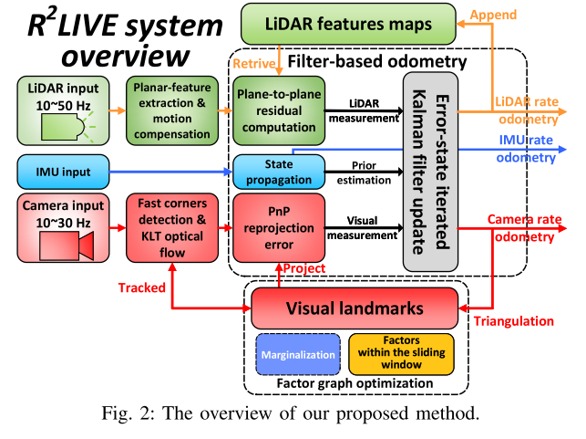
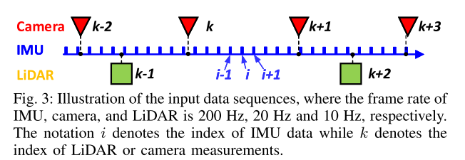
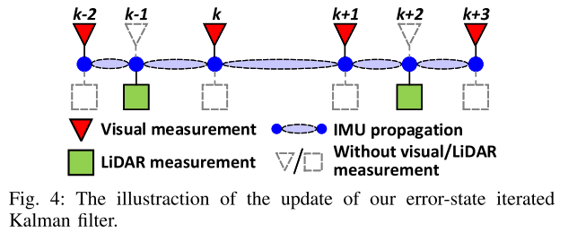

# R2Live: A Robust, Real-time, LiDAR-Inertial-Visual tightly-coupled state Estimator and mapping

## Reference

- https://arxiv.org/pdf/2102.12400.pdf
- https://github.com/hku-mars/r2live

## 写在前面

从前几年开始SLAM方法就已经在探索视觉和lidar多传感器融合的方法了，RXLive也是其中非常具有代表性的一种方法，其使用ESKF的方法进行位姿的实时推算，同时能达到不错的效果；

本文笔者主要关注如下几点：

1. 特征间如何融合；
2. ESKF如何进行观测的更新；

----

## 符号表达

首先还是先搞清楚符号表示，本文涉及的符号还是相当多的，这里就先整理最基础的，有些变量在后面推导的时候再进行定义：

- 理想的状态变量记作：$\mathbf{x_i}$，实时估计的状态变量记作：$\mathbf{\hat{x}_i}$，在IEKF的迭代中，后验的状态变量记作：$\mathbf{\check{x}}_{i}$；

- IMU的状态变量为：
  $$
  \mathrm{x_i=\left[{}^{G}R_{I_i}^{T} \quad {}^{G}p_{I_i}^{T} \quad {}^{I}R_{C_i}^{T} \quad {}^{I}p_{C_i}^{T} \quad {}^{G}v_{I_i}^{T} \quad {}^{G}b_{g_i}^{T} \quad {}^{G}b_{a_i}^{T} \right]^{T}}
  $$

- 

---

## 整体方法

整个论文的框架如下所示：

可以看到整个框架是两路独立的观测进行状态的更新操作，因此其实涉及到两路观测的更新的时序问题，作者这里也给出了时序图：

因子图如下：

可以看到，整个框架并不强依赖两路传感器都能进行观测，有一路的观测就能进行状态变量的更新。

整个框架使用滤波的方法（IESKF）来保证算法的实时性，所以笔者也按照滤波方法的两个阶段来进行后面文章的总结：

### 预测阶段

滤波方法的预测阶段主要就是对于状态的递推以及协方差矩阵的计算，状态的递推不难，这里不再赘述，我们主要关心协方差矩阵的计算；

这里作者使用的依旧是ESKF中的协方差传播公式，即
$$
\mathrm{\Sigma_{\delta{\hat{x}_{i+1}}}}=\mathrm{F_{\delta{\hat{x}}}\Sigma_{\hat{x}_{i}}F_{\delta{\hat{x}}}^{T}+F_{W}QF_{W}^{T}} \tag{1}
$$

其中$\mathrm{F_{\delta{\hat{x}}}}$ 为 $\mathrm{\delta{\hat{x}}}$ 的状态传递矩阵，可以使用微分方程配合欧拉法、中点法或者龙哥库塔法进行获取（VINS-MONO和OpenVINS），本文中采用的方法主要是从SE(3)运算的角度（微分方程的原始公式）进行计算，如下：

#### 旋转部分

该部分的推导中共有两处的约等：

1. 该出约等主要由于BCH公式告诉我们在李代数李群上，有 $\mathrm{Exp(X+\delta{X}) \approx Exp(X)Exp(J_{r}(X)\delta{X})}$；
2. 第二处约等发生在合并中，有 $\mathrm{Exp(X)Exp(\delta{X}) \approx Exp(X+J^{-1}_{r}(X)(\delta{X}))}$，这里面由于 X 也是一个极小量，所以 $\mathrm{J_r^{-1}}$ 就退化为单位矩阵；

$$
\begin{aligned}
\delta{\theta}_{i+1} &= \mathrm{Log}(R_{i+1}\boxminus \hat{R}_{i+1}) \\
&=\mathrm{Log((R_{i}Exp(w))^{T}\underbrace{ \hat{R}_{i}Exp(\hat{w})}_{truth}}) \\ 
&\approx \mathrm{Log((R_{i}Exp(w))^{T}R_{i}Exp(\delta{\theta}_{i})Exp(w)Exp(-J_{r}(w)(\delta{b_g}+n_g))} \\
&=\mathrm{Log(\underbrace{Exp(w)^{T}Exp(\delta{\theta}_{i})Exp(w)}_{Exp(Exp(w)^{T}\delta{\theta}) \quad \text{detail in append}}Exp(-J_{r}(w)(\delta{b_g}+n_g))} \\
&=\mathrm{Log(Exp(Exp(w)^{T}\delta{\theta_{i}})Exp(-J_{r}(w)(\delta{b_g}+n_g)))} \\
&\approx \mathrm{Exp(w)^{T}\delta{\theta_{i}}-J_{r}(w)(\delta{b_g+n_{g}})}
\end{aligned} \tag{2}
$$

> Append
>
> 这里可以将Exp(w)看做一个旋转矩阵，将 $\mathrm{Exp(\delta{\theta_{i}})}$ 使用罗戈里格斯公式展开，就可以得到下面的结论：
> $$
> \mathrm{RExp(\theta)R^{T}}=\mathrm{Exp(R\theta)} \tag{3}
> $$

#### 位移部分

这里笔者和论文中的推导的结果不完全一样，论文中推导的结果最后有 **在body系下** 观测对于位移的项，也就是加速度对于位移的影响，但是因为整个位移和速度都是 **在world系** 下的，因此笔者认为并不应该出现，且从论文的微分方程的角度来看，作者在位移的微分中仅仅考虑了速度，因此该部分笔者在推导的过程中仅仅考虑了速度：
$$
\begin{aligned}
\delta{p}_{i+1} &= p_{i+1} - \hat{p}_{i+1} \\
&=p_{i}+v_{i}\Delta{t} - \hat{p}_{i}-\hat{v}_{i}\Delta{t} \\
&=\delta{p}_{i} + \delta{v}_{i}\Delta{t}
\end{aligned} \tag{4}
$$

#### 速度部分

速度部分也有两处约等，不过较为常规，一处是极小量处罗德里格斯公式展开，一处是极小量的忽略；
$$
\begin{aligned}
\delta{v}_{i+1} &= v_{i+1}-\hat{v}_{i+1} \\
&=v_{i}+\mathrm{R}_{i}a_{i}\Delta{t}-\hat{v}_{i}-\mathrm{\hat{R}}_{i}\hat{a}_{i}\Delta{t} \\
&=\delta{v}_{i}+\mathrm{\hat{R}_{i}Exp(\delta{\theta})}(\hat{a}_{i}-b_a-n_a)\Delta{t}-\mathrm{\hat{R}}_{i}\hat{a}_{i}\Delta{t} \\
&\approx \delta{v}_{i}+(\mathrm{\hat{R}_{i}(I+\lfloor\delta{\theta}\rfloor_{\times}(\hat{a}_{i}-b_a-n_a))}) - \mathrm{\hat{R}}_{i}\hat{a}_{i}\Delta{t} \\
&\approx \delta{v}_{i}-\mathrm{\hat{R}_{i}\lfloor\hat{a}_{i}\rfloor_{\times}\delta{\theta}}\Delta{t}-\mathrm{\hat{R}_{i}(b_a-n_a})\Delta{t}
\end{aligned} \tag{5}
$$

#### 外参部分

外参部分比较简单，因为系统状态传递过程中并没有能够更新的量，因此 i+1 时刻的内外参在更新时默认为 i 时刻的值；
$$
\begin{aligned}
{}^{I}\delta{\theta}_{c}&=I \\
{}^{I}\delta{p}_{c}&=I
\end{aligned} \tag{6}
$$

### 更新部分

更新部分作者为了提升整个方案的精度，使用IEKF的思路对观测进行多次迭代更新，也就是我们熟悉的I(E)KF，推导部分可以参考[here](https://zhuanlan.zhihu.com/p/66646519)；

在IEK的推导最后，笔者也强调推导过程中的状态量均按照标量推导，如果涉及到流形的运算时，则整个公式中四则运算都要按照流形的规则进行运算，在本文中作者无疑是在流形上进行的运算，因此在公式中会有流形加减带来的一些李代数到李群的映射矩阵；

这里先给出作者构建的MAP问题：
$$
\begin{array}{l}
\min _{\delta \tilde{\mathbf{x}}_{k+1}}\left(\left\|\check{\mathbf{x}}_{k+1} \boxminus \hat{\mathbf{x}}_{k+1}+\mathcal{H} \delta \check{\mathbf{x}}_{k+1}\right\|_{\Sigma_{\delta \tilde{\mathbf{x}}_{k+1}}^{-1}}\right. \\
+\sum_{j=1}^{m_l}\left\|\mathbf{r}_l\left(\check{\mathbf{x}}_{k+1},{ }^L \mathbf{p}_j\right)+\mathbf{H}_j^l \delta \check{\mathbf{x}}_{k+1}\right\|_{\Sigma_{\alpha_j}^{-1}}^2 \\
\left.+\sum_{s=1}^{m_c}\left\|\mathbf{r}_c\left(\check{\mathbf{x}}_{k+1},{ }^C \mathbf{p}_s,{ }^G \mathbf{P}_s\right)+\mathbf{H}_s^c \delta \check{\mathbf{x}}_{k+1}\right\|_{\Sigma_{\boldsymbol{\beta}_s}^{-1}}^2\right) \\
\end{array} \tag{7}
$$
可以看到整个MAP问题由三部分构成：

1. 第一行表示的是先验约束项，也是IEK方法特有的一项，防止后验值和先验值相差过大；
2. 第二行表示的是lidar观测的约束项，后面的补充项也是IEK方法的特有项；
3. 第三行表示的是camera观测的约束项，后面的补充项也是IEK方法的特有项；

后面笔者依次进行推导：

#### 先验约束项

先验约束项目的是为了防止最终的优化值和先验值差距太大，在IEKF更新中，每次的迭代都需要考虑迭代后状态变量和先验的误差，即：
$$
f(\check{\mathbf{x}}_{k+1}) = \check{\mathbf{x}}_{k+1} \boxminus \hat{\mathbf{x}}_{k+1} \tag{8}
$$
这部分推导论文中也给的比较明确，如下：
$$
\begin{aligned}
\mathbf{x}_{k+1} \boxminus \hat{\mathbf{x}}_{k+1} & =\left(\check{\mathbf{x}}_{k+1} \boxminus \delta \check{\mathbf{x}}_{k+1}\right) \boxminus \hat{\mathbf{x}}_{k+1} \\
& \approx \check{\mathbf{x}}_{k+1} \boxminus \hat{\mathbf{x}}_{k+1}+\mathcal{H} \delta \check{\mathbf{x}}_{k+1} \\
& \sim \mathcal{N}\left(\mathbf{0}, \boldsymbol{\Sigma}_{\delta \hat{\mathbf{x}}_{k+1}}\right),
\end{aligned} \tag{9}
$$
其中状态转移矩阵 $\mathcal{H}$ 的公式如下：
$$
\mathcal{H} = \frac{(\check{\mathrm{x}}_{k+1}\boxplus\delta{\check{\mathrm{x}}_{k+1}})\boxminus\hat{\mathrm{x}}_{k+1}}{\delta{\check{\mathrm{x}}}_{k+1}}|_{\delta{\check{\mathrm{x}}}_{k+1}=0} \tag{10}
$$
 $\mathcal{H}$ 矩阵的形式也比较简单，只有旋转部分涉及到BCH公式中的雅克比矩阵；

公式（9）其实给出来一个非常重要的结论就是先验误差项的一阶展开是要满足均值为零，方差为 $\Sigma_{\delta \hat{\mathbf{x}}_{k+1}}$  的正太分布。所以不难得到 $\delta{\check{\mathrm{x}}_{k+1}}$ 满足如下分布：
$$
\delta \check{\mathbf{x}}_{k+1} \sim \mathcal{N}\left(-\mathcal{H}^{-1}\left(\check{\mathbf{x}}_{k+1} \boxminus \hat{\mathbf{x}}_{k+1}\right), \mathcal{H}^{-1} \boldsymbol{\Sigma}_{\delta \tilde{\mathbf{x}}_{k+1}} \mathcal{H}^{-T}\right) \tag{11}
$$
公式（11）的第一项比较简单，就是一个逆映射的关系，第二项指导了迭代过程中协方差的更新方式（如果没有李群和李代数的相互运算，则协方差可以不更新）；

#### LIDAR观测约束项

lidar的观测约束也比较简单，主要参考LOAM的平面约束，假设 ${}^{L}p_{j}$ 是当前lidar的扫描点，则：
$$
{}^{G}p_{j}={}^{G}\check{\mathrm{R}}_{I_{k+1}}({}^{I}\mathrm{R}_{L}{}^{L}p_{j} + {}^{I}\mathrm{p}_{L})+{}^{G}\check{\mathrm{p}}_{I_{k+1}} \tag{12}
$$
在全局系下进行平面拟合，得到最近处的平面法向量为 $\mathbf{u}_j$，则误差项如下：
$$
\mathrm{r}_{l}(\mathrm{x}_{k+1},{}^{L}p_{j}^{gt})=\mathrm{r}_{l}(\mathrm{x}_{k+1},{}^{L}p_{j})+\mathbf{H}_{j}^{l}\delta{\check{\mathrm{x}}}_{k+1}+{}^{G}\alpha_{j} \tag{13}
$$
其中：

- $ {}^{L}p_{j}={}^{L}p_{j}^{gt}+n_{j}, n_{j}\sim \mathcal{N}(0, \Sigma_{n_j}) $；

- $\mathbf{H}$ 矩阵为观测矩阵，形式如下，具体的数值推导很多论文中都有，这里不再详述；
  $$
  \mathbf{H}=\frac{\partial{r_{l}(\check{\mathrm{x}}_{k+1} \boxplus \delta{\check{\mathrm{x}}}_{k+1},{}^{L}p_{j})}}{\partial \delta{\check{\mathrm{x}}}_{k+1}}|_{\delta{\check{\mathrm{x}}_{k+1}}} \tag{14}
  $$

- ${}^{G}\alpha_{j}$ 为 lidar 的观测噪声，笔者在原文的基础上添加了一个坐标系的上标，原本的噪声存在于lidar系中，后面要随着转换关系转换到全局坐标系下，传递矩阵为：
  $$
  \mathbf{F}_{\mathrm{p}_{j}}={}^{G}\check{\mathrm{R}}_{I_{k+1}}{}^{I}\mathrm{R}_{L} \tag{15}
  $$
  所以噪声满足如下的高斯分布形式：
  $$
  {}^{G}\alpha_{j}\sim\mathcal{N}(0, \mathbf{F}_{P_{j}}\Sigma_{\alpha_{j}}\mathbf{F}_{P_j}^{T}) \tag{16}
  $$

- 

#### Camera观测约束项

