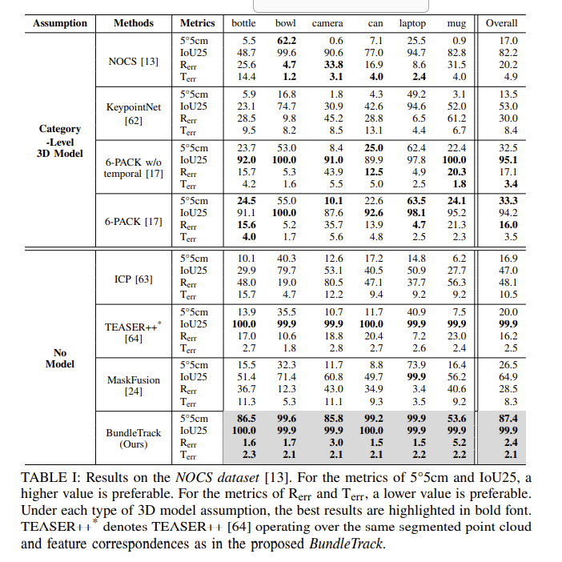
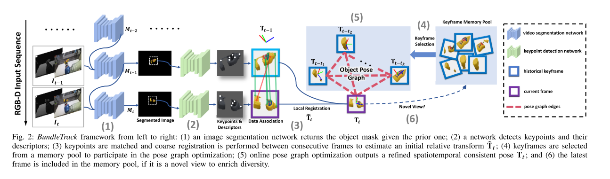
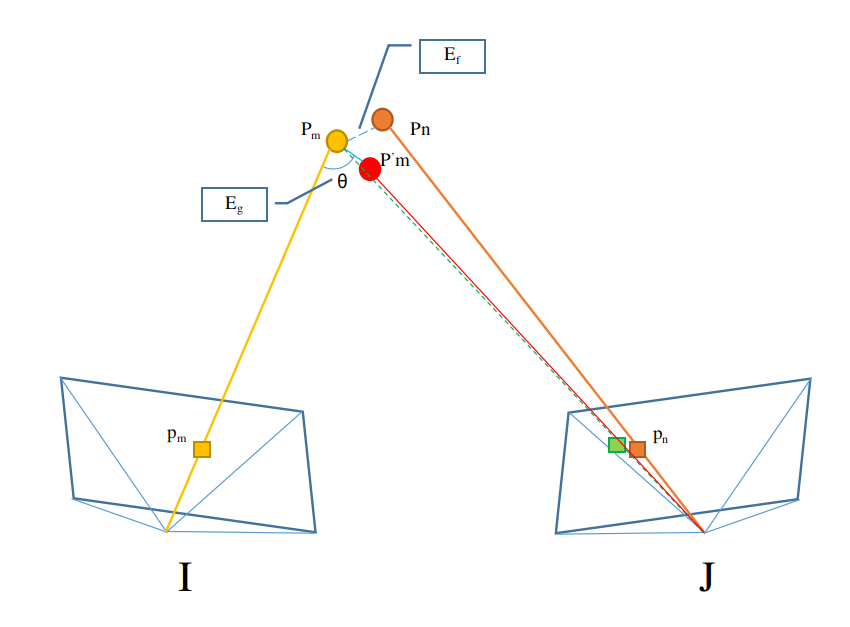
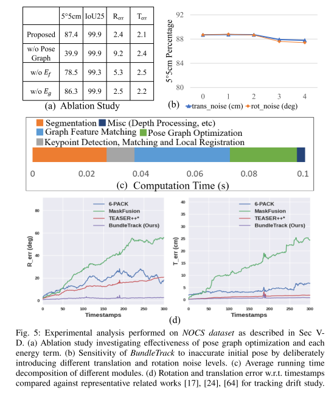
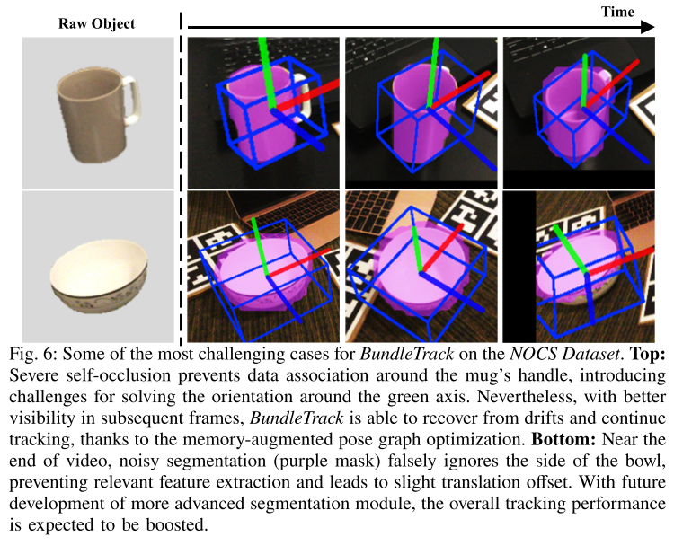

# BundleTrack: 6D Pose Tracking for Novel Objects without Instance or Category-Level 3D Models

----

## 写在前面

上一篇总结了语义SLAM的开山之作——Probabilistic Data Association for Semantic SLAM，总结的时候也觉得该论文使用了物体的模型文件，觉得不是那么的普适，然后就看到了这篇论文，主要还是因为该论文的方法效果拔群，直接给出论文中的对比结果。

可以看到简直不要太强。最重要的是这篇论文是深度学习辅助几何方法的方法，也是笔者一直比较看好的一个方向。

&nbsp;

----

## 解决什么问题

作者在摘要中也简单的讲到很多物体的6D自由度估计问题都需要用到物体的模型文件，离线的训练搭配在线的跟踪，而bundle track则不需要知道物体的模型文件，作者将深度学习的分割、匹配方法结合pose graph的思路来对物体的自由度进行时空一致性估计，同时作者也用CUDA实现了10HZ实时版本，代码在https: //github.com/wenbowen123/BundleTrack。

&nbsp;

-----

## 方法

### 符号Notation

首先还是把使用的符号说清楚：

- 每一帧的RGB-D数据表示为 $I_t$；
- 每一帧的检测物体的mask图表示为 $M_t$，其是一个二值图；
- 每一帧的位姿在相机坐标系的表示为 $T_{\tau}$，真实在tracking的位姿是 $T_{0->\tau}$，也就是物体的初始位姿到 $\tau$ 时刻的相对位姿。

### 整体的方法

整个算法的整体思路作者用一个图表示出来，如下：

作者把整个方法分为五个要点，这里也简单的说一下自己的理解与收获。

#### 物体分割的传播（Propagating Object Segmentation）

这一步如整体流程图中的第一部分所示，主要是使用网络将RGB-D的信息以及上一帧的Mask当做输入进行当前物体的分割，得到当前物体在视野中的Mask $M_t$，所以整个算法是需要一个初始的Mask来告诉算法要跟踪那个物体的。

#### 关键点的匹配和注册（Keypoint Detection, Matching and Local Registration）

通过上一部分的追踪算法，这部分已经能够得到图像中的ROI区域，这部分作者通过网络提取2D图像ROI中的特征点和描述子，然后进行匹配，当然匹配点可能会因为segment的问题而有一些outlier，此时使用RANSAC方法，每次使用三个点进行相对位姿的估计，之后选择内点最多的模型。这里有个问题就是如果特征点比较少，这个部分的可信度是不是会比较低？

#### 关键帧的选取策略

当前帧的初始位姿得到之后，就要参与到后续的位姿优化中，作者维护了一个keyframe pool，其中的关键帧数量为 $\mathcal{N}$，作者希望选出其中 $\mathcal{K}$ 个关键帧来进行位姿图的优化，这里就涉及到一个选取关键帧的策略，作者把这个问题建模为 minimum H-subgraph of an edge-weighted graph problem，整个目标函数如下：
$$
\begin{aligned}
\mathop{argmin}_{x} &\mathop{\sum}_{i \in N} \mathop{\sum}_{j \in N, j\ne i }x_{i}x_{j} arccos(\frac{tr(R_i^TR_j-1)}{2}) \\
s.t &\mathop{\sum}_{i \in N}x_i=\mathcal{K} \quad x_i\in \{0, 1\},i \in N 
\end{aligned} \tag{1}
$$
可以看到该选择方法和SVO中的关键帧选取差不多，也是看两个位姿的视角，选择视角差足够大的关键帧作为参与优化问题的节点。

#### 位姿图优化

上述过程之后，我们就可以进行位姿优化了，假定选择了 k 个关键帧，那么整个图描述为 $G=\{V,E\},|V|=k+1$，在这个图中，每个node的位姿表示为 $T_i,i \in |V|$，其时间戳表示为 $\tau=t-t_k，k=1...K$，当 k = 0 时，表示为当前帧。

边的表示如下：
$$
\begin{aligned}
\mathbf{E}&=\mathop{\sum}_{i \in |V|} \mathop{\sum}_{j \in |V|, j \ne i}(\lambda_1 E_{f}(i,j) + \lambda_2 E_g(i,j)) \\
\mathbf{E_f}(i,j)&=\mathop{\sum}_{(m,n) \in C_{i,j}}\rho(\|\mathrm{T_i^{-1}p_m - T_j^{-1}p_n}\|_2) \\
\mathbf{E_g}(i,j)&=\mathop{\sum}_{p\in |I_i|}\rho(\|n_i(x) * \underbrace{ |\mathrm{T_iT_j^{-1} \underbrace{ \pi_{D}^{-1}\underbrace{(\pi(T_jT_i^{-1}p))}_{\text{image pixel in j frame}}}_{\text{point in j frame}} - p}|}_{\text{normalize residual vector}} \|_2)
\end{aligned} \tag{2}
$$
作者将该损失函数称为时空一致性的损失函数，说说笔者个人的理解：

- $\mathbf{E_f}$ 表示空间上的一致性，其中$C_{i,j}$ 表示 i 帧和 j 帧的特征点匹配对，将两者投影到空间上看看误差多大；

- $\mathbf{E_g}$ 表示时间上的一致性，当 i 帧上的点经过向 j 帧的投影反投影之后，与原先点的连线的角度应该要在对应的射线上；

- 这里笔者稍微修改了一下公式，因为按照论文中的意思，两个向量应该都必须是单位向量，计算的其实是角度的误差；

- 上述两个residual如下图所示，其中 $\mathrm{P^{'}_{m}}$ 表示第 i 帧的一个点经过映射反映射之后的位置，绿色的虚线其实和红色的线应该是重合的，这里为了表示存在中间的一个过程而画的稍微开了一些：

  

#### 关键帧的增加

这里依旧是以视角为阈值进行筛选，当新的帧与所有关键帧的视角相差10°以上时，认为有新的视角了，则添加到关键帧中。

&nbsp;

-----

## 分析

记录一下作者进行的一些分析，主要的分析结果如下，其中：

1. a实验是笑容学习，可以看到每一个上面的误差函数以及步骤都能帮助准确率大幅上升；
2. b实验是随机添加了4cm以内的位置扰动，可以看到对于整体的性能影响不大，所以算法的鲁棒性还是很强的；
3. c实验是时间统计，看到整体而言算法的性能还是很强的；
4. d实验是对于近年来的工作进行了对比，整体而言BundleTrack的性能还是最好的；

最后是作者对于一些失效情况的分析，主要给出了两种情况，第一种是自我遮挡，导致yaw轴的估计会因为匹配的关系而变差，但是后期视角变好之后又可以及时矫正过来；第二种情况是分割不佳导致估计出的位置有些许偏差；如下图：

&nbsp;

----

## 总结

整体来说，笔者觉得整个方法还是不难的，但是看了消融实验之后又觉得每个步骤其实都是作者不断的实验和总结得到的结果，确实是相当的厉害了，也是借此来致敬很多将现有方法做到极致的科学家和研究员们。

最后，看起来真要学习一下CUDA和OpenCL了。