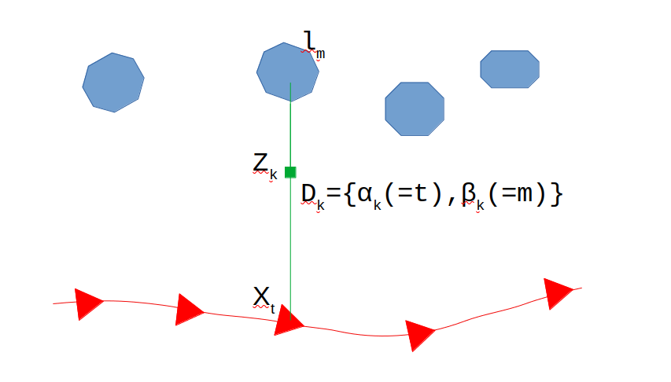
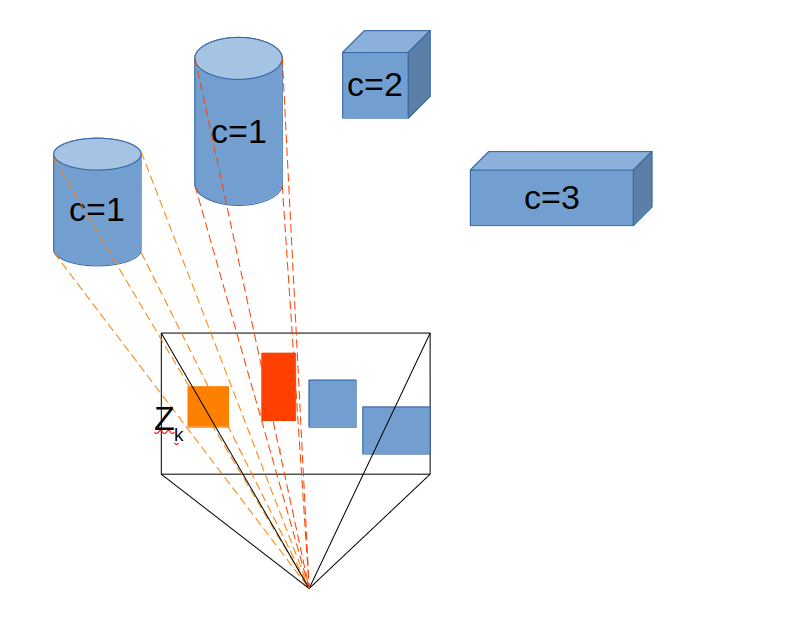

# Probabilistic Data Association for Semantic SLAM

----

## 写在前面

最近开始入门学习语义SLAM的知识，先从大名鼎鼎的开山之作Probabilistic Data Association for Semantic SLAM看起，后续会以周为单位更新一些文章的总结以及收获。

*这篇文章笔者属于看懂了，但是没有想懂，最后会给出自己的疑惑，也希望明白的大佬可以解惑一下。*

&nbsp;

----

## 要解决什么问题

笔者一直都是从事传统SLAM算法的研究工作，所以面对的都是点线面等比较简单的几何特征，对于物体级的特征其实之前确实没有仔细想过如何去处理。

在传统的SLAM工作中，匹配或者跟踪其实占据了一个很重要的位置，我们知道，对于前端的优化问题而言，有两个很重要的因素：对应点集和优化问题的初值。

- 对应点集的获取通常就是特征点匹配或者光流跟踪，两种方法各有好坏，这里不做赘述；
- 优化问题初值也是一个很关键的部分。如果初值选择的不好，那么优化是很容易就飞掉的，所以各种 VO/SLAM 框架均在这给定比较好的初值方面做了不少工作（例如ORB的匀速模型、DSO的5中运动模型假设等）。

回到语义SLAM中，假如空间中有一个静态的物体 $\mathcal{M}$（真正意义上的landmark），相机在运动过程中连续观测到了很多的物体 $\mathcal{Z\in\{z_k\}}$，那么我们如何知道那些观测是对应到静态物体 $\mathcal{M}$ 呢？在传统SLAM中，我们容易通过匹配或者跟踪的方法来确定某些观测属于同一个几何结构，但是对于物体级别的特征而言，并没有很好的方法来确定这件事情。

这篇文章其实就在解决这件事情。

&nbsp;

----

## SLAM优化问题的构建

这部分从理论上给出了作者的主要思路——通过 EM 的方法来解决未知关联情况下的SLAM问题。

### 符号Notation

假设SLAM过程如下图所示，其中：

- 蓝色的块为landmark，表示为$\mathcal{L=\{l_m,m= 1...M\}}$；
- 红色的线为机器人/摄像头的轨迹，三角为关键帧，表示为$\mathcal{X=\{x_t}, t=1...T\}$；
- 绿色的方块为观测，表示为$\mathcal{Z=\{z_k}, k=1...K\}$，传统SLAM中就是特征点的位置，本文中是检测到的各种物体的类别和bounding-box位置；
- 绿色的线表示关联关系，表示为$\mathcal{D}=\{D_k=\{\alpha_k, \beta_k\},k=1...K\}$，可以看到连接关系理论上是和观测的数量是一致的，这和传统SLAM中的关联关系数量吻合，但是在本文提出的全概率模型下，这个数量笔者认为是不一致的，后面会详细说明；

所以整个SLAM问题的概率表达式如下，也就是带着关联关系的最大似然问题：
$$
\mathcal{\hat{X}, \hat{L}, \hat{D}} = \mathop{argmax}_{\mathcal{X, L, D}} \mathrm{log} p(\mathcal{Z|X, L, D}) \tag{1}
$$
可以看到，其实SLAM问题也要估计的最佳的匹配关系。

&nbsp;

### 传统的方法

传统的SLAM方法其实将整个过程拆分为了两个部分：**根据初值求解关联关系** 和 **根据初值和关联关系求解优化变量**，如下：
$$
\begin{cases}
\mathcal{\hat{D}} = \mathop{argmax}_{\mathcal{D}} \mathrm{log} p(\mathcal{D|X^{0}, L^{0}, Z}) \\
\mathcal{\hat{X}, \hat{L}} = \mathop{argmax}_{\mathcal{X, L}} \mathrm{log} p(\mathcal{Z|X, L, \hat{D}})
\end{cases} \tag{2}
$$
这样做的缺点比较明显：

- 关联关系比较 hard，确定了就不能更改，一些 outlier 要在优化步骤中去除，且去除就不可恢复；
- 无法随着位姿更好而重新连接上应有的观测；

&nbsp;

### 本文的方法

回顾上图中的变量，所有的变量中，除去待优化的变量，观测可以通过几何结构提取方法和目标检测方法获得，只有关联关系是无法显式获得的，也就是是一个隐变量，于是作者想到用 EM 方法进行求解整个带隐变量的优化问题，公式如下：
$$
\begin{aligned}
\mathcal{X^{i+1}, L^{i+1}}&=\mathop{arg max}_{\mathcal{X, L}} \mathbb{E}_{\mathcal{D}}\left[\mathrm{log}p(\mathcal{Z|X, L, D})|\mathcal{X^{i}, L^{i}, Z}\right]  \\
&=\mathop{arg max}_{\mathcal{X, L}} \mathop{\sum}_{\mathcal{D}\in\mathbb{D}} p(\mathcal{D|X^{i}, L^{i}, Z}) \mathrm{log}p(\mathcal{Z|X, L, D})
\end{aligned}
\tag{3}
$$

> 简单介绍一下笔者理解的 EM 算法，借用李航博士的统计学习方法中抛硬币的例子，已知三个硬币的概率为$\pi, p, q$，先抛第一个硬币，如果是正面抛第二个，反之抛第三个，随后记录N次的实验结果，求解三个硬币的概率是多少。
>
> 该问题的求解里面隐含了每次实验结果到底是由第二个硬币得到的还是第三个硬币得到的这个变数——隐变量，EM 算法的核心就是把隐变量代入到问题中，将整个问题变为全概率模型。但是我们并不知道隐变量的概率到底是什么，所以在 EM 算法中会根据每次迭代的初值更新隐变量的概率，随后更新其他变量。
>
> 所以 EM 算法是一个迭代算法，同时会因为优化初值的不同得到不同的结果。上述公式是 EM 算法的基本公式。

下面就主要是对公式（3）进行变换了：

首先将 $p(\mathcal{Z|X, L, D})$ 使用关联关系 $D$ 进行替换，因为观测都是独立同分布的，得到：
$$
p(\mathcal{Z|X, L, D})=\mathop{\sum}_{k=1}^{K}p(\mathrm{z|x_{\alpha_k}, \mathcal{l}_{\beta_{k}}}) \tag{4}
$$
将公式（4）代入到公式（3）中可得：
$$
\begin{aligned}
\mathop{arg max}_{\mathcal{X, L}} \mathop{\sum}_{\mathcal{D}\in\mathbb{D}} \mathop{\sum}_{k=1}^{K} p(\mathcal{D|X^{i}, L^{i}, Z}) \mathrm{log}p(\mathrm{z|x_{\alpha_k}, \mathcal{l}_{\beta_{k}}}) 
\end{aligned} \tag{5}
$$
注意到目前为止，我们的关联关系数量还是和观测数量一致，也就是这个关联关系还是 hard 的，是一对一的匹配，但是语义的观测我们并不知道这个匹配，所以要将这个离散的对应变为概率的乘积，变换如下：
$$
\begin{aligned}
\mathop{arg max}_{\mathcal{X, L}}& \mathop{\sum}_{\mathcal{D}\in\mathbb{D}} \mathop{\sum}_{k=1}^{K} p(\mathcal{D|X^{i}, L^{i}, Z}) \mathrm{log}p(\mathrm{z|x_{\alpha_k}, \mathcal{l}_{\beta_{k}}}) \\
&=\mathop{arg max}_{\mathcal{X, L}}\mathop{\sum}_{k=1}^{K} \mathop{\sum}_{j=1}^{M} w_{kj}^{i} \mathrm{log}p(\mathrm{z|x_{\alpha_k}, \mathcal{l}_{j}}) 
\end{aligned} \tag{6}
$$
整个公式其实对如下的几点做了变换：

- 将观测对应的 landmark 的下标变为了 j，同时因为本来 $\beta_k$ 是映射到一个 landmark 下标的，而变换了之后，j 的范围就变为了所有的 landmark，所以添加了一层关于 landmark 数量的求和；
- 将隐变量的条件概率变为了 $w_{kj}$，看下标可以看到该概率是第 k 个观测连接第 j 个 landmark 的概率；
- 公式（6）上面的外层求和被合并到了 $w_{kj}$ 中：$w_{kj}^{i} = \sum_{D\in\mathbb{D}(k,j)}p(\mathcal{D|X^{i}, L^{i}, Z})$；

容易看出来，整个公式经过这样的变换之后，基本上就比较对应 EM 算法的两个步骤了，其中内层是 E 步，求在初值下的期望；外层是 M 步，求解期望的最大值。

&nbsp;

----

## 语义SLAM

整个系统中除了语义信息，还加入了几何结构特征和惯性器件的约束，这里重点放在语义约束的部分，看一下作者是如何把 EM 用在整个SLAM问题中的。

假设检测的类别为 $C=1...\mathcal{C}$ 在关键帧中的语义观测为：$S_{t}=\{s_k=(s_{k}^{c},s_{k}^{s},s_{k}^{b})\}$，$s_{k}^{c}$ 是第 k 个观测是那个类， $s_{k}^{s}$ 表示预测是这个类别的得分，$s_{k}^{b}$ 表示观测到的bounding-box信息。

看公式（6）的话其实我们需要计算两个部分，观测的条件概率 $p(\mathrm{z|x_{\alpha_k}, \mathcal{l}_{j}})$ 和隐变量的概率 $w_{kj}$ ，分别来看这两个部分。

### 观测的条件概率 $p(\mathrm{z|x_{\alpha_k}, \mathcal{l}_{j}})$ 

文章中将下标 j 又换回去了，这里没有换，公式如下：
$$
p(s_k|\mathrm{x_{\alpha_k}},\mathcal{l}_{j})=p(s_{k}^{c}|\mathcal{l}_{j}^{c})p(s_k^s|l_{j}^{c},s_k^c)p(s_k^b|\mathrm{x_{\alpha_k}},l_{j}^{p}) \tag{7}
$$
深度看一下：

- $p(s_{k}^{c}|\mathcal{l}_{j}^{c})$ 表示第 k 个观测在第 j 个landmark 是 c 物体时候的概率，这个容易理解，只要是 c 物体的 landmark 在这里应该都是1，能够滤掉不是 c 物体的landmark；
- $p(s_k^s|l_{j}^{c},s_k^c)$ 表示第 k 个观测是第 j 个landmark，且这个landmark 是 c 物体的得分，也就是识别网络给出的置信度；
- $p(s_k^b|\mathrm{x_{\alpha_k}},l_{j}^{p})$ 表示在位姿 $\mathrm{x_{\alpha_k}}$ 和 landmark 的位置 $l_j^p$ 的前提下，对于bounding-box的重投影误差；

整体来看，前两项与网络强相关，与后面的优化问题关系不大，而最后一项是与优化问题比较相关的。

### 隐变量的概率 $w_{kj}$

这里直接给出文中的结论：
$$
\begin{aligned}
w_{kj}^{t,(i)}&=\mathop{\sum}_{l^c\in\mathcal{C}}\mathop{\sum}_{D_t\in\mathbb{D}_{t}(k,j)}\mathcal{k}^{(i)}(\mathcal{D}_t,l^{c}) \quad \forall t,k,j \\
\mathcal{k}^{(i)}(\mathcal{D}_t,l^{c}) &=\frac{p(S_t|\mathcal{X}^{(i)},\mathcal{L}^{(i)},\mathcal{D}_t)}{\mathop{\sum}_{l^c}\mathop{\sum}_{D\in\mathbb{D}}p(S_t|\mathcal{X}^{(i)},\mathcal{L}^{(i)},\mathcal{D}_t)}
\end{aligned} \tag{8}
$$
注意：

- 上面公式的两个求和是对全部参数空间中的一部分进行求和；
- 下面公式的求和是对全部参数空间求和；

该公式也符合 EM 算法中使用初解求解隐变量的步骤，笔者总结如下图：

比如视野中一共有4个观测，其中两个圆柱属于同一类别，那么对于观测 k（黄色的检测），由于我们并不知道该观测是属于那个圆柱，根据公式（8），算法会根据当前的位姿以及两个圆柱的3D空间位置，将两个圆柱都对 $z_k$ 这个观测的 bounding-box 做重投影误差，之后转为概率（误差越大，概率越小），假设概率为a, b，则观测 k 属于第一个圆柱的概率就是 $a/(a+b)$，属于第二个圆柱的概率为 $b/(a+b)$。多个物体的类似。

&nbsp;

----

## 实验部分

上述的公式及分析其实已经把迭代问题讲清楚了，但是还没有涉及如何初始化一个新的 landmark，文中给出了一种方法。在新的关键帧到来之后，进行语义信息的提取，之后计算该观测与所有landmark的马氏距离（个人猜测依旧是重投影误差），如果该距离都大于阈值，则新建landmark，同时该landmark的深度由在检测框内的点深度的中值给定（什么？框内没有点或者这些点没有深度？那就给个固定值或者整个场景的深度中值）。

&nbsp;

----

## 总结

本文算是比较详细的总结了一下语义SLAM的开山之作，对个人来讲也是引发了一个物体匹配级别的思考与收获。但是还是有一个地方没有特别的理解，比如建立的 landmark 的3D bounding-box是怎么得到的？提前准备好的模型文件亦或是其他的办法？（看论文给出的效果感觉像是提前准备好的模型文件）。