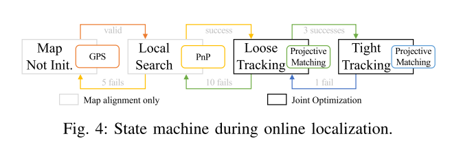

# Road Mapping and Localization Using Sparse Semantic Visual Features

----

## 写在前面

最近比较忙哈，本来期望每周都能精读一篇论文的，结果上周就夭折了。这次的论文是Li Mingyang大佬的论文，主要的目标场景是自动驾驶方向，从论文的题目上看可以知道作者主要是想用稀疏的语义信息进行见图和定位，笔者主要关注的地方有三点：

1. 如何对语义信息建模；
2. 如何进行语义级的匹配；
3. 如何将语义信息融合到优化问题中；

&nbsp;

-----

## 解决什么问题

近年来虽然视觉的定位方法有了很好的研究，大多数的视觉方法也都还是基于关键点的方法，这样的方法一方面需要提取很多的特征点进行处理，计算压力比较大，另一方面就是常被诟病的收到光照、季节的影响相当大。

基于此，作者的方法就是在建图的时候仅仅包含“永久的（persistent）”和“简要的（compact）”的要素，包括标准的交通信号指示、车道线、路灯等等（作者这里使用了**垂直方向的交通牌、路灯 和 水平面上的指示线、车道线**）。当然目前也有一些工作想做相同的事情，但是作者指出，已有的一些工作都是使用几何方法初始化语义框内的点，一个很大的弊端就是这些点并不一定是真正的稳定识别的，作者基于这个缺陷也是给出了自己的**一套方法**，这里整个方法包括重新设计了神经网络进行符合作者要求的语义检测以及后面的SLAM过程。

&nbsp;

------

## 方法

首先祭出整个的流程图

可见整个工作其实是两部分：离线的建图和在线的定位。

&nbsp;

### 建图部分

文章比较重的篇幅都在写如何进行建图，主要是根据已有的一条轨迹以及Keyframe进行整个位姿和语义物体的位姿的优化。这里按照文章的节奏来。

#### 符号表示（Notation）

文中符号比较多，如下：

- c: 表示关键帧；
- a: 表示检测到的语义物体，包括上面说的 **垂直方向的指示牌、路灯** 和 **水平方向的指示线**；
- b: 表示样条曲线，主要表示车道线，这里车道线的种类也比较多，包括虚线和实线；
- i: 表示关键帧 c 中物体 a 中的第 i 个点，表示为 $(.)_{a^{i}}^{c}$ ；
- k: 表示样条曲线的第 k 个控制点，表示为 $(.)_{b^{k}}$；
- m, n: 对于车道线的检测，作者又进行了更详细的划分，m表示实线车道线的samples，而n表示虚线车道线的corners；

#### 道路特征的选择

如上所述，在特征的选择上，作者在垂直方向和水平方向都选择了一些目标，如下：

&nbsp;

#### 特征提取

上面的示意图看到对于整个目标的检测上，角点的提取相当的稀疏且准确（给我superpoint的感觉），后续作者称这些点为 deep feature，同时对于车道线这个目标而言，作者期望检测到一些边缘的点，称之为sample（笔者认为这些点可能并不是deep feature），基于这些需求，作者基于CenterNet设计了下述的多头神经网络：

其中1）~3）的任务为：1）物体框和角点的检测；2）车道线，这里主要是指连续的实线；3）车道线虚线及其角点。

简单讲讲作者的理解：对于物体框的检测来说比较常规，这里不多叙述，笔者比较关心的其实是 lane 和 line 的检测，可以看到作者也是单独加了一些 head 用于更好的识别车道线。

&nbsp;

#### 特征的追踪

这里就根据物体的不同进行不同的策略，但是该阶段的匹配均是在图像上进行的。首先就是根据 IMU 的积分得到两帧之间的相对位姿，然后根据物体是水平还是竖直的采用不同的策略：简单而言，在地面的物体因为视角的问题两帧之间相同的像素块会有相当大的仿射畸变，因此使用传统的光流和匹配方法会导致不准确，所以作者采用了其他的方法。

##### 当物体是水平时，即特征在地面上

作者使用当前的位姿以及相机与车体的外参构建一个地面的平面表达：$\mathbf{G=[cos(\theta)cos(\phi),cos(\theta)sin(\phi),sin(\theta),d]}$（这里唯一需要特别注意的是这个平面的表达式是在camera系下的，也就是 z 轴向前，x 轴向右，y 轴向下），之后使用射线场（ray-ground）的方法得到特征点在摄像方向与地平面的交点，即（看后面的部分时发现作者把 d 的值域设置为了 $\R_{3}$，个人感觉应该是笔误）：
$$
\mathrm{G x} = \mathrm{ [cos(\theta)cos(\phi),cos(\theta)sin(\phi),sin(\theta)]x + d} =0 \tag{1}
$$
随后根据 IMU 积分得到的相对位姿，将这些点投影到临近帧上：
$$
p'=\pi(T' . \pi'(p,z_p)) \quad \text {with } \mathrm{G.\pi'(p,z_p)}=0 \tag{2}
$$
关于匹配部分，作者使用 instance-wise 和 pixel-wise 的方式结合匈牙利匹配方法 （Hungarian matching strategy） 进行联合的关联：

- instance-wise 的关联关系使用检测框的IOU，对于 车道线 就使用边线构成的多边形计算IOU；
- pixel-wise 的关联关系使用重投影误差；

不难看出，上述的两种关系在计算的时候都是多对多的场景，这里就有一个分配的关系在，对于IOU而言，我们希望正确的关联使得关联对的IOU最大，而重投影误差则相反，我们希望他的残差最小。这个分配问题作者使用匈牙利匹配算法进行求解，讲道理这个问题也和上一篇论文中的 maximum weighted bipartite matching problem（最大加权二值分配问题）很像。

##### 当物体是垂直时

特征点位于垂直方向时，作者主要使用GFTT（good feature to track）提取特征点的位置，之后使用光流的方法进行追踪，同时提取特征点的FREAK描述子（这些点作者后续称为 classical feature），唯一比较大的问题就是垂直方向的物体可能会包含比较多的背景点，作者后续使用平面拟合的方法进行了去除外点。

&nbsp;

#### 车道线的表示和初始化

车道线的表示在整个论文中是唯一一个被提及的观测表示方法，事实上稍微了解的同学不难知道，在自动驾驶的场景中，车道线其实一般都是比较长且平滑的，但是这并不意味着车道线很容易表示（高阶曲线因为其数学表达的问题导致一定会存在弧度），本文作者使用了cubic Catmull-Rom样条曲线来一段一段的对车道线进行表示：假设有曲线的控制点 $C_k \in \R_3$，那么连续的四个控制点就可以表示一个形状$C(t')\in\R_3，t’\in[0,1]$：
$$
C(t')=
\begin{bmatrix}t'^{3} \\ t'^{2} \\ t' \\ 1\end{bmatrix}^{T}
\begin{bmatrix}-\tau & 2-\tau & \tau-2 & \tau \\ 2\tau & \tau-3 & 3-2\tau & -\tau \\-\tau & 0 & \tau & 0 \\ 0 & 1 & 0 & 0 \\ \end{bmatrix}
\begin{bmatrix}C_{k-1} \\ C_{k} \\ C_{k+1} \\ C_{k+2}\end{bmatrix} \tag{3}
$$
其中 $\tau$ 是一个形状系数，取为0.5。

假设在一段连续的车道线观测中（因为一定会有路口，所以车道线必然是一长段一长段的），我们通过公式（2）将关键帧中的车道线点都投影到地面上，假设这些点为 $P_{bj},j\in \{1...N\}$，作者首先随机取其中一个点，之后在周围的 $\{0.5\lambda,1.5\lambda\}$ 区间内向两边扩充（其中 $\lambda$ 取值为40m），得到 M 个点，设置为控制点 $C_k,k\in\{2...M+1\}$，之后为了控制曲线的两个端点，作者又设置了两个离线点 $C_1,C_{M+2}$，所以一共有M+2个点来描述整个 N 个点的线段。

那么对于关键帧 c 中的观测点 $P_{cj}$，首先使用最小距离垂直的特点求解公式（3）中的参数 $t'$（其实我们能看到，这个 $t'$ 其实是一个关联关系的变量，因为这个变量直接决定了观测点的目标比对点，所以后面作者还是会对这个变量进行优化），使用最小距离垂直公式
$$
C'(t_{cj})(C(t_{cj}) - P_{cj}) = 0 \tag{4}
$$
可以粗略的求得关联变量 $t_{cj}$，当然笔者最开始其实一直在纠结这个片段到底是用那些个控制点，后来发现作者应该是每四个依次进行对比的，原话是

> we explicitly solve the parameter tcj through the equation $C'(t_{cj})(C(t_{cj})−P_{cj}) = 0$ piece by piece，The real roots of the quintic equation stands for possible stationary points, which are then compared with all integers between [2,N+1] to pick up the global minimum point-to-curve residual.

所以这个部分笔者感觉应该是可以优化一下速度的，比如根据当前关键帧的范围设定一个比较的范围。

得到了关联变量 $t_{cj}$ 之后，我们就可以优化所有的控制点了，作者建模为如下的优化问题：
$$
\begin{aligned}
\mathop{argmin}_{C_k} &\mathop{\sum}_{c,j}\|P_{cj} - C(t_{cj})\|^{2}_{{}^{x}\Omega} + \mathop{\sum}_{k=3}^{M+1}\||C_k - C_{k-1}|-\lambda\|^{2}_{{}^{y}\Omega} \\
\text{with } &\langle C_1, \beta \rangle = 
\begin{cases}
|C_2-C_1|=|C_3-C_2| \text{ point in a sphere } \\
\beta N_2 = \tau(C_3 - C_1) \text{ point in a line }
\end{cases}
\end{aligned} \tag{5}
$$
整个优化分为两个部分，第一个是 on-the-line 的控制点部分，1）对点到曲线的误差最小化；2）对两个点之间的间隔做约束。下面又解了 off-the-line 的点，这两个点最大的作用就是可以通过 $C_1, C_2, C_3, C_4$ 来表示那些在 $C_2$ 附近的点（多加一个点很重要的原因就是因为cubic Catmull-Rom样条的中间控制点其实是很重要的，如果不额外添加两个辅助点，在 $C_2$ 前面的点其实并不能跟很好的被表达），这部分也比较简单，$N_2$ 就是在 $C_2$ 附近找一些点恢复出该点的方向，$\beta$ 感觉是一个适配变量。

> 简单讨论一下优化的必要性，这也是笔者觉得比较亮点的地方。
>
> 首先一点，本文的车道线是在3D坐标系下表示的，这就涉及到一个很重要的问题，当前帧使用ray-ground方法得到的 Z 值在远处必然是不准确的，这在坑洼的地面、上下坡的时候表现尤为明显。所以路面上同一个点，远处观测到该点的帧恢复的点 $P_{k-1}$ 与近处恢复的点 $P_{k}$ 的值必然是不同的，但是因为是随机选取策略，并不能保证每个点都取到最好的恢复点。
>
> 因此在选取了控制点之后，对其进行整体的优化可以使得整个控制点的分布更好（纯属个人理解）。

&nbsp;

#### 优化部分的设计

经过上面的步骤，我们其实就得到了很多的观测了，此时作者将这些观测用在紧耦合的Visual-Inertial中的框架中，主要的优化变量如下：

1. 关键点的位置 $P_a$，这些点分布在水平和垂直方向上，特别的，作者使用逆深度的参数进行优化；

2. **相机坐标系** 下的地面平面表示 $G=\{\theta, \phi, d\}$，这个平面表示主要结合公式（1）为地面物体的点提供位置先验；

3. **世界坐标系** 下的垂直平面表示 $V=\{\varphi,e\}$，这个平面主要通过公式 
   $$
   V_a(\varphi, e)\mathrm{x} = [cos(\varphi), sin(\varphi), 0]\mathrm{x} + e \tag{6}
   $$
   

   为垂直平面的点提供位置先验；

4. 车道线的样条控制点 $C_{b^k} \in \R_3$；

5. 车道线的关联变量 $t_{b^j}^{c}$，这里注意上下标，因为我们在初始化车道线的时候已经得到了一些关联变量，所以对于关键帧 c 上的点 j，其实我们是知道它属于哪一段样条曲线的，记为 $b^{j}$；

6. 当然还有最基本的变量：关键帧的位置 $T_c$（其实个人感觉应该还有速度bias等的信息？）；

下面是约束的形式：

1. 位姿和关键点位置的约束：
   $$
   \mathrm{f_{a^i}^{c}=\|p^{c}_{a^{i}}-\pi(T_{c}^{-1}P_{a^i})\|^{2}_{\Omega^{c}_{a^i}}} \tag{7}
   $$

2. 位姿、样条控制点和动态关联变量的约束：
   $$
   \mathrm{f_{b^j}^{c}=\|p^{c}_{b^{j}}-\pi(T_{c}^{-1}C_b(t_{bj}^{c}))\|^{2}_{\Omega^{c}_{b^j}}} \tag{8}
   $$

3. 地面点（包括样条的控制点）和垂直点的位置约束：
   $$
   \begin{aligned}
   \mathrm{f_{a^i}^{c}}&=\mathrm{\|V_aP_{a^i})\|^{2}_{\Omega^{c}_{a^i}}} \\
   \mathrm{f_{x}^{c}}&=\mathrm{\|G^{c}(T_c^{-1}P_x^{c})\|^{2}_{\Omega_{x}^{c}}} 
   \end{aligned}\tag{9}
   $$
   补充一点，这里笔者给地面向量 $G$ 添加了关键帧的下标，因为按照作者和公式的说法，该平面表示就是在关键帧中的表示，符合预期。

因子图如下，开始笔者觉得这图啥玩意，后来觉得这图真NB，唯一比较confuse的一点就是最下方的ground被连成一条整线了，个人觉得应该是分着的：

关于上面优化变量的初始化部分，可以直接看论文的部分，比较简单，这里不再赘述。

然后作者补充说上述的优化在建图的时候是全部进行的，但是在**在线的定位**时，关键点和控制点的3D位置都被fix住，然后平面的约束也不再需要了，符合预期。

&nbsp;

#### Re-id和特征融合

这部分也比较重要，因为不可避免有时候会检测不出来、跟丢或者是位置不太准确导致同一个物体位于不同平面上，传统SLAM中使用BOW进行相似度检查，之后融合，而对于交通上的标识和场景而言，这样的方式很容易出错，因此作者使用的是3D-3D的instance-wise的方法进行语义物体融合。

作者认为如果两个垂直物体的中心距离不超过 5 m，则认为两者是同一个物体；如果两个车道线（个人感觉主要是指虚线）的中心距离不超过 0.5 m，则两者是同一车道线。

认识是同一物体其实是简单的，不过笔者没有特别的看懂作者是如何进行特征点的merge的。

&nbsp;

#### 地图存储的结构

作者在存储地图的时候存下了observer $\mathcal{O}$（关键帧），以及landmark $\mathcal{L}$，以及用于连接关键帧和landmark的共视关系 $\mathcal{G}$，在关键帧最近的GNSS数据也保留。

&nbsp;

### 定位部分

定位部分的流程图如下：

#### Initialization

使用GNSS 数据粗略的定位到 $T_{M}$；

#### local search

找到$T_M$附近30m 内的关键帧 $\mathcal{O}_M \in \mathcal{O}$，之后通过共视关系得到所有的观测点，这些观测点当然会来自于不同的物体。随后通过2D-3D PnP-RANSAC的方法进行特征点关联，如果在 5 个不同物体的点有 12 个内点的话，认为匹配是成功的，之后更新 $T_M$。

#### tracking

这部分主要就是构建当前帧与地图中元素的关联关系了，从前面 **优化部分设计** 中作者说道，在线定位的过程中仅有公式 （7）（8）在发挥作用，因此这部分我们需要特别关注的就是地图的信息如何和当前帧的检测产生关联关系的。

作者的方法是将所有的地图元素投影到当前帧上：

- 在 **loose** 方法中，作者将地图中的 deep feature 投影到当前帧上，之后与当前帧的 deep feature 计算重投影误差，当然两者都属于同一个物体，如果误差在 30 pixel 以内，就认为这个点可能是匹配点，当然 30 pixel 是一个比较广泛的范围了，随后进行匈牙利分配算法进行关联；
- 在 **tight** 方法中，作者将 deep feature 和 classical feature 都投影到当前帧上，之后与当前帧上的 deep feature 和 classical feature 进行重投影误差，两者都要属于同样的物体，如果 deep feature 的投影误差在 20 pixel 以内，classical feature 的误差在 3.0 pixel 以内，这里之所以阈值不同是因为 deep feature 其实在物体上是比较少的（比如交通牌可能就三四个），但是 classical feature 是很多的（比如交通牌上可能会有不少角点），同样进行依次匈牙利算法进行关联；

> 这里笔者没有看到对于连续车道线关联的相关内容，因为在论文中，连续车道线中没有deep feature（笔者个人认为网络对于车道线边缘的输出不叫deep feature），可能会有一些 classical feature。不过车道线的关联更多的是动态关联参数 $t_{cj}$ 的求解。

&nbsp;

-----

## 总结

整个论文的东西其实还是很多的，其中有很多后关联算法使用了匈牙利分配算法，笔者感觉整个工程量还是挺大的，从最后的结果来看效果很好。

回答一下最开始的关注点：

Q: 如何进行语义信息的建模？

A: 这里建模主要是针对车道线了，作者使用 cubic Catmull-Rom样条曲线 进行表示，主要的好处是能够分段表达，且在段内不会存在特别大的误差；同时内含关联变量，可以动态的优化使得关键最好。对于其他的物体，主要使用的还是 deep feature 和其中的 classical feature 来表示该物体。

Q: 如何进行语义级的匹配？

A: 在 tracking 阶段，垂直方向的物体使用光流的方法进行跟踪，而水平方向因为仿射变换较大，使用 instance-wise 和 pixel-wise 的方法进行级联匹配（最终是要匹配到点的）；而对于车道线，主要是求解垂脚方程来得到初始的匹配关系，后面再进行优化。在后面的re-id 阶段，主要使用3D-3D的方法来判断两个物体是不是同一个物体，如果是同一个物体，则后面融合他们的观测。

Q: 如何将语义信息融合到优化问题中？

A: 因为前面匹配做了大量的关联工作，所以这部分主要就是重投影误差了，同时优化了车道线的 控制点和关联变量，比较好的是对 水平和竖直3D点 分别添加了平面约束。

 