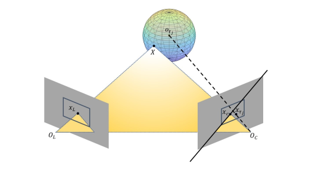
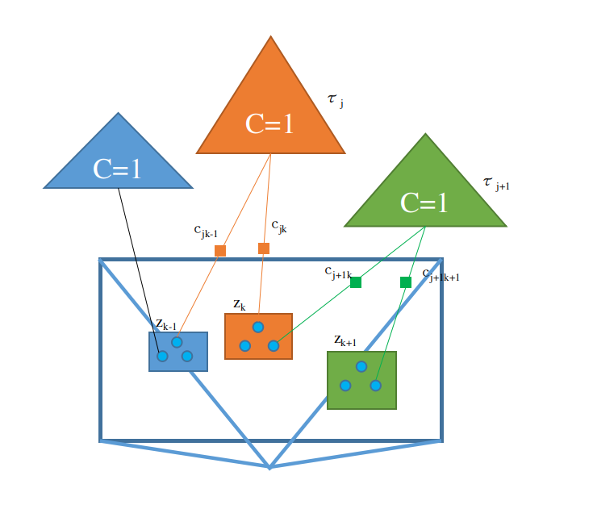
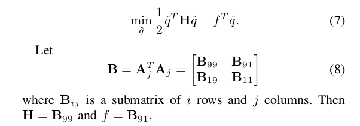
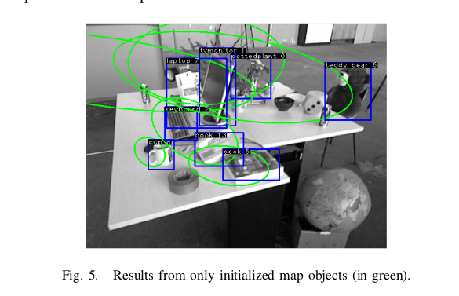
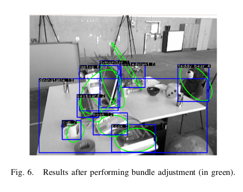

# Semantic SLAM with Autonomous Object-Level Data Association

----

## 写在前面

本篇依旧是关于数据关联的语义SLAM，整个文章并没有给出实际的对比数据（个人感觉这个方法可能要再经过一些工作才能变得更加成熟），但是笔者个人感觉文章的想法和做法都是相当不错的，这里依旧是简单的写一下总结和收获。

&nbsp;

----

## 解决什么问题

在 Probabilistic Data Association for Semantic SLAM 文章中，作者使用 EM 方法动态的估计物体与观测的匹配关系，但是最后也讲到，文章的方法 **应该是** 需要事先准备好的CAD模型文件；而到了BundleTrack，我们看到完全舍弃了模型，使用特征匹配的方法结合RGB-D输入估计当前帧中要追踪物体的位姿，但是依旧用到了depth图；而本文希望通过纯视觉的方法，同时不用模型文件，建立起物体的模型以及物体级的匹配关系，该模型和关联关系同时又能很好的使用在 BA 中。

于是涉及到两个问题：

1. 如何进行物体级的匹配；
2. 如何进行物体级的建模，包括建模方式、初始化以及优化；

&nbsp;

---

## 方法

### 符号Notation

首先还是说明一下符号：

- 图像表示为 $I_t$，表示 t 时刻的图像；
- 语义的观测表示为 $S_t=\{z_k|z_k=\{b_k,c_k,s_k\}\}$，其中 $b_k$ 表示bounding-box，$c_k$ 表示物体的类别，$s_k$ 表示置信度；
- 物体标记为 $\tau$，第 j 个物体就是 $\tau_{j}$；

&nbsp;

### 物体级的匹配

整个方法的思路笔者觉得还是不难的，但是没有讲的特别清楚，只能靠猜测了，主要分为两个步骤，匹配和分配：

#### 匹配的方法

这部分作者主要在bounding-box组成的ROI中提取角点，之后提取描述子并转化为BOW的单词，记为 $v^{z}$，为匹配做准备。

#### 分配的方法

承接上一步，当我们有了观测，如何得知要和那个物体进行匹配呢？比如对于一个观测 $z_k$，它的物体类型是 a，则：

- 遍历所有的是该类型的物体，之后通过几何的方法进行验证物体是否能与该观测产生关联，如下图，可能的物体标记为 $\tau^{ca}$；

  

- 遍历属于该物体所有的 BOW 单词，设为 $v^{ca}$，之后将观测内的所有 BOW 单词 $v^{z}$ 与 $v^{za}$ 进行比较和求分，得到其中最大的分值 $c_{kj}$，其中 k 表示观测的下标，j 表示第 j 个物体；

- 如果每一帧的观测中所有的物体都仅有一个，那么到这一步其实已经可以了，但是必然会有两个相同类型的物体出现在同一帧画面中，那么就会涉及到分配的问题；

- 作者把这个问题建模为 maximum weighted bipartite matching problem（最大加权二值分配问题），主要公式如下，

  首先引入一个二值变量
  $$
  x_{kj}=
  \begin{cases}
  1 \quad \text{if z_k is assigned to } \tau_j \\
  0 \quad \text{otherwise}
  \end{cases} \tag{1}
  $$
  之后构建优化问题：
  $$
  \begin{aligned}
  \mathop{argmax}_{x_{kj}} &\mathop{\sum}_{\{k:z_k \in S_{t}^{c}\}} \mathop{\sum}_{\{j:\tau_{j} \in \tau^{ca}\}} c_{kj}x_{kj} \\
  s.t. &\mathop{\sum}_{\{k:z_k \in S_{t}^{c}\}} x_{kj} \le 1 \quad \text{对于物体j，要么该帧没有观测（=0），要么仅有一个观测（=1）} \\
  &\mathop{\sum}_{\{j:\tau_{j} \in \tau^{ca}\}} x_{kj} \le 1 \quad \text{对于观测k，要么没有物体对应（=0），要么仅对应一个物体（=1）}
  \end{aligned} \tag{2}
  $$
  笔者总结如下图，公式（2）中其实是在选择那些线保留，那些线要删掉，其中：

  - 第一个约束条件可以由下图中的两个黄线表示，物体 $\tau_{j}$ 可能对应两个观测，但是要和蓝色的C=1物体的观测得分一起，删除掉$c_{jk-1}$，以此来使得目标函数最大；
  - 第二个约束条件可以由下图中的黄线和绿线表示，观测 $z_k$ 可能对应两个物体，但是要和绿色的C=1物体的观测得分一起考虑，删除掉$c_{j+1k}$，以此来使得目标函数最大；
  - 这里面其实涉及到一个博弈的问题，比如可能 $c_{j+1k}$ 比 $c_{jk}$ 的分值要高，但是因为 $c_{j+1k+1}$ 的存在，势必会使得 $c_{j+1k}$ 被抛弃掉；

  

&nbsp;

### 物体的建模

前面说道：本文的方法是无需模型的方法，所以作者并不关系整个物体的具体形状，而是将整个物体构建为一个椭圆（对偶二次曲线），以此来进行投影等操作。

在3D射影空间中，椭圆可以表示为对偶二次曲线：
$$
\begin{cases}
X^{T}QX=0 \\
\pi^{T}Q^{*}\pi=0
\end{cases} \tag{3}
$$
公式（3）上面为点的表示，下面为切面的表示法，两者互为对偶。特别的，如果Q是可逆矩阵，那么 $Q^{*} = Q^{-1}$，且对偶二次曲线中，Q 是对称矩阵。

#### 模型初值的求解

作者使用的是切面的表示方法。我们知道，在检测框架中，一般我们仅能得到bounding-box，而bounding-box可以认为是3D最小外包矩形的最大内包椭圆在图像上的投影，因此理论上我们是可以把bounding-box反投影回去得到物体最小外包椭圆的切平面的。如下，其中 P 是摄像机矩阵：
$$
\begin{aligned}
\begin{cases}
x&=PX \\
I^{T}x&=0 \\
\end{cases}
\end{aligned} \rightarrow \underbrace{I^{T}P}_{\pi^{T}}X=0 \tag{4}
$$
所以对于某个物体 $\tau_j$ 的bounding-box，$\{x_{min},y_{min}\},\{x_{max},y_{max}\}$，同时已知当前位姿和相机内参所构成的摄像机矩阵的话，可以将该矩形的四条线投影为切平面：
$$
\begin{cases}
\Pi^{T}_{k,xmin}=[1,0,-x_{k.min}]P_i \\
\Pi^{T}_{k,xmax}=[0,1,-x_{k.max}]P_i \\
\Pi^{T}_{k,ymin}=[1,0,-y_{k.min}]P_i \\
\Pi^{T}_{k,ymax}=[0,1,-y_{k.max}]P_i
\end{cases} \tag{5}
$$
因为对偶二次曲线为对称矩阵，所以整个矩阵的自由度为10-1=9，所以 $\pi^{T}Q^{*}\pi=0$ 可以表示为如下的线性方程。
$$
[\Pi(1)^2,2\Pi(1)\Pi(2),2\Pi(1)\Pi(3),2\Pi(1)\Pi(4),\Pi(2)^{2},2\Pi(2)\Pi(3),2\Pi(2)\Pi(4),Pi(3)^{2},2\Pi(3)\Pi(4),\Pi(4)^{2}]
\begin{bmatrix}q_1 \\ q_2 \\ q_3 \\ q_4 \\ q_5 \\ q_6 \\ q_7 \\ q_8 \\ q_9 \\ -1\end{bmatrix}=0 \tag{6}
$$
可以看到一个平面提供了一个约束，至少需要9个平面才能将整个约束提供完，当然这9个平面构成的矩阵要可逆。

到这里其实我们看到可以使用SVD进行参数的求解了，但是作者又进一步的构建了一个优化问题，如下：

其实就是公式（6）的L2范数展开。

同时，作者提出了三个检查来确定是否是一个正确的初始化：

- 物体要在每个共视帧视野的前方；
- 相机的主平面与曲线不能相交，防止特别奇怪的曲线；
- 初始化之后物体的中心投影要在所有公式帧bounding-box的内部；

最后，因为求解出来的参数并不一定是一个标准的椭圆，因此作者借鉴3d object localisation from multi-view image detections 中的方法将曲线方式表示为椭圆被旋转和平移之后的表达式：
$$
Q^{*}= \begin{bmatrix} \mathrm{Rdiag(a^2,b^2,c^2)R^{T}-tt^{T}} & t \\ t^{T} & -1  \end{bmatrix} \tag{9}
$$
&nbsp;

#### 模型的优化——Bundle Adjustment

当使用上面的步骤求得了一个初始值之后，下一步其实就是使用模型进行位姿的估计以及物体模型的调优，这里其实隐藏了一个物体的位置，从公式（9）中我们能看到，其实对称矩阵 $Q^{*}$ 中包括了椭圆的朝向和位置了，因此优化了对称矩阵 $Q^{*}$ 其实就优化了物体的位置。

作者构建了一个pose_graph和Bundle Adjustment的联合方法，如下：
$$
\mathcal{X^{*},\tau^{*}}=\underbrace{\mathop{argmin}_{X,\tau}\mathop{\sum}_{i}\|h_{o}(x_{i+1},x_{i}) - u_{i+1}\|_{\sum_{u}}^{2}}_{pose-graph}+\mathop{\sum}_{j}\underbrace{ \mathop{\sum}_{\{i:K_i \in \mathcal{K}_j\}}\|h_{o}(x_{i},\tau_{j})-z_{i}^{j}\|_{\sum_z}^{2}}_{bundle-adjustment} \tag{10}
$$
位姿优化部分不多讲了，主要讲一下如何构建重投影误差：结合公式（4），我们能得到：
$$
\pi^{T} Q^{*} \pi = I^{T}P_i Q^{*} (I^TP_i)^{T} = I^{T} \underbrace{P_iQ^{*}P_i^{T}}_{dual-conic-
projection} I = 0 \tag{11}
$$
所以重投影误差就可以用检测到的bounding-box的四条边界线与物体的投影曲线求解公式（11）所示的代数误差。作者在后面给出了两个图表示该过程是十分有效的，如下图，可以看到整个效果还是好了很多的：

  &nbsp;

----

## 总结

本文作者主要是把物体建模为一个三维射影空间的对偶二次曲线（3D欧式空间的椭圆）来达到不需要考虑物体的实际形状与模型的目的，同时，因为对偶二次曲线可以天然的与bounding-box的边界框线有映射关系，因此可以更好的构建重投影误差，这也是笔者觉得一个很大的收获。

但是如果按照 Probabilistic Data Association for Semantic SLAM 文章的说法，本文还是一个人工设计的规则来进行物体的关联估计，会存在一些理论上的问题，不过笔者觉得问题不大，传统SLAM也这么走过来多少年了，哈哈。

当然，本文中有一些地方没有讲的很清楚，很多地方笔者也是靠猜测。关于模型建模为对偶二次曲线的细节，可以多多参考 《3d object localisation from multi-view image detections》，该文章的分析还是更细致一些。