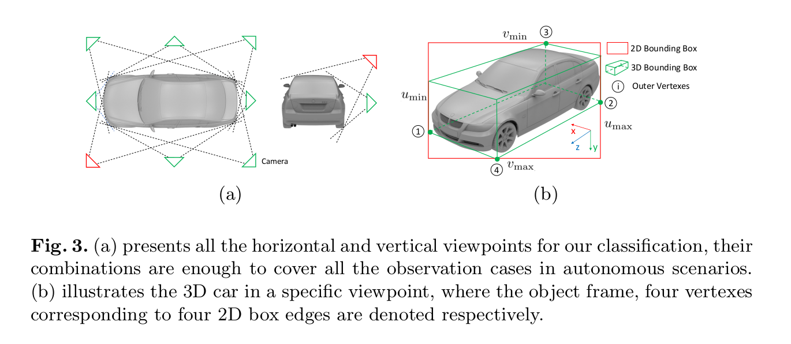

# Stereo Vision-based Semantic 3D Object and Ego-motion Tracking for Autonomous Driving
----

## 闲扯一些

看到最近网上比较火的 “2021年只剩下10%” 的话题，确实也比较感慨，今年确实对于自己来说是比较难过但是又很有收获的一年：

1. 自己动手模仿+魔改了几个开源框架的实现，最后的效果虽然都一般，不过写一遍确实能更好的理解其中的细节，最不济也是练练手了；
2. 写了比较多的文章，一部分文章觉得不错就发了出来，希望能够帮助更多的小伙伴；
3. 自己也从室内机器人的方向切到了自动驾驶方向，接触了更多的Lidar SLAM，SLAM方向的技术栈也全面了一些，同时最近也在做一些神经网络的研究，也是比较有意思的工作；
4. 也在一步一步的学习语义SLAM的东西，算是进一步的扩展自己吧；

当然也有好多未完成的“心愿”：

1. 迟迟未完成的 《多视图几何》 的总结，一是内容确实很多，比较难有大块的时间去啃；
2. 迟迟未完成的 Android 程序的开发。。。
3. 迟迟未开启的 《设计模式》的总结，好吧我就是懒。。。

最后 10% 啦，希望自己和各位小伙伴都能够抓住最后的时间再提升自己一下，就酱。

&nbsp;

----

## 写在前面

本文是18年的关于语义SLAM一个比较经典的文章，笔者看下来感觉整体的思路和效果都是不错的，也是港科沈老师和秦博的工作。

目标场景依旧是自动驾驶方面的，题目中也基本上交代了工作的主要特点：1）双目；2）自车位置的追踪；3）语义3D物体的追踪（论文中主要就是他车了）。这里提前给出笔者通常关心的问题以及作者给出的方法：

1. 如何进行语义信息的建模——作者通过车体的先验尺寸信息来恢复物体在空间中的3D信息；
2. 如何进行语义的匹配——作者构建了一个投票的问题，该问题主要依据几何中心和形状相似度；
3. 如何把语义信息与优化问题关联——采用 **3D box到2D box的投影误差** 和 **物体内部的特征点的投影误差** 进行tight couple的优化；

&nbsp;

-----

## 解决什么问题

首先作者还是主要总结了基于3D检测（注意不是模型）的方法的缺点：

1. 需要大量的数据和标注，特别是因为是3D检测，所以标注起来会很麻烦；
2. 一致性问题，因为语义SLAM本质上还是需要将语义的模型和投影误差等等的优化目标函数建立关系，因此对于观测的一致性要求比较高，所以这种基于3D检测的方法，前后帧的检测一致性比较难保证，因此就比较难取得较好的效果；

基于上述的缺点，作者希望通过2D检测框的方法结合SLAM的几何跟踪方法进行动态物体的跟踪，一方面2D检测的方法比较成熟且稳定，另一方面几何的方法可以取得较为准确的结果。

为了达到上述的目的，作者引入了先验尺寸这个变量（这个尺寸在优化问题中还会优化），这个变量能把动态目标的3D尺寸转变为2D检测框的边界，从而放在优化问题中进行优化；当然，仅仅是这样并不能说作者的方法就比3D检测方法稳定，先不说这个先验尺寸准确度的影响，2D物体的检测也并不是100%的稳定且准确，因此作者由引入了物体内部特征点的检测，帮助构成传统的几何约束，保证约束的正确性。

&nbsp;

----------

## 方法

首先给出整个方法的框架图，整个图其实把整个方法表达的比较清楚了：

### 符号表示（Notation）

因为本文的模块比较分明，所以这里符号笔者也按照模块来进行总结：

#### 3D动态物体相关的符号

- d: 表示车的尺寸信息，$\mathbf{d}=[d_x, d_y, d_z]$；
- p: 表示当前车的位置，$\mathbf{p}=[p_x, p_y, p_z]$；
- $C_{1:4}$: 选择矩阵（selection matrix），根据视角的不同选择不同的矩阵由此从3D尺寸中得到2D检测框的边界；
- $\theta$: 表示当前车的朝向，该朝向是相对于世界系的；
- v: 表示当前车的速度，在车体坐标系下；
- $\delta$: 表示车体的角速度，在车体坐标系下，yaw轴；

#### 优化问题相关的符号

- $s_k$: 语义信息观测，$s_k=\{b_{kl}, b_{kr}, l_k, C_{k1:4}\}$，其中 $b_{kl/r}$ 表示观测的2D 检测框的两个端点，$l_k$ 表示观测的label，$C_{k1:4}$ 表示选择矩阵，该矩阵由网络的输出决定（下面会介绍），k 表示第 k 个物体，所以这个观测其实是匹配过；
- $^{k}\mathrm{f}$: 在第 k 个物体坐标系下特征点的位置，当k = 0 时，表示该特征点位于世界坐标系下，也就是背景点；
- ${}^{n}z_{k}$: 传统特征点观测，${}^{n}z_{k}=\{^{n}z_{kl}^{t}, ^{n}z_{kr}^{t}\}$，其中 $l$ 表示左视图，$r$ 表示右视图，k 表示第 k 个物体，当 k = 0 时，表示该观测是背景点；
- $^{w}\mathrm{x}_{c}$: 表示camera的状态量，$^{w}\mathrm{x}_{c}=\{^{w}R_{c},^{w}p_{c}\}$；
- $^{w}\mathrm{x}_{ok}$: 表示车体的的状态量，$^{w}\mathrm{x}_{ok}=\{^{w}p_{ok},d_{k}, ^{w}\theta_{ok}, v_{ok}, \delta_{ok}\}$， 其中的变量在上面关于3D动态物体相关符号中均有介绍；
- $\mathcal{S}$: 表示所有语义信息观测，$\mathcal{S}=\{\mathbf{s}_k\}_{k=1:K},\mathbf{s}_k=\{s_{k}^{t}\}_{t=0:T}$，注意其中字母整体和斜体的区别；
- $\mathcal{F}$: 表示所有特征点的观测，$\mathcal{F}=\{^{k}\mathrm{f}\}_{k=0:K},^{k}\mathrm{f}=\{^{k}f_{n}\}_{n=0:N}$；

&nbsp;

### 语义检测部分

这部分主要是网络的构成，作者主要采用FAST-RCNN的框架，在该网络的基础上添加了一个子分类器，主要为了对视角进行分类，如下图所示：

网络除了负责对于动态物体车的2D box的检测，同时也需要对看到的视角进行检测，作者预测了水平和上斜处的视角，一共16个位置，在一般的场景中，这些视角足以覆盖所有的观测情况了。

b图中我们可以看到选择矩阵 $C_{1:4}$ 是如何起作用的，当确定了视角之后，理想情况下的2D检测框的四个边界 $\{u_{min}, u_{max}, v_{min}, v_{max}\}$ 就可以通过车的先验尺寸得到，图示应该是在车的上斜方看的情况下得到结果。

&nbsp;

#### 从观测视角推导3D box

上面简单的说了一下图 （b） 是如何来的，下面就是对应的公式：
$$
\begin{aligned}
\begin{cases}
u_{min}=\pi(p+R_{\theta}C_1\mathrm{d})_{u},u_{max}=\pi(p+R_{\theta}C_2\mathrm{d})_{u} \\
v_{min}=\pi(p+R_{\theta}C_3\mathrm{d})_{v},v_{max}=\pi(p+R_{\theta}C_4\mathrm{d})_{v}
\end{cases}
\end{aligned} \tag{1}
$$
其中： 

1. $\{p, \theta\}$ 表示物体在相机坐标系下的中心位置和朝向；
2. $C_{1:4}$ 表示选择矩阵，从视角中推断出来；
3. $\mathrm{d}$ 表示物体的尺寸先验

其中 $\{p, \theta\}$ 两个变量是我们需要从上述的公式中推断出来的，一共是 4DoF 的变量，刚好四个约束。

当然我们看到，因为我们仅仅使用了16个视角，而且尺寸的先验也并不一定是对的，因此必然会有一些误差，但是对于常规的场景而言，该假设是完全够用的。

上述过程我们估计了动态物体在 **相机坐标系** 下的中心位置和朝向，那我们就可以通过公式（1）恢复出物体的3D box的顶点在 **相机坐标系** 下的点，但是这里我们需要八个方程了。

这些点的推断可以在图一中的左下图看到，这里再贴一下“高清大图”，可以看到每个2D检测框中，作者把对应的3D box也绘制了出来，效果还是很可以的：

&nbsp;

#### 特征点的提取和匹配

这里主要讨论的是动态物体部分的特征点提取和匹配。

上章节获得了 **相机坐标系** 下 3D box 的点，这里作者使用这些点产生了动态物体的mask，在该mask中提取动态物体上的特征点，这里主要涉及两个问题：

1. 遮挡问题：因为 3D box 都获取到了，所以就可以通过位置关系得到遮挡的部分，下图中被遮挡车体的部分（黄色以及粉红色的部分）；
2. 截断问题：这个也是常见的情况，例如下图中最右边的紫色区域，这部分作者直接把2D检测框作为mask；

对于当前时刻双目的立体匹配来说：从上一节推断出的物体在 **相机坐标系** 下的位置和尺寸之后，就可以将3D box投影到左右目的图像平面，进而产生左右目的mask，进行ORB特征点的提取（这部分特别注意的是：从后续的点云对齐章节来看，这部分的mask其实是 **3D box的平面投影** 拼接成的，后续会看特征点属于那个平面）；匹配策略上作者使用了极线搜索（epipolar line searching）的方法，猜测应该是用点到线的距离来作为匹配的标准。

对于前后帧的匹配：作者主要采用了加权分值的办法来先匹配物体，之后使用ORB的描述子来进行点的匹配。具体而言：相似度得分由补偿相机旋转后连续图像之间的二维框的中心距和形状相似度（使用opencv中的shape matching？）加权，该步骤是一个从一对多中挑选一个最佳匹配的问题，作者使用的应该是逐一对比取最小的方法，也可以使用之前总结中提到的 匈牙利匹配策略 或者 加权二值分配策略；物体匹配完成之后，使用 ORB 描述子进行点匹配，包含外点的剔除策略。

&nbsp;

### 自车位置跟踪和动态物体跟踪

这部分就是一个二阶段的方法了，示意图如下，简单在介绍一下其中的一些变量：

- ${}^{0}\mathrm{f}_n$：主要是褐色部分的观测，代表场景中的静态点（也就是背景点）；
- ${}^{k}\mathrm{f}_n$：主要是绿色部分的观测，代表动态物体车体上的特征点；

在一阶段中，作者主要使用背景点进行传统的SLAM定位工作，公式如下：
$$
\begin{aligned}
{ }^{w} \mathcal{X}_{c},{ }^{0} \mathbf{f} &=\underset{w{\mathcal{X}}_{c},{ }^{0} \mathbf{f}}{\arg \max } \prod_{n=0}^{N_{0}} \prod_{t=0}^{T} p\left({ }^{n} \mathbf{z}_{0}^{t} \mid{ }^{w} \mathbf{x}_{c}^{t},{ }^{0} \mathbf{f}_{n},{ }^{w} \mathbf{x}_{c}^{0}\right) \\
&=\underset{w \mathcal{X}_{c},{ }^{0} \mathbf{f}}{\arg \max } \sum_{n=0}^{N_{0}} \sum_{t=0}^{T} \log p\left(\left.{ }^{n} \mathbf{z}_{0}^{t}\right|^{w} \mathbf{x}_{c}^{t},{ }^{0} \mathbf{f}_{n},{ }^{w} \mathbf{x}_{c}^{0}\right) \\
&=\underset{w \mathcal{X}_{c},{ }^{0} \mathbf{f}}{\arg \min } \sum_{n=0}^{N_{0}} \sum_{t=0}^{T}\left\|r_{\mathcal{Z}}\left({ }^{n} \mathbf{z}_{0}^{t},{ }^{w} \mathbf{x}_{c}^{t},{ }^{0} \mathbf{f}_{n}\right)\right\|_{{ }^{0} \sum_{n}^{t}}^{2}
\end{aligned} \tag{2}
$$
二阶段主要利用语义的观测量进行车体位置和车体上关键点的更新，构建如下最大后验函数：
$$
\begin{aligned}
{ }^{w} \mathbf{x}_{ok},{ }^{k} \mathbf{f}&={\arg \max _{^{w}\mathrm{x}_{ok},^{k}\mathrm{f}}} p\left({ }^{w} \mathbf{x}_{o k},{ }^{k} \mathbf{f} \mid{ }^{w} \mathbf{x}_{c}, \mathbf{z}_{k}, \mathbf{s}_{k}\right) \\
&={\arg \max _{^{w}\mathrm{x}_{ok},^{k}\mathrm{f}}} p\left(\mathbf{z}_{k}, \mathbf{s}_{k} \mid{ }^{w} \mathbf{x}_{c},{ }^{w} \mathbf{x}_{o k},{ }^{k} \mathbf{f}\right) p\left(\mathbf{d}_{k}\right) \\
&={\arg \max _{^{w}\mathrm{x}_{ok},^{k}\mathrm{f}}} p\left(\left.\mathbf{z}_{k}\right|^{w} \mathbf{x}_{c},{ }^{w} \mathbf{x}_{o k},{ }^{k} \mathbf{f}\right) p\left(\left.\mathbf{s}_{k}\right|^{w} \mathbf{x}_{c},{ }^{w} \mathbf{x}_{o k}\right) p\left(\mathbf{d}_{k}\right) \\
&={\arg \max _{\mathbf{x}_{o k},{ }^{k} \mathbf{f}} \prod_{t=0}^{T} \prod_{n=0}^{N_{k}} \underbrace{p\left(\left.{ }^{n} \mathbf{z}_{k}^{t}\right|^{w} \mathbf{x}_{c}^{t},{ }^{w} \mathbf{x}_{o k}^{t},{ }^{k} \mathbf{f}_{n}\right) }_{\text{特征点部分}} \underbrace{ p\left(\mathbf{s}_{k}^{t} \mid{ }^{w} \mathbf{x}_{c}^{t},{ }^{w} \mathbf{x}_{o k}^{t}\right)}_{\text{3D box 与2D检测框投影}} \underbrace{p\left({ }^{w} \mathbf{x}_{o k}^{t-1} \mid{ }^{w} \mathbf{x}_{o k}^{t}\right)}_{\text{物体的运动}}\underbrace{ p\left(\mathbf{d}_{k}\right)}_{\text{尺寸的先验}}}
\end{aligned} \tag{3}
$$
取负对数函数得到目标函数为：
$$
\begin{aligned}
{ }^{w} \mathbf{X}_{o k},{ }^{k} \mathbf{f}=& \underset{w_{\mathbf{X}_{o k}, k_{\mathbf{f}}}}{\arg \min }\left\{\sum_{t=0}^{T} \sum_{n=0}^{N_{k}}\left\|r_{\mathcal{Z}}\left({ }^{n} \mathbf{z}_{k}^{t},{ }^{w} \mathbf{x}_{c}^{t},{ }^{t} \mathbf{x}_{o k}^{t},{ }^{k} \mathbf{f}_{n}\right)\right\|_{k}^{2} \sum_{n}^{t}+\left\|r_{\mathcal{P}}\left(d_{k}^{l}, \mathbf{d}_{k}\right)\right\|_{\sum^{i}}^{2}\right.\\
&\left.+\sum_{t=1}^{T}\left\|r_{\mathcal{M}}\left({ }^{w} \mathbf{x}_{o k}^{t},{ }^{w} \mathbf{x}_{o k}^{t-1}\right)\right\|_{\sum_{k}^{t}}^{2}+\sum_{t=0}^{T}\left\|r_{\mathcal{S}}\left(\mathbf{s}_{k}^{t},{ }^{w} \mathbf{X}_{c}^{t},{w}^{w} \mathbf{x}_{o k}^{t}\right)\right\|_{\sum_{k}^{t}}^{2}\right\}
\end{aligned} \tag{4}
$$
特征点的误差函数就是双目的重投影误差，一定注意 $^{k}\mathrm{f}_n$ 表示在第 k 个物体坐标系的点，如下：
$$
\begin{aligned}
& r_{\mathcal{Z}}\left({ }^{n} \mathbf{z}_{k}^{t},{ }^{w} \mathbf{x}_{c}^{t},{ }^{w} \mathbf{x}_{o k}^{t},{ }^{k} \mathbf{f}_{n}\right) \\
=&\left[\begin{array}{c}
\pi\left(h^{-1}\left({ }^{w} \mathbf{x}_{c}^{t}, h\left({ }^{w} \mathbf{x}_{o k}^{t},{ }^{k} \mathbf{f}_{n}\right)\right)\right)-{ }^{n} \mathbf{z}_{k l}^{t} \\
\pi\left(h \left({ }^{r} \mathbf{x}_{l}, h^{-1}\left(^w\mathrm{x}_{c}^{t}, \left.h\left({ }^{w} \mathbf{x}_{o k}^{t},{ }^{k} \mathbf{f}_{n}\right)\right)\right)\right)\right) -{ }^{n} \mathbf{z}_{k r}^{t}
\end{array}\right]
\end{aligned} \tag{5}
$$
语义检测框的观测依旧要结合视角的信息，取得3D box在 **图像坐标系** 下的四个边界值的投影误差（注意虽然我们在 **推导3D box中** 算的了物体的朝向，但是这里并不能直接使用这两个变量计算3D box的几个顶点，主要是因为朝向是在平面上的，缺少了倾斜方向的视角信息，得到的顶点可能更不准）：
$$
\begin{aligned}
r_{\mathcal{S}}\left(\mathbf{s}_{k}^{t},{ }^{w} \mathbf{x}_{c}^{t},{ }^{w} \mathbf{x}_{o k}^{t}, \mathbf{d}_{k}\right)=\left[\begin{array}{l}
\pi\left(h_{\mathbf{C}_{1}}\right)_{u}-\left(\mathbf{b}_{k l}^{t}\right)_{u} \\
\pi\left(h_{\mathbf{C}_{2}}\right)_{u}-\left(\mathbf{b}_{k r}^{t}\right)_{u} \\
\pi\left(h_{\mathbf{C}_{3}}\right)_{v}-\left(\mathbf{b}_{k l}^{t}\right)_{v} \\
\pi\left(h_{\mathbf{C}_{4}}\right)_{v}-\left(\mathbf{b}_{k r}^{t}\right)_{v}
\end{array}\right] \\
h_{\mathbf{C}_{i}}=h^{-1}\left({ }^{w} \mathbf{x}_{c}^{t}, h\left({ }^{w} \mathbf{x}_{o k}^{t}, \mathbf{C}_{i} \mathbf{d}_{k}^{l}\right)\right) &
\end{aligned} \tag{6}
$$
动态物体的运动约束，这部分比较简单了，因为状态变量中具有车体的速度和转速，因此当前的位置可以有一个运动模型的先验，约束如下：
$$
\begin{array}{c}
{ }_{\hat{\mathbf{x}}_{o k}^{t}=}\left[\begin{array}{c}
{ }^{w} \mathbf{p}_{o k}^{t} \\
{ }^{w} \theta_{o k}^{t} \\
\delta_{o k}^{t} \\
v_{o k}^{t}
\end{array}\right]=\left[\begin{array}{ccc}
\mathbf{I}_{3 \times 3} & \mathbf{0} & \mathbf{0} & \boldsymbol{\Lambda} \\
\mathbf{0}, & 1 & 0 & \frac{\tan (\delta) \Delta \mathrm{t}}{L} \\
\mathbf{0}, & 0 & 1 & 0 \\
\mathbf{0}, & 0 & 0 & 1
\end{array}\right]\left[\begin{array}{c}
{ }^{w} \mathbf{p}_{o k}^{t-1} \\
w \\
\theta_{o k}^{t-1} \\
\delta_{o k}^{t-1} \\
v_{o k}^{t-1}
\end{array}\right], \boldsymbol{\Lambda}=\left[\begin{array}{c}
\cos (\theta) \Delta \mathrm{t} \\
\sin (\theta) \Delta \mathrm{t} \\
0
\end{array}\right], \\
r_{\mathcal{M}\left({ }^{w} \mathbf{x}_{o k}^{t},{ }^{w} \mathbf{x}_{o k}^{t-1}\right)={ }^{w} \mathbf{x}_{o k}^{t}-{ }^{w} \hat{\mathbf{x}}_{o k}^{t},},
\end{array} \tag{7}
$$
角度作差的时候记得要对角度进行norm。

&nbsp;

### 点云的对齐

这部分笔者感觉是整片文章中的一个比较有意思的地方。在经过了上面的MAP求解之后，我们其实得到了一个相对较好的车体位置和 **在车体上检测出来** 的3D点云，但是这都基于一个前提就是我们使用了 **车的先验尺寸信息** 以及 **认为在视角下 3D box 的投影能完美的契合 2D 检测框** 的假设，这两者其实都给优化问题带来了一定的误差（当然可以通过协方差矩阵进行残差权重的调整），于是作者采用了这样一个后续的步骤进行一些状态的调整。

整个目标函数如下：
$$
^w{\mathbf{x}_{o k}^{t}}=\underset{^w{\mathbf{x}_{o k}}}{\arg \min } \sum_{n=0}^{N_{k}} d\left({ }^{w} \mathbf{x}_{o k}^{t},{ }^{k} \mathbf{f}_{n}\right) \tag{8}
$$
其中 $d\left({ }^{w} \mathbf{x}_{o k}^{t},{ }^{k} \mathbf{f}_{n}\right)$ 表示点到平面的距离，这个平面是在提取特征点的时候确定的，这样做的好处是因为3D点的恢复是靠双目的视差恢复得嘛，会比较准一些。

> 这里最后一点其实笔者没有特别想明白作者为啥要把特征点搞到 **物体坐标系** 下，笔者感觉这样投来投去的又会因为 **位置和朝向** 的误差而增加了不少 特征点位置 的误差。

&nbsp;

----

## 总结

本文作者主要提出了一个二阶段的优化方法来跟踪自车位姿和他车位姿，其中笔者认为比较精髓的点为：

1. 通过根据 **观测视角** 以及 **引入尺寸的先验信息** 使得算法能够由 2D 检测框推断出车体在 **相机坐标系** 下的位置和朝向；
2. 通过 3D box的空间平面信息来制作提取特征点的mask，以此来较为精确的提取车体上的关键点；
3. 也是因为知道了平面信息，最后作者使用点到面的距离来再次fine tune车体的位置，达到点云和3D box空间一致的效果；

整体而言，每次看这种 model free 的方法都会觉得很有收获，一方面是一些建模的知识又增加了不少，另一方面是也能看到几何的约束还是整个SLAM方法中很重要的部分（按照笔者的认知，神经网络在精细的调优上的表现基本永远不可能取代精确的几何约束）。