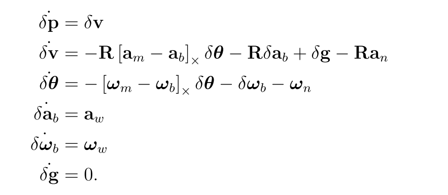
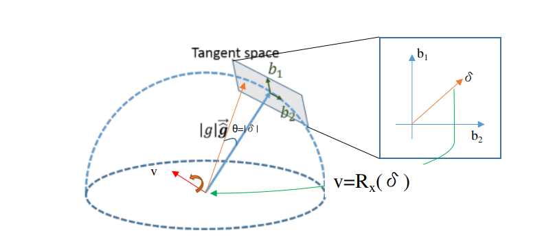
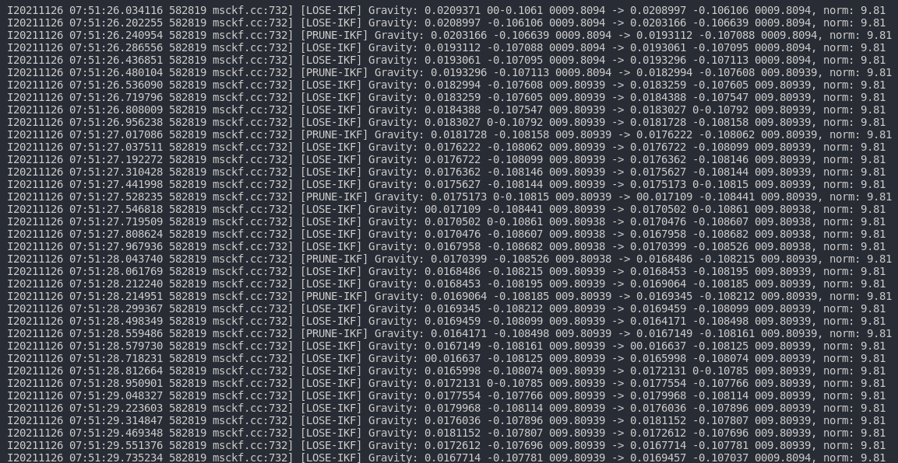

# 一文详解三种重力优化方法

----

## 写在前面

啊哈，又到了一文详解系列，今天探索一个比较不常用的细节点——重力优化。

在VIO的框架中，重力因为在运动方程中进行速度位移的推算，直接影响了里程计的尺度，因此也扮演了一个比较重要的角色，但是目前对于重力这个量的优化的代码其实并不多见，甚至较多的方法和论文中也基本上认为已经有了一个比较好的重力值，因此不做优化。

本文也是自己在写Mono-MSCKF的时候添加的一个优化量，之所以单独的拎出来总结一番主要是因为在FAST_LIO中看到了一种比较好的方法，该方法把重力这个变量建模为一个流型 $S^2$（单位球，四元数是$S^3$），具有相当优雅的理论推导，实践中FAST_LIO使用了一款针对流型开发的开源C++库MTK，代码甚是难懂，这里算是笔者结合MTK论文和代码的一些感悟。

&nbsp;

----

## 摘要

目前在笔者的认知中，重力的优化基本上分为三种方法：

1. 当做3维向量的优化方法，该方法较为简单，缺点也很明显，重力需要在一个半球球面上，而3维向量的方法完全没有考虑这个特点，因此每次优化之后都需要进行归一化；
2. 先作为3维向量进行优化，随后在切平面上进行refine，该方法的代表就是VINS-MONO的初始化了，优点就是把优化下探到了2维切平面上，更接近于重力优化实际的自由度了，缺点依旧是没有考虑重力在半球上的特点，每次优化之后都要归一化；
3. 因为重力变量的维度为3，但是实际调整的自由度为2，参考四元数的表示，我们可以将重力在流型 $S^2$ 进行优化（$S^2 \rightarrow \R^3$），这样的好处是整个优化运算是封闭的！即重力优化后的值会一直在球上，而不必进行多余的归一化操作；

前两种方法比较简单，本文就不做过多的赘述，仅仅简介一下，主要介绍最后一种方法。

&nbsp;

---

## 作为3维向量的优化方法

这部分主要参考Quaternion kinematics for the error-state Kalman filte，这里就不详细推导了，直接给出结论：



&nbsp;

-----

## 后续Refine的方式

这部分主要参考VINS-MONO的论文和代码部分，主要是两个部分：

### Visual Inertial Alignment

算法在这个过程中主要求解的变量为每个预积分时间间隔的速度、整个视觉的尺度以及 **在视觉初始帧上的重力加速度**（这个地方也是笔者认为VINS-Mono工作很细致且合理的地方，因为整个过程中算法并没有依靠任何的先验信息），求解的状态变量如下：
$$
\mathcal{X}_{I}=\left[\mathbf{v}_{b_{0}}^{b_{0}}, \mathbf{v}_{b_{1}}^{b_{1}}, \cdots \mathbf{v}_{b_{n}}^{b_{n}}, \mathbf{g}^{c_{0}}, s\right]
$$

还是先看算法的输入：

- 相机参考系$C_0$下的每个时刻的位姿$T^{c0}_{c_k}=[R^{c0}_{c_k}|p^{c0}_{c_k}],k=0,...,N$；
- IMU坐标系$b$下的每个时间间隔的积分值${p_{bk+1}^{bk}, v_{bk+1}^{bk},k=0,...,N-1}$；

于是可以在相机的参考系$C_0$构建如下的模型：
$$
\begin{aligned}
\begin{cases}
s{^{c0}}p_{bk+1} &= s^{c0}p_{bk}+{^{c0}}v_{bk}\Delta{t}-\frac{1}{2}{^{c0}}g\Delta{t}^2+{^{c0}}p_{bk+1}^{bk} \\
{^{c0}}v_{bk+1} &= {^{c0}}v_{bk}-{^{c0}}g\Delta{t}+{^{c0}}v_{bk+1}^{bk}
\end{cases}
\end{aligned} \tag{1}
$$
在上述公式中，笔者特别把参考系写在了符号的左上角，例如$^{c0}p_{bk}$表示在$C_0$坐标系下，IMU在K时刻的位置；但是我们仅仅有K时刻Camera的位置，这个也很简单，基本上就是一个简单的三角转换关系，图形表示的话如下：


其中：

- $a={^{c0}}p_{ck}$，$b={^{c0}}p^{ck}_{bk}$，$c={^{c0}}p_{bk}$；

- 那么c是需要求解的量，a是视觉得到的量，那么剩下的关键就是b如何得到了，其实也比较简单，因为通常情况下我们知道了IMU与Camera之间的外参$T_{c}^{b}=[R_{c}^{b}|t_{c}^{b}]=[R_{ck}^{bk}|t_{ck}^{bk}]$，那可以看到，外参对应的参考系是K时刻的IMU系，即$b_k$，那转到$C_0$坐标系下也简单，直接转一下就OK了，于是有：
  $$
  \begin{aligned}
  s{^{c0}}p_{bk}&=s{^{c0}}p_{ck}+(-\underbrace{R^{c0}_{bk}p_{ck}^{bk}}_{{^{c0}}p_{ck}^{bk}}) \\
  &=s{^{c0}}p_{ck}-\underbrace{R^{c0}_{ck}(R_c^b)^T}_{R_{bk}^{c0}} p_{c}^{b} 
  \end{aligned} \tag{2}
  $$

所以公式（1）可以进一步写作：
$$
\begin{aligned}
\begin{cases}
p_{bk+1}^{bk} &= R_{c0}^{bk} \left[s({^{c0}}p_{bk+1}-{^{c0}}p_{bk})-R_{bk}^{c0}v_{bk}\Delta{t}+\frac{1}{2}{^{c0}}g\Delta{t}^2\right] \\
&= R_{c0}^{bk} \left[s{^{c0}}p_{ck+1}-R_{bk+1}^{c0}p_{c}^{b}-s{^{c0}}p_{bk}+R_{bk}^{c0}p_{c}^{b}-R_{bk}^{c0}v_{bk}\Delta{t}+\frac{1}{2}{^{c0}}g\Delta{t}^2\right]\\
&= R_{c0}^{bk} \left[s({^{c0}}p_{ck+1}-{^{c0}}p_{bk})-R_{bk}^{c0}v_{bk}\Delta{t}+\frac{1}{2}{^{c0}}g\Delta{t}^2\right]-R_{bk+1}^{bk}p_{c}^{b}+p_{c}^{b}\\
v_{bk+1}^{bk} &= R_{c0}^{bk}({^{c0}}v_{bk+1} - {^{c0}}v_{bk}+{^{c0}}g\Delta{t}) \\
&= R_{c0}^{bk}(R_{bk+1}^{c0}v_{bk+1} - R_{bk}^{c0}v_{bk}+{^{c0}}g\Delta{t}) \\
\end{cases}
\end{aligned} \tag{3}
$$
公式（3）可以理解为一个观测方程，由状态变量$\left[ v_{bk} , v_{bk+1}, {^{c0}}g, s \right]$得到K～K+1时刻IMU积分的值，所以写作矩阵的形式就是：
$$
\hat{\mathbf{z}}_{b_{k+1}}^{b_{k}}=\left[\begin{array}{c}
\hat{\boldsymbol{\alpha}}_{b_{k+1}}^{b_{k}}-\mathbf{p}_{c}^{b}+\mathbf{R}_{c_{0}}^{b_{k}} \mathbf{R}_{b_{k+1}}^{c_{0}} \mathbf{p}_{c}^{b} \\
\hat{\boldsymbol{\beta}}_{b_{k+1}}^{b_{k}}
\end{array}\right]=\mathbf{H}_{b_{k+1}}^{b_{k}} \mathcal{X}_{I}+\mathbf{n}_{b_{k+1}}^{b_{k}} \tag{4}
$$
其中：
$$
\mathbf{H}_{b_{k+1}}^{b_{k}}=\left[\begin{array}{cccc}
-\mathbf{I} \Delta t_{k} & \mathbf{0} & \frac{1}{2} \mathbf{R}_{c_{0}}^{b_{k}} \Delta t_{k}^{2} & \mathbf{R}_{c_{0}}^{b_{k}}\left(\overline{\mathbf{p}}_{c_{k+1}}^{c_{0}}-\overline{\mathbf{p}}_{c_{k}}^{c_{0}}\right) \\
-\mathbf{I} & \mathbf{R}_{c_{0}}^{b_{k}} \mathbf{R}_{b_{k+1}}^{c_{0}} & \mathbf{R}_{c_{0}}^{b_{k}} \Delta t_{k} & \mathbf{0}
\end{array}\right]
$$
那么对于公式（4）的解法就比较多了，可以直接用线性方程的解，也可以用迭代的方式求解，这里就不赘述了。

需要特别注意的一点，在VINS-Mono的实现中，作者在尺度部分引入了一个100倍的系数，个人理解这里并不是权重，应该是怕最终解算出来的的尺度很小，因此想把这个数值变得大一些，防止因为数值问题而导致结果错误。

&nbsp;

### Refine Gravity

算法在获取了初始 的重力加速度之后，又对重力加速度进行了细调，期望找到一个更准的重力加速度，这部分和上部分的理论基本一致，不过对于重力变量的优化，作者采用的是球面坐标的表示方法，论文中给出的图示如下：


其中：

- $|g|$表示标准的重力加速度的模长，$\overrightarrow{g}$表示本次优化的初始重力方向的方向向量；
- $b_1, b_2$表示在Tangent平面上的两个正交向量，当做是优化空间的基底；

那么重写公式（1）有：
$$
\begin{aligned}
\begin{cases}
s{^{c0}}p_{bk+1} &= s^{c0}p_{bk}+{^{c0}}v_{bk}\Delta{t}-\frac{1}{2}({^{c0}}g_0+[b1, b2]\begin{bmatrix}w1 \\ w2\end{bmatrix})\Delta{t}^2+{^{c0}}p_{bk+1}^{bk} \\
{^{c0}}v_{bk+1} &= {^{c0}}v_{bk}-({^{c0}}g_0+[b1, b2]\begin{bmatrix}w1 \\ w2\end{bmatrix})\Delta{t}+{^{c0}}v_{bk+1}^{bk}
\end{cases}
\end{aligned} \tag{5}
$$
于是公式（5）变作：
$$
\begin{aligned}
\begin{cases}
p_{bk+1}^{bk} &= R_{c0}^{bk} \left[s({^{c0}}p_{ck+1}-{^{c0}}p_{bk})-R_{bk}^{c0}v_{bk}\Delta{t}+[b1, b2]\begin{bmatrix}w1 \\ w2\end{bmatrix}\right]-R_{bk+1}^{bk}p_{c}^{b}+p_{c}^{b}+\frac{1}{2}R_{c0}^{bk}{^{c0}}g_0\Delta{t}^2\\
v_{bk+1}^{bk} &= R_{c0}^{bk}(R_{bk+1}^{c0}v_{bk+1}-R_{bk}^{c0}v_{bk}+([b1, b2]\begin{bmatrix}w1 \\ w2\end{bmatrix})\Delta{t})+R_{c0}^{bk}{^{c0}}g_0\Delta{t}
\end{cases}
\end{aligned} \tag{6}
$$
这部分也可以写作线性方程的形式，这里就不赘述了。

&nbsp;

------

## 在流型空间 $S^2$ 的优化方法

这部分主要参考[Integrating Generic Sensor Fusion Algorithms with Sound State Representations through Encapsulation of Manifolds](https://arxiv.org/abs/1107.1119)。

$S^2$ 看名字很像群，毕竟有 $S^3$ 这样的大哥在，但是实际上，$S^1$ 对应$SO(2)$，$S^3$ 对应$SO(3)$，$S^2$ 并不对应旋转，而是对应了单位球这样一个特殊的 3D 几何体，通常我们说球体这个东西是一个流型（manifold），而非一个李群，因为它在实数空间上是不连续的。

不过虽然不是李群，但是这丝毫不影响我们在流型空间上去使用 $S^2$ 来进行单位球面上的变量的更新，具体而言，我们还是可以在 $S^2$ 上定义流型的加法 $\boxplus$ 和减法 $\boxminus$ 来更新流型上的变量。

### 符号表示

这里先列一下符号表示：

- $\mathrm{x}$ 表示流型（也就是单位球）上变量；
- $\delta$ 表示切平面上的变量；
- $R_{\mathrm{x}}(\delta)$ 表示将切平面上的变量映射到三维空间中；

### 具体方法

这里主要参考MTK的实现，它的想法其实很简单：因为变量处于球面上，因此作者就把 **切平面的2维向量** 通过一个 3x2 的矩阵映射到 **3维空间** 中，把这个 **3维向量** 看做为 **旋转向量**，通过 Exp映射 将旋转向量映射为 **SO(3)**，最后变为了旋转矩阵 乘以 位于单位球面上的变量 的方式来保证更新之后的结果依旧在球面上。形成公式如下：
$$
\hat{\mathrm{x}} = \mathrm{x}\boxplus\delta = Exp(R_x(\delta))\mathrm{x} \tag{7}
$$
这个公式就相当熟悉了，其中就差如何把 **切平面的2维向量** 映射到 **3维空间中了**，也就是这个 3x2 的矩阵，其实也比较简单，参考上一章节 refine gravity 的时候的做法，我们也需要在切平面上找到两个向量 $b_1, b_2$，这两个向量满足 $b_k \perp \mathrm{x}， b_1 \perp b_2，\|b_k\|=1$，当然上一章的方法依旧满足这样的要求，不过MTK中给出了更简单的实现，这里以重力为例，$g=[x,y,z]^{T}$：
$$
R_{\mathrm{x}}(\delta)=B_{\mathrm{x}}\delta 
=
\begin{bmatrix}
1-\frac{x^2}{1+z} & -\frac{xy}{1+z} \\
-\frac{xy}{1+z} & 1-\frac{y^2}{1+z} \\
-x & -y
\end{bmatrix}\delta \tag{8}
$$
感兴趣的小伙伴可以自己验证一下这个 $B_x$ 中的两个列向量是单位向量，并且相互垂直且垂直于 $g$ 自身的，更多的方向表示法可以参考[MTK的开源代码](https://openslam-org.github.io/MTK.html)中的S2.hpp中的内容。

因为两个向量都垂直于 $g$，因此映射之后的选转向量也一定垂直于 $g$，其次，两个向量是单位向量且是相互垂直的关系十分重要，主要能够带来两个好处：

1. 因为这样我们的更新量其实就 主宰 了映射到三维空间的旋转向量了，具体而言，假设 $\delta=[a, b]^{T}，B_x=[b_1, b_2]$，则映射之后的三维向量（也就是旋转向量）的模为：
   $$
   \begin{aligned}
   \|R_x(\delta)\|^{2}&=(ab_1+bb_2)^{T}(ab_1+bb_2) \\
   &=a^2b_1^{T}b_1+\underbrace{ abb_1^{T}b_2+abb_2^{T}b_1}_{\text{相互正交，所以为0}}+b^{2}b_2^{T}b_2 \\
   &=a^2+b^2 \\
   &=\|\delta\|^2
   \end{aligned} \tag{9}
   $$
   

   再进一步，旋转向量的模表示这个旋转的角度，所以切空间向量的模的大小决定了旋转的角度，同时切空间的方向也决定了旋转轴的方向，改进一下VINS中的示意图如下，一定注意的是旋转方向要满足右手定则：

   

2. 矩阵 $B_x$ 的逆（严格来说是伪逆）是该矩阵的转置，这个比较好证明，这里不多说。

上面定义完流型的加法之后，还需要定义流型的减法，根据上面的分析我们能看出：

1. 旋转向量 $\mathrm{v}$ 要垂直与更新前和更新后重力的平面，所以方向一定是 $\mathrm{v}=|g \times \hat{g}|$（$\hat{g}$ 为更新后的重力方向，$|.|$表示取模），这里前后关系一定是 **更新前** 叉乘 **更新后**，想不通的就类比于笛卡尔坐标系 xyz 的方向；
2. 旋转的多少可以通过两个向量的 內积 得到；

到这里我们就可以定义减法 $\boxminus$ 了：
$$
\hat{g} \boxminus g = acos(|g|.|\hat{g}|) B_g^{T} \lfloor g \rfloor_{\times}\hat{g} \tag{10}
$$
公式（10）看起来是一个理论上相当稳的形式了，但是事实真的如此吗？有一个很简单的情况就是**当 更新前后 的向量是方向相反的时候，上述公式是失效的！**因为这时候我们说 切平面 的更新量的模应该为$\pi$，但是得到的更新量是0，即公式认为两者相同。

这其实是一个比较奇异的地方，主要的原因就是因为叉乘里面其实也有角度$sin(\theta)$的影响，所以这个部分我们需要着重的进行讨论，这里简单贴一下 MTK 中的方法，它的解法就是当判断出来 叉乘 为0的时候，如果 $\theta > 0$，则直接返回 $[\pi,0]$（当然从理论上来说也可以是$[0, \pi]$），否则返回 $[0,0]$：

```c++
void boxminus(MTK::vectview<scalar, 2> res, const S2<scalar, den, num, S2_typ>& other) const {
    scalar v_sin = (MTK::hat(vec)*other.vec).norm();
    scalar v_cos = vec.transpose() * other.vec;
    scalar theta = std::atan2(v_sin, v_cos);
    // MTK::tolerance: 1.e-7
    if(v_sin < MTK::tolerance<scalar>())
    {
        // 两个向量相互平行且夹角不为0
        if(std::fabs(theta) > MTK::tolerance<scalar>()) 
        {
            res[0] = 3.1415926;
            res[1] = 0;
        }
        else{ // 两个向量相互平行且夹角为0
            res[0] = 0;
            res[1] = 0;
        }
    }
    else
    {
        S2<scalar, den, num, S2_typ> other_copy = other;
        Eigen::Matrix<scalar, 3, 2>Bx;
        other_copy.S2_Bx(Bx);
        res = theta/v_sin * Bx.transpose() * MTK::hat(other.vec)*vec;
    }
}
```

&nbsp;

### ESKF推导

我们简单的推导一下上述的重力更新在ESKF中的影响，位置暂时认为微分仅为速度，则主要考虑速度的微分方程，有：
$$
\begin{aligned}
\dot{(v+\delta v)}&= \dot{v_{t}}=a_t \\
\dot{v}+\dot{\delta v}&=\dot{v_{t}}=R_t(a-b_{at})-g_t \\
R(a-b_{a})-g+\dot{\delta{v}}&=\dot{v_t}=R_t(a-b_{a}-\delta{b_a}-n_a)-gExp(B_g\delta{g}) \\
\dot{\delta{v}}&=RExp(\delta{\theta})(a-b_{a}-\delta{b_a}-n_a) - R(a-b_{a}) - (gExp(B_g\delta{g}) - g) \\
\dot{\delta{v}}& \approx -R\delta{b_a}-R\delta{b_a}-R\lfloor a-\delta b_a \rfloor_{\times} \delta\theta + \|O_2\| - (g(I+\lfloor B_g \delta g\rfloor_{\times}) - g) \\
\dot{\delta{v}}& \approx -R\delta{b_a}-Rn_a-R\lfloor a-b_a \rfloor_{\times} \delta\theta + \|O_2\| + \lfloor g \rfloor_{\times} B_g \delta{g} \\
\end{aligned} \tag{11}
$$
重力加速度切平面向量的更新量的微分为0，即：
$$
\dot{\delta{g}} =0 \tag{12}
$$


-----

## 实验

秉着 talk is cheap，show me your code 的态度，笔者将上面的算法移植到了Mono-MSCKF中，重力更新的结果还是蛮不错的，注意笔者这里使用了 IKF 进行迭代式的更新，重力依旧稳稳的保持在了单位球的表面上。



&nbsp;

-----

## 总结

文章主要对三种重力的优化进行了介绍和原理推导，总体而言：

1. 前两种方法因为更新不在流型上，因此无法保证算法是封闭的，不过对于更新量比较小的场景，这样的算法是完全够用的；
2. 最后一种方法是把重力当做流型空间 $S^2$ 来进行更新，我们从原理上推导了在流型上的加法 $\boxplus$ 和减法 $\boxminus$ ，随后也对奇异的情况做了讨论；