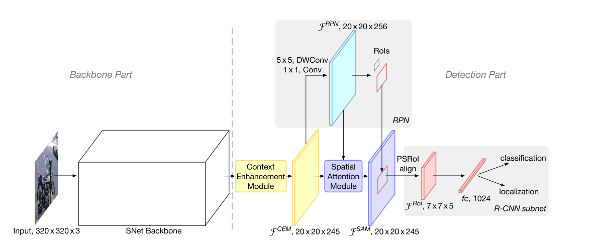
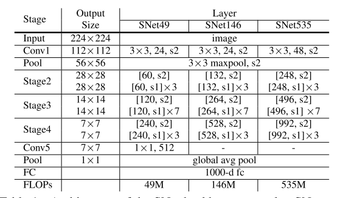
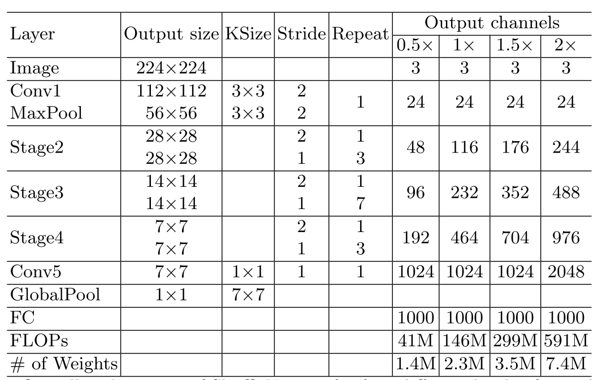
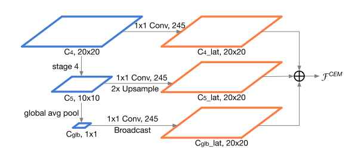
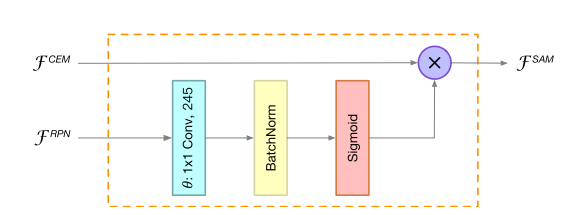
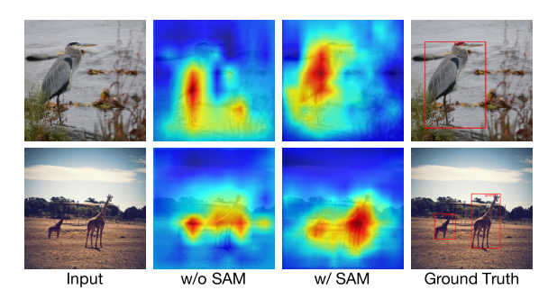

# ThunderNet

## 论文出处
论文：https://arxiv.org/abs/1903.11752

&nbsp;
---
## 整体介绍
ThunderNet首先是一个two-stage的目标检测网络，其最大的特点是速度能够媲美one-stage网络。
1. 论文对backbone net和head net进行了较为深入的分析和对比；
2. 提出来CEM和SAM模块；

网络的整体结构如下：

&nbsp;
---
## Backbone网络结构
### 定位与分类的矛盾关系
GCN网络告诉我们，物体检测是一个比较矛盾的任务，其中物体的分类要求旋转平移具有不变性，因而需要更多的全连接层或者全局卷积层；而物体的定位对于旋转和平移又要具有较高的敏感性，因而需要尽量避免全连接层和全局卷积层，而需要更多较大的feature map以得到更大的空间信息；因此一个较好的方案就是使用尽量大的卷积核得到更大的感受野，这样即使在相对较浅的backbone网络下，高维特征也能获得较大的感受野，获取到足够多的空间信息用于定位。

&nbsp;
### 浅层特征与深层特征的重要程度
浅层特征图的优势在于具有更多的空间信息，但是区别程度（discriminative）不如深层特征，因此对于定位（localization）任务而言，其更依赖于浅层的特征，而分类（classification）任务更依赖于深层的特征。作者通过实验也发现较大的backbone相对而言更不擅长定位（一般情况下我们都是在backbone的最后几层拿到特征图进而进行定位回归）。

&nbsp;
### SNet backbone
根据上述的分析，我们需要一个相对较小且感受野较大的backbone网络。作者对比了目前比较好的轻量级网络，发现：
1. ShuffleNetV1/2的感受野太小（320的输入，121的感受野）；
2. ShuffleNetV2和MobileNetV2的浅层特征图太少了（一个32，一个24）；
3. Xception缺少较有效的深层特征（最后的特征图太大，19*19）；

作者从shuffleNetV2入手，对该网络进行了修改，以满足期望，主要修改如下：
1. 把网络中的所有3×3 DWConv层修改为5×5 DWConv层，该修改扩大了感受野，将感受野从121扩大到了193；

2. 设计了三种结构，分别是SNet49，SN146，SNet535，各数字的意义是最终的网络浮点运算数，SNet结构图如下:
     
    
	ShuffleNetV2的结构图如下：
	
    

	可以看到三种结构是在0.5、1、2的ShuffleNetV2基础上进行的改进。同时注意一点，在ThunderNet中，Conv5层不是每个结构都有的，在SNet49中添加conv5是为了让网络能学到更多的信息，同时也增加了网络的深度。

&nbsp;
### 检测部分
#### PRN网络
文中作者使用5×5 DWConv和1×1×256的结构代替了原先3×3×256的结构，之后对于每一个像素输出的anchor有5个尺寸，分别为[32，64，128，256，512]，每个尺寸又有[1:2, 3:4, 1:1, 4:3, 2:1]这5种长宽比，因为特征图是20×20的，因此最终的anchor数量应为20×20×25=10000个。

#### CEM(Context Enhancement Module)模块
该模块主要代替图像金字塔的繁重操作，取出backbone网络的最后三层（C3，C4，C5）输出并融合在一起产生一个新的特征图，该特征图的大小为C3的大小，且将浅层特征和深层特征结合在了一起，一方面扩大了感受野，同时对特征图的表达能力进行了微调，相比与FPN网络，该结构的效果明显，且运算量小了很多，该模块结构如下：其中网络的输出维度为了后面做ROI warp做准备，下面会讲如何得到这个数值

#### SAM(Spatial Attention Module)模块

该模块的主要作用有点儿像Attention，作者也说道希望网络可以在前景上得到较高的特征分值而在背景上分值较小，但是对于backbone较轻以及输入图像较小的ThunderNet而言确实有些力不从心，不容易获得到这方面的先验知识。

反观PRN的输出特征图，该特征图不刚好就是前景和背景的分数么？于是作者将该特征图经过处理作为先验的知识加入到网络中，组成了SAM模块，让该模块结合先验知识，对CEM的特征图的前景分布进行微调，产生对前景空间具有更好表达使得后续的回归更加的方便。模块的结构图如下：

该模块的数学公式如下（Attention大法好）：
$$
\mathcal{F}^{S A M}=\mathcal{F}^{C E M} \cdot \operatorname{sigmoid}\left(\theta\left(\mathcal{F}^{R P N}\right)\right)
$$

除了上述功能，该模块还有一个作用就是给结合了PRN模块和CEM模块，误差反向传播的时候给两个模块添加了额外的梯度，帮助训练：
$$
\frac{\partial \mathcal{L}}{\partial \mathcal{F}_{i}^{R P N}}=\frac{\partial \mathcal{L}^{R P N}}{\partial \mathcal{F}_{i}^{R P N}}+\sum_{\forall j} \frac{\partial \mathcal{L}^{R \cdot C N N}}{\partial \mathcal{F}_{j}^{S A M}} \cdot \frac{\partial \mathcal{F}_{j}^{S A M}}{\partial \mathcal{F}_{i}^{R P N}}
$$
作者在后面也给出了添加这个模块和不添加这个模块得到特征图的区别，如下：可以看到效果还是很显著的，分布高的地方都集中到了前景上

&nbsp;

#### RCNN subnet部分
最后网络添加R-CNN的回归子网络对ROI中的区域进行分类和定位，其中ROI align使用PSROI align操作，输出的特征图为7×7×5=245，也就是前面各个模块输出的值，随后使用一个全连接层进行特征总结，之后分开进行分类回归和位置回归。

&nbsp;
### 网络整体结构
这里再次给出网络的整体结构，希望再次看到这个的时候能对网络内部结构一目了然了～

&nbsp;
### 额外的测试
论文到这里并没有结束，而是很严谨的对论文中修改的每个部分进行了有无的测试，当然，结果是所有的结构都添加的情况下能取得最好的结果，这里不再赘述，感兴趣的可以看看。